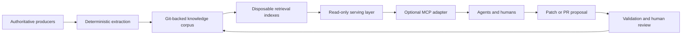

# Knowledge-base creation, management, and optimization

## Purpose

This guide is the compatibility entry point for agent-ready knowledge-base design. Use it to choose the right deeper guide for Markdown in Git, OKF v0.2, retrieval, provenance, freshness, security, evaluation, and MCP serving.

The detailed engineering reference now lives under [Agent knowledge bases](knowledge-bases/README.md).

## Core model

An agent-ready knowledge system should separate source facts, curated knowledge, disposable indexes, serving interfaces, and maintenance workflows.

The Git corpus is the knowledge source of truth. Search indexes, vector indexes, graph indexes, embeddings, caches, and MCP resources are derived serving state that must be rebuildable from Git.

## Reader path

| Need | Read |
| --- | --- |
| Understand the whole architecture | [Reference architecture](knowledge-bases/reference-architecture.md) |
| Audit OKF v0.2 details and conformance | [OKF v0.2](knowledge-bases/okf-v0.2.md) |
| Compare OKF with RDF, JSON-LD, OpenAPI, AsyncAPI, MCP, and retrieval tooling | [Knowledge standards landscape](knowledge-bases/knowledge-standards-landscape.md) |
| Design progressive disclosure and retrieval budgets | [Retrieval and context efficiency](knowledge-bases/retrieval-and-context-efficiency.md) |
| Track sources, trust, freshness, conflicts, and reconciliation | [Provenance, trust, and freshness](knowledge-bases/provenance-trust-and-freshness.md) |
| Secure RAG, MCP serving, ingestion, and maintenance paths | [Security and governance](knowledge-bases/security-and-governance.md) |
| Measure retrieval, answer quality, cost, freshness, and determinism | [Evaluation and quality](knowledge-bases/evaluation-and-quality.md) |
| Inspect a small conformant bundle | [OKF v0.2 example bundle](knowledge-bases/examples/okf-v0.2/index.md) |

## Choosing the right approach

| Situation | Prefer | Why |
| --- | --- | --- |
| The corpus is small and review matters | Plain Markdown plus Git | Lowest operational cost and easiest human review. |
| Agents need portable metadata, provenance, lifecycle, and trust signals | OKF v0.2 | Adds structured frontmatter without requiring a database or runtime. |
| Manual navigation is too slow | Lexical search | Cheap, inspectable, and usually the first retrieval layer to add. |
| Vocabulary mismatch is measured and important | Semantic reranking | Helps when keyword search misses conceptually relevant content. |
| Typed relationships must be exchanged across organizations | RDF, JSON-LD, SKOS, OWL, or SHACL | Adds semantic-web representation and validation where the problem justifies it. |
| Agents need a standard runtime interface | MCP | Exposes search and fetch capabilities without defining the storage model. |
| Retrieval requirements justify specialized infrastructure | Vector database or graph database | Use only when measurements show local indexes or simpler search are insufficient. |

> [!IMPORTANT]
> Do not ask an LLM to recreate machine-readable facts that can be parsed exactly from OpenAPI, AsyncAPI, JSON Schema, Terraform, Kubernetes manifests, SQL schemas, Git metadata, or structured APIs. Use deterministic extraction for facts and reserve model-authored content for explanation, relationships, trade-offs, and operational reasoning.

## Related links

- Official specification: [OKF v0.2](https://github.com/GoogleCloudPlatform/knowledge-catalog/blob/main/okf/SPEC.md)
- Official specification: [Model Context Protocol](https://modelcontextprotocol.io/specification/2026-07-28/basic/index)
- [Agent knowledge bases](knowledge-bases/README.md)
- [Model Context Protocol](model-context-protocol.md)
- [Create AI tools for Claude and Codex](create-ai-tools-for-claude-and-codex.md)
- [Back to AI tooling](README.md)
- [Back to AI index](../README.md)
- [Back to LLM index](../../llm/README.md)
- [Back to root index](../../README.md)
