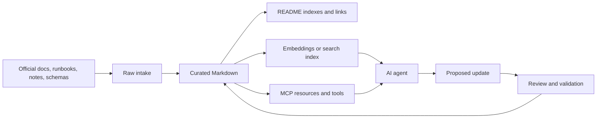

# Knowledge-base creation, management, and optimization

## Purpose

This guide explains how to create, manage, and optimize knowledge bases for AI agents. It covers Markdown repositories, retrieval and vector stores, source quality, lifecycle management, and OKF v0.2.

## When to use this

| Situation | Use |
| --- | --- |
| Humans and agents both need to read and review content | Markdown in Git. |
| The corpus is too large for prompt context | Retrieval or vector store. |
| The knowledge base changes often | Source ownership, freshness metadata, changelog, and validation. |
| Agents will maintain the corpus | Structured indexes, provenance, review rules, and write boundaries. |
| Knowledge must move across tools or organizations | OKF bundle. |

## Knowledge-base architecture



The Markdown repository is the source of truth. Retrieval and MCP are access layers over it, not replacements for curation.

## Create the knowledge base

### Choose a folder structure

```text
knowledge-base/
  README.md
  AGENTS.md
  glossary.md
  changelog.md
  topics/
    ai-tooling/
      README.md
      model-context-protocol.md
  sources/
    incoming/
    processed/
```

What it does: separates polished documentation from raw intake and gives both humans and agents clear navigation.

### Use a standard article shape

```markdown
# Clear article title

## Purpose

State what the reader can do after reading this page.

## When to use this

Explain when the guidance applies.

## Procedure

Give steps, examples, expected outputs, and warnings near risky operations.

## Troubleshooting

List symptoms, likely causes, and safe next checks.

## Related links

- Back to parent index: README.md
- Back to root index: ../../README.md
```

What it does: makes content predictable for readers, search, retrieval chunking, and agent navigation.

## Manage source quality

| Practice | Why it matters |
| --- | --- |
| Prefer official sources for product behavior | Reduces stale or incorrect claims. |
| Record source URLs near claims | Agents can cite and refresh the right source. |
| Separate raw notes from curated docs | Draft content does not become trusted guidance accidentally. |
| Add owner and freshness metadata for volatile topics | APIs, limits, prices, and product behavior change. |
| Keep examples runnable and scoped | Readers can validate guidance without guessing. |
| Avoid duplicated guidance | Agents may retrieve conflicting chunks. |

Use source quality labels when the corpus mixes internal notes and external references:

| Label | Meaning |
| --- | --- |
| Official | Vendor or project documentation. |
| Internal reviewed | Approved internal runbook or decision record. |
| Internal draft | Useful but not final. |
| Generated | Agent-created and not yet reviewed. |
| Historical | Preserved for context, not current guidance. |

## Optimize for retrieval

Retrieval systems work better when documents have stable structure.

### Chunking rules

- Chunk by heading, not arbitrary token count, when possible.
- Keep each chunk tied to path, heading, title, source, and freshness metadata.
- Avoid giant tables with long cells because they chunk poorly.
- Keep commands and examples outside tables.
- Include aliases and common search terms in headings or short summaries.
- Store stable IDs so a search result can be fetched as a full document or section.

### Retrieval flow

1. Search by semantic similarity and keyword filters.
2. Return titles, paths, headings, snippets, and source metadata.
3. Fetch the full source document or section before answering high-stakes questions.
4. Cite the source path or external reference.
5. Report uncertainty when sources conflict or freshness is unknown.

> [!IMPORTANT]
> Retrieval finds content; it does not make content true. A stale, duplicated, or low-quality document can become more visible after indexing.

## Manage lifecycle

| Lifecycle field | Use |
| --- | --- |
| Owner | Team or person responsible for correctness. |
| Created date | Initial publication date. |
| Last reviewed date | Last human or trusted process review. |
| Stale-after date | Review deadline for volatile guidance. |
| Status | Draft, reviewed, deprecated, archived. |
| Sources | Evidence used to create or verify the page. |

For ordinary Markdown repositories, lifecycle can live in the body or frontmatter. For portable bundles, use OKF frontmatter.

## OKF v0.2

Open Knowledge Format is a Markdown plus YAML-frontmatter format for human- and agent-readable knowledge bundles. OKF v0.2 is intentionally minimal: a directory tree of Markdown files, optional reserved index/history files, and frontmatter fields that make provenance, trust, lifecycle, freshness, and attestation explicit.

### Bundle structure

```text
knowledge-bundle/
  index.md
  log.md
  concepts/
    model-context-protocol.md
    knowledge-retrieval.md
```

What it does: creates a portable bundle that can be read with normal file tools, reviewed in Git, indexed for retrieval, or served through MCP.

OKF reserves:

| File | Purpose |
| --- | --- |
| `index.md` | Directory listing for progressive disclosure. |
| `log.md` | Chronological update history. |

All other `.md` files are concept documents.

### Concept frontmatter

```markdown
---
type: Reference
title: Model Context Protocol
description: Standard protocol for exposing tools, resources, and prompts to AI hosts.
resource: https://modelcontextprotocol.io/specification/2026-07-28/basic/index
tags: [ai, mcp, tools]
generated: { by: human:knowledge-maintainer, at: 2026-08-05T10:00:00Z }
verified: { by: human:knowledge-maintainer, at: 2026-08-05T10:30:00Z }
stale_after: 2026-11-05
sources:
  - id: mcp-spec
    resource: https://modelcontextprotocol.io/specification/2026-07-28/basic/index
    title: MCP 2026-07-28 overview
    author: process:mcp-docs
    last_modified: 2026-07-28
---

# Model Context Protocol

MCP connects AI hosts to external tools and context providers.[^mcp-spec]

[^mcp-spec]: MCP 2026-07-28 overview.
```

What it does: records the concept type, canonical resource, tags, generation and verification metadata, freshness, and source attribution.

### Attested computations

Use `type: Attested Computation` when a knowledge item is a sanctioned way to compute a value rather than a static article.

````markdown
---
type: Attested Computation
title: Monthly active users
description: Unique active users in a calendar month.
runtime: bigquery
parameters:
  - { name: month, type: string, required: true }
executor:
  resource: references/skills/run-bigquery.md
  receipt: [job_id, executed_sql, result]
attester:
  resource: references/attesters/monthly-active-users.py
verified: { by: human:data-owner, at: 2026-08-05T11:00:00Z }
---

# Computation

```sql
SELECT COUNT(DISTINCT user_id) AS monthly_active_users
FROM analytics.events
WHERE FORMAT_DATE('%Y-%m', event_date) = @month
  AND event_name = 'active';
```
````

What it does: separates a metric definition from an improvised model answer. The executor produces evidence, and the attester checks the evidence deterministically.

## Serve a knowledge base to agents

Expose the corpus through MCP with a small, safe tool surface:

| Tool | Behavior |
| --- | --- |
| `search_knowledge` | Read-only search over titles, frontmatter, headings, body chunks, and aliases. |
| `fetch_knowledge_entry` | Read-only fetch by stable concept ID or path. |
| `propose_knowledge_update` | Produces a patch or suggested Markdown without writing. |
| `modify_knowledge_entry` | Applies a validated write only inside allowed paths. |

> [!WARNING]
> For agent-maintained knowledge bases, start with propose-only updates. Add direct write tools only after you have path allowlists, conflict checks, lint checks, review policy, and audit logging.

## Optimization checklist

- Remove duplicated pages or make one page canonical.
- Add aliases for terms readers actually search for.
- Keep parent indexes complete and concise.
- Add "Related links" to focused pages.
- Mark volatile pages with review dates.
- Prefer examples that can be copied and validated.
- Keep claims near their sources.
- Re-index after structural changes.
- Track search misses and add pages for repeated unanswered questions.
- Test agent answers against known questions and expected citations.

## Troubleshooting

| Symptom | Likely cause | Next step |
| --- | --- | --- |
| Agent cites the wrong page | Duplicate or ambiguous pages. | Pick a canonical page and link related pages to it. |
| Search misses obvious content | Missing aliases or poor headings. | Add common terms to headings, summaries, or metadata. |
| Answers are stale | No freshness metadata or review cycle. | Add owner, reviewed date, and stale-after date. |
| Agent invents procedures | Raw notes are indexed as trusted docs. | Separate raw intake from curated content. |
| Tool output is too large | Search returns full documents. | Return summaries and IDs, then fetch one document by ID. |
| Updates break links | No link validation. | Run repository-aware link checks before commit. |

## Related links

- Official documentation: [OpenAI retrieval](https://developers.openai.com/api/docs/guides/retrieval)
- Official documentation: [OpenAI function calling](https://developers.openai.com/api/docs/guides/function-calling)
- Official specification: [OKF v0.2](https://github.com/GoogleCloudPlatform/knowledge-catalog/blob/main/okf/SPEC.md)
- [Model Context Protocol](model-context-protocol.md)
- [Create AI tools for Claude and Codex](create-ai-tools-for-claude-and-codex.md)
- [Back to AI tooling](README.md)
- [Back to AI index](../README.md)
- [Back to LLM index](../../llm/README.md)
- [Back to root index](../../README.md)
