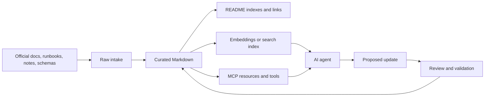

# Knowledge-base creation, management, and optimization

## Purpose

This guide explains how to create, manage, and optimize knowledge bases for AI agents. It covers Markdown repositories, retrieval and vector stores, source quality, lifecycle management, and OKF v0.2.

## When to use this

| Situation | Use |
| --- | --- |
| Humans and agents both need to read and review content | Markdown in Git. |
| The corpus is too large for prompt context | Retrieval or vector store. |
| The knowledge base changes often | Source ownership, freshness metadata, changelog, and validation. |
| Agents will maintain the corpus | Structured indexes, provenance, review rules, and write boundaries. |
| Knowledge must move across tools or organizations | OKF bundle. |

## Knowledge-base architecture



The Markdown repository is the source of truth. Retrieval and MCP are access layers over it, not replacements for curation.

## Create the knowledge base

### Choose a folder structure

```text
knowledge-base/
  README.md
  AGENTS.md
  glossary.md
  changelog.md
  topics/
    ai-tooling/
      README.md
      model-context-protocol.md
  sources/
    incoming/
    processed/
```

What it does: separates polished documentation from raw intake and gives both humans and agents clear navigation.

### Use a standard article shape

```markdown
# Clear article title

## Purpose

State what the reader can do after reading this page.

## When to use this

Explain when the guidance applies.

## Procedure

Give steps, examples, expected outputs, and warnings near risky operations.

## Troubleshooting

List symptoms, likely causes, and safe next checks.

## Related links

- Back to parent index: README.md
- Back to root index: ../../README.md
```

What it does: makes content predictable for readers, search, retrieval chunking, and agent navigation.

## Manage source quality

| Practice | Why it matters |
| --- | --- |
| Prefer official sources for product behavior | Reduces stale or incorrect claims. |
| Record source URLs near claims | Agents can cite and refresh the right source. |
| Separate raw notes from curated docs | Draft content does not become trusted guidance accidentally. |
| Add owner and freshness metadata for volatile topics | APIs, limits, prices, and product behavior change. |
| Keep examples runnable and scoped | Readers can validate guidance without guessing. |
| Avoid duplicated guidance | Agents may retrieve conflicting chunks. |

Use source quality labels when the corpus mixes internal notes and external references:

| Label | Meaning |
| --- | --- |
| Official | Vendor or project documentation. |
| Internal reviewed | Approved internal runbook or decision record. |
| Internal draft | Useful but not final. |
| Generated | Agent-created and not yet reviewed. |
| Historical | Preserved for context, not current guidance. |

## Optimize for retrieval

Retrieval systems work better when documents have stable structure.

### Chunking rules

- Chunk by heading, not arbitrary token count, when possible.
- Keep each chunk tied to path, heading, title, source, and freshness metadata.
- Avoid giant tables with long cells because they chunk poorly.
- Keep commands and examples outside tables.
- Include aliases and common search terms in headings or short summaries.
- Store stable IDs so a search result can be fetched as a full document or section.

### Retrieval flow

1. Search by semantic similarity and keyword filters.
2. Return titles, paths, headings, snippets, and source metadata.
3. Fetch the full source document or section before answering high-stakes questions.
4. Cite the source path or external reference.
5. Report uncertainty when sources conflict or freshness is unknown.

> [!IMPORTANT]
> Retrieval finds content; it does not make content true. A stale, duplicated, or low-quality document can become more visible after indexing.

## Manage lifecycle

| Lifecycle field | Use |
| --- | --- |
| Owner | Team or person responsible for correctness. |
| Created date | Initial publication date. |
| Last reviewed date | Last human or trusted process review. |
| Stale-after date | Review deadline for volatile guidance. |
| Status | Draft, reviewed, deprecated, archived. |
| Sources | Evidence used to create or verify the page. |

For ordinary Markdown repositories, lifecycle can live in the body or frontmatter. For portable bundles, use OKF frontmatter.

## OKF v0.2

Open Knowledge Format is a Markdown plus YAML-frontmatter format for human- and agent-readable knowledge bundles. OKF v0.2 is intentionally minimal: a directory tree of Markdown files, optional reserved index/history files, and frontmatter fields that make provenance, trust, lifecycle, freshness, and attestation explicit.

OKF is not a database, vector store, agent runtime, API protocol, or replacement for domain schemas. It is a portable file format for packaging knowledge so humans, agents, search indexes, MCP servers, and deterministic code can all read the same corpus.

### What OKF is for

| Problem | OKF answer |
| --- | --- |
| A model found a Markdown page, but cannot tell whether it is official, draft, stale, or generated. | Put `sources`, `generated`, `verified`, `status`, and `stale_after` in frontmatter. |
| A knowledge base needs to move between tools or teams. | Ship a directory of Markdown files with standard metadata; no central registry is required. |
| An agent needs to browse before loading full content. | Use `index.md`, `description`, `tags`, and stable concept IDs for progressive disclosure. |
| A generated answer cites claims but the source mapping is fragile. | Use `sources[].id` plus Markdown footnotes keyed to source IDs. |
| A metric or number must be reproducible. | Use `type: Attested Computation` with an executor, receipt shape, and deterministic attester. |

### What OKF is not

- It is not only for AI agents. Humans can read and review OKF with normal Markdown tools.
- It is not an automatic retrieval system. You still need search, embeddings, MCP tools, or file reads to load relevant concepts.
- It is not an authority system by itself. It records signals; consumers decide how to treat them.
- It is not a schema registry. `type` values are descriptive strings, and consumers must tolerate unknown types.
- It is not a packaging standard for executors and attesters. OKF records the interface and referenced resources, not the runtime packaging.

### How agents consume OKF

Agents do not consume OKF by "knowing everything" in the bundle. They consume it through a traversal and retrieval loop:

1. Read the root `index.md` or search an index built from frontmatter and headings.
2. Inspect candidate concepts by title, description, tags, type, status, and freshness.
3. Fetch the most relevant concept body.
4. Resolve internal Markdown links to neighboring concepts when needed.
5. Check `sources`, `verified`, `generated`, and `stale_after` before trusting claims.
6. Use footnotes to map specific claims back to `sources[].id`.
7. For computations, execute the referenced executor, capture a receipt, and run the deterministic attester when the runtime is available.
8. Answer with citations or propose a knowledge-base update when the concept is missing, stale, or unverified.

In practice, the consuming layer can be:

| Consumer | How it reads OKF |
| --- | --- |
| Human | Opens Markdown files, follows links, reviews Git diffs. |
| Retrieval index | Chunks concept bodies and stores frontmatter as metadata filters. |
| MCP server | Exposes `search_knowledge`, `fetch_knowledge_entry`, and read-only resources over concept IDs. |
| Agent | Calls search/fetch tools, checks metadata, follows links, and proposes updates. |
| Deterministic verifier | Reads `Attested Computation` concepts, runs executors, and checks receipts with attesters. |

### Bundle structure

```text
knowledge-bundle/
  index.md
  log.md
  references/
    sources/
    skills/
    attesters/
  concepts/
    model-context-protocol.md
    knowledge-retrieval.md
```

What it does: creates a portable bundle that can be read with normal file tools, reviewed in Git, indexed for retrieval, or served through MCP.

OKF reserves:

| File | Purpose |
| --- | --- |
| `index.md` | Directory listing for progressive disclosure. |
| `log.md` | Chronological update history. |

All other `.md` files are concept documents.

Concept IDs are paths relative to the bundle root without the `.md` suffix. For example, `concepts/model-context-protocol.md` has concept ID `concepts/model-context-protocol`.

### Concept frontmatter

Every concept document has YAML frontmatter and a Markdown body. `type` is the only always-required frontmatter key. The other fields are optional but important for trust and retrieval.

```markdown
---
type: Reference
title: Model Context Protocol
description: Standard protocol for exposing tools, resources, and prompts to AI hosts.
resource: https://modelcontextprotocol.io/specification/2026-07-28/basic/index
tags: [ai, mcp, tools]
generated: { by: human:knowledge-maintainer, at: 2026-08-05T10:00:00Z }
verified: { by: human:knowledge-maintainer, at: 2026-08-05T10:30:00Z }
stale_after: 2026-11-05
sources:
  - id: mcp-spec
    resource: https://modelcontextprotocol.io/specification/2026-07-28/basic/index
    title: MCP 2026-07-28 overview
    author: process:mcp-docs
    last_modified: 2026-07-28
---

# Model Context Protocol

MCP connects AI hosts to external tools and context providers.[^mcp-spec]

[^mcp-spec]: MCP 2026-07-28 overview.
```

What it does: records the concept type, canonical resource, tags, generation and verification metadata, freshness, and source attribution.

### Frontmatter field guide

| Field | Required | Use |
| --- | --- | --- |
| `type` | Yes | Describes the concept kind, such as `Reference`, `Playbook`, `Metric`, `API Endpoint`, or `Attested Computation`. |
| `title` | No | Human-readable display name; consumers can derive it from the filename if absent. |
| `description` | No | One-line summary for indexes, search snippets, and previews. |
| `resource` | No | Canonical URI for the real-world asset the concept describes. |
| `tags` | No | Cross-cutting labels that consumers can filter or group by. |
| `sources` | No | Materials the concept derives from, including internal paths or external URLs. |
| `generated` | No | Actor and timestamp for who or what produced the current content. |
| `verified` | No | Actor and timestamp for who or what confirmed the content. |
| `status` | No | Lifecycle state, such as `draft`, `stable`, `deprecated`, or `archived`. |
| `stale_after` | No | Date after which consumers should treat the concept as needing review. |

OKF records objective signals rather than one universal trust score. A consumer can decide that human-reviewed concepts are preferred over machine-confirmed ones, or that concepts past `stale_after` need a warning.

### Sources and claim attribution

Use `sources` for provenance and Markdown footnotes for claim-level attribution.

```markdown
---
type: Playbook
title: EKS workload identity troubleshooting
sources:
  - id: eks-pod-identity
    resource: https://docs.aws.amazon.com/eks/latest/userguide/pod-identities.html
    title: EKS Pod Identities
    author: team:aws-docs
    last_modified: 2026-07-12
---

# First checks

EKS Pod Identity uses a cluster add-on and IAM role association to provide
credentials to workloads.[^eks-pod-identity]

[^eks-pod-identity]: EKS Pod Identities.
```

What it does: lets an agent join the footnote label `eks-pod-identity` back to the matching `sources` entry instead of guessing which source supports the claim.

### Attested computations

Use `type: Attested Computation` when a knowledge item is a sanctioned way to compute a value rather than a static article.

````markdown
---
type: Attested Computation
title: Monthly active users
description: Unique active users in a calendar month.
runtime: bigquery
parameters:
  - { name: month, type: string, required: true }
executor:
  resource: references/skills/run-bigquery.md
  receipt: [job_id, executed_sql, result]
attester:
  resource: references/attesters/monthly-active-users.py
verified: { by: human:data-owner, at: 2026-08-05T11:00:00Z }
---

# Computation

```sql
SELECT COUNT(DISTINCT user_id) AS monthly_active_users
FROM analytics.events
WHERE FORMAT_DATE('%Y-%m', event_date) = @month
  AND event_name = 'active';
```
````

What it does: separates a metric definition from an improvised model answer. The executor produces evidence, and the attester checks the evidence deterministically.

The difference between verification and attestation:

| Term | Meaning |
| --- | --- |
| `verified` | Someone or something reviewed the concept content and its sources. |
| Executor | A referenced procedure or code path that computes a value and returns a receipt. |
| Receipt | Runtime evidence, such as job ID, executed SQL, compiled SQL, parameters, result hash, or output. |
| Attester | Deterministic code that checks the receipt and returns a verdict. |

An LLM should not be the attester. The attester should be deterministic code so the result is reproducible.

### Real use case: platform operations knowledge bundle

Scenario: a platform team wants Claude, Codex, and internal support agents to answer Kubernetes operations questions from the same trusted source. They also want agents to suggest documentation updates without writing directly to production docs.

The team creates this OKF bundle:

```text
platform-ops-okf/
  index.md
  log.md
  concepts/
    kubernetes/
      index.md
      crashloopbackoff-playbook.md
      workload-identity-playbook.md
    ai-tooling/
      model-context-protocol.md
  computations/
    pod-restart-rate.md
  references/
    sources/
      eks-pod-identity.md
      kubernetes-pod-lifecycle.md
    skills/
      run-prometheus-query.md
    attesters/
      prometheus-result-shape.py
```

What it does: gives agents one bundle to browse, retrieve, cite, and validate. Narrative playbooks live under `concepts/`; reproducible metrics live under `computations/`; source snapshots, executor instructions, and attesters live under `references/`.

#### Root index

```markdown
# Platform operations knowledge

## Kubernetes

- `concepts/kubernetes/crashloopbackoff-playbook.md` - CrashLoopBackOff playbook.
- `concepts/kubernetes/workload-identity-playbook.md` - Workload identity playbook.

## AI tooling

- `concepts/ai-tooling/model-context-protocol.md` - Model Context Protocol.

## Computations

- `computations/pod-restart-rate.md` - Pod restart rate.
```

What it does: gives humans and agents a fast route map before they inspect individual concepts.

#### Playbook concept

```markdown
---
type: Playbook
title: CrashLoopBackOff triage
description: Safe first checks for Kubernetes Pods that repeatedly restart.
tags: [kubernetes, troubleshooting, pods]
status: stable
generated: { by: human:platform-team, at: 2026-08-05T09:00:00Z }
verified: { by: human:sre-lead, at: 2026-08-05T10:00:00Z }
stale_after: 2026-11-05
sources:
  - id: k8s-pod-lifecycle
    resource: references/sources/kubernetes-pod-lifecycle.md
    title: Kubernetes Pod lifecycle
    author: team:kubernetes-docs
    last_modified: 2026-07-20
---

# First checks

Inspect the Pod status, restart count, events, and previous container logs before
changing workloads.[^k8s-pod-lifecycle]

```bash
kubectl describe pod app-123 -n production
kubectl logs app-123 -n production --previous
```

What it does: checks the current Pod state and previous container output without modifying the cluster.

[^k8s-pod-lifecycle]: Kubernetes Pod lifecycle.
```

What it does: gives the agent a safe, sourced troubleshooting page with freshness and review status.

#### Attested computation concept

````markdown
---
type: Attested Computation
title: Pod restart rate
description: Restart rate for Pods matching an application label over a time window.
tags: [kubernetes, prometheus, reliability]
status: stable
runtime: prometheus
parameters:
  - { name: namespace, type: string, required: true }
  - { name: app, type: string, required: true }
  - { name: window, type: string, required: true }
executor:
  resource: references/skills/run-prometheus-query.md
  receipt: [query, datasource, started_at, result]
attester:
  resource: references/attesters/prometheus-result-shape.py
generated: { by: human:platform-team, at: 2026-08-05T09:30:00Z }
verified: { by: process:observability-ci, at: 2026-08-05T10:15:00Z }
stale_after: 2026-10-05
sources:
  - id: restart-metric
    resource: references/sources/kube-state-metrics.md
    title: kube-state-metrics restart metric reference
---

# Computation

```promql
sum by (pod) (
  increase(kube_pod_container_status_restarts_total{
    namespace="$namespace",
    container!="",
    pod=~"$app.*"
  }[$window])
)
```

The query uses the kube-state-metrics restart counter for container restarts.[^restart-metric]

[^restart-metric]: kube-state-metrics restart metric reference.
````

What it does: defines a metric the agent can request through a deterministic executor instead of inventing a PromQL query.

#### Agent consumption flow

User request:

```text
Why is the checkout service restarting, and what should I check first?
```

Agent flow:

1. Calls `search_knowledge` with `checkout restarting CrashLoopBackOff Kubernetes`.
2. Receives `concepts/kubernetes/crashloopbackoff-playbook` and `computations/pod-restart-rate`.
3. Calls `fetch_knowledge_entry` for the playbook.
4. Checks that `status: stable`, `verified` is present, and `stale_after` is in the future.
5. Follows the internal link to the restart-rate computation if the user asks for current evidence.
6. Runs the computation only if it has access to Prometheus and the user asked for live diagnosis.
7. Returns the safe first checks and cites the playbook path and source IDs.
8. If the playbook is stale or missing the checkout-specific procedure, calls `propose_knowledge_update` rather than editing directly.

This is how OKF supports iteration: it gives the agent structured metadata and file layout so it can decide what to trust, what to fetch, what to cite, and what to update. The actual iteration still happens through tools, Git workflows, review, validation, and human or policy approval.

## Serve a knowledge base to agents

Expose the corpus through MCP with a small, safe tool surface:

| Tool | Behavior |
| --- | --- |
| `search_knowledge` | Read-only search over titles, frontmatter, headings, body chunks, and aliases. |
| `fetch_knowledge_entry` | Read-only fetch by stable concept ID or path. |
| `propose_knowledge_update` | Produces a patch or suggested Markdown without writing. |
| `modify_knowledge_entry` | Applies a validated write only inside allowed paths. |

> [!WARNING]
> For agent-maintained knowledge bases, start with propose-only updates. Add direct write tools only after you have path allowlists, conflict checks, lint checks, review policy, and audit logging.

## Optimization checklist

- Remove duplicated pages or make one page canonical.
- Add aliases for terms readers actually search for.
- Keep parent indexes complete and concise.
- Add "Related links" to focused pages.
- Mark volatile pages with review dates.
- Prefer examples that can be copied and validated.
- Keep claims near their sources.
- Re-index after structural changes.
- Track search misses and add pages for repeated unanswered questions.
- Test agent answers against known questions and expected citations.

## Troubleshooting

| Symptom | Likely cause | Next step |
| --- | --- | --- |
| Agent cites the wrong page | Duplicate or ambiguous pages. | Pick a canonical page and link related pages to it. |
| Search misses obvious content | Missing aliases or poor headings. | Add common terms to headings, summaries, or metadata. |
| Answers are stale | No freshness metadata or review cycle. | Add owner, reviewed date, and stale-after date. |
| Agent invents procedures | Raw notes are indexed as trusted docs. | Separate raw intake from curated content. |
| Tool output is too large | Search returns full documents. | Return summaries and IDs, then fetch one document by ID. |
| Updates break links | No link validation. | Run repository-aware link checks before commit. |

## Related links

- Official documentation: [OpenAI retrieval](https://developers.openai.com/api/docs/guides/retrieval)
- Official documentation: [OpenAI function calling](https://developers.openai.com/api/docs/guides/function-calling)
- Official specification: [OKF v0.2](https://github.com/GoogleCloudPlatform/knowledge-catalog/blob/main/okf/SPEC.md)
- [Model Context Protocol](model-context-protocol.md)
- [Create AI tools for Claude and Codex](create-ai-tools-for-claude-and-codex.md)
- [Back to AI tooling](README.md)
- [Back to AI index](../README.md)
- [Back to LLM index](../../llm/README.md)
- [Back to root index](../../README.md)
