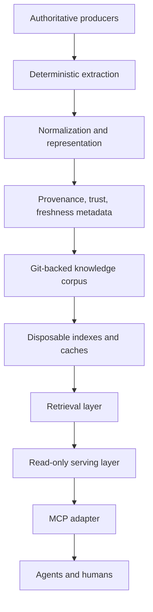

# Reference architecture

## Purpose

This guide defines an agent-first, Git-backed, standards-aware knowledge system. It is for engineers, platform engineers, AI or LLMOps engineers, solutions architects, and agents that need a trustworthy corpus for retrieval, reasoning, citation, and maintenance.

## Goals and non-goals

| Type | Statement |
| --- | --- |
| Goal | One logical place for agents and humans to ask for authoritative knowledge across many producers. |
| Goal | Token-efficient retrieval through progressive disclosure and bounded responses. |
| Goal | Self-healing freshness through reconciliation and proposed changes. |
| Goal | Trustworthy-by-construction facts through deterministic extraction and source metadata. |
| Goal | Agent-managed, human-gated maintenance through patches and PRs. |
| Goal | Extensible producer classes without redesigning the architecture. |
| Goal | OKF interoperability when OKF bundles are produced or consumed. |
| Non-goal | Requiring a CMS, website, vector database, graph database, warehouse, persistent search database, write API, or one implementation framework. |
| Non-goal | Replacing OpenAPI, AsyncAPI, JSON Schema, RDF, OWL, SKOS, MCP, source repositories, or human review. |

## System layers

| Layer | Responsibility | Must not be confused with |
| --- | --- | --- |
| Authoritative producer | Original system or artifact, such as API schema, code repo, docs, database schema, or vendor spec. | The derived knowledge corpus. |
| Derived knowledge | Curated representation generated or written from sources. | The original source. |
| Deterministic facts | Machine-owned regions parsed from exact source data. | Model-authored interpretation. |
| Model-authored reasoning | Explanation, trade-offs, relationships, and troubleshooting guidance. | Exact machine-readable facts. |
| Retrieval artifacts | Search indexes, embeddings, graph indexes, caches, chunk stores. | Source of truth. |
| Serving layer | Read-only search and fetch access with authorization and audit. | Maintenance write path. |
| Maintenance workflow | Reconciliation, regeneration, enrichment, validation, PR, and review. | User-facing serving path. |

## Source-of-truth distinctions

| Term | Meaning |
| --- | --- |
| Source-of-truth producer | The authoritative upstream artifact or system for a fact. |
| Knowledge source of truth | The Git-backed derived corpus that agents and humans review and serve. |
| Derived serving state | Rebuildable indexes, embeddings, caches, and retrieval views. |

Git is the knowledge source of truth because it gives reviewable diffs, history, authorship, rollback, branches, PRs, and reproducible corpus revisions. A database can serve the corpus, but it should not become the record of authority unless a concrete architecture explicitly accepts that trade-off.

## Deterministic facts and reasoned meaning

Use deterministic extractors for:

- OpenAPI descriptions.
- AsyncAPI descriptions.
- JSON Schema.
- Terraform configuration and state exports.
- Kubernetes manifests and CRDs.
- SQL schemas.
- Structured APIs.
- Git metadata.
- Configuration files.

Use LLMs or agents for:

- Explanation.
- "When should I use this?"
- Relationships between systems.
- Operational guidance.
- Architecture context.
- Troubleshooting reasoning.
- Summarization.

> [!IMPORTANT]
> Enforce "zero model-authored claims in machine-owned regions" with generated-region markers, renderer hashes, source hashes, and validation. Prompt text is not an enforcement boundary.

## Maintenance loop

```mermaid
flowchart LR
    Change["Producer change"] --> Reconcile["Reconciliation"]
    Reconcile --> Affected["Affected concept detection"]
    Affected --> Regen["Deterministic regeneration"]
    Regen --> Enrich["Agent enrichment where needed"]
    Enrich --> Validate["Validation"]
    Validate --> Diff["Meaningful Git diff"]
    Diff --> PR["PR or patch"]
    PR --> Human["Human review"]
    Human --> Merge["Merge"]
    Merge --> Corpus["New corpus Git state"]
```

Track this producer state:

| Field | Why it matters |
| --- | --- |
| `producer_id` | Stable producer identity. |
| `pinned_revision` | Last accepted producer revision. |
| `observed_revision` | Current producer revision seen by the reconciler. |
| `source_path` | Exact source scope. |
| `source_hash` | Content comparison independent of events. |
| `renderer_version` | Reproducible generation behavior. |
| `knowledge_concepts` | Dependent concepts to regenerate or review. |
| `generated_hash` | Detects output drift and no-op updates. |
| `last_reconciled_at` | Freshness and lag signal. |
| `status` | Active, stale, failed, retired, or blocked as internal state. |

A missed webhook should increase latency, not permanently break correctness. Scheduled reconciliation compares revisions and hashes. A no-change reconciliation must produce byte-identical output and no PR.

## Serving surface

Keep normal serving read-only:

| Operation | Behavior |
| --- | --- |
| `search_knowledge` | Returns bounded results with IDs, titles, summaries, metadata, trust, freshness, and authority signals. |
| `fetch_knowledge_entry` | Fetches a specific document or section by stable ID. |
| `fetch_source_evidence` | Fetches related evidence only when needed and authorized. |

Do not expose a generic "modify production knowledge" operation through the normal serving interface. Maintenance tools may create branches, patches, or PRs, but they belong behind a separate security boundary with stronger authorization, validation, and audit logging.

## Implementation procedure

1. Inventory producers and classify source authority.
2. Define canonical corpus paths and concept IDs.
3. Choose plain Markdown or OKF for the corpus representation.
4. Write deterministic extractors for structured producers.
5. Mark machine-owned regions and validate them.
6. Add provenance, generation, verification, lifecycle, and freshness metadata.
7. Build lexical search first.
8. Add semantic reranking, vector search, or graph retrieval only after measured failures justify them.
9. Expose read-only search and fetch operations.
10. Add reconciliation and PR-based maintenance.
11. Evaluate retrieval, answer quality, freshness, determinism, and cost.
12. Trace searches, fetched evidence, corpus revision, and authorization decisions.

## What can go wrong

| Risk | Control |
| --- | --- |
| Agent cannot find existing knowledge | Golden retrieval questions and index coverage checks. |
| Retrieval returns too much | Budgets, progressive disclosure, and section fetches. |
| Stale content looks valid | `stale_after`, producer reconciliation, source hashes, and lag metrics. |
| LLM alters machine-owned facts | Generated-region validation and renderer re-run checks. |
| Conflicting sources are silently merged | Source authority metadata and conflict reporting. |
| Unauthorized content is retrieved | Retrieval-time authorization before ranking and fetch. |
| Write path mutates production silently | Propose-only maintenance, PR review, and audit. |

## Related links

- [OKF v0.2](okf-v0.2.md)
- [Knowledge standards landscape](knowledge-standards-landscape.md)
- [Retrieval and context efficiency](retrieval-and-context-efficiency.md)
- [Provenance, trust, and freshness](provenance-trust-and-freshness.md)
- [Security and governance](security-and-governance.md)
- [Evaluation and quality](evaluation-and-quality.md)
- [Back to agent knowledge bases](README.md)
- [Back to AI tooling](../README.md)
- [Back to root index](../../../README.md)
