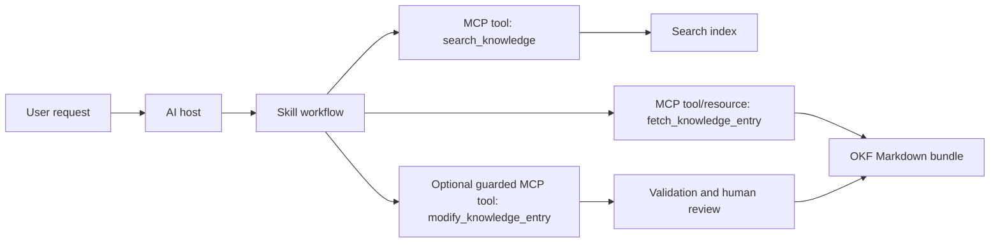

# Model Context Protocol, custom tools, and OKF

## Purpose

This guide helps engineers design AI tool integrations and Markdown-based knowledge systems. It explains when to use MCP, custom tools, skills, retrieval, and OKF so an AI system can use external data and actions without turning every integration into a one-off prompt.

## When to use this

| Need | Use | Why |
| --- | --- | --- |
| Connect an agent to external systems | MCP server | Standardizes tools, resources, prompts, transport, and discovery. |
| Let a model call application code directly | Function tool | Good for a small, known set of typed operations in one application runtime. |
| Let a model emit free-form input for a specialized executor | Custom tool | Useful when a JSON schema is too rigid or a grammar-constrained command is better. |
| Teach a repeatable workflow | Skill or `SKILL.md` | Keeps instructions, references, scripts, and templates reusable without loading everything into context up front. |
| Search a large document corpus | Retrieval or vector store | Finds relevant chunks by semantic similarity before generation. |
| Maintain durable Markdown knowledge | Markdown knowledge base or OKF bundle | Keeps knowledge readable, reviewable, linkable, and versioned in Git. |

Use MCP when the model needs live context or controlled actions outside the prompt. Use a skill when the model needs a repeatable procedure. Use OKF when the knowledge itself needs a portable Markdown format that humans and agents can traverse.

## Mental model

| Layer | Owns | Example |
| --- | --- | --- |
| Model | Reasoning and language generation | Decides that it needs a project status before answering. |
| Tool | Action or computation | `update_project`, `run_query`, `create_ticket`. |
| Resource | Readable context | A file, schema, document, dashboard definition, or OKF concept. |
| Prompt or skill | Reusable workflow guidance | "Search first, fetch sources, then summarize with citations." |
| Knowledge base | Durable facts and procedures | Markdown docs, OKF bundles, runbooks, schemas, decisions. |

The important separation is capability versus guidance. A tool gives the agent something it can do. A skill tells the agent when and how to do it. A knowledge base gives the agent curated facts to inspect. MCP is the connection protocol that exposes tools, resources, and prompts consistently.

## What MCP is

Model Context Protocol is a standard protocol for connecting AI hosts to external context providers and tools.

| Component | Meaning |
| --- | --- |
| Host | The AI application the user interacts with, such as Codex, ChatGPT, an IDE, or a custom agent app. |
| Client | The MCP connection inside the host. It sends MCP requests and receives responses. |
| Server | The integration process or service that exposes capabilities to the host. |
| Tool | A callable operation the model can invoke, usually for actions, API calls, queries, or computations. |
| Resource | Readable data the host can attach as context, such as files, database schemas, or application records. |
| Prompt | A reusable prompt template exposed by the server. |

MCP messages use JSON-RPC. Current MCP revisions use per-request protocol metadata and a stateless request model: the server should not infer conversation, capability, or user context from a prior request on the same connection. If application state is needed across requests, use explicit identifiers such as task IDs, handles, cursors, or resource URIs.

MCP commonly uses two standard transports:

| Transport | Use it for |
| --- | --- |
| `stdio` | Local integrations launched as child processes by the host. |
| Streamable HTTP | Remote servers reachable over the network. |

The same tool, resource, and prompt concepts apply across transports. The transport controls message framing and delivery, not the meaning of the MCP messages.

## MCP building blocks

### Tools

Tools expose actions. A tool should have a stable name, a clear title, a short description, an input schema, and, when practical, an output schema.

Good tools are goal-sized:

- `list_projects`
- `get_project`
- `update_project_status`
- `search_knowledge`
- `fetch_knowledge_entry`

Avoid one generic tool such as `do_everything` with a `mode` argument. It hides risk, makes authorization harder, and gives the model less precise routing information.

Tool results can return human-readable content and structured JSON. Structured results are useful when later steps need exact IDs, status values, URLs, timestamps, or validation errors.

### Resources

Resources expose readable context. Use resources for data the host or user may choose to load, such as:

- Markdown files.
- API schemas.
- Database table definitions.
- OKF concept documents.
- Project metadata.
- Runbook pages.

Resources are usually better than tools when nothing needs to be computed or changed. A resource URI should be stable and meaningful enough for logs, citations, and debugging.

### Prompts and skills

Prompts are reusable templates exposed through MCP. Skills are richer workflow packages, usually centered on a `SKILL.md` file and optional `references/`, `scripts/`, and `assets/` folders.

Use a prompt for a compact reusable instruction. Use a skill when the workflow needs multiple steps, examples, templates, supporting documentation, or helper scripts.

### Discovery and schemas

MCP clients discover which tools, resources, and prompts a server provides. Tool input schemas use JSON Schema. Newer MCP guidance recommends JSON Schema 2020-12 as the default dialect when no explicit `$schema` is provided.

Output schemas help clients validate structured tool results. They also help models understand the shape of returned data.

### Safety annotations

Set tool annotations according to real behavior:

| Annotation | Use |
| --- | --- |
| `readOnlyHint` | `true` only when the tool cannot change state. |
| `destructiveHint` | `true` when the action is irreversible or hard to reverse. |
| `openWorldHint` | `true` when the action can affect public or external systems. |

Annotations help hosts choose safer confirmation behavior. They do not replace server-side authorization, input validation, audit logging, or explicit business rules.

## How to create an MCP server

### Plan the tool surface

Start from user goals, not backend endpoints.

1. List the jobs users expect the agent to complete.
2. Split read operations from write operations.
3. Design small tools around those jobs.
4. Define precise input and output schemas.
5. Decide which data should be exposed as resources instead of tools.
6. Add authentication and authorization before exposing private data or write actions.
7. Test with representative prompts and failure cases.

### Install the TypeScript SDK

```bash
npm install @modelcontextprotocol/sdk zod
```

What it does: adds the official TypeScript SDK and `zod` for schema validation.

### Minimal TypeScript server

```ts
import { McpServer } from "@modelcontextprotocol/sdk/server/mcp.js";
import { StdioServerTransport } from "@modelcontextprotocol/sdk/server/stdio.js";
import { z } from "zod";

const server = new McpServer(
  { name: "knowledge-tools", version: "1.0.0" },
  {
    instructions:
      "Use search_knowledge before fetch_knowledge_entry. Do not modify entries unless the user explicitly asks for a change.",
  },
);

server.registerTool(
  "search_knowledge",
  {
    title: "Search Knowledge",
    description: "Search curated Markdown knowledge entries by query.",
    inputSchema: {
      query: z.string().min(1),
      limit: z.number().int().min(1).max(10).default(5),
    },
    outputSchema: {
      results: z.array(
        z.object({
          id: z.string(),
          title: z.string(),
          path: z.string(),
          summary: z.string(),
        }),
      ),
    },
    annotations: { readOnlyHint: true },
  },
  async ({ query, limit }) => {
    const results = await searchMarkdownIndex(query, limit);

    return {
      content: [{ type: "text", text: JSON.stringify({ results }) }],
      structuredContent: { results },
    };
  },
);

server.registerResource(
  "ai-mcp-guide",
  "kb://ai/model-context-protocol-custom-tools-and-okf",
  {
    title: "MCP, custom tools, and OKF",
    description: "Guide for AI tool integrations and Markdown knowledge bases.",
    mimeType: "text/markdown",
  },
  async (uri) => ({
    contents: [
      {
        uri: uri.href,
        mimeType: "text/markdown",
        text: await readKnowledgeEntry("ai/model-context-protocol-custom-tools-and-okf.md"),
      },
    ],
  }),
);

const transport = new StdioServerTransport();
await server.connect(transport);
```

What it does: creates a local MCP server with one read-only search tool and one Markdown resource. The helper functions represent your own search index and file-reading logic.

### Streamable HTTP deployment shape

Use Streamable HTTP when a host must reach the server over the network. The server typically exposes one endpoint such as `/mcp`, validates authentication on each request, and returns JSON or a request-scoped stream depending on the SDK configuration.

> [!IMPORTANT]
> Treat each HTTP request as independently authorized. Do not rely on connection identity, prior conversation state, or model intent to decide whether a user can read or modify a resource.

### Minimal Python server

```python
from mcp.server.fastmcp import FastMCP

mcp = FastMCP("knowledge-tools", json_response=True)


@mcp.tool()
def search_knowledge(query: str, limit: int = 5) -> list[dict]:
    """Search curated Markdown knowledge entries by query."""
    return search_markdown_index(query=query, limit=limit)


@mcp.resource("kb://entry/{entry_id}")
def fetch_knowledge_entry(entry_id: str) -> str:
    """Fetch a Markdown knowledge entry by stable ID."""
    return read_knowledge_entry(entry_id)


if __name__ == "__main__":
    mcp.run(transport="streamable-http")
```

What it does: creates a Python MCP server with a search tool and a dynamic resource URI. The helper functions represent your own retrieval and file-reading implementation.

### Test the server

```bash
npx @modelcontextprotocol/inspector
```

What it does: starts the MCP Inspector so you can connect to a local MCP endpoint, list capabilities, call tools, read resources, and inspect returned schemas.

## How to design custom tools

### Tool design checklist

- Name the operation with a verb and object, such as `fetch_ticket` or `create_release_note`.
- Keep each tool focused on one user-visible goal.
- Put routing guidance in the description: when to call it, when not to call it, and what it returns.
- Use typed schemas with required fields, enums, validation bounds, and clear descriptions.
- Return stable IDs and URLs so the model can cite or reuse exact records.
- Return structured data for downstream processing and text for human readability.
- Split reads from writes so read-only tasks do not inherit write permissions.
- Validate authorization inside the server on every request.
- Make destructive or external actions explicit in the name, schema, and annotations.
- Return actionable errors with machine-readable codes where possible.

### Read and write split

Use separate tools for inspection and mutation:

| User goal | Tool | Risk |
| --- | --- | --- |
| Find matching entries | `search_knowledge` | Read-only. |
| Open one entry | `fetch_knowledge_entry` | Read-only. |
| Propose a change | `propose_knowledge_update` | Produces a patch but does not write. |
| Apply a reviewed change | `modify_knowledge_entry` | Writes state and needs stronger controls. |

> [!WARNING]
> Do not let a write tool accept arbitrary file paths, shell commands, or raw patches from the model without server-side allowlists and validation. The server owns the trust boundary.

### Error handling

Return errors that help the host and model recover:

| Error | Meaning | Recovery |
| --- | --- | --- |
| `not_found` | The requested record or resource does not exist. | Search again or ask the user for a different ID. |
| `ambiguous_query` | The query matched too many records. | Ask for a narrower topic, owner, or date. |
| `unauthorized` | The user lacks access. | Stop and explain the missing permission. |
| `validation_failed` | Arguments did not satisfy business rules. | Return field-specific messages. |
| `conflict` | The target changed since it was read. | Re-fetch and retry with the latest version. |

## Custom tools in OpenAI APIs

OpenAI tool calling has two common custom surfaces:

| Surface | Input shape | Use it for |
| --- | --- | --- |
| Function tool | JSON object defined by JSON Schema | Typed application operations. |
| Custom tool | Free-form text, optionally grammar-constrained | Specialized command languages, DSLs, generated code fragments, SQL-like expressions, or tool input where JSON is awkward. |

Function tools are usually the default because schemas are explicit and easy to validate. Custom tools are useful when the executor naturally consumes text. If a custom tool must only receive valid text in a specific format, constrain it with a grammar. Keep grammars small and test them with representative prompts.

Example custom tool decision:

```text
Use a function tool for: create_ticket({ title, description, priority })
Use a custom tool for: generate a domain-specific query expression that an executor parses
```

What it does: keeps ordinary business operations typed while reserving free-form custom tools for formats that are naturally text-based.

## Markdown workflows and skills

A Markdown-based custom workflow usually starts with a `SKILL.md` file:

```markdown
---
name: knowledge-curator
description: Curate Markdown knowledge-base articles with source checks, internal links, and changelog notes.
---

Use this skill when the user asks to add, ingest, or improve knowledge-base content.

1. Read the parent index and nearby articles.
2. Prefer official sources for product behavior.
3. Add or update focused Markdown pages.
4. Update indexes, glossary entries, and changelog notes when needed.
5. Run Markdown lint and link checks before finishing.
```

What it does: gives the agent reusable routing and quality instructions for a documentation workflow.

Skill directories commonly use this shape:

```text
knowledge-curator/
  SKILL.md
  references/
    markdown-style.md
    source-quality.md
  scripts/
    check-links.js
  assets/
    article-template.md
```

What it does: keeps the activation instructions small while storing deeper reference material and deterministic helpers next to the skill.

Use `references/` for policies, schemas, examples, and background material. Use `scripts/` for deterministic checks or transformations. Use `assets/` for templates or reusable files.

Skills pair well with MCP:

- The skill defines the workflow, decision points, output format, and safety rules.
- The MCP server exposes live data, controlled actions, authorization checks, and resources.
- The knowledge base stores durable facts, examples, runbooks, and decisions.

## Knowledge-base management for agents

Good agent-facing knowledge bases are engineered, not dumped.

| Practice | Why it matters |
| --- | --- |
| Keep Markdown as the source of truth | Humans can review changes, and agents can read files without special adapters. |
| Maintain parent indexes | Agents need a route map before opening individual documents. |
| Use stable filenames and IDs | Links, citations, search results, and tool outputs need durable references. |
| Record sources near claims | The agent can distinguish sourced guidance from local assumptions. |
| Track freshness | Product behavior, limits, pricing, and APIs change. |
| Separate raw intake from curated docs | Draft notes do not pollute trusted guidance. |
| Validate links and lint | Broken navigation lowers both human and agent reliability. |
| Use retrieval for large corpora | The agent can search before loading full documents into context. |

### Ingestion workflow

1. Capture raw notes with source URLs, timestamps, and owner context.
2. Classify the note by topic, provider, and destination.
3. Convert it into a focused article or update an existing one.
4. Add relative links from parent indexes and related articles.
5. Add glossary entries for important new terms.
6. Record meaningful changes in the changelog.
7. Run lint and link checks.
8. Keep source material available when provenance matters.

### Retrieval workflow

Use retrieval when the corpus is too large to fit in prompt context.

1. Chunk documents along headings and stable IDs.
2. Store path, heading, title, source, freshness, and permission metadata with each chunk.
3. Search by semantic similarity and, when possible, keyword filters.
4. Fetch the full source document or section before answering important questions.
5. Return citations or exact resource URLs with the answer.

> [!IMPORTANT]
> Retrieval is not a substitute for source quality. A vector index can find stale, duplicated, or low-trust content faster. The knowledge base still needs ownership, review, and cleanup.

## OKF spec

Open Knowledge Format is a vendor-neutral format for knowledge bundles. OKF v0.2 represents knowledge as a directory tree of Markdown files with YAML frontmatter.

### Bundle structure

```text
knowledge-bundle/
  index.md
  log.md
  concepts/
    model-context-protocol.md
    okf.md
  references/
    mcp-spec.md
```

What it does: stores knowledge as ordinary files, with optional reserved files for directory listings and update history.

OKF reserves two filenames:

| File | Purpose |
| --- | --- |
| `index.md` | Directory listing for progressive disclosure. |
| `log.md` | Chronological update history. |

All other `.md` files are concept documents.

### Concept frontmatter

Every non-reserved concept document needs parseable YAML frontmatter with a non-empty `type` field.

```markdown
---
type: Reference
title: Model Context Protocol
description: Standard protocol for exposing tools, resources, and prompts to AI hosts.
resource: https://modelcontextprotocol.io/specification/2026-07-28/basic/index
tags: [ai, mcp, tools]
generated: { by: human:knowledge-maintainer, at: 2026-08-04T10:00:00Z }
verified: { by: human:knowledge-maintainer, at: 2026-08-04T10:30:00Z }
stale_after: 2026-11-04
sources:
  - id: mcp-spec
    resource: https://modelcontextprotocol.io/specification/2026-07-28/basic/index
    title: MCP 2026-07-28 overview
    author: process:mcp-docs
    last_modified: 2026-07-28
---

# Model Context Protocol

MCP connects AI hosts to external tools and context providers.[^mcp-spec]

[^mcp-spec]: MCP 2026-07-28 overview.
```

What it does: gives an agent enough metadata to classify, cite, verify, and refresh the concept.

### Provenance, trust, and lifecycle

OKF v0.2 makes these fields first-class but optional:

| Field family | Purpose |
| --- | --- |
| `sources` | Records the materials the concept derives from. |
| `generated` | Records who or what produced the current content. |
| `verified` | Records who or what confirmed the content. |
| `stale_after` | Signals when the concept should be reviewed. |
| `status` | Communicates lifecycle state such as draft, stable, deprecated, or archived. |

The useful habit is to record evidence, not just conclusions. Agents can then reason about whether a claim came from an official source, a generated note, a human review, or an old snapshot.

### Attested computations

An OKF `type: Attested Computation` concept describes a sanctioned way to compute a value and how to verify that the value was produced correctly.

````markdown
---
type: Attested Computation
title: Monthly active users
description: Unique active users in a calendar month.
runtime: bigquery
parameters:
  - { name: month, type: string, required: true }
executor:
  resource: references/skills/run-bigquery.md
  receipt: [job_id, executed_sql, result]
attester:
  resource: references/attesters/monthly-active-users.py
verified: { by: human:data-owner, at: 2026-08-04T11:00:00Z }
---

# Computation

```sql
SELECT COUNT(DISTINCT user_id) AS monthly_active_users
FROM analytics.events
WHERE FORMAT_DATE('%Y-%m', event_date) = @month
  AND event_name = 'active';
```
````

What it does: separates a metric definition from an improvised model answer. The executor produces evidence, and the attester checks that evidence deterministically.

## End-to-end pattern

A practical AI knowledge system can combine OKF, MCP, retrieval, and skills:



Tool surface:

| Tool | Behavior |
| --- | --- |
| `search_knowledge` | Read-only search over titles, frontmatter, headings, and chunk text. |
| `fetch_knowledge_entry` | Read-only fetch by stable concept ID or path. |
| `propose_knowledge_update` | Produces a patch or suggested Markdown change without writing. |
| `modify_knowledge_entry` | Applies a validated change only inside allowed paths and with authorization. |

> [!WARNING]
> Keep `modify_knowledge_entry` behind explicit authorization, path allowlists, conflict checks, lint checks, and audit logging. For many teams, returning a proposed patch for human review is the better first version.

Recommended flow:

1. The skill tells the agent to search first.
2. The MCP server searches the OKF bundle or its index and returns IDs, titles, summaries, and source URLs.
3. The agent fetches the most relevant entries before answering.
4. If content is stale or missing, the agent proposes a Markdown update.
5. Validation checks lint, links, frontmatter, and source references.
6. A human or trusted automation approves writes to the knowledge base.

## Troubleshooting

| Symptom | Likely cause | Next step |
| --- | --- | --- |
| The model calls the wrong tool | Tool names or descriptions are too broad. | Rename tools around user goals and tighten descriptions. |
| The model skips required context | Workflow instructions are only in prose, not a skill or server instructions. | Add a focused skill and say which tool sequence to follow. |
| Tool calls fail validation | Schema is too loose, too strict, or missing required examples. | Add field descriptions, enums, bounds, and representative tests. |
| Results are hard to cite | Tool output lacks stable IDs or source URLs. | Return IDs, paths, titles, and user-openable URLs. |
| Knowledge answers are stale | No freshness metadata or review workflow. | Add `stale_after`, owners, changelog entries, and review tasks. |
| Links break after moving files | Links were not validated or stable IDs were not used. | Run link checks and prefer durable bundle-relative paths where supported. |
| Retrieval finds low-quality content | Raw notes and curated docs are indexed together. | Separate intake from trusted docs and include trust metadata. |
| Write tools overreach | Server trusts model intent. | Enforce authorization, allowlists, dry-run mode, and human confirmation server-side. |
| OKF documents fail validation | Missing frontmatter or empty `type`. | Add parseable YAML frontmatter to every non-reserved concept document. |

## Related links

- Official documentation: [MCP overview](https://modelcontextprotocol.io/specification/2026-07-28/basic/index)
- Official documentation: [MCP tools](https://modelcontextprotocol.io/specification/2026-07-28/server/tools)
- Official documentation: [MCP resources](https://modelcontextprotocol.io/specification/2026-07-28/server/resources)
- Official documentation: [OpenAI MCP server guide](https://developers.openai.com/plugins/build/mcp-server)
- Official documentation: [OpenAI skills guide](https://developers.openai.com/plugins/build/skills)
- Official documentation: [Codex customization](https://learn.chatgpt.com/docs/customization/overview)
- Official documentation: [OpenAI retrieval](https://developers.openai.com/api/docs/guides/retrieval)
- Official documentation: [OpenAI function calling](https://developers.openai.com/api/docs/guides/function-calling)
- Official documentation: [OKF specification](https://github.com/GoogleCloudPlatform/knowledge-catalog/blob/main/okf/SPEC.md)
- [Back to AI index](README.md)
- [Back to AI agents index](../ai-agents/README.md)
- [Back to LLM index](../llm/README.md)
- [Back to root index](../README.md)
