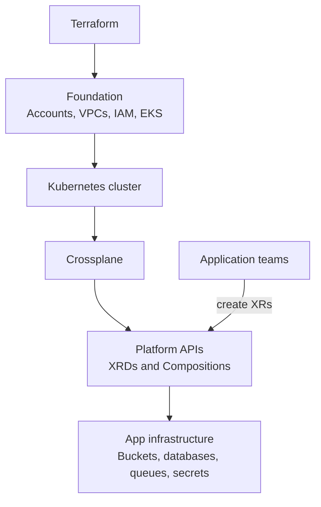

# Terraform vs Crossplane

## Purpose

Compare Terraform and Crossplane so you can decide which tool fits a workflow, team model, or platform architecture.

## Short version

Use Terraform when you want an explicit plan/apply workflow, broad provider coverage, mature module reuse, and infrastructure changes driven by CLI, CI/CD, or HCP Terraform.

Use Crossplane when you want infrastructure to be available as Kubernetes APIs, reconciled continuously by controllers, and exposed to application teams through platform-owned abstractions.

Many organizations use both:

- Terraform creates foundational infrastructure such as accounts, networks, clusters, and IAM bootstrap.
- Crossplane runs inside Kubernetes and exposes self-service APIs for application infrastructure.

## Comparison table

| Area | Terraform | Crossplane |
| --- | --- | --- |
| Primary interface | HCL configuration and CLI/API workflows. | Kubernetes resources and controllers. |
| Execution model | Plan, then apply when a workflow runs. | Continuous reconciliation loop. |
| State model | Terraform state maps configuration to remote objects. | Kubernetes stores desired state; controllers observe external state and update status. |
| Reuse model | Modules package reusable HCL. | XRDs define APIs; Compositions define implementations. |
| Review model | `terraform plan` shows proposed changes before apply. | Kubernetes diff/GitOps review plus controller status after reconciliation. |
| Access model | Backend, workspace, VCS, and cloud credentials. | Kubernetes RBAC, namespaces, provider configs, and cloud credentials. |
| Drift handling | Detected during plan or refresh. | Controllers continuously observe and reconcile. |
| Best fit | Infrastructure provisioning and lifecycle workflows. | Platform APIs, self-service, and Kubernetes-native operations. |

## What Terraform does well

- Gives a clear preview of planned changes before applying.
- Has a mature provider and module ecosystem.
- Works well outside Kubernetes.
- Fits pull request workflows where reviewers inspect a plan.
- Handles foundational infrastructure before a Kubernetes cluster exists.
- Has established patterns for remote state, locking, policy, and CI/CD.

## What Crossplane does well

- Lets teams request infrastructure with Kubernetes APIs.
- Uses Kubernetes RBAC and namespaces for self-service boundaries.
- Reconciles continuously instead of only during a pipeline run.
- Exposes platform-specific APIs such as `PlatformDatabase`, `AppBucket`, or `ServiceEnvironment`.
- Composes cloud resources, Kubernetes resources, and third-party custom resources behind one XR.
- Works naturally with GitOps controllers that apply Kubernetes manifests.
- Reports health through Kubernetes status, conditions, events, and controller logs.

## Problems Crossplane solves more naturally than Terraform

| Problem | Why Crossplane helps |
| --- | --- |
| Platform self-service | Teams can create approved infrastructure by creating custom Kubernetes resources. |
| Continuous correction | Controllers keep reconciling if an external resource drifts or is not ready yet. |
| Kubernetes-native access control | RBAC and namespaces can control who can request which platform APIs. |
| Application plus infrastructure composition | One XR can compose a Deployment, Service, Secret, database, bucket, or external system resource. |
| API abstraction | XRDs let platform teams hide low-level provider details behind a stable internal API. |
| Status-driven operations | Users can inspect readiness with `kubectl get`, `kubectl describe`, events, and traces. |

## Problems Terraform still solves better

| Problem | Why Terraform helps |
| --- | --- |
| Explicit change preview | `terraform plan` is a first-class workflow for review before mutation. |
| Foundational bootstrap | Terraform can create networks, clusters, IAM, and backends before Kubernetes exists. |
| Broad resource coverage | Terraform has a very mature provider ecosystem across cloud and SaaS platforms. |
| One-off provisioning | A CI/CD apply can be simpler than operating controllers inside a cluster. |
| State-driven migration workflows | Terraform state commands support advanced import, move, and refactor workflows. |
| Non-Kubernetes teams | Teams do not need to learn CRDs, controllers, or Kubernetes operations first. |

## XRDs vs Terraform modules

XRDs are not modules.

A Terraform module is a reusable HCL package. It receives variables, creates resources during plan/apply, and records the result in Terraform state.

An XRD defines a Kubernetes API. Users create XRs from that API. Crossplane continuously reconciles those XRs through Compositions and provider controllers.

The useful mapping is:

| Terraform concept | Crossplane concept |
| --- | --- |
| Module variables | XRD schema fields. |
| Module outputs | XR status fields and connection details pattern. |
| Module resources | Composition composed resources. |
| Module source/version | Composition package, revision, or GitOps-managed manifest. |
| Module call | XR manifest. |
| Terraform state | Kubernetes API objects plus provider-observed external state. |

## Decision guide

| Situation | Prefer |
| --- | --- |
| You need to create the first Kubernetes cluster and cloud network. | Terraform |
| You need application teams to request standard infrastructure from inside Kubernetes. | Crossplane |
| You require human review of an exact infrastructure plan before apply. | Terraform |
| You want ongoing reconciliation and Kubernetes-native status. | Crossplane |
| You are building a platform API with controlled inputs and hidden implementation. | Crossplane |
| You are managing many systems that have no Kubernetes operating model. | Terraform |
| You want GitOps to manage app infrastructure resources as Kubernetes manifests. | Crossplane |
| You need mature module registry patterns and provider coverage immediately. | Terraform |

## Practical combined architecture

This split keeps Terraform responsible for bootstrap and broad infrastructure, while Crossplane turns the Kubernetes cluster into a self-service platform control plane.

## Review and safety differences

Terraform safety usually comes from:

- Plan review before apply.
- State locking.
- Module versioning.
- CI/CD approval gates.
- Policy checks before mutation.

Crossplane safety usually comes from:

- Narrow XRD schemas.
- Compositions owned by platform teams.
- Kubernetes RBAC and namespace boundaries.
- ProviderConfig permission boundaries.
- GitOps review for XR manifests.
- Status, events, traces, and controller logs after reconciliation.

Neither tool removes the need for cloud IAM design, deletion policies, naming standards, tagging, or cost controls.

## Related links

- [Terraform documentation](https://developer.hashicorp.com/terraform/docs)
- [Terraform modules](https://developer.hashicorp.com/terraform/language/modules)
- [Terraform state](https://developer.hashicorp.com/terraform/language/state)
- [Crossplane documentation](https://docs.crossplane.io/latest/)
- [Crossplane XRDs](https://docs.crossplane.io/latest/composition/composite-resource-definitions/)
- [Crossplane Compositions](https://docs.crossplane.io/latest/composition/compositions/)
- [Back to Crossplane comparison](README.md)
- [Back to Crossplane index](../README.md)
- [Back to root index](../../README.md)
