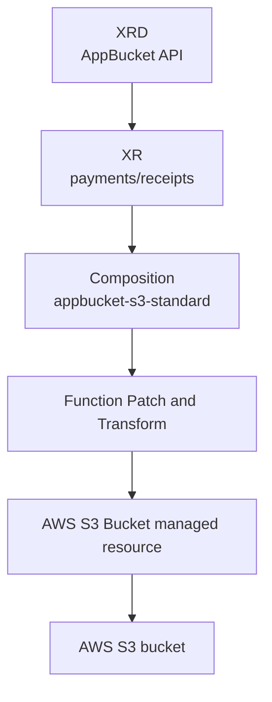

# Crossplane Compositions

## Purpose

Explain what Compositions are, how they depend on XRDs and XRs, and how to implement an AWS-backed platform API with pipeline functions.

## Where Compositions fit

A Composition is the implementation behind an XR.

The XRD defines the API. The XR is the user request. The Composition decides which AWS managed resources Crossplane should create for that request.



A Composition is not used directly by application teams in normal self-service workflows. Platform teams own it, and application teams create XRs.

## What a Composition does

In Crossplane v2, new Compositions should use `mode: Pipeline`.

Pipeline Compositions call one or more Functions. A Function receives the XR and existing composed resources, then returns the desired composed resources Crossplane should apply.

Typical AWS Composition responsibilities:

- Set the AWS provider config.
- Choose approved AWS resource kinds.
- Map XR fields into AWS provider fields.
- Inject tags, naming, region, and deletion policy rules.
- Hide IAM, network, encryption, and default settings from application teams.
- Publish readiness through the XR.

## Install Function Patch and Transform

```yaml
apiVersion: pkg.crossplane.io/v1
kind: Function
metadata:
  name: function-patch-and-transform
spec:
  package: xpkg.crossplane.io/crossplane-contrib/function-patch-and-transform:v0.8.2
```

Apply it:

```bash
kubectl apply -f function-patch-and-transform.yaml
kubectl get functions
```

What it does: installs the function used by the Composition pipeline to template AWS managed resources.

Expected result after it becomes healthy:

```text
NAME                           INSTALLED   HEALTHY
function-patch-and-transform   True        True
```

## AWS AppBucket Composition

This Composition implements the `AppBucket` XRD from [XRDs and XRs](../xrd-and-xr/README.md). It creates an AWS S3 Bucket managed resource.

```yaml
apiVersion: apiextensions.crossplane.io/v1
kind: Composition
metadata:
  name: appbucket-s3-standard
  labels:
    provider: aws
    service: s3
    tier: standard
spec:
  compositeTypeRef:
    apiVersion: platform.example.org/v1alpha1
    kind: AppBucket
  mode: Pipeline
  pipeline:
  - step: patch-and-transform
    functionRef:
      name: function-patch-and-transform
    input:
      apiVersion: pt.fn.crossplane.io/v1beta1
      kind: Resources
      resources:
      - name: bucket
        base:
          apiVersion: s3.aws.m.upbound.io/v1beta1
          kind: Bucket
          spec:
            deletionPolicy: Delete
            providerConfigRef:
              name: default
              kind: ClusterProviderConfig
            forProvider:
              region: eu-west-1
              tags:
                managed-by: crossplane
                platform-api: appbucket
        patches:
        - type: FromCompositeFieldPath
          fromFieldPath: spec.region
          toFieldPath: spec.forProvider.region
        - type: FromCompositeFieldPath
          fromFieldPath: spec.environment
          toFieldPath: spec.forProvider.tags.environment
        - type: FromCompositeFieldPath
          fromFieldPath: spec.deletionPolicy
          toFieldPath: spec.deletionPolicy
```

Apply it:

```bash
kubectl apply -f composition-appbucket-s3-standard.yaml
kubectl get compositions
```

What it does: registers an AWS S3 implementation for the `AppBucket` API. Any `AppBucket` XR that selects this Composition creates an S3 Bucket managed resource.

## Composition fields that matter

| Field | Purpose |
| --- | --- |
| `metadata.name` | Stable Composition name that XRs can reference. |
| `metadata.labels` | Selection metadata for `compositionSelector`. |
| `spec.compositeTypeRef` | The XRD API version and kind this Composition can implement. |
| `spec.mode` | Use `Pipeline` for function-based Compositions. |
| `spec.pipeline` | Ordered list of function steps. |
| `functionRef.name` | Installed Function called by that step. |
| `input.resources[].base` | Base AWS managed resource template. |
| `patches` | Field mappings from the XR to composed resources. |

## AWS field mapping example

This patch copies the user's region choice into the S3 Bucket managed resource:

```yaml
- type: FromCompositeFieldPath
  fromFieldPath: spec.region
  toFieldPath: spec.forProvider.region
```

This patch adds the user's environment to AWS tags:

```yaml
- type: FromCompositeFieldPath
  fromFieldPath: spec.environment
  toFieldPath: spec.forProvider.tags.environment
```

This patch lets the XR decide whether Crossplane deletes or orphans the AWS S3 bucket when the XR is deleted:

```yaml
- type: FromCompositeFieldPath
  fromFieldPath: spec.deletionPolicy
  toFieldPath: spec.deletionPolicy
```

## Multi-resource AWS Composition pattern

A production Composition often creates more than one AWS resource. For example, an `AppQueue` API could compose:

- An SQS queue.
- An SQS dead-letter queue.
- A queue redrive policy.
- IAM policy resources for workload access.

Keep the same pattern:

```yaml
resources:
- name: queue
  base:
    apiVersion: sqs.aws.m.upbound.io/v1beta1
    kind: Queue
    spec:
      providerConfigRef:
        name: default
        kind: ClusterProviderConfig
      forProvider:
        region: eu-west-1
- name: deadletter
  base:
    apiVersion: sqs.aws.m.upbound.io/v1beta1
    kind: Queue
    spec:
      providerConfigRef:
        name: default
        kind: ClusterProviderConfig
      forProvider:
        region: eu-west-1
```

What it does: shows how one XR can own multiple AWS managed resources. The exact provider fields depend on the installed AWS provider package and resource kind.

For a fuller AWS network example, see [AWS VPC platform API](../examples/aws-vpc-platform-api.md). It shows one `PlatformNetwork` XR implemented as a VPC, two subnets, a network ACL, ACL rules, a route table, route table associations, and S3/DynamoDB VPC endpoints.

## Render before applying

```bash
crossplane composition render appbucket-receipts.yaml composition-appbucket-s3-standard.yaml function-patch-and-transform.yaml
```

What it does: runs the function pipeline locally and prints the AWS managed resources the Composition would generate.

Use this before applying new Compositions to a shared cluster.

## Trace after applying

```bash
crossplane beta trace appbucket.platform.example.org/receipts -n payments
```

What it does: shows the XR, Composition, composed AWS managed resources, and readiness state in one tree.

## Composition revision policy

Crossplane creates Composition revisions when a Composition changes. By default, XRs can automatically use newer revisions.

For production AWS resources, consider pinning upgrades:

```yaml
spec:
  crossplane:
    compositionUpdatePolicy: Manual
```

What it does: prevents an existing XR from automatically adopting a new Composition revision until the platform team intentionally moves it.

## Composition design rules for AWS

- Keep AWS provider schemas out of the application-facing XRD where possible.
- Inject required tags in the Composition, not in every XR.
- Default to least-privilege provider credentials per account or environment.
- Treat deletion policies as part of the data-retention model.
- Use Composition labels for environment, provider, tier, and compliance variants.
- Test Compositions with `crossplane composition render` before applying them.

## Troubleshooting Compositions

| Symptom | Check | Likely cause |
| --- | --- | --- |
| XR does not select the Composition | Compare `spec.compositeTypeRef` with the XRD API version and kind | Composition targets the wrong XR type. |
| Function is not called | `kubectl get functions` | Function package is not installed or not healthy. |
| XR is `Synced=False` | `kubectl describe appbucket receipts -n payments` | Patch path, function input, or provider resource template is invalid. |
| S3 Bucket is not ready | `kubectl describe bucket <name> -n payments` | AWS permissions, region, quota, naming, or provider config problem. |
| New Composition change affects existing XRs | Inspect Composition revisions and XR update policy | Existing XRs may be using automatic revision updates. |

## Related links

- [Crossplane Compositions](https://docs.crossplane.io/latest/composition/compositions/)
- [Function Patch and Transform](https://docs.crossplane.io/latest/guides/function-patch-and-transform/)
- [Crossplane composite resources](https://docs.crossplane.io/latest/composition/composite-resources/)
- [XRDs and XRs in this knowledge base](../xrd-and-xr/README.md)
- [Crossplane examples](../examples/README.md)
- [AWS VPC platform API](../examples/aws-vpc-platform-api.md)
- [Back to Crossplane index](../README.md)
- [Back to root index](../../README.md)
