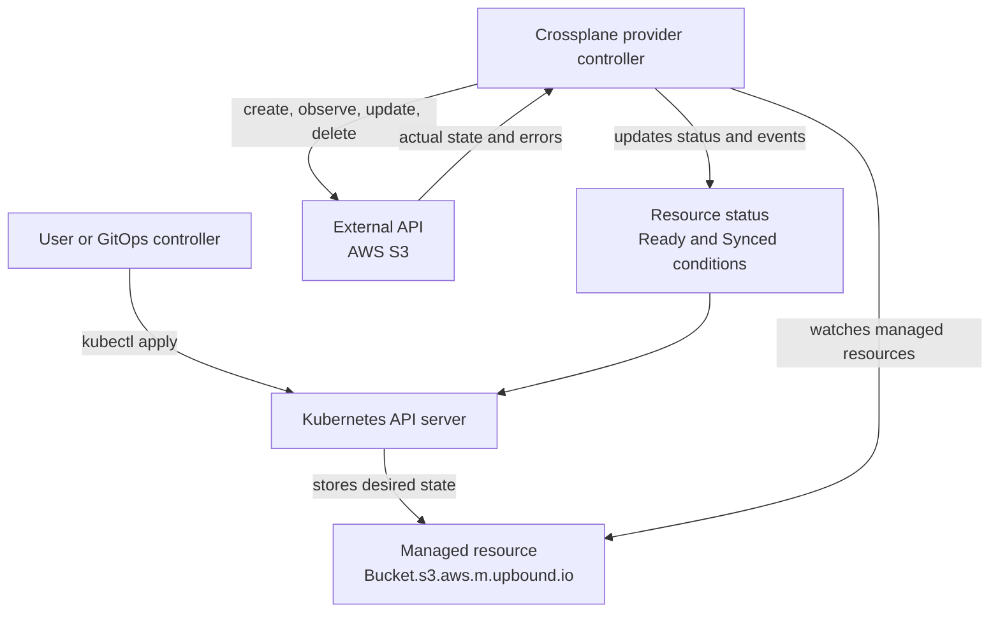
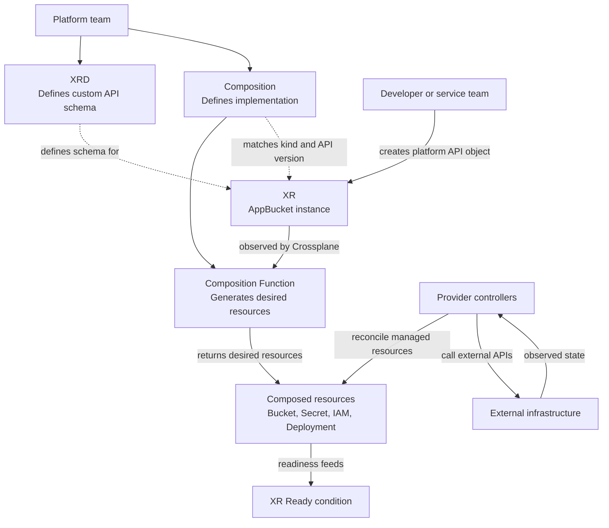
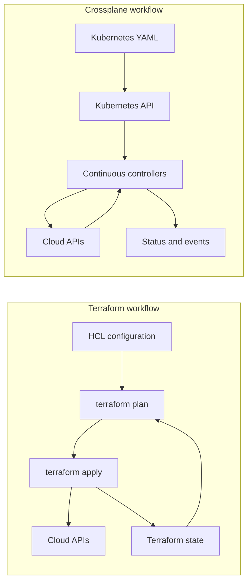
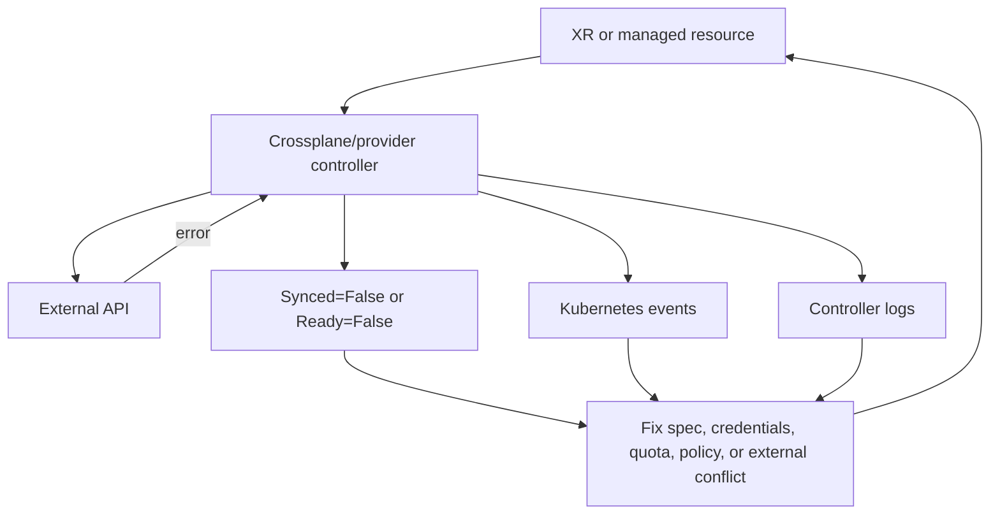

# Crossplane workflow

## Purpose

Show the graphical workflow Crossplane follows when deploying infrastructure directly through managed resources or indirectly through a custom platform API.

## Direct managed resource workflow



What happens:

1. A user applies a provider-specific managed resource.
2. Kubernetes stores the object like any other custom resource.
3. The provider controller watches that object.
4. The provider calls the external API.
5. Crossplane updates status, conditions, events, and connection details where supported.

This workflow is close to using a cloud-provider SDK through Kubernetes objects.

## Composition workflow



What happens:

1. The platform team defines an XRD and at least one matching Composition.
2. A developer creates an XR using the custom API from the XRD.
3. Crossplane selects a matching Composition.
4. Crossplane runs the Composition function pipeline.
5. The pipeline returns desired composed resources.
6. Crossplane applies those resources to the Kubernetes API.
7. Provider controllers reconcile managed resources into external infrastructure.
8. Crossplane reports status through the XR.

This workflow is the main platform self-service pattern.

## Terraform plan/apply compared with Crossplane reconciliation



The key difference is timing. Terraform calculates and applies a change when the workflow runs. Crossplane keeps watching resources and reconciling them after the initial request.

## Failure workflow



Useful checks:

```bash
kubectl get managed
kubectl describe <kind> <name> -n <namespace>
kubectl get events -n <namespace> --sort-by=.lastTimestamp
kubectl -n crossplane-system logs deploy/crossplane
kubectl -n crossplane-system get pods
```

What it does: starts from resource health, then uses describe output, events, and controller logs to find provider errors.

## Related links

- [Crossplane fundamentals](../fundamentals/README.md)
- [Crossplane examples](../examples/README.md)
- [XRDs and Compositions](../xrd-and-compositions/README.md)
- [Terraform vs Crossplane](../comparison/terraform-vs-crossplane.md)
- [Crossplane composition documentation](https://docs.crossplane.io/latest/composition/)
- [Back to Crossplane index](../README.md)
- [Back to root index](../../README.md)
