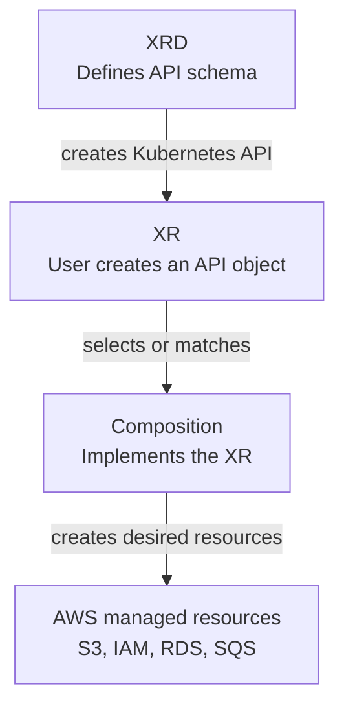

# XRDs and XRs

## Purpose

Explain what Crossplane XRDs and XRs are, how they depend on each other, how users call them, and how they compare with Terraform modules.

## The dependency chain

Crossplane platform APIs have two layers before infrastructure can be created:

1. The XRD defines the API contract.
2. The XR is a user request that follows that contract.
3. A Composition implements the XR by creating AWS managed resources.



An XRD alone does not create AWS infrastructure. It only creates the Kubernetes API. An XR alone cannot create AWS infrastructure unless a matching Composition exists.

## What an XRD is

An XRD, or `CompositeResourceDefinition`, defines a new Kubernetes API for a higher-level platform capability.

Think of an XRD as an API contract:

- It gives the API a group, version, kind, and plural name.
- It defines whether the API is namespaced or cluster-scoped.
- It defines the allowed `spec` fields with an OpenAPI v3 schema.
- It validates what users can ask for before Crossplane tries to compose anything.
- It does not create AWS resources by itself.

The important mental model is:

```text
XRD = "What can users request?"
XR  = "One user request that follows the XRD schema."
Composition = "How Crossplane turns that request into AWS resources."
```

For AWS, useful XRDs might be:

- `AppBucket`: a governed S3 bucket for one application.
- `AppQueue`: a standard SQS queue with tags and dead-letter settings.
- `PlatformDatabase`: an approved RDS database profile.
- `PlatformNetwork`: a VPC, subnets, network ACLs, route tables, and VPC endpoints.
- `ServiceEnvironment`: a bundle of AWS resources needed by one service.

The XRD should describe what the consumer is allowed to decide. It should not expose every provider field.

## AWS AppBucket XRD

```yaml
apiVersion: apiextensions.crossplane.io/v2
kind: CompositeResourceDefinition
metadata:
  name: appbuckets.platform.example.org
spec:
  group: platform.example.org
  scope: Namespaced
  names:
    kind: AppBucket
    plural: appbuckets
  versions:
  - name: v1alpha1
    served: true
    referenceable: true
    schema:
      openAPIV3Schema:
        type: object
        properties:
          spec:
            type: object
            properties:
              region:
                type: string
                description: AWS region where the S3 bucket should be created.
                enum:
                - eu-west-1
                - eu-central-1
                - us-east-1
              environment:
                type: string
                description: Environment tag controlled by the requesting team.
                enum:
                - dev
                - staging
                - prod
              deletionPolicy:
                type: string
                description: Whether Crossplane should delete or orphan the external AWS resource when the XR is deleted.
                enum:
                - Delete
                - Orphan
                default: Delete
            required:
            - region
            - environment
```

What it does: creates a namespaced Kubernetes API named `AppBucket`. Users can create `AppBucket` objects, but they can only choose the approved region, environment, and deletion behavior.

Apply and inspect it:

```bash
kubectl apply -f xrd-appbucket.yaml
kubectl get xrd appbuckets.platform.example.org
kubectl api-resources | findstr AppBucket
```

What it does: verifies the XRD exists and the generated API is available through Kubernetes discovery.

> [!IMPORTANT]
> XRD `metadata.name` must be the plural name, a dot, and the group name. For this example it must be `appbuckets.platform.example.org`.

## AWS PlatformNetwork XRD

This XRD defines a bigger AWS network API. The user can request a deployable VPC shape without creating every `VPC`, `Subnet`, `NetworkACL`, `RouteTable`, and `VPCEndpoint` managed resource manually.

```yaml
apiVersion: apiextensions.crossplane.io/v2
kind: CompositeResourceDefinition
metadata:
  name: platformnetworks.platform.example.org
spec:
  group: platform.example.org
  scope: Namespaced
  names:
    kind: PlatformNetwork
    plural: platformnetworks
  versions:
  - name: v1alpha1
    served: true
    referenceable: true
    schema:
      openAPIV3Schema:
        type: object
        properties:
          spec:
            type: object
            properties:
              region:
                type: string
                enum:
                - eu-west-1
                - eu-central-1
                - us-east-1
              cidrBlock:
                type: string
                description: CIDR block for the VPC.
              environment:
                type: string
                enum:
                - dev
                - staging
                - prod
              privateSubnetA:
                type: object
                properties:
                  availabilityZone:
                    type: string
                  cidrBlock:
                    type: string
                required:
                - availabilityZone
                - cidrBlock
              privateSubnetB:
                type: object
                properties:
                  availabilityZone:
                    type: string
                  cidrBlock:
                    type: string
                required:
                - availabilityZone
                - cidrBlock
              deletionPolicy:
                type: string
                enum:
                - Delete
                - Orphan
                default: Delete
            required:
            - region
            - cidrBlock
            - environment
            - privateSubnetA
            - privateSubnetB
```

What it does: creates a custom Kubernetes API named `PlatformNetwork`. The API exposes only platform-approved inputs: region, VPC CIDR, two private subnet definitions, environment, and deletion behavior.

Apply and inspect it:

```bash
kubectl apply -f xrd-platformnetwork.yaml
kubectl get xrd platformnetworks.platform.example.org
kubectl api-resources | findstr PlatformNetwork
```

What it does: confirms Kubernetes now has a `platformnetworks.platform.example.org` API endpoint.

## What an XR is

An XR, or composite resource, is an object a user creates from the API defined by the XRD.

For this XRD, the user calls the API by creating an `AppBucket`:

```yaml
apiVersion: platform.example.org/v1alpha1
kind: AppBucket
metadata:
  namespace: payments
  name: receipts
spec:
  region: eu-west-1
  environment: prod
  deletionPolicy: Orphan
  crossplane:
    compositionRef:
      name: appbucket-s3-standard
```

Apply and inspect it:

```bash
kubectl apply -f appbucket-receipts.yaml
kubectl get appbuckets -n payments
kubectl describe appbucket receipts -n payments
```

What it does: creates a request for an AWS-backed platform bucket. Crossplane stores the XR, selects the referenced Composition, and starts creating composed resources.

For the network XRD, the call is a `PlatformNetwork` XR:

```yaml
apiVersion: platform.example.org/v1alpha1
kind: PlatformNetwork
metadata:
  namespace: payments
  name: payments-network
spec:
  region: eu-west-1
  cidrBlock: 10.40.0.0/16
  environment: prod
  privateSubnetA:
    availabilityZone: eu-west-1a
    cidrBlock: 10.40.1.0/24
  privateSubnetB:
    availabilityZone: eu-west-1b
    cidrBlock: 10.40.2.0/24
  deletionPolicy: Orphan
  crossplane:
    compositionRef:
      name: platformnetwork-aws-private
```

Apply and inspect it:

```bash
kubectl apply -f platformnetwork-payments.yaml
kubectl get platformnetworks -n payments
kubectl describe platformnetwork payments-network -n payments
crossplane beta trace platformnetwork.platform.example.org/payments-network -n payments
```

What it does: calls the platform API once. The matching Composition can then create the AWS VPC, subnets, network ACL, ACL rules, route table, route table associations, and VPC endpoints as composed resources.

## How users select an implementation

Use an explicit Composition when the caller must pin an implementation:

```yaml
spec:
  crossplane:
    compositionRef:
      name: appbucket-s3-standard
```

Use a selector when the platform team wants label-based choices:

```yaml
spec:
  crossplane:
    compositionSelector:
      matchLabels:
        provider: aws
        service: s3
        tier: standard
```

What it does: lets multiple AWS implementations exist for the same `AppBucket` API, such as standard, compliance, or logging-heavy buckets.

## XRDs and XRs compared with Terraform modules

XRDs are not Terraform modules. XRs are not Terraform module calls in the execution sense either.

| Terraform module concept | Crossplane equivalent | Important difference |
| --- | --- | --- |
| Module input variables | XRD `spec` schema | XRD fields become a Kubernetes API contract, not CLI input. |
| Module call | XR manifest | An XR is persisted and reconciled continuously. |
| Module resources | Composition resources | The Composition is a controller-driven implementation. |
| Module outputs | XR status and connection details | Status is updated by controllers over time. |
| Module version | Composition package, Git version, or Composition revision | Existing XRs can auto-adopt or manually pin revisions. |
| Terraform state | Kubernetes objects plus provider-observed external state | There is no Terraform state file for the XR. |

The practical mapping is:

- XRD equals the platform API contract.
- XR equals one request to that platform API.
- Composition equals the implementation of that request.

In Terraform, a module is evaluated when Terraform runs. In Crossplane, the XR remains in Kubernetes and controllers keep reconciling it until it is deleted or paused.

For the `PlatformNetwork` example, the Terraform equivalent would be a `vpc` module call with input variables. In Crossplane, the `PlatformNetwork` XR is a persistent Kubernetes resource. If an AWS subnet or endpoint is not ready, the XR shows that through status and Crossplane keeps reconciling instead of waiting for another `terraform apply`.

## Designing AWS XRDs

Good AWS platform APIs expose product-level choices and hide provider-level detail.

| XRD design decision | Recommended AWS platform API shape |
| --- | --- |
| Region | Expose a short allowlist if latency, residency, or cost matters. |
| Tags | Require business tags such as environment; inject owner and managed-by tags in the Composition. |
| Resource names | Prefer generated names; expose external names only for integration requirements. |
| IAM | Hide IAM role, policy, and provider credential details from application teams. |
| Networking | Expose environment or tier; hide subnet, VPC, and security group IDs where possible. |
| Deletion | Default to `Delete` in sandboxes and `Orphan` or backup-first behavior for production data. |

## Common XRD fields

| Field | Purpose |
| --- | --- |
| `spec.group` | API group for the generated API, such as `platform.example.org`. |
| `spec.names.kind` | User-facing kind, such as `AppBucket`. |
| `spec.names.plural` | Plural resource name, such as `appbuckets`. |
| `spec.scope` | Whether XRs are `Namespaced`, `Cluster`, or `LegacyCluster`. |
| `spec.versions` | Served API versions and schemas. |
| `served` | Allows users to create resources with that API version. |
| `referenceable` | Marks the version a Composition can reference. Only one version should be referenceable. |
| `openAPIV3Schema` | Validates the user-facing `spec` fields. |

## v2 scope guidance

Use `Namespaced` for most application-facing AWS APIs. It keeps XRs in application namespaces and follows normal Kubernetes RBAC patterns.

Use `Cluster` only for platform-level APIs that are not owned by one namespace, such as cluster-wide IAM bootstrap or shared network policy.

Use `LegacyCluster` only when maintaining v1-style claim workflows.

## Troubleshooting XRDs and XRs

| Symptom | Check | Likely cause |
| --- | --- | --- |
| `kubectl get appbuckets` fails | `kubectl get xrd appbuckets.platform.example.org` | XRD is missing, unhealthy, or the API name is different. |
| XR is rejected on apply | Check Kubernetes validation error | The XR does not match the XRD schema. |
| XR exists but creates nothing | `kubectl describe appbucket receipts -n payments` | No matching Composition or invalid Composition reference. |
| XR stays `Synced=False` | `crossplane beta trace appbucket.platform.example.org/receipts -n payments` | Composition function or composed resource error. |
| XR stays `Ready=False` | Inspect composed AWS resources | An S3, IAM, RDS, SQS, or other AWS managed resource is not ready. |

## Related links

- [Crossplane XRDs](https://docs.crossplane.io/latest/composition/composite-resource-definitions/)
- [Crossplane composite resources](https://docs.crossplane.io/latest/composition/composite-resources/)
- [Crossplane Compositions](https://docs.crossplane.io/latest/composition/compositions/)
- [Terraform modules](https://developer.hashicorp.com/terraform/language/modules)
- [Crossplane Compositions in this knowledge base](../compositions/README.md)
- [Crossplane examples](../examples/README.md)
- [AWS VPC platform API example](../examples/aws-vpc-platform-api.md)
- [Back to Crossplane index](../README.md)
- [Back to root index](../../README.md)
