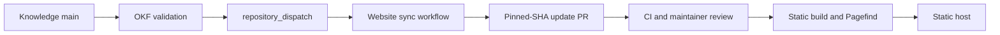

# Website architecture

## Repository responsibilities

| Repository | Responsibility |
| --- | --- |
| Knowledge base | Author and validate `knowledge/`; generate the concept catalog; emit an update signal after successful `main` OKF validation. |
| Website | Pin a full knowledge commit SHA; fetch and verify the snapshot; render pages and search; own redirects, tests, release review, and deployment. |

The website is an [Astro static build](https://docs.astro.build/en/guides/content-collections/) with a build-time Markdown collection and [Pagefind](https://pagefind.app/docs/) indexing the finished HTML. The final artifact is static HTML, CSS, JavaScript for search, assets, and a generated search bundle. No server-side content query is needed when a reader opens a page. Temporary build caches are disposable.

## Snapshot and rendering

The website reads `content-lock.json` and checks out the exact knowledge commit in a temporary build directory. It verifies the [content contract](content-contract.md) before Astro renders pages. The renderer resolves source links and assets in a single tested mapping layer, uses GitHub-compatible heading IDs, and generates a route manifest. Pagefind runs after static HTML generation. The search bundle and route manifest are derived outputs, never content authorities.

Use a Markdown pipeline that handles GFM callouts and converts Mermaid blocks to safe SVG during the build. Reject or sanitize unsafe raw HTML. A failed conversion fails the build, rather than silently replacing a diagram or warning with plain text. Site origin and base path are build-time values applied to routes, assets, canonical URLs, sitemap, and search paths.

## Update workflow

1. A successful run of the existing `OKF validation` workflow for a `push` to knowledge `main` triggers a separate dispatch job. Restrict it to that event and branch. Its fine-grained token is stored as a source-repository Actions secret and has Contents write permission only on the website repository, as required by [GitHub's dispatch endpoint](https://docs.github.com/en/rest/repos/repos#create-a-repository-dispatch-event).
2. The website listens for `repository_dispatch` and also supports manual and scheduled reconciliation. Each run fetches the current source `main` HEAD instead of trusting an event payload as the build revision. Serialize sync runs. Skip an unchanged revision; reject a non-forward move from the current lock for manual investigation.
3. The sync run checks the proposed source snapshot, updates one content-lock branch, and opens or updates one pull request. Website PR checks validate rendering and release requirements. The maintainer reviews and merges; only the merge into website `main` can start production deployment.
4. With the website `GITHUB_TOKEN`, GitHub may require a maintainer to approve the workflow runs on an automation-created pull request. Document this as part of review. Enable the repository setting that allows Actions to create pull requests. [GitHub event behavior](https://docs.github.com/en/actions/how-tos/write-workflows/choose-when-workflows-run/trigger-a-workflow).

Keep the dispatch token out of pull-request jobs and logs. Require a reviewed PR and passing checks on website `main`; do not give the sync workflow a deployment credential. A failed dispatch or expired token leaves the current site online, and reconciliation can retry after the credential is repaired.

## Hosting boundary

The build produces one portable `dist/` artifact. The initial host and domain are deferred to the owner. Add one deployment adapter only after selection, with origin and base path configured in CI. Deployment reads a built artifact and does not fetch new knowledge outside the pinned lock.

## Related links

- [Requirements](requirements.md)
- [Content contract](content-contract.md)
- [Rollout](rollout.md)
- [Website plan](README.md)
