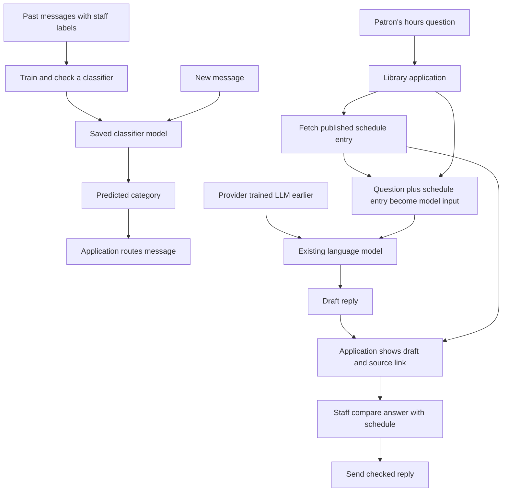

# AI fundamentals

## Purpose

Read this before choosing an AI tool or trusting an AI-written answer. You
should leave able to distinguish an AI system, machine learning, generative
AI, a large language model, an assistant, and an agent. You should also be
able to explain why building a model differs from using one.

These words have overlapping uses. This page gives a beginner's working
model, starting with the [OECD's AI system definition](https://oecd.ai/en/ai-principles).
The library example below is invented. No model was trained, queried, or
tested for it.

## What AI means here

An **AI system** is machine-based: it takes input and infers an output for
an explicit or implicit goal. The output may be a prediction,
recommendation, decision, or new content. For example,
an email sorter predicts a category; a writing assistant produces a draft.
AI systems differ in how independently they operate and whether they adapt
after deployment.[^oecd-ai-principles]

An application built around a model may also include an interface,
instructions, data sources, tools, and a step where people review its output.

Not every AI system learns from examples. Some reason over represented
knowledge and rules; many current systems use **machine learning (ML)**.
A simple hand-written keyword rule is usually ordinary software; an `if`
statement alone does not make a system AI. In ML, **training** uses data to
build or adjust a **model** that can make predictions or generate content.
**Inference** means using that model to produce an output. A normal
inference call does not update the model's learned internal values
(**parameters**, often called **weights**). A system can update them through
a separate training or adaptation step, even if it runs that step
frequently.[^oecd-ai-definition-memo][^google-what-is-ml][^google-ml-glossary]

An assistant can seem to remember because its application sends earlier
messages, saved notes, or retrieved records back as input. The model can
use that input in a new response without changing its
weights.[^anthropic-context-windows] The OECD memorandum also uses "infer
how" for work during system building; this page
uses **inference** for producing an output with an existing model.[^oecd-ai-definition-memo]

## Why the distinctions matter

If you treat every AI feature as the same thing, you can easily assume that
asking a question teaches the model, that a fluent sentence is a checked
fact, or that an agent can act without limits. Those assumptions change how
you protect data, review an answer, and decide which tools an application may
use. A generated answer can sound certain while being false; NIST calls this
**confabulation**, often called a "hallucination" in everyday AI
discussion.[^nist-genai-profile] A text-generating LLM predicts output
tokens from learned patterns and the current input. That process alone does
not check a claim against an up-to-date record.[^google-llm-introduction]

One request does not by itself train the model you are using. That says
nothing about whether the application stores your input or whether a provider
may use it when training a future model. Product policies differ; check the
current data-use policy before submitting sensitive material. Anthropic's
consumer data-use notice is one concrete example of such a policy, not a
rule for every AI service.[^anthropic-consumer-data-use]

## The mental model: five different questions

| Question | Term | Plain meaning |
| --- | --- | --- |
| How was the model built? | Machine learning | Training uses data to build or adjust a model. Other AI approaches can use explicit knowledge and rules. |
| What can the model create? | Generative AI | A model can create content such as text, images, audio, or video, beyond choosing from a fixed set of labels. It can still be asked to return just one label. |
| Is it a large model for language? | Large language model (LLM) | An ML model trained at large scale on language data. Text-generating LLMs produce output in tokens, small pieces of text or other encoded content. “Large” has no single cutoff in this guide. |
| How is a model presented in a conversation? | Assistant | An application presents a model through an interface and may add instructions, information, or tools. Other applications, such as a message router, need no chat assistant. |
| Who chooses the next step? | Agent | In one common meaning, the model directs a sequence of steps and tool calls instead of following only a fixed path. |

Today's LLMs are ML models; many use deep learning with neural networks.
Generative AI includes more than LLMs: a model that generates an image is
generative too. An LLM is a component of an assistant, not the whole
application. A generative model can also be asked to classify a message by
returning one label; the task alone does not identify the model type.[^google-what-is-ml][^google-llm-introduction]

Anthropic distinguishes a **workflow**, where code defines the paths,
from an **agent**, where the model chooses its next steps and tool requests.
An assistant can also behave as an agent. A model's request does not run a
tool by itself: the application checks whether the tool is available,
executes an allowed call, and returns the result. Other organizations use
the word “agent” more broadly, so check what a product actually lets it
do.[^anthropic-effective-agents][^anthropic-tool-use]

## An analogy: an apprentice sign painter

Imagine an apprentice who studies many examples of shop signs. Later a
customer asks for a new sign. The long study resembles **training**; making
this sign resembles **inference**. The apprentice can paint convincing words
without checking whether the shop really opens on Sunday. Giving the
apprentice the official shop-hours book puts the right information within
reach; they can still copy it incorrectly, so someone compares the sign
with the book. A ladder adds a tool for hanging a sign. Permission to use it
on a real shopfront is a separate decision. AI tool access and authorization
are separate too.

The analogy breaks in useful ways:

- A person may learn from each job. The model in this example does not
  update its weights when answering. The application can retain the
  conversation or use feedback in a later training cycle; these are
  separate from this inference call.
- A person can visit the shop. A model cannot inspect a live record unless
  the application gives it a way to retrieve that record. A remembered
  pattern is not evidence for today's opening hours.
- A person chooses and uses physical tools directly. An AI agent acts only
  through the tools, permissions, and application flow people give it.
  More access changes the possible consequences of a mistake.[^anthropic-effective-agents]

## Example: the invented Riverside Library

The library wants to sort incoming messages and answer opening-hours
questions. These are two jobs shown in four steps:

1. **Build a sorter.** Staff label past messages as *membership*, *room
   booking*, or *lost item*. Training produces a classifier; staff check it
   on different messages it has not seen. It predicts one label and does not
   write a reply. This classifier is ML but does not generate content.
2. **Use the sorter.** A new message arrives. The classifier predicts *room
   booking* and the application routes it to the right queue. This is
   inference. That one prediction does not retrain the model. Staff can
   correct mistakes and use reviewed examples for a later training cycle.
3. **Draft an answer.** The library also uses an existing LLM trained by a
   provider. It asks the model to draft a reply to a patron's web-form
   question about special-event hours. Without the current schedule, the
   model might give plausible but wrong hours. The application fetches the
   published schedule, passes the relevant entry to the model, and shows
   staff a draft with a link to that entry. Staff verify
   the entry and answer before sending the reply. This is a fixed **workflow**:
   application code defines the lookup and review steps. A source link helps
   checking but does not guarantee that the draft interpreted it well.
4. **Consider an agent.** The model could instead request a read-only
   `get_schedule` call when it decides the schedule is needed. The
   application checks and runs the request, then gives the result back to
   the model.[^anthropic-tool-use] A separate `edit_booking` tool could
   change bookings if the application granted it write access and ran its
   requests. The library does not grant that tool in this example; a real
   write path would need its own access limits and human confirmation.

The library could also ask an LLM to choose one of the three message labels.
That would be a generative model used for a classification task, instead of
the separate classifier the library trained here.[^anthropic-ticket-routing]

The patron's message and fetched material are input, not instructions from
the library. If either contains a command for the model, the application
must not let that text grant new tool access or override its checks. This
kind of attempted redirection is called **prompt injection**.[^nist-genai-profile]

**End state:** the library trained one model for labels and used another for
draft text. Its fixed workflow checks the reply before sending it; the
optional agent path has only a read tool. This is a teaching example, not a
claim about a real library or a tested product.

## Visual: building a model and using it are separate

**Text alternative:** Past labelled messages go through a training and
checking step to create a classifier. A new message goes through that saved
classifier, and the application routes its predicted category. Separately,
a patron's question reaches an application that fetches the published
schedule entry, sends the question and entry to a language model trained
earlier by a provider, then shows staff the draft and source link. Staff
compare them before sending a reply. The diagram shows the fixed workflow,
not the optional agent path. Use the two paths to decide whether a task
needs a newly trained model, an existing model, an up-to-date record,
or a human review step.

## Common misconceptions

- **“All AI is ML.”** Knowledge-based approaches can use explicit rules or
  representations instead of training a model from examples.[^oecd-ai-definition-memo]
- **“Generative AI is just chat.”** Images, audio, and video are also possible
  outputs.[^oecd-ai-definition-memo]
- **“The model learned my question.”** A normal inference call uses a model;
  it does not by itself change its learned values. Earlier messages supplied
  again as context can change the next answer without training the
  model.[^anthropic-context-windows]
  Check the product's data-use policy separately.[^anthropic-consumer-data-use]
- **“A citation makes an answer true.”** Check that the source exists, is
  current for the question, and supports the exact claim.[^nist-genai-profile]
- **“It said it checked, so it did.”** Inspect the actual source or tool
  result. The model's statement about its own steps is not evidence that the
  application fetched the record.[^anthropic-tool-use]
- **“An agent can do anything.”** Tools, credentials, and back-end checks
  bound its access. It can still make mistakes within that access, so grant
  only the capabilities it needs.[^anthropic-effective-agents]

## Check your understanding

1. Which Riverside model did staff train, and which did they only use?
2. Why does the library's trained classifier differ from the LLM, even
   though either model could be used to choose a message label?
3. Without the schedule entry, why might the drafting workflow give wrong
   hours? Even with the entry, why must staff check the draft?
4. Who chooses the schedule lookup in the library's fixed workflow? Who
   would choose it in the optional agent path, and what additional risk would
   `edit_booking` create?

## Next steps

- [AI tooling](ai-tooling/index.md) maps applications, tools, skills, and
  knowledge bases.
- [Model Context Protocol](ai-tooling/model-context-protocol.md) explains one
  way an AI application can reach tools and information.
- [Retrieval and context efficiency](ai-tooling/knowledge-bases/retrieval-and-context-efficiency.md)
  follows the search-to-source path behind a grounded answer.

The current AI section has no beginner hands-on tutorial for building either
library feature. Follow the official lessons below for guided ML practice.

## Official documentation for deeper study

- The [OECD AI Principles](https://oecd.ai/en/ai-principles) define an AI
  system; the [explanatory memorandum](https://www.oecd.org/content/dam/oecd/en/publications/reports/2024/03/explanatory-memorandum-on-the-updated-oecd-definition-of-an-ai-system_3c815e51/623da898-en.pdf)
  explains learning-based and knowledge-based approaches, training, and use.
- Google's [introduction to ML](https://developers.google.com/machine-learning/intro-to-ml/what-is-ml)
  and [LLM lesson](https://developers.google.com/machine-learning/crash-course/llm/transformers)
  go deeper into trained models and text generation.
- [Anthropic's agent guide](https://www.anthropic.com/engineering/building-effective-agents)
  compares fixed workflows with model-directed tool use, and its
  [tool-use guide](https://platform.claude.com/docs/en/agents-and-tools/tool-use/how-tool-use-works)
  shows how an application runs a model-requested tool.
- Anthropic's [context-window guide](https://platform.claude.com/docs/en/build-with-claude/context-windows)
  explains why a conversation can use earlier messages without retraining,
  while its [ticket-routing guide](https://platform.claude.com/docs/en/about-claude/use-case-guides/ticket-routing)
  shows a language model used for classification.
- [NIST's Generative AI Profile](https://nvlpubs.nist.gov/nistpubs/ai/NIST.AI.600-1.pdf)
  covers risks including confidently wrong output.
- [Anthropic's consumer data-use notice](https://privacy.claude.com/en/articles/10023555-how-do-you-use-personal-data-in-model-training)
  illustrates why input retention and future training are product-policy
  questions rather than properties of inference.

## Related links

- [AI index](index.md)
- [Start here](../start-here.md)
- [Root knowledge index](../index.md)

[^oecd-ai-principles]: [OECD AI Principles](https://oecd.ai/en/ai-principles), source record `oecd-ai-principles`.
[^oecd-ai-definition-memo]: [OECD explanatory memorandum on the AI system definition](https://www.oecd.org/content/dam/oecd/en/publications/reports/2024/03/explanatory-memorandum-on-the-updated-oecd-definition-of-an-ai-system_3c815e51/623da898-en.pdf), source record `oecd-ai-definition-memo`.
[^google-what-is-ml]: [Google for Developers - What is machine learning?](https://developers.google.com/machine-learning/intro-to-ml/what-is-ml), source record `google-what-is-ml`.
[^google-ml-glossary]: [Google for Developers - Machine Learning Glossary](https://developers.google.com/machine-learning/glossary), source record `google-ml-glossary`.
[^google-llm-introduction]: [Google for Developers - What's a large language model?](https://developers.google.com/machine-learning/crash-course/llm/transformers), source record `google-llm-introduction`.
[^anthropic-effective-agents]: [Anthropic - Building effective agents](https://www.anthropic.com/engineering/building-effective-agents), source record `anthropic-effective-agents`.
[^anthropic-tool-use]: [Anthropic - How tool use works](https://platform.claude.com/docs/en/agents-and-tools/tool-use/how-tool-use-works), source record `anthropic-tool-use`.
[^anthropic-context-windows]: [Anthropic - Context windows](https://platform.claude.com/docs/en/build-with-claude/context-windows), source record `anthropic-context-windows`.
[^anthropic-ticket-routing]: [Anthropic - Ticket routing](https://platform.claude.com/docs/en/about-claude/use-case-guides/ticket-routing), source record `anthropic-ticket-routing`.
[^nist-genai-profile]: [NIST AI 600-1 - Generative AI Profile](https://nvlpubs.nist.gov/nistpubs/ai/NIST.AI.600-1.pdf), source record `nist-genai-profile`.
[^anthropic-consumer-data-use]: [Anthropic Privacy Center - How do you use personal data in model training?](https://privacy.claude.com/en/articles/10023555-how-do-you-use-personal-data-in-model-training), source record `anthropic-consumer-data-use`.
