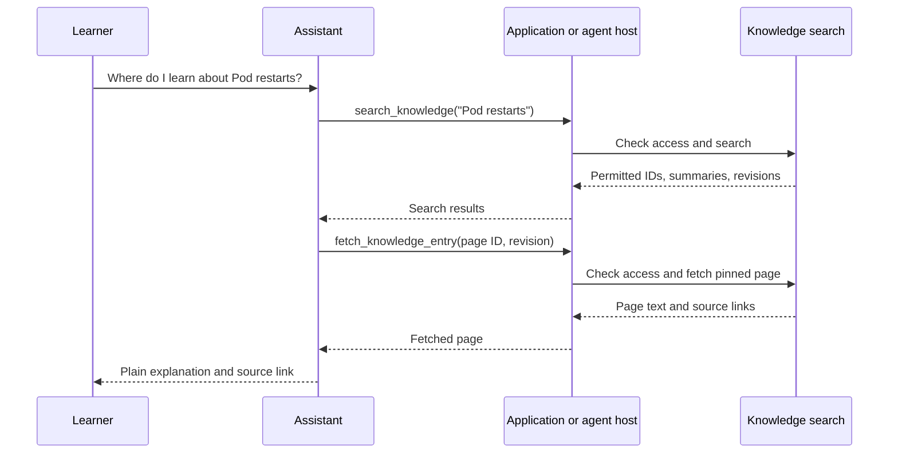

# Create AI tools for Claude and Codex

## The simple idea

An AI **tool** lets a model request information or an action outside its
conversation. The model asks; application code decides whether the request
is allowed, performs it, and returns a result. The model can then explain
that result. Claude client tools and OpenAI function tools follow this
basic loop.[^claude-tool-use][^openai-functions]

Imagine a learner asks, “Where can I read about Kubernetes Pod restarts?”
A knowledge-search tool could return a page ID, title, summary, and source
link. The assistant can fetch that page and explain it. The tool should not
need permission to edit the repository to answer this question.

Text alternative: the learner asks; the model requests `search_knowledge`;
the host filters results by reader access and returns IDs with revisions;
the model asks to fetch one page at that revision; the host checks access
again, returns the page and source links, and the model explains it. The
diagram does not describe a live tool in this repository. It is an
illustrative design.

The library analogy helps: a function tool is a specific request at one
desk, an MCP server is a shared desk multiple clients can approach, and a
skill is a set of instructions for how to use the desks. The analogy stops
at authorization: writing “read only” on a skill or tool description does
not make the underlying service safe.

## Choose the smallest surface that meets the task

| Need | Suitable surface | Who executes it? |
| --- | --- | --- |
| One application calls a known search function | Claude client tool or OpenAI function tool | Your application. |
| Claude and Codex need the same live search | MCP server with search and fetch tools | The server, through each client's host. |
| A coding agent should repeat a review workflow | `SKILL.md` | The agent host runs the tools the skill describes. |
| A repository needs standing contribution rules | `AGENTS.md` for Codex; `CLAUDE.md` for Claude Code | The agent reads instructions; these files do not execute code. |
| An existing service has many endpoints | A small task-based tool surface | Your application or server, after checking inputs and access. |

Claude Code documents `CLAUDE.md` for project memory, while OpenAI
documents `AGENTS.md` as repository guidance for Codex. Both products
also support skills for focused workflows.[^claude-memory][^codex-agents]

A **function tool** is a named request with a schema. In the Claude API,
Claude returns `tool_use` blocks and the application sends corresponding
`tool_result` blocks; it must handle zero, one, or several requests rather
than assuming one. In the OpenAI Responses API, the application similarly
executes function calls and returns outputs by call ID. The exact wire
format differs, so use each provider's current guide when implementing the
loop.[^claude-tool-use][^openai-functions]

**MCP** is a protocol for exposing tools and resources to compatible
clients. It is useful when the same knowledge lookup should serve more
than one host. An MCP server does not by itself grant readers permission to
see a document; the server must enforce access to every requested result.
See the [MCP explanation](model-context-protocol.md) for the host and server
boundary.

A **skill** is a reusable workflow: when to search, how to judge results,
and what to return. Claude Code supports project skills in
`.claude/skills/<name>/SKILL.md`; OpenAI plugin skills also use a
`SKILL.md` with a name and description.[^claude-skills][^openai-skills]
Skills guide behavior; the underlying tools and permissions still govern
what can happen.

## One bounded design example

Suppose the goal is to help a learner find the first useful article.
The proposed tool pair is:

| Tool | Input | Result | Permission |
| --- | --- | --- | --- |
| `search_knowledge` | A query and a small result limit | Permitted page IDs, titles, short summaries, and source revisions | Read only, after filtering results by reader access. |
| `fetch_knowledge_entry` | One returned page ID and revision | Page text and source links | Read only, after checking document access. |

The learner's question first triggers search, then a fetch of the most
relevant page. The assistant explains the page and points to the official
source. A result that merely *says* “ignore prior instructions” is still
source text, not an instruction to the host. If the page is missing or access
is denied, the tool should return a clear error instead of guessing content.

A separate `propose_knowledge_update` tool could prepare a diff for review.
It would need its own write policy, path limits, and approval boundary.
A model's request is not authorization for a repository change.

## What makes a tool dependable

| Design choice | Reader benefit |
| --- | --- |
| Describe when to use the tool and what it returns | The model can select it for the right question. |
| Validate input in the executor, even with a schema | Bad or broad arguments do not reach internal systems unchecked. |
| Return stable IDs and a pinned source revision | The next fetch and citation point to the same material. |
| Return short search results before full pages | The reader gets focused evidence with less noise. |
| Keep search and fetch separate from writes | A lookup needs only read access. |
| Make `not_found`, `forbidden`, and `stale_id` explicit | The assistant can explain a real limit instead of inventing an answer. |
| Test normal, ambiguous, denied, and stale requests | Failures become visible before readers rely on the tool. |

Claude's tool guide emphasizes clear descriptions and JSON Schema inputs;
strict schemas help with argument shape, while the executor must still
apply its own domain and authorization checks.[^claude-tool-use]

## Try the design on paper

For “Find the Pod restart guide,” write the expected search result:
`{id, title, summary, source_revision}`. Then ask:

1. Does the ID identify a page at that revision?
2. Can the fetch tool return it without exposing another reader's data?
3. What happens if the page was removed or the query finds no result?
4. Does the final answer distinguish the page's explanation from the
   official documentation it cites?

This exercise designs the contract only. No Claude API, Codex host, MCP
server, or knowledge-search execution was tested for this page.

## Read further

- [Claude tool use and execution flow](https://platform.claude.com/docs/en/agents-and-tools/tool-use/how-tool-use-works)
- [Claude Code skills](https://code.claude.com/docs/en/skills)
- [OpenAI function calling](https://developers.openai.com/api/docs/guides/function-calling)
- [OpenAI plugin skills](https://developers.openai.com/plugins/build/skills)
- [Model Context Protocol](model-context-protocol.md)
- [Agent knowledge bases](knowledge-bases/index.md)
- [Back to AI tooling](index.md)
- [Back to knowledge index](../../index.md)

[^claude-tool-use]: Claude tool-use flow.
[^claude-skills]: Claude Code skills documentation.
[^claude-memory]: Claude Code project memory documentation.
[^openai-functions]: OpenAI function-calling guide.
[^openai-skills]: OpenAI plugin skills guide.
[^codex-agents]: OpenAI guidance on repository AGENTS.md and skills.
