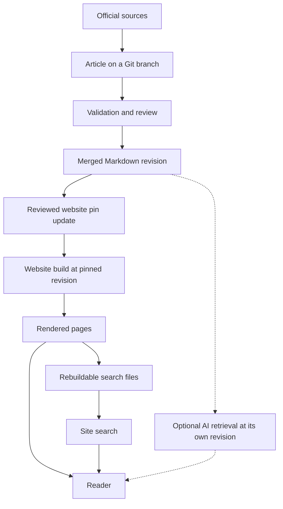

# Knowledge-base creation, management, and optimization

## The simple idea

A useful knowledge base starts with **an article that helps a person
understand one thing**. The article should explain the idea in ordinary
language, show a small example, say where the explanation has limits,
and link to the original documentation. Readers can learn the basics
here, then use the official source when they need exact behavior or
instructions.

The website, search box, and an AI assistant are different ways to
*reach* that article. They do not replace the article or make it correct
automatically. In this repository, the reader-facing articles live as
Markdown in [the knowledge bundle](../../index.md). Git records changes
to those files over time, and the bundle uses OKF metadata to describe
each concept and its lifecycle.[^git-version-control][^okf-spec]

Imagine a library: articles are the books, topic directories are the
shelves, and each `index.md` is a shelf guide. The website is a reading
room and its search box is a lookup desk. This picture helps with finding
a page. It does not show the Git review and release steps, and a lookup desk
cannot check whether a book is accurate or current.

## Follow one article to a reader

Text alternative: an author checks official sources and writes an article
on a Git branch. Validation and review happen before it is merged. A
separate reviewed website update pins a merged revision, renders pages,
and makes rebuildable search files from those pages. An optional AI route
can read a curated revision too, which may differ from the website pin.
If a website sentence is stale, compare its displayed source commit with
source `main`: an older pin needs a site update; an error still present
in `main` needs a reviewed Markdown correction.

Consider [Terraform state management](../../terraform/fundamentals/state-management.md).
A beginner might search “Why does Terraform need state?”, read a
short explanation and example, then open [HashiCorp's state
documentation](https://developer.hashicorp.com/terraform/language/state)
for the exact rules.[^terraform-state] If the article needs correction,
review the Markdown change first. The planned website update then pins
the newer source revision through its own reviewed pull request; pages
and search files are rebuilt from that pin.[^adr-0005] The separate site
is currently a local scaffold, not a public release. This example was
not tested with a reader.

## Keep the layers separate

| Layer | Job | If it is wrong or missing |
| --- | --- | --- |
| **Source documentation** | Supplies authoritative product or standard details. | Recheck the official source before making a claim. |
| **Curated article** | Teaches one outcome in simple language and cites sources. | Edit and review the Markdown; do not patch only the website. |
| **Topic index and metadata** | Tell readers what exists, where it belongs, and whether its status is draft, stable, or deprecated. | Fix links and labels so new material has a home. |
| **Website and search** | Present articles and help readers discover them. | Rebuild them from the approved article revision. |
| **Optional AI access** | Lets an assistant retrieve selected articles. | Check what it retrieved and how it used the source. |

A static website can build pages from Markdown; Astro documents
content collections for working with content, and Pagefind can create
search data from built pages.[^astro-collections][^pagefind-docs]
An MCP server can expose retrieval to an AI host, but MCP only
standardizes that exchange. It does not define the content store or
verify the answer.[^mcp-architecture] These are options for presenting
and finding knowledge, not extra copies to maintain by hand.

## Make room for more topics

A growing knowledge base needs a predictable path for a new article.
Here, a contributor should:

1. Choose the closest topic directory and read its `index.md`.
2. Give the concept one main reader outcome: understand, complete a
   task, inspect a reference, or solve a problem.
3. Write a simple definition, a bounded example, limits, and links to
   primary sources. Add the frontmatter this repository's
   [OKF profile](knowledge-bases/okf-v0.2.md) requires: `type`, `title`,
   `description`, `tags`, `status`, `maturity`, `audience`, and
   `maintainer`. Record only real provenance and review evidence.
4. Add the page to its parent index, regenerate the derived concept catalog,
   and run the repository's validation and link checks before review.

The [contribution guide](../../../CONTRIBUTING.md) and
[authoring instructions](../../../instructions.md) contain the exact
requirements. The index and concept catalog make the new article discoverable
in the source bundle. A public website update still requires its
separate pinned-revision review and build.[^adr-0005]

## Improve what readers struggle to find or understand

After publication, use reader tasks and search results to identify a
specific problem: a missing explanation, an unclear example, a bad
topic route, or a misleading search result. Correct the source article
or index, then review and rebuild the derived views. The
[retrieval guide](knowledge-bases/retrieval-and-context-efficiency.md)
explains how to test whether a search path finds the intended page.
This repository's [reader-task protocol](../../../reader-test-facilitator-guide.md)
records real confusion before claiming the site helps new learners.

## Check your understanding

- If the site shows an outdated sentence, how can its displayed source
  commit tell you whether to edit the article or update the site pin?
- What can an official documentation link add after a simple article?
- Why does an AI answer still need source checking when it retrieved
  an article successfully?

## Explore further

- [Reference architecture](knowledge-bases/reference-architecture.md)
  explains source files, derived indexes, serving, and maintenance.
- [Retrieval and context efficiency](knowledge-bases/retrieval-and-context-efficiency.md)
  explains search and bounded results.
- [Provenance, trust, and freshness](knowledge-bases/provenance-trust-and-freshness.md)
  explains how to record source and review signals without inventing them.
- [Model Context Protocol](model-context-protocol.md) explains optional
  AI access.
- [Back to AI tooling](index.md).

[^git-version-control]: [Git book, about version control](https://git-scm.com/book/en/v2/Getting-Started-About-Version-Control), source record `git-version-control`.
[^okf-spec]: [Open Knowledge Format v0.2 specification, pinned revision](https://github.com/GoogleCloudPlatform/open-knowledge-format/blob/ad30107c31c06aec8a7d5636e0d1058118604e6f/SPEC.md), source record `okf-spec`.
[^pagefind-docs]: [Pagefind documentation](https://pagefind.app/docs/), source record `pagefind-docs`.
[^astro-collections]: [Astro content collections](https://docs.astro.build/en/guides/content-collections/), source record `astro-collections`.
[^mcp-architecture]: [MCP architecture overview](https://modelcontextprotocol.io/docs/2026-07-28/learn/architecture), source record `mcp-architecture`.
[^terraform-state]: [HashiCorp, Terraform state](https://developer.hashicorp.com/terraform/language/state), source record `terraform-state`.
[^adr-0005]: [ADR-0005: Publish a Git-backed reading site](../../decision-records/adr-0005-git-backed-reading-site.md).
