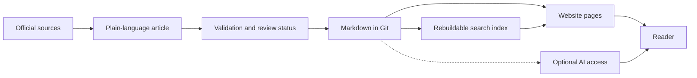

# Knowledge-base creation, management, and optimization

## The simple idea

A useful knowledge base starts with **an article that helps a person
understand one thing**. The article should explain the idea in ordinary
language, show a small example, say where the explanation has limits,
and link to the original documentation. Readers can learn the basics
here, then use the official source when they need exact behavior or
instructions.

The website, search box, and an AI assistant are different ways to
*reach* that article. They do not replace the article or make it correct
automatically. In this repository, the reader-facing articles live as
Markdown in [the knowledge bundle](../../index.md). Git records changes
to those files over time, and the bundle uses OKF metadata to describe
each concept and its lifecycle.[^git-version-control][^okf-spec]

Imagine a library: articles are the books, the topic indexes are the
shelves, and search is the catalog. The website is a reading room.
This analogy stops at trust. A shelf or catalog can help find a book,
but an author and reviewer still have to check what the book says.

## Follow one article to a reader

Text alternative: an author checks official sources, writes an article,
and records its validation and review status. The versioned Markdown is
stored in Git. A website presents it; a rebuildable search index helps
people find it. An optional AI connection can read it too. The reader
still needs the article's source links.

Consider [Terraform state management](../../terraform/fundamentals/state-management.md).
A beginner might search “Why does Terraform need state?”, read a
short explanation and example, then open [HashiCorp's state
documentation](https://developer.hashicorp.com/terraform/language/state)
for the exact rules.[^terraform-state] If the explanation changes, the
Markdown file changes first. The website and search output should then
be rebuilt from that revision. This is a design pattern, not a claim
that this example was tested with a reader.

## Keep the layers separate

| Layer | Job | If it is wrong or missing |
| --- | --- | --- |
| **Source documentation** | Supplies authoritative product or standard details. | Recheck the official source before making a claim. |
| **Curated article** | Teaches one outcome in simple language and cites sources. | Edit and review the Markdown; do not patch only the website. |
| **Topic index and metadata** | Tell readers what exists, where it belongs, and whether it is draft or mature. | Fix links and labels so new material has a home. |
| **Website and search** | Present articles and help readers discover them. | Rebuild them from the approved article revision. |
| **Optional AI access** | Lets an assistant retrieve selected articles. | Check what it retrieved and how it used the source. |

A static website can build pages from Markdown; Astro documents
content collections for working with content, and Pagefind can create
search data from built pages.[^astro-collections][^pagefind-docs]
An MCP server can expose retrieval to an AI host, but MCP only
standardizes that exchange. It does not define the content store or
verify the answer.[^mcp-architecture] These are options for presenting
and finding knowledge, not extra copies to maintain by hand.

## Make room for more topics

A growing knowledge base needs a predictable path for a new article.
Here, a contributor should:

1. Choose the closest topic directory and read its `index.md`.
2. Give the concept one main reader outcome: understand, complete a
   task, inspect a reference, or solve a problem.
3. Write a simple definition, a bounded example, limits, and links to
   primary sources. Record only real provenance and review evidence.
4. Add the page to its parent index, then run the repository's
   validation and link checks before review.

The [contribution guide](../../../CONTRIBUTING.md) and
[authoring instructions](../../../instructions.md) contain the exact
requirements. The directory and metadata rules make a new article
discoverable without changing the website by hand.[^okf-spec]

## Check your understanding

- If search shows an outdated sentence, which file should an author
  correct first?
- What can an official documentation link add after a simple article?
- Why does an AI answer still need source checking when it retrieved
  an article successfully?

## Explore further

- [Reference architecture](knowledge-bases/reference-architecture.md)
  explains source files, derived indexes, serving, and maintenance.
- [Retrieval and context efficiency](knowledge-bases/retrieval-and-context-efficiency.md)
  explains search and bounded results.
- [Provenance, trust, and freshness](knowledge-bases/provenance-trust-and-freshness.md)
  explains how to record source and review signals without inventing them.
- [Model Context Protocol](model-context-protocol.md) explains optional
  AI access.
- [Back to AI tooling](index.md).

[^git-version-control]: [Git book, about version control](https://git-scm.com/book/en/v2/Getting-Started-About-Version-Control), source record `git-version-control`.
[^okf-spec]: [Open Knowledge Format specification](https://github.com/GoogleCloudPlatform/open-knowledge-format/blob/main/SPEC.md), source record `okf-spec`.
[^pagefind-docs]: [Pagefind documentation](https://pagefind.app/docs/), source record `pagefind-docs`.
[^astro-collections]: [Astro content collections](https://docs.astro.build/en/guides/content-collections/), source record `astro-collections`.
[^mcp-architecture]: [MCP architecture overview](https://modelcontextprotocol.io/docs/2026-07-28/learn/architecture), source record `mcp-architecture`.
[^terraform-state]: [HashiCorp, Terraform state](https://developer.hashicorp.com/terraform/language/state), source record `terraform-state`.
