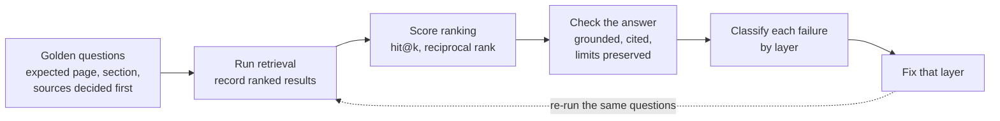

# Evaluation and quality

## The question this page answers

**Evaluating** a knowledge base means checking, with questions whose answers
you already know, whether people and AI agents can find the right evidence
and turn it into an accurate answer that cites that evidence. A knowledge
base is not good because it has many pages. It is good when a real question
leads to the right page quickly, and the answer stays faithful to it.

Three terms carry the rest of the page:

- A **golden question** is a test question written together with its
  expected answer location: the page, the section, and any source records a
  safe answer needs. The expected location is decided *before* running a
  search, so the result cannot bend the judgement.
- A **ranked result list** is what a search returns, best guess first. The
  **rank** of a result is its position: rank 1 is first.
- **Grounding** means every material claim in an answer is supported by the
  evidence the answer retrieved, and each citation points to text that
  supports its claim.

This page explains how to design a small evaluation. It does not describe a
search service deployed for this repository.

## Why one score is not enough

A wrong answer can come from several unrelated causes: the page never
existed, search ranked it too low, the answer ignored it, the page was
correct until its source changed, or the agent gave up after too many
lookups. One overall score hides which of these happened, and fixing the
wrong layer wastes effort. Keep five measurements separate:

| Layer | Question it answers | Example check | Symptom when it fails |
| --- | --- | --- | --- |
| Content quality | Does a correct, clear page for this question exist? | A reviewer confirms the expected section answers the question. | Every search misses because nothing answers it, or the page is wrong. |
| Retrieval ranking | Does the expected page appear high in the results? | Hit@k and reciprocal rank, defined below. | The page exists but appears low or not at all. |
| Answer grounding and citations | Does the answer say what the evidence says, and cite it correctly? | Compare each claim with the fetched section. | The right page was fetched, yet the answer contradicts or overstates it. |
| Freshness | Does the answer reveal draft, stale, or conflicting evidence? | The answer mentions a passed `stale_after` deadline or an open source conflict. | A confident answer relies on outdated or disputed evidence. |
| Efficiency | What did it cost to reach the evidence? | Count searches, fetches, bytes or tokens, and seconds per question. | The answer is right but too slow or expensive to be useful. |

Efficiency is recorded next to quality, never instead of it: a cheaper run
that misses the evidence is worse, not better.

## An analogy and where it breaks

Picture a mystery shopper at a library help desk. They ask a question they
already know the answer to, note which shelf the librarian points to first,
check whether the librarian's answer matches the book, and time the visit.

The analogy captures deciding the answer key in advance and scoring several
things at once. Where it breaks:

- **The desk is one person; the system has parts.** A search index finds
  pages and a separate writer, human or model, composes the answer. They can
  fail independently, which is why the layers above are scored separately.
- **One visit is an anecdote.** A useful evaluation uses many questions, and
  small sets still give noisy numbers.
- **The answer key can go out of date.** When a source changes, the
  expected answer may change too; golden questions need their own review.
- **Some questions should have no answer.** Test questions the corpus
  cannot answer as well as ones it can.[^azure-rag-retrieval] For those, a
  good answer says the evidence is missing instead of inventing it.
- **Some shelves are closed.** A shopper who lacks access must not even see
  a restricted title. That is a pass or fail rule, described below, not a
  ranking score.

## The evaluation loop

Text alternative: an evaluator writes golden questions with their expected
evidence, runs retrieval, and records the ranked results. Ranking is scored
first, then the answer is checked against the evidence. Each failure is
assigned to one layer, that layer is fixed, and the *same* questions are run
again so that before and after results are comparable. The diagram helps
decide which layer a change should target.

## A worked example with invented results

Everything in this example is illustrative. No search engine produced these
rankings, and no answer was generated or scored.

**The golden question.** "Does a passed `stale_after` date mean a knowledge
page is wrong?" The case author decides in advance that the expected
evidence is [Provenance, trust, and freshness](provenance-trust-and-freshness.md),
section "Freshness signals." If a reviewer believes another page also
answers the question, it is added to the expected list *before* scoring,
not after seeing the results.

**The ranked results** for that question in one imagined run:

| Rank | Page returned | Relevant? |
| --- | --- | --- |
| 1 | Retrieval and context efficiency | No. It mentions staleness but does not answer the question. |
| 2 | Provenance, trust, and freshness, "Freshness signals" | Yes. |
| 3 | Reference architecture | No. It lists `stale_after` as a control without explaining it. |

**Scoring the ranking.**

- **Hit@k** is 1 when at least one expected page appears in the first `k`
  results, otherwise 0. Here hit@1 is 0 and hit@3 is 1. With one expected
  page, hit@k gives the same number as recall at `k`, the share of expected
  items found in the first `k`.
- **Precision at k** is the share of the first `k` results that are
  relevant.[^stanford-ir-ranked-evaluation] Here precision at 3 is 1 of 3.
  It says more when a question has several relevant pages.
- **Reciprocal rank** is 1 divided by the rank of the first relevant result,
  or 0 if none appears within the chosen top-five cutoff. Here it is 1/2,
  or 0.5.
- **Mean reciprocal rank at five (MRR@5)** averages those top-five
  reciprocal ranks across the question set.[^azure-rag-retrieval] Suppose
  two more invented questions score 1 (expected page first) and 0
  (expected page absent from the top five). MRR@5 for the three questions
  is (0.5 + 1 + 0) / 3 = 0.5.

The average hides the most useful detail: one question missed entirely.
Always read the individual misses, not only the mean.

**Checking the answer.** Suppose the agent fetched the rank-2 section and
answered:

> No. A passed `stale_after` date means the page is due for review, so check
> its sources before relying on it. It does not prove the page is wrong, and
> a date still in the future does not prove it is right. (Source: Provenance,
> trust, and freshness, "Freshness signals"; the page is a draft.)

Check it claim by claim: each statement matches the fetched section, the
citation points to the section that supports it, and the answer keeps the
page's `draft` limit. That is a pass for grounding and freshness awareness.

Now suppose a different answer said, "Yes, ignore pages past `stale_after`,"
with the same citation. Retrieval succeeded and a citation exists, but the
claim contradicts the evidence. That is a grounding failure. Improving the
search would not fix it.

## Choosing what to measure

| If your concern is | Measure | Why |
| --- | --- | --- |
| Readers or agents usually open only the first result | Hit@1 and reciprocal rank | They reward the expected page appearing first. |
| An agent reads a fixed number of results, such as five | Hit@5, or recall at 5 | They show whether the evidence was inside the reading budget. |
| Questions have several relevant pages | Precision at k | It shows how much of the budget is spent on noise. |
| Some pages are more useful than others | A graded measure such as NDCG | It is designed for non-binary relevance judgements.[^stanford-ir-ranked-evaluation] |
| Answers must be trustworthy | A claim-by-claim grounding and citation check | Ranking metrics say nothing about what the answer claims. |

Compare two retrieval methods only on the same question set. Across 18
public datasets, the BEIR benchmark found BM25 lexical search to be a robust
baseline, while several neural retrieval approaches often underperformed,
which its authors read as room to improve generalization.[^beir] The
practical inference: a method's results on someone else's collection do not
transfer automatically to yours, so keep a simple lexical baseline in your
own comparison.

After using the golden questions to improve the system, check a separate
set of questions that was not used to tune it. Otherwise, repeated fixes
can improve the known examples without helping new readers.

## Rules that are pass or fail, not scores

Some properties must hold regardless of how good the ranking is.

- **Authorization before disclosure.** A caller without access to a page
  must not receive its document, its title, or a snippet of it. Test this
  with a restricted fixture page and an unauthorized caller. A failure is a
  security defect, even if every ranking score is perfect. Caches count
  too: a cached result that is not keyed by the caller's authorization
  scope and the corpus commit can leak a page or serve superseded evidence.
  See [security and governance](security-and-governance.md).
- **Deterministic generated regions.** Where a renderer produces part of a
  page from a producer, re-running it over unchanged input with the same
  renderer version must produce identical output and no proposed change,
  and no model-written text may appear inside those machine-owned regions.
  This repository applies the same idea to its generated catalog:
  `python3 scripts/build-knowledge-catalog.py --check` fails when the
  committed catalog differs from a fresh build.

## What this repository tests today

The [retrieval cases](../../../../tests/retrieval-cases.yaml) are golden
questions, each with expected concept paths and, for most cases, required
source IDs. The [case validator](../../../../scripts/validate-retrieval-cases.py)
checks that every expected path is a real concept in the generated catalog
and that each required source ID is recorded on one of the expected
concepts.

That is a static integrity check. It does not run a search engine, produce
a ranking, compute hit@k or MRR, generate an answer, or record a human
reader's result. The [retrieval guide](retrieval-and-context-efficiency.md)
proposes hit@3 as a planning check for an optional AI retrieval layer. No
release threshold has been set, and no result has been measured. The cases
are ready to become the question set for the loop above when a retrieval
layer exists.

## Common misconceptions

- "The right page was retrieved, so the answer is right." Retrieval and
  answer grounding are separate checks.
- "A citation proves the claim." Only if the cited text supports it.
- "A high average means no problem." A mean can hide a question that
  failed completely.
- "Fewer tokens is always better." Not if the evidence was cut out.
- "Our static retrieval cases pass, so search works." They check paths and
  source IDs, not ranking.

## Check your understanding

1. The expected page is at rank 4. What are hit@3, hit@5, and the
   reciprocal rank?
2. An answer cites the correct section but adds a limit the section never
   mentions. Which layer failed?
3. Why must the expected page be chosen before looking at the search
   results?
4. Why is an unauthorized snippet a failure even when ranking is perfect?

## Official documentation for deeper study

- [Stanford Introduction to Information Retrieval, evaluation of ranked
  results](https://nlp.stanford.edu/IR-book/html/htmledition/evaluation-of-ranked-retrieval-results-1.html)
  explains precision at k, R-precision, MAP, and NDCG, with their trade-offs.
- [Azure Architecture Center, RAG information-retrieval
  phase](https://learn.microsoft.com/en-us/azure/architecture/ai-ml/guide/rag/rag-information-retrieval)
  defines precision and recall at K and MRR, and recommends testing positive
  and negative questions.
- [BEIR research paper](https://arxiv.org/abs/2104.08663) shows why a
  retrieval method must be tested on varied collections before trusting it.

## Next in this section

- [Retrieval and context efficiency](retrieval-and-context-efficiency.md)
  explains the search-to-fetch path being measured.
- [Provenance, trust, and freshness](provenance-trust-and-freshness.md)
  explains the freshness and conflict signals an answer should surface.
- [Security and governance](security-and-governance.md) explains the
  authorization rule tested above.
- [Reference architecture](reference-architecture.md) shows where
  evaluation fits in the full system.
- [Back to agent knowledge bases](index.md)
- [Back to AI tooling](../index.md)
- [Back to root index](../../../../README.md)

[^stanford-ir-ranked-evaluation]: [Manning, Raghavan, and Schütze - Introduction to Information Retrieval, Evaluation of ranked retrieval results](https://nlp.stanford.edu/IR-book/html/htmledition/evaluation-of-ranked-retrieval-results-1.html), source record `stanford-ir-ranked-evaluation`.
[^azure-rag-retrieval]: [Microsoft Azure Architecture Center - Develop a RAG solution, information-retrieval phase](https://learn.microsoft.com/en-us/azure/architecture/ai-ml/guide/rag/rag-information-retrieval), source record `azure-rag-retrieval`.
[^beir]: [Thakur et al. - BEIR, a heterogeneous benchmark for zero-shot evaluation of information retrieval models](https://arxiv.org/abs/2104.08663), source record `beir`.
