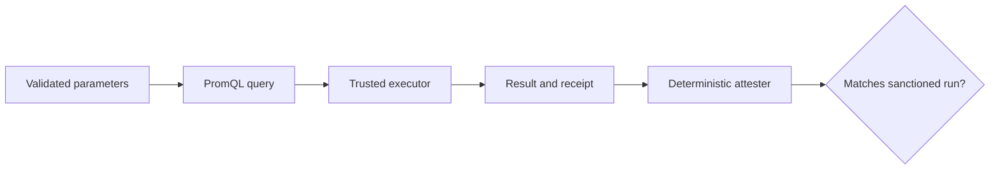

# Pod restarts in a time window

This is a **synthetic computation contract**, not a measured restart count.
PromQL is the query language used by Prometheus. The query below asks how
much a container restart counter increased during a chosen window, then adds
containers from the same Pod. The filename says “rate” for historical link
stability, but `increase()` estimates a **count over a window**, not a
per-second rate.[^prometheus-increase]

## Computation

```promql
sum by (pod) (
  increase(kube_pod_container_status_restarts_total{
    namespace="$namespace",
    pod=~"$app.*"
  }[$window])
)
```

What it does: estimates restarts for Pods whose names start with the selected
application prefix in one namespace. A real executor must validate
`namespace`, `app`, and `window` before substitution; passing arbitrary user
text into a PromQL selector could broaden the query. The result can be
fractional because `increase()` extrapolates over the range.

The metric is documented by kube-state-metrics.[^kube-state-metrics]

## Attestation model

Imagine asking for namespace `payments`, Pod prefix `checkout-`, and a `30m`
window. A trusted executor would bind those values, run the query, and return
evidence of the executed query and result. The sample
[executor reference](../references/executors/run-prometheus-query.md) only
shows a **made-up receipt shape**; no query was run. The accompanying Python
file checks whether fields look plausible and **does not prove execution**.
It therefore must not return a successful attestation of a real measurement.



Text alternative: validate the three inputs, bind them into the query, run it
through a trusted executor, keep the result and run evidence, then compare
that evidence with the sanctioned computation. A receipt written by an
untrusted caller cannot establish that the query ran.

An LLM may explain the result, but it must not act as the attester.

Check your understanding: Why would a receipt that merely contains the
metric name fail to prove that this query ran? Why is `30m` an input that
the executor must validate?

[^kube-state-metrics]: kube-state-metrics Pod metrics.
[^prometheus-increase]: [Prometheus `increase()` documentation](https://prometheus.io/docs/prometheus/latest/querying/functions/#increase).

## Related links

- [Retrieval budget](retrieval-budget.md)
- [Prometheus executor](../references/executors/run-prometheus-query.md)
- [Receipt-shape attester](../references/attesters/prometheus-receipt-shape.md)
- [kube-state-metrics source reference](../references/sources/kube-state-metrics.md)
- [Back to bundle index](../index.md)
