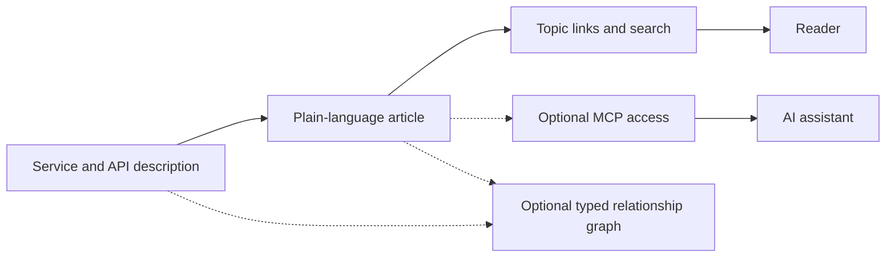

# Knowledge standards landscape

## The simple idea

A **standard** or convention is useful only after you know the job it
needs to do. An API description, a learning article, a relationship
graph, a search index, and an AI connection answer different
questions. Putting all of them under “knowledge standard” can lead a
team to choose a complicated format for a problem that needs only a
clear article and good links.

Think of a workshop: a blueprint describes what to build, a guide
teaches a newcomer, labels connect related parts, a catalog helps
find them, and a courier delivers the right item. One cannot replace
all the others. The analogy stops at software boundaries: a format
can participate in more than one job, and no label or catalog checks
whether a guide's explanation is true.

## Ask what you need to do

| Need | Start with | What it gives you |
| --- | --- | --- |
| Describe exact HTTP operations | **OpenAPI** | Paths, operations, request and response shapes for an HTTP API.[^openapi-spec] |
| Describe messages and channels | **AsyncAPI** | A machine-readable description of an event-driven or asynchronous API.[^asyncapi-spec] |
| Validate JSON structure | **JSON Schema** | Rules a program can check against JSON data.[^json-schema] |
| Package human-readable concepts | **OKF** | Markdown articles, directory navigation, and metadata about sources and lifecycle.[^okf-spec] |
| Exchange typed relationships | **RDF** and a serialization such as **JSON-LD** | Identified subject–relationship–object statements that other graph-aware systems can interpret.[^rdf-concepts][^json-ld] |
| Let an AI application request context | **MCP** | A protocol for tools, resources, and prompts; it does not choose where knowledge is stored.[^mcp-base] |
| Help people find existing pages | A **search index** | A rebuildable way to locate content; it is an implementation, not the authoritative article. |
| Tell coding agents how to work here | **AGENTS.md** | Repository instructions such as paths, commands, and review expectations.[^agents-md] |

This is a starting map, not a ranking of technologies. Use the
smallest piece that answers the real need. A Markdown link may be
enough to connect two lessons; a cross-organization exchange of typed
relationships may justify RDF.

## Follow one example

Imagine a team adding a “Create order” HTTP endpoint. This is an
**illustrative design**, not an endpoint or integration that this
repository has built:

1. The service's **OpenAPI** document describes the request method,
   path, inputs, and responses. If a JSON payload has reusable
   validation rules, **JSON Schema** can describe those rules.
   Machine-readable facts should come from the actual service
   description, not be guessed from an AI-written summary.[^openapi-spec][^json-schema]
2. A beginner article in an **OKF** bundle explains what an order
   means, gives a small example, and links to the precise API
   reference.[^okf-spec]
3. Topic links and a search index help a reader find the article.
   If an AI assistant needs it, an **MCP** server could offer a
   search or fetch operation over the same curated corpus.[^mcp-base]
4. If several organizations must exchange formal relationships
   such as “this endpoint creates this business entity,” the team
   might add **RDF** and **JSON-LD**. That need does not arise merely
   because the article has a Markdown link.[^rdf-concepts][^json-ld]

Text alternative: a service and its API description inform a
plain-language article. Topic links and search lead readers to it.
An optional MCP connection can give an assistant access. A typed
graph is an additional choice when systems must exchange formal
relationships.

## If you need a richer graph

The semantic-web family has several distinct jobs. It adds value
when a real consumer needs those jobs; it is not a prerequisite for
writing an understandable article.

| Need inside a graph | Standard to explore |
| --- | --- |
| State identified relationships | **RDF** is the data model; **JSON-LD** is one way to express linked data in JSON.[^rdf-concepts][^json-ld] |
| Describe broad classes and properties | **RDF Schema**.[^rdf-schema] |
| Maintain labels and broader/narrower terms across a shared vocabulary | **SKOS**.[^skos] |
| Express richer class relationships and reasoning | **OWL**.[^owl] |
| Validate whether a graph fits expected shapes | **SHACL**.[^shacl] |
| Exchange who or what produced information | **PROV-O**.[^prov-o] |

For example, adding the tag `orders` to a Markdown page is enough
for simple topic browsing. If two organizations must agree that
“purchase,” “order,” and translated labels refer to a controlled
concept hierarchy, SKOS may become useful. That is a design
judgment, not a requirement of OKF.[^skos][^okf-spec]

## Conventions around the edges

This repository's `AGENTS.md` tells coding agents how to change its
files. It is a project instruction convention, not the format of the
reader-facing corpus.[^agents-md] A website may publish `llms.txt`
as a curated map of pages for AI consumers; its own site presents it
as a proposal. It is not a replacement for article sources, access
control, or search.[^llms-txt]

The specifications above and the software that implements them
evolve. Follow the linked primary document for exact syntax,
conformance, and the current status of a version. For instance, W3C
lists RDF 1.1 as a Recommendation while [RDF 1.2 Concepts](https://www.w3.org/TR/rdf12-concepts/)
is a Candidate Recommendation at the time this page was checked;
those are different maturity levels.[^rdf-concepts][^rdf12-concepts]

## Check your understanding

- Which document should supply the exact fields of a new HTTP API
  operation? Which page should help a beginner understand why it
  exists?
- When would a Markdown link be enough, and when might a typed graph
  help?
- Why does adding MCP not make an article accurate or searchable by
  itself?

## Explore further

- [OKF v0.2](okf-v0.2.md) explains this bundle format in depth.
- [Reference architecture](reference-architecture.md) shows how
  sources, Markdown, search, and optional AI access fit together.
- [Model Context Protocol](../model-context-protocol.md) explains
  the host, client, and server relationship.
- [Back to agent knowledge bases](index.md).

[^okf-spec]: [Open Knowledge Format specification](https://github.com/GoogleCloudPlatform/open-knowledge-format/blob/main/SPEC.md), source record `okf-spec`.
[^openapi-spec]: [OpenAPI Specification 3.2.0](https://spec.openapis.org/oas/v3.2.0.html), source record `openapi-spec`.
[^asyncapi-spec]: [AsyncAPI Specification 3.1.0](https://www.asyncapi.com/docs/reference/specification/v3.1.0), source record `asyncapi-spec`.
[^json-schema]: [JSON Schema 2020-12](https://json-schema.org/draft/2020-12), source record `json-schema`.
[^rdf-concepts]: [RDF 1.1 Concepts](https://www.w3.org/TR/rdf11-concepts/), source record `rdf-concepts`.
[^rdf12-concepts]: [RDF 1.2 Concepts](https://www.w3.org/TR/rdf12-concepts/), source record `rdf12-concepts`.
[^json-ld]: [JSON-LD 1.1](https://www.w3.org/TR/json-ld11/), source record `json-ld`.
[^rdf-schema]: [RDF Schema 1.1](https://www.w3.org/TR/rdf-schema/), source record `rdf-schema`.
[^skos]: [SKOS Reference](https://www.w3.org/TR/skos-reference/), source record `skos`.
[^owl]: [OWL 2 Overview](https://www.w3.org/TR/owl2-overview/), source record `owl`.
[^shacl]: [SHACL](https://www.w3.org/TR/shacl/), source record `shacl`.
[^prov-o]: [PROV-O](https://www.w3.org/TR/prov-o/), source record `prov-o`.
[^mcp-base]: [Model Context Protocol base specification](https://modelcontextprotocol.io/specification/2026-07-28/basic/index), source record `mcp-base`.
[^agents-md]: [AGENTS.md project](https://agents.md/), source record `agents-md`.
[^llms-txt]: [llms.txt proposal](https://llmstxt.org/), source record `llms-txt`.
