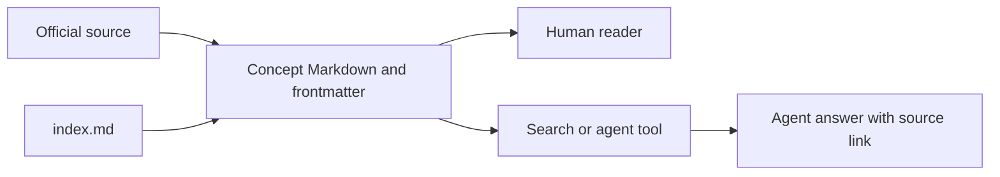

# OKF v0.2

## Purpose

Open Knowledge Format (OKF) is a way to keep knowledge in Markdown files
with small YAML headers. A person can read the files directly; a tool can
read the headers to find topics, sources, and review signals. Think of a
library: directories are shelves, `index.md` pages are shelf guides, and
each concept is a book with a catalog card. The analogy has a limit:
the card describes a source or review; it does not prove the contents are
correct. The pinned [OKF v0.2 specification](https://github.com/GoogleCloudPlatform/open-knowledge-format/blob/ad30107c31c06aec8a7d5636e0d1058118604e6f/SPEC.md)
defines the portable format.[^okf-spec]

OKF is an open specification maintained in the GoogleCloudPlatform `open-knowledge-format` repository. It is not an ISO, IETF, or W3C standard. Treat it as a practical interchange format for curated knowledge, not as a semantic-web replacement, retrieval engine, database, API runtime, or authorization system.

## What OKF is

| Property | OKF v0.2 model |
| --- | --- |
| Steward | GoogleCloudPlatform `open-knowledge-format` project. |
| Maturity | Open specification. |
| Version | `0.2`. |
| Scope | UTF-8 Markdown files with YAML frontmatter in a directory hierarchy. |
| Distribution unit | Knowledge bundle. |
| Core document | Concept document. |
| Source control fit | Git-friendly by design. |
| Agent fit | Frontmatter exposes type, sources, generation, verification, lifecycle, freshness, and optional computation metadata. |

OKF solves packaging and trust metadata for curated knowledge. It does not solve retrieval ranking, semantic reasoning, runtime execution, API description, graph validation, access control, or human review by itself.

## Bundle model

```text
knowledge-bundle/
  index.md
  log.md
  concepts/
    example-concept.md
```



Text alternative: a source informs a concept file, an index helps people
find that file, and the same Markdown can be read directly or through a
search or agent tool. The format stores source signals; the tool still
needs its own retrieval and access rules.

OKF v0.2 is based on:

- UTF-8 Markdown.
- YAML frontmatter.
- A directory hierarchy.
- Concept documents.
- Optional reserved `index.md`.
- Optional reserved `log.md`.

Concept IDs are bundle-relative file paths without the `.md` suffix. In a
standalone bundle whose root contains `concepts/retrieval-budget.md`, the ID
would be `concepts/retrieval-budget`. In **this** repository the bundle
root is `knowledge/`, so the embedded example page's full ID is
`ai/ai-tooling/knowledge-bases/examples/okf-v0.2/concepts/retrieval-budget`.

Reserved files are not concept documents:

| Reserved file | Meaning |
| --- | --- |
| `index.md` | Directory listing for progressive disclosure. |
| `log.md` | Chronological update history. |

## Conformance

A dedicated bundle claimed to conform to OKF v0.2 must satisfy the official conformance rules:

1. Every non-reserved `.md` concept document contains parseable YAML frontmatter.
2. Every concept frontmatter block contains a non-empty `type`.
3. Every reserved `index.md` or `log.md` follows its defined structure when present.

The [`knowledge/` directory](../../../index.md) in this
repository declares an OKF v0.2 bundle. Governance files, automation, and
source notes outside that directory are not part of the bundle. The
[embedded example](examples/okf-v0.2/index.md) is a small subtree
for format study inside this repository's bundle. It does not declare a
second root version or claim separate production validation.

Consumers must be permissive. A consumer should warn about an unresolved
knowledge link and continue reading the rest of the bundle. It should not
reject a bundle merely for unknown `type` values, extra keys, missing
optional metadata, or missing optional indexes.[^okf-spec]

## This repository's stricter profile

OKF itself requires only `type` on a concept. This repository also requires
`title`, `description`, `tags`, `status`, `maturity`, `audience`, and
`maintainer`, and an `index.md` in every knowledge directory.
`maturity`, `audience`, and `maintainer` are local extension keys; OKF
already defines the other listed concept fields. Run
`python3 scripts/validate-okf.py knowledge` from the repository root to
check this profile. These extra rules help readers find and judge pages;
they do not change the base OKF standard.

## Root version declaration

The root `index.md` may declare the target OKF version:

```yaml
---
okf_version: "0.2"
---
```

This declaration belongs only in the bundle-root `index.md`. Nested `index.md` files are directory listings, not version declarations. A consumer that does not understand the declared version should attempt best-effort consumption instead of refusing the bundle immediately.

## Concept frontmatter

Only `type` is always required for concept documents.

The following frontmatter is an illustrative format example. Its actor,
timestamps, source modification date, and verification entry are invented;
they do not describe a reviewed page in this repository.

```yaml
---
type: Playbook
title: CrashLoopBackOff triage
description: Safe first checks for Kubernetes Pods that repeatedly restart.
status: stable
generated: { by: process:doc-renderer, at: 2026-08-08T10:00:00Z }
verified:
  - { by: human:platform-reviewer, at: 2026-08-08T10:30:00Z }
stale_after: 2026-11-08T00:00:00Z
sources:
  - id: k8s-pods
    resource: https://kubernetes.io/docs/concepts/workloads/pods/
    title: Kubernetes Pods
---
```

`type` values are descriptive strings, not centrally registered classes. Consumers must tolerate unknown types and usually treat them as generic concepts.

## Lifecycle

Official OKF v0.2 status values are:

| Status | Meaning |
| --- | --- |
| `draft` | Useful but not stable enough to prefer as authoritative. |
| `stable` | Current usable knowledge. |
| `deprecated` | Retained for history or migration but no longer preferred. |

If `status` is absent, consumers treat the concept as `stable`.
This repository requires an explicit status and only uses `stable` after
recorded review, source, and review-deadline evidence. A format default is
not a substitute for that editorial decision.

> [!IMPORTANT]
> `archived` is not an OKF v0.2 lifecycle status. A repository may define an internal archival extension, but it must not represent that extension as normative OKF.

## Actor convention

OKF actors use this convention:

| Actor form | Use |
| --- | --- |
| `<producer>/<version>` | Agents and tools, such as `reference-agent/1.4.0`. |
| `human:<id>` | A person. |
| `process:<id>` | An automated process. |

For `generated.by` and `verified[].by`, do not encode a team, CI job,
crawler, or renderer as `human:<id>`. The local `maintainer` extension
allows `team:<name>`; it is a different field and does not make the page
human-reviewed.

This matters because `human:<id>` in `verified` affects the derived trust tier. Marking an automated or team source as human-reviewed creates a false trust signal.

## Sources and credibility signals

OKF records objective signals rather than a universal credibility score.

| Field | Use |
| --- | --- |
| `sources[].resource` | URI or path to the source material. |
| `sources[].id` | Stable citation key used by Markdown footnotes. |
| `sources[].title` | Human-readable source label. |
| `sources[].author` | Actor that produced the source; an authority signal. |
| `sources[].usage_count` | Exercise count for the source or source scope during `usage_window`; a liveness or adoption signal. |
| `sources[].last_modified` | Last known source modification time; a recency signal. |
| `usage_window` | Time window for interpreting `usage_count`. |

Authority, recency, and liveness help consumers infer credibility, but OKF does not standardize a single trust score.

## Per-claim provenance

Claim-level citations join Markdown footnote labels to `sources[].id`.

```markdown
The root corpus should be versioned in Git, while retrieval indexes remain rebuildable derived artifacts.[^git-corpus]

[^git-corpus]: Git-backed corpus design note.
```

The following entry would connect the invented citation above to a source.
It is a **format illustration**, not source metadata for this page:

```yaml
sources:
  - id: git-corpus
    resource: https://example.com/design-note
    title: Example design note
```

The citation remains stable even when the `sources` list is reordered.
Consumers should resolve attribution by ID, not list position or footnote
prose.

## Generated and verified

`generated` records who or what produced the current content. `verified` records who or what confirmed the content against sources or the resource.

Trust tiers are derived from `verified`:

| Metadata state | Derived trust tier |
| --- | --- |
| No `verified` | Unverified. |
| Only non-human verifier | Machine-confirmed. |
| At least one `human:<id>` verifier | Human-reviewed. |

These are trust signals, not authorization controls. A serving layer still needs explicit authentication, authorization, path policy, and audit logging.

## Freshness

Do not confuse these timestamps:

| Field | Meaning |
| --- | --- |
| `sources[].last_modified` | When the source material last changed, if known. |
| `generated.at` | When the concept content was produced. |
| `verified[].at` | When a verifier confirmed the concept. |
| `stale_after` | Date after which consumers should treat the concept as needing review. |

`stale_after` is a review signal. It does not prove the content is false, and it does not replace producer reconciliation.

## Attested Computation

Use `type: Attested Computation` when a knowledge item defines a sanctioned computation rather than a static explanation.

Core fields:

| Field | Purpose |
| --- | --- |
| `runtime` | Execution environment or engine, such as `prometheus`, `sql`, or `python`. |
| `parameters` | Declared inputs accepted by the computation. |
| `computation` | Optional path to a computation file; otherwise put one fenced query in a Computation section. |
| `executor` | Referenced instructions or code that runs the computation and returns a receipt. |
| `executor.receipt` | Runtime evidence fields, such as query, parameters, result hash, job ID, or output. |
| `attester` | Deterministic no-LLM code that checks the receipt and returns a verdict. |

Document verification and runtime attestation are different. `verified`
records a review of the concept. A successful runtime attestation needs
enough trusted evidence to show that a concrete run followed the sanctioned
computation; merely checking a receipt's shape is insufficient.

An LLM must not be the deterministic attester. It may explain a result, but attestation requires reproducible code or policy.

See [Pod restarts in a time window](examples/okf-v0.2/concepts/pod-restart-rate.md)
for a small public-safe example. Its shape checker deliberately does not
claim a real run was attested.

## When to use OKF

Use OKF when:

- Knowledge must move across tools, teams, or organizations.
- Agents and humans consume the same Markdown corpus.
- Metadata, provenance, trust, lifecycle, and freshness need structure.
- You want a Git-friendly bundle without requiring a database or SDK.

Do not use OKF as the only answer when:

- You need formal graph semantics across organizations. Consider RDF, RDFS, OWL, SKOS, PROV, or SHACL.
- You need HTTP API description. Use OpenAPI.
- You need event-driven API description. Use AsyncAPI.
- You need runtime agent access. Use MCP as a serving adapter.
- You need retrieval ranking. Build or attach a retrieval layer.
- You need authorization. Enforce it in serving and maintenance systems.

## Validation checklist

- Every concept file starts with YAML frontmatter.
- Every concept frontmatter has a non-empty `type`.
- `index.md` and `log.md` are treated as reserved files.
- Root `index.md`, when declaring version, uses `okf_version: "0.2"`.
- `status` is absent, `draft`, `stable`, or `deprecated`.
- Actor values follow `<producer>/<version>`, `human:<id>`, or `process:<id>`.
- Footnote labels match `sources[].id` values.
- Attested Computation concepts use deterministic attesters.
- Consumers preserve unknown keys and tolerate unknown types.

Check your understanding: What does an OKF `index.md` provide to a new
reader? What makes a concept human-reviewed under the specification, and
why does a `human:` string without a real review mislead readers? Why does
this repository require more frontmatter than OKF itself?

[^okf-spec]: Open Knowledge Format v0.2 specification, pinned revision.

## Related links

- Official specification: [OKF v0.2, pinned revision](https://github.com/GoogleCloudPlatform/open-knowledge-format/blob/ad30107c31c06aec8a7d5636e0d1058118604e6f/SPEC.md)
- [OKF v0.2 example bundle](examples/okf-v0.2/index.md)
- [Knowledge standards landscape](knowledge-standards-landscape.md)
- [Reference architecture](reference-architecture.md)
- [Back to agent knowledge bases](index.md)
- [Back to AI tooling](../index.md)
- [Back to knowledge index](../../../index.md)
