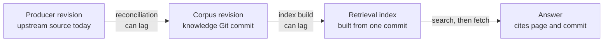

# Provenance, trust, and freshness

## The question this page answers

A knowledge page makes **claims**: statements a reader may act on, such as
"the `status` field has three values." Three different questions decide how
much weight a claim deserves:

- **Provenance** asks *where did this claim come from?* Which source, at
  which version, and which person or process turned it into this page.
- **Trust** asks *how much review supports it?* Nobody checked it, a machine
  check confirmed it, or a person reviewed it against its sources.
- **Freshness** asks *could its source have changed since then?* A page
  written against last month's source may no longer match today's.

A **producer** is the upstream system or document a claim depends on: an
OpenAPI file, a Terraform module, an official product manual, or a team's
decision record. This page explains how the three questions differ, how the
producer, the knowledge corpus, and a search index each carry their own
version, and what to do when a page and its producer disagree.

## Why the distinction matters

Mixing the three questions produces confident mistakes:

- A page with an excellent citation can still be **stale**: the citation
  proves where the claim came from, not that the source still says it.
- A page reviewed by a person can still be **wrong now**: review happened at
  one moment, against one version of the source.
- A page that is not yet past its review date is not **proven correct**:
  the upstream source may have changed the day after review.
- When two sources disagree, quietly choosing one hides a decision the
  reader needed to know about.

An AI agent is especially exposed. It sees text and metadata, not the
history behind them, so it can only report the limits that the corpus
records.

## Three questions, three kinds of evidence

| Question | Evidence in this bundle | What that evidence does not tell you |
| --- | --- | --- |
| Provenance | `sources` records in frontmatter, and keyed footnotes whose label matches a `sources[].id`, so each claim points to its evidence.[^okf-spec] | Whether the source is still current, or whether the page summarized it correctly. |
| Trust | The `verified` list and the lifecycle `status`. OKF consumers derive a trust tier from `verified`: no entry is *unverified*, only non-human verifiers is *machine-confirmed*, and at least one `human:<id>` verifier is *human-reviewed*.[^okf-spec] | Whether the review is recent, or whether the reviewer was expert in that claim. |
| Freshness | `stale_after`, `sources[].last_modified`, and, in a maintained system, reconciliation records that compare producer revisions. | Whether a claim is true. Freshness signals say when to look again. |

The W3C PROV data model describes provenance as information about the
things, activities, and people involved in producing data, which can be used
to form assessments about its quality, reliability, or trustworthiness.[^w3c-prov-dm]
That wording is the key idea: provenance supports an *assessment*; it does
not by itself establish that a claim is true.

In this bundle, most pages are `draft`, have no `verified` entry, and have
no `stale_after`. That is honest, not incomplete bookkeeping: those fields
are added only after a real review. A page becomes `stable` only with
recorded review evidence, official sources, and a freshness deadline. See
[OKF v0.2](okf-v0.2.md) for the full field meanings.

## Three separate versions

A single answer can depend on three versions that move independently.

| Version | What it identifies | Example |
| --- | --- | --- |
| Producer revision | The state of the upstream source. | The OpenAPI file at a given commit, or a documentation page for product version 4.1. |
| Corpus revision | The state of the knowledge base. | The Git commit of this repository that contains the page. |
| Retrieval index | A derived snapshot built for search. | A full-text or vector index built from one corpus commit. |



Text alternative: changes flow left to right. The producer changes first.
Reconciliation later brings the change into a new corpus commit, and an index
build later still makes that commit searchable. An agent searches the index,
fetches the page, and answers. Each arrow is a place where one version can
trail the one before it, so when an answer looks wrong, ask which gap it
fell into: the corpus trailing the producer, or the index trailing the
corpus.

The corpus in Git is the knowledge record; the index is disposable and can
be rebuilt from any commit. Recording the corpus commit with an answer lets
someone later reproduce what the agent saw. The [reference
architecture](reference-architecture.md) shows where each layer sits.

## An analogy and where it breaks

Think of a printed copy of a train timetable pinned on an office notice
board, with a handwritten note beside it: "For the 9:00 meeting, take the
8:10." The operator's timetable is the producer. The copy's footer says which
timetable edition it came from (provenance). A colleague's initials show they
checked the copy against the original (trust). A sticker says "recheck by the
seasonal change" (freshness).

The analogy teaches the split between facts and interpretation: the operator
is the authority for departure times, but not for the note about which train
suits the meeting. Where it breaks:

- **Changes can be silent.** A timetable usually changes on a published
  date. An upstream schema or documentation page can change without a new
  version label, so a maintained knowledge base compares content hashes as
  well as revision names.
- **A knowledge page is not a copy.** It explains and selects. A page can be
  faithful to its source's facts and still misstate their meaning.
- **One page, many producers.** A page may draw on several sources with
  different authority for different claims, so provenance belongs to claims,
  not only to the page.
- **The recheck date is not a promise.** A train can be cancelled before the
  sticker's date. Likewise, `stale_after` is an absolute moment after which
  the concept counts as stale;[^okf-spec] before that moment it is still only
  as correct as its last review.

## Authority depends on the claim

There is no single ranking of sources that suits every corpus. The right
authority depends on what the claim is about, so configure it per domain.

| Kind of claim | Usual authority | Caution |
| --- | --- | --- |
| Exact machine-readable fact: a field name, an enum value, a CLI flag | The producer artifact itself, at a pinned revision | Authoritative only for what it describes. A schema says which values exist, not what a business process does with them. |
| Product behavior, limits, or defaults | The vendor's or project's official documentation for that version | Prose documentation can lag its own schema or release. |
| Protocol or format rules | The governing specification, such as an RFC or W3C Recommendation | An implementation may support only part of the specification. |
| An organization's own choices | Its reviewed decision records and runbooks | Local decisions can override general advice for that organization only. |
| Interpretation: when to use something, trade-offs, explanations | A reviewed explanation that cites its evidence | Authority comes from the evidence and review, not from the page existing. |

Prefer deterministic extraction for the first row: parse the producer with
code rather than asking a model to restate exact facts. Explanation and
guidance can be drafted by people or agents, then reviewed.

## Freshness signals

| Signal | What it means | What to do |
| --- | --- | --- |
| `stale_after` has passed | The page is due for review. | Warn the reader and check the sources; do not treat the page as wrong by default. |
| Producer revision differs from the pinned revision | The source has moved on since the page was last reconciled. | Check whether the change affects any claim the page makes. |
| Source content hash changed | The source text changed, even if its version label did not. | Same as above; hashes catch silent edits. |
| Reconciliation failed or has not run recently | Freshness is unknown for the affected pages. | Say that freshness is unknown rather than implying the page is current. |
| Source moved, retired, or deprecated | Evidence may no longer exist or apply. | Find the replacement source or mark the claim unsupported. |

**Reconciliation** is a scheduled comparison of the producer's current state
with the state the corpus last accepted. Change notifications such as
webhooks can make detection faster, but a missed notification should only
delay detection, not hide a change permanently.

## One invented scenario: a schema changes after the page

This scenario is illustrative. The API, revisions, hashes, and people are
invented; nothing was run.

An **Orders API** publishes an OpenAPI file. A knowledge page, "Order
lifecycle," explains that an order's `status` is `pending`, `paid`, or
`shipped`, and that a paid order can only move to shipped. The page was
reconciled against schema revision **A**.

1. **Detect.** The API team releases revision **B**, which adds `refunded`
   to the `status` values. The scheduled reconciler sees that the observed
   revision differs from the pinned revision, and that the hash of the
   `OrderStatus` schema changed. It maps that schema to the "Order
   lifecycle" page.
2. **Propose a patch.** A renderer regenerates the page's machine-owned
   table of status values from revision B. The explanation sentence ("can
   only move to shipped") is no longer true, so an agent drafts a revised
   sentence and opens a pull request that cites revision B.
3. **Review.** A person compares the draft with the schema and the API
   team's release notes. Validation checks links, metadata, and that the
   generated table matches the renderer output exactly.
4. **Merge.** The merge creates a new corpus commit. The reconciler records
   revision B as pinned, and the search index is rebuilt from the new
   commit. Until the rebuild finishes, search can still return the old text.

The reconciler's state for this producer might look like the following
record. Every value is an invented placeholder; this is not a real producer,
hash, or attestation.

```yaml
# Invented illustration for the Orders API scenario; not real evidence.
producer_id: orders-api-openapi
pinned_revision: "<schema revision A>"
observed_revision: "<schema revision B>"
source_path: components/schemas/OrderStatus
source_hash: "<hash of OrderStatus at revision B>"
knowledge_concepts:
  - "<path to the Order lifecycle page>"
state: drift-detected
```

What it does: it keeps the producer's state separate from the corpus state,
so drift can be found by comparison even if no change notification arrived.

**An unresolved conflict.** During review, the reviewer finds that the API
team's prose guide still says refunds are recorded as a separate refund
object, and does not mention a `refunded` status. The schema is the
authority for which values the API can return, so the regenerated table
stays. But the schema does not say what `refunded` means for shipping, and
the two official sources imply different processes. The reviewer cannot
settle that alone, so the page gets a visible note naming both sources and
the open question, and an issue goes to the API owners. Meanwhile, an agent
asked about refunds should report both sources and the conflict, not pick
one silently.

## Deciding what to do when a page and its source disagree

1. **Name the exact claim and both versions.** Which sentence, which
   producer revision, and which corpus commit?
2. **Classify the claim.** If it is an exact fact the producer defines, the
   producer at its current revision governs the answer, and the page needs a
   patch.
3. **Check for interpretation or competing authorities.** If the claim is an
   interpretation, or two authoritative sources disagree, surface both with
   citations. Do not average them or merge them into a new claim.
4. **State unknowns.** If you cannot tell which revision the page was written
   against, or reconciliation has failed, say that freshness is unknown.
5. **Route the fix through review.** Propose a patch or open an issue; do not
   let a serving path edit the corpus directly. See [security and
   governance](security-and-governance.md) for why the write path is
   separate.

## Richer provenance is optional

This bundle records provenance with OKF frontmatter and keyed footnotes. It
does not require the W3C PROV model. PROV-O expresses PROV in the OWL web
ontology language so that systems can represent and exchange provenance, and
it can be specialized for particular domains.[^w3c-prov-o] Consider it when
provenance must travel between systems as linked data; see the [knowledge
standards landscape](knowledge-standards-landscape.md) for where it fits.

## Common misconceptions

- "It has a source, so it is correct." A source shows origin, not current
  accuracy or a faithful summary.
- "It is before `stale_after`, so it is current." The date schedules review;
  the producer can change at any time.
- "It is past `stale_after`, so it is wrong." It is due for checking, which
  may confirm it.
- "The schema always wins." It wins for the facts it defines, not for the
  meaning or process around them.
- "Rebuilding the search index updates the knowledge." The index reflects a
  corpus commit; only a reviewed corpus change updates the knowledge.

## Check your understanding

1. A page is human-reviewed and cites the vendor manual, but the vendor
   released a new major version last week. Which of the three questions is
   now open?
2. Why can search return the old text for a while after a correction merges?
3. In the Orders API scenario, why does the regenerated status table stay
   while the refund process remains an open conflict?
4. What should an agent say when reconciliation for a page's producer has
   been failing?

## Official documentation for deeper study

- [OKF v0.2 specification](https://github.com/GoogleCloudPlatform/open-knowledge-format/blob/main/SPEC.md):
  read the sections on `sources`, per-claim citations, `verified` and trust
  tiers, and `stale_after`.
- [W3C PROV-DM](https://www.w3.org/TR/prov-dm/) defines the entity,
  activity, and agent model, plus derivation, revision, and attribution.
- [W3C PROV-O](https://www.w3.org/TR/prov-o/) shows how to represent PROV as
  linked data when provenance must be exchanged between systems.

## Next in this section

- [OKF v0.2](okf-v0.2.md) explains each metadata field used above.
- [Reference architecture](reference-architecture.md) places reconciliation
  in the full maintenance loop.
- [Evaluation and quality](evaluation-and-quality.md) shows how to test that
  answers surface stale or conflicting evidence.
- [Retrieval and context efficiency](retrieval-and-context-efficiency.md)
  shows why search results should carry status and revision.
- [Back to agent knowledge bases](index.md)
- [Back to AI tooling](../index.md)
- [Back to knowledge index](../../../index.md)

[^okf-spec]: [Open Knowledge Format (OKF) v0.2 specification](https://github.com/GoogleCloudPlatform/open-knowledge-format/blob/main/SPEC.md), source record `okf-spec`.
[^w3c-prov-dm]: [W3C - PROV-DM, The PROV Data Model](https://www.w3.org/TR/prov-dm/), source record `w3c-prov-dm`.
[^w3c-prov-o]: [W3C - PROV-O, The PROV Ontology](https://www.w3.org/TR/prov-o/), source record `w3c-prov-o`.
