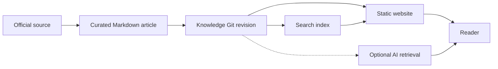
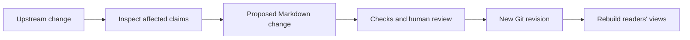

# Reference architecture

## The simple idea

A knowledge system needs **one reviewable place for its explanations**
and several ways for people to find and read them. In this repository,
that place is the Markdown bundle under [knowledge/](../../../index.md).
Topic indexes, concept metadata, links, and Git history help maintain it.
The website, search data, and any AI retrieval service are ways to
*present* a selected revision of those articles.[^okf-spec][^git-version-control]

There are two kinds of authority. A product's official documentation
is the authority for that product's behavior. The accepted Markdown
revision is the authority for what **this knowledge base says** about
it. A versioned article can still be mistaken or out of date; Git
history alone does not make its claims true.

Picture a museum. The original artifact is the upstream source;
a carefully written exhibit label is the knowledge article; the
gallery map is its index; the public display is the website. The
analogy stops at correctness: a clear label can still misdescribe
an artifact, and a new discovery can make yesterday's label stale.

## The parts and their jobs

| Part | Job | Example here |
| --- | --- | --- |
| **Upstream source** | Supplies product facts or a standard's rules. | HashiCorp's Terraform state documentation.[^terraform-state] |
| **Curated article** | Explains one reader outcome in plain language and links its sources. | [Terraform state management](../../../terraform/fundamentals/state-management.md). |
| **Bundle structure** | Gives each article a topic, path, links, and lifecycle metadata. | Parent `index.md` files and OKF frontmatter.[^okf-spec] |
| **Git revision** | Identifies exactly which Markdown version was reviewed or built. | A commit SHA, with its diff and history.[^git-version-control] |
| **Derived output** | Makes the same revision easy to browse or search. | Static website pages and a rebuildable search index.[^astro-collections][^pagefind-docs] |
| **Optional AI access** | Lets an assistant request selected knowledge. | A read-oriented MCP server, if one is built.[^mcp-architecture] |

The word **derived** matters. If a search result or website page is
wrong because the article is wrong, fix the article. Then rebuild the
presentation from the corrected revision. A search index can rank
articles, but it is not another editorial copy of their prose.

## The reading path

Text alternative: a curated Markdown article cites an official
source. A Git revision fixes the article's exact version. A website
and search index present that revision to readers. An optional AI
retrieval service can use the same revision.

A static site can render Markdown into pages, and Pagefind can build
search data from finished pages.[^astro-collections][^pagefind-docs]
The [website architecture plan](../../../../knowledge-base-upgrade/features/knowledge-website/architecture.md)
specifies an exact pinned knowledge commit for this project. A site
build or an AI answer should identify the revision it used so a
reader can check the underlying article. MCP standardizes how an AI
host asks a server for context; it does not choose the source of truth
or judge whether an answer is accurate.[^mcp-architecture]

## The change path

Imagine that an official Terraform state page changes an important
rule. This is an **illustrative sequence**; no such change or
automated reconciliation is claimed here.

1. A maintainer or monitoring process notices the upstream change
   and checks what actually changed in the official source.
2. The author finds affected articles, updates the explanation and
   citations, and marks any unresolved uncertainty clearly.
3. Repository checks catch structural problems such as invalid
   metadata and broken internal links. A reviewer checks the meaning
   of the revised claims.
4. The accepted change becomes a new Git revision. Website and
   search output can then be rebuilt from that revision.

Text alternative: an upstream change prompts inspection of affected
claims. A proposed Markdown patch goes through automated checks and
human review. An accepted Git revision becomes input to rebuilt reader
views.

An event or scheduled job could help detect upstream changes, but
that is a possible maintenance design, not proof that a reconciler
already runs. Likewise, passing metadata and link checks is evidence
that the bundle is structurally sound; it does not verify every
technical sentence or replace a reader test.

## Add topics without losing the path

A new topic should have one clear home. Put its Markdown article under
the nearest subject directory, link it from that directory's
`index.md`, and give it the concept metadata required by
[the authoring instructions](../../../../instructions.md). If a new
directory is needed, add its own `index.md` and link that directory
from its parent. This keeps both people and tools able to discover the
new material as the corpus grows.[^okf-spec]

Keep separate questions separate:

- **Is it true?** Check the official source and record real evidence.
- **Can readers find it?** Check topic links and representative search
  questions.
- **Can readers understand it?** Try the explanation with people who
  are new to the subject.
- **Is it still current?** Revisit the article when its source changes.

## Check your understanding

- If the website displays a wrong explanation, where should the
  correction start?
- What is the difference between an official product source and the
  knowledge bundle's Git revision?
- Which checks can find a broken link, and which work is needed to
  catch a misleading but well-formed explanation?

## Explore further

- [Knowledge-base creation, management, and optimization](../knowledge-bases-creation-management-and-optimization.md)
  is the shorter reader-focused introduction.
- [Provenance, trust, and freshness](provenance-trust-and-freshness.md)
  explains how to record the source and review status of a claim.
- [Retrieval and context efficiency](retrieval-and-context-efficiency.md)
  explains the search-to-fetch path.
- [Evaluation and quality](evaluation-and-quality.md) separates
  discovery, ranking, and answer quality.
- [Security and governance](security-and-governance.md) covers
  permission boundaries in retrieval and maintenance.
- [Back to agent knowledge bases](index.md).

[^okf-spec]: [Open Knowledge Format specification](https://github.com/GoogleCloudPlatform/open-knowledge-format/blob/main/SPEC.md), source record `okf-spec`.
[^git-version-control]: [Git book, about version control](https://git-scm.com/book/en/v2/Getting-Started-About-Version-Control), source record `git-version-control`.
[^astro-collections]: [Astro content collections](https://docs.astro.build/en/guides/content-collections/), source record `astro-collections`.
[^pagefind-docs]: [Pagefind documentation](https://pagefind.app/docs/), source record `pagefind-docs`.
[^mcp-architecture]: [MCP architecture overview](https://modelcontextprotocol.io/docs/2026-07-28/learn/architecture), source record `mcp-architecture`.
[^terraform-state]: [HashiCorp, Terraform state](https://developer.hashicorp.com/terraform/language/state), source record `terraform-state`.
