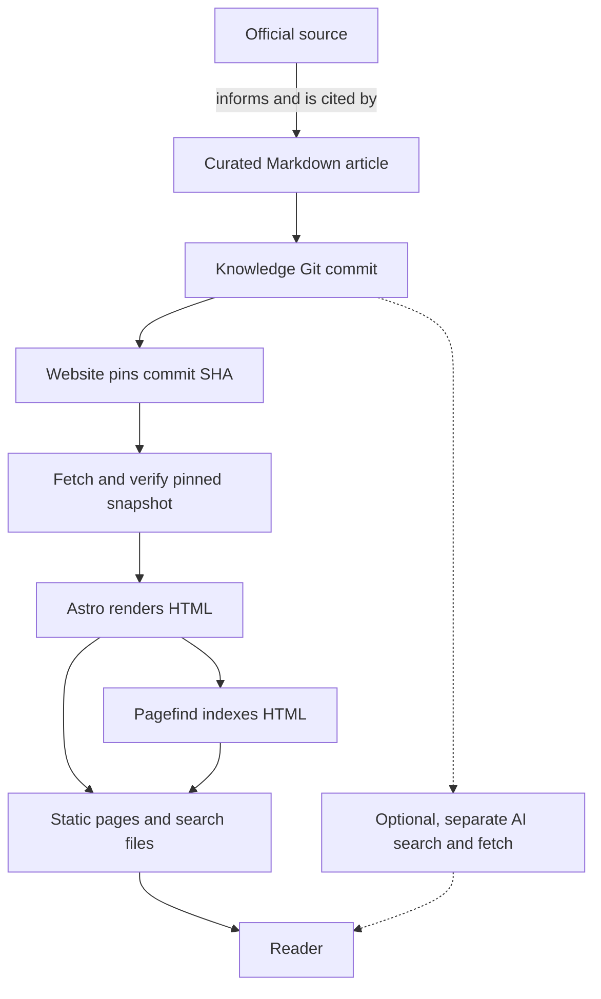
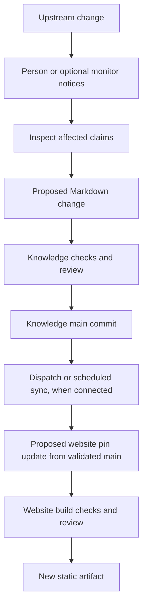

# Reference architecture

## The simple idea

A knowledge system needs **one reviewable place for its explanations**
and several ways for people to find and read them. In this repository,
that place is the Markdown **bundle** (a linked collection of pages) under
[knowledge/](../../../index.md). Topic indexes, page metadata, links, and
Git history help maintain it. The separate website project pins a knowledge
commit and builds static pages and search data from it. An optional AI
retrieval service could read the same bundle; none is deployed here.

There are two kinds of authority. A product's official documentation
is the authority for that product's behavior. The accepted Markdown
revision is the authority for what **this knowledge base says** about
it. A versioned article can still be mistaken or out of date; Git
history alone does not make its claims true.

Picture a museum. The original artifact is the upstream source;
a carefully written exhibit label is the knowledge article; the
gallery map is its topic index. A dated edition of the labels is a
Git commit, while the visitor kiosk is a website and search built
from that edition. The analogy stops at correctness: a clear label
can still misdescribe an artifact, and a new discovery can make
yesterday's label stale.

## The parts and their jobs

| Part | Job | Example here |
| --- | --- | --- |
| **Upstream source** | Supplies product facts or a standard's rules. | HashiCorp's Terraform state documentation.[^terraform-state] |
| **Curated article** | Explains one reader outcome in plain language and links its sources. | [Terraform state management](../../../terraform/fundamentals/state-management.md). |
| **Bundle structure** | Gives each article a topic, path, links, and lifecycle metadata. | Parent `index.md` files and OKF frontmatter, the metadata block at the top of a concept.[^okf-spec] |
| **Knowledge Git revision** | Identifies exactly which Markdown version was built or cited; it does not prove review. | A commit SHA, Git's unique identifier for that saved version.[^git-version-control] |
| **Website project** | Pins one knowledge commit and holds rendering code, redirects, and release checks, not a second authored copy of the articles. | A separate local project with `content-lock.json` and a static build. |
| **Derived output** | Makes the pinned revision easy to browse or search. | Rendered HTML and Pagefind search data generated from that HTML.[^astro-collections][^pagefind-docs] |
| **Optional AI access** | Lets an assistant request selected knowledge. | A read-oriented Model Context Protocol (MCP) server, if one is built.[^mcp-architecture] |

The word **derived** matters. If the source article is wrong, fix it and
rebuild the presentation from the corrected revision. If the article is
right but the displayed page is wrong, inspect the website's pinned
commit, rendering, and search build. A search index can hold excerpts and
rank articles, but nobody edits the explanation there; corrections start
in the source article or the presentation code.

## The reading path

Text alternative: an official source informs and is cited by a curated
Markdown article. A Git commit saves its exact version. The separate
website project pins that commit, fetches and verifies the snapshot, then
Astro renders HTML and Pagefind indexes it. Static pages and search files
form one reader artifact.

A separate, optional AI search and fetch service could use the same
knowledge commit; it would need its own retrieval design.

A static site can render Markdown into pages, and Pagefind builds search
data from the finished HTML.[^astro-collections][^pagefind-docs]
The [website architecture plan](../../../../knowledge-base-upgrade/features/knowledge-website/architecture.md)
specifies an exact pinned knowledge commit for this project. The separate
website project builds locally, while the public host and domain remain
unselected. A site build or an AI answer should identify the
revision it used so a reader can check the underlying article. MCP
standardizes how an AI host asks a server for context; it does not choose
the source of truth or judge whether an answer is accurate.[^mcp-architecture]

For example, a reader asks, “Why does Terraform need state?” The curated
[Terraform state article](../../../terraform/fundamentals/state-management.md)
explains how a resource address maps to a managed object and links
HashiCorp's documentation.[^terraform-state] A knowledge commit fixes the
article's wording; the website lock selects that commit; the build renders
the article and creates search data from its HTML. This traces a possible
reader path, not a claim that a particular query already ranks first or
that a beginner reader has tested it.

## The change path

Imagine that an official Terraform state page changes an important
rule. This is an **illustrative sequence**; no such change or
automated reconciliation is claimed here.

1. A maintainer or optional monitor notices the upstream change
   and checks what actually changed in the official source.
2. The author finds affected articles, updates the explanation and
   citations, and marks any unresolved uncertainty clearly.
3. Repository checks catch structural problems such as invalid
   metadata and broken internal links. A reviewer checks the meaning
   of the revised claims before the knowledge change reaches `main`.
4. When website synchronization is connected, it can propose a new pinned
   knowledge SHA. The website's own build checks and maintainer review
   come before that pin is accepted. Once hosted, the site continues to
   show its previous artifact until a new build is released.

The dispatch event is a wake-up signal, not the source revision itself.
The website sync reads the current validated knowledge `main` commit before
proposing a pin change. A missed event can be recovered by scheduled or
manual reconciliation; neither path skips website review.

Text alternative: a person or optional monitor notices an upstream change
and inspects affected claims. A proposed Markdown patch goes through
knowledge checks and review before reaching knowledge `main`. When
connected, dispatch or scheduled reconciliation can propose a website pin
update from validated `main`. The proposed pin goes through website build
checks and review before producing a new static artifact. Once hosted,
readers continue seeing the earlier artifact until the new one is released.

An event or scheduled **reconciler** could help detect upstream changes:
it would compare a source's current version with the version recorded in
the article and propose review when they differ. That is a possible
maintenance design, not a claim that one already runs. Likewise, passing
metadata and link checks is evidence that the bundle is structurally
sound; it does not verify every technical sentence or replace a reader
test. See [provenance, trust, and freshness](provenance-trust-and-freshness.md)
for the fuller reconciliation loop.

## Add topics without losing the path

A new topic should have one clear home. This repository requires its
Markdown article under the nearest subject directory, a link from that
directory's `index.md`, and the concept metadata in
[the authoring instructions](../../../../instructions.md). If a new
directory is needed, add its own `index.md` and link that directory
from its parent. These are this repository's rules; OKF itself allows
more flexible bundle layouts.[^okf-spec] The links help people and tools
discover the new material as the corpus grows.

Keep separate questions separate:

- **Is it true?** Check the official source and record real evidence.
- **Can readers find it?** Check topic links and representative search
  questions.
- **Can readers understand it?** Try the explanation with people who
  are new to the subject.
- **Is it still current?** Revisit the article when its source changes.

## Check your understanding

- If a website page looks wrong, how would you decide whether to fix the
  source article, the pinned commit, or the renderer?
- What is the difference between an official product source and the
  knowledge bundle's Git revision?
- Which checks can find a broken link, and which work is needed to
  catch a misleading but well-formed explanation?

## Explore further

- [Knowledge-base creation, management, and optimization](../knowledge-bases-creation-management-and-optimization.md)
  is the shorter reader-focused introduction.
- [Provenance, trust, and freshness](provenance-trust-and-freshness.md)
  explains how to record the source and review status of a claim.
- [Retrieval and context efficiency](retrieval-and-context-efficiency.md)
  explains the search-to-fetch path.
- [Evaluation and quality](evaluation-and-quality.md) separates
  discovery, ranking, and answer quality.
- [Security and governance](security-and-governance.md) covers
  permission boundaries in retrieval and maintenance.
- [Back to agent knowledge bases](index.md).

[^okf-spec]: [Open Knowledge Format specification](https://github.com/GoogleCloudPlatform/open-knowledge-format/blob/main/SPEC.md), source record `okf-spec`.
[^git-version-control]: [Git book, about version control](https://git-scm.com/book/en/v2/Getting-Started-About-Version-Control), source record `git-version-control`.
[^astro-collections]: [Astro content collections](https://docs.astro.build/en/guides/content-collections/), source record `astro-collections`.
[^pagefind-docs]: [Pagefind documentation](https://pagefind.app/docs/), source record `pagefind-docs`.
[^mcp-architecture]: [MCP architecture overview](https://modelcontextprotocol.io/docs/2026-07-28/learn/architecture), source record `mcp-architecture`.
[^terraform-state]: [HashiCorp, Terraform state](https://developer.hashicorp.com/terraform/language/state), source record `terraform-state`.
