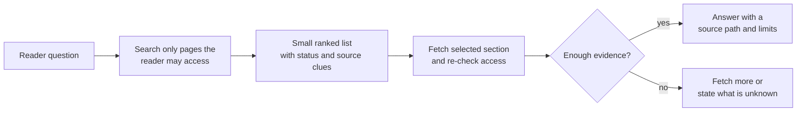

# Retrieval and context efficiency

## Purpose

Use this page to understand why an AI agent should search a knowledge base
before reading it, what information a search result should return, and how to
measure whether the search is useful. The reader outcome is a design model,
not a promise that this repository has a particular search service deployed.

## The problem in plain language

**Retrieval** means finding the parts of a knowledge base relevant to a
question. The agent has a limited **context window**: the text it can read
while composing one answer. Even when the window is large, loading irrelevant
pages costs time, increases answer noise, and makes it harder to inspect which
evidence was used.

Think of a library. The catalog helps you locate books; you then open the
chapter you need. Sending every book on the shelf to a reader would be slow
and confusing. The analogy has a limit: finding a page does not establish
that its claims are current, reviewed, or authorized for that reader.

## The smallest useful path



Text alternative: a question enters a search scoped to pages the reader may
access. Search returns a short ranked list with enough metadata to choose a
page. The agent checks access again before fetching a relevant section. It
answers with a citation and the page's limitations when evidence is enough;
otherwise it fetches more or states what is unknown. Failed questions can
become evaluation cases for missing content, access, ranking, and context
limits. The diagram separates *finding* from *reading*; it does not describe
a deployed system.

The corpus in Git is authoritative. Search indexes, embeddings, caches, and
snippets are derived views and must be rebuildable from that corpus. Record
the corpus revision used to produce a result, and fetch from that same
revision. Otherwise a snippet and the fetched page might describe different
versions. An upstream documentation or software version is a separate
*producer revision*; the corpus commit does not establish that its sources
are current. See [provenance, trust, and
freshness](provenance-trust-and-freshness.md).

## Search first, then disclose detail

| Stage | Return | Decision the agent can make |
| --- | --- | --- |
| Navigate | Topic and directory indexes | Which subject area is likely to help? |
| Search | Titles, paths, short snippets, lifecycle status, page source IDs, and corpus revision | Which few concepts deserve a closer read? |
| Fetch | One section or document with its metadata | Is there enough evidence to answer and cite? |
| Inspect sources | Official documentation or source snapshot when needed | Does a high-risk or disputed claim hold? |

A search response should not return every full document by default. It should
make a small, informed fetch possible. Search also needs an access boundary:
filter candidates by the reader's authorization *before* ranking cutoffs or
result counts, so an unauthorized hit neither leaks nor crowds out allowed
pages. Do not reveal private titles, snippets, counts, suggestions, or
documents; check access again at fetch. Key result caches by authorization
scope and corpus commit, and invalidate them when access changes.
Access rules attached to indexed sections must stay current when permissions
change.[^azure-document-access] This repository's published bundle is public;
this boundary applies when a system also searches private material. Retrieved
pages are evidence to evaluate, not instructions to obey. See [security and
governance](security-and-governance.md).

## One illustrative search

This response format is invented; its page path, status, page source IDs,
and excerpt reflect the real draft page. Other fields illustrate a possible
search response. This is not a ranking measurement or a live API response:

```json
{
  "question": "How do I know whether a knowledge page is stale?",
  "corpus_revision": "<pinned Git commit>",
  "hits": [
    {
      "path": "knowledge/ai/ai-tooling/knowledge-bases/provenance-trust-and-freshness.md",
      "title": "Provenance, trust, and freshness",
      "status": "draft",
      "verified": [],
      "page_source_ids": ["okf-spec", "w3c-prov-dm", "w3c-prov-o"],
      "heading_path": ["Provenance, trust, and freshness", "Freshness signals"],
      "access_scope": "public",
      "freshness_warning": "No stale_after review deadline recorded",
      "excerpt_is_partial": true,
      "snippet": "| `stale_after` has passed | The page is due for review. | Warn the reader and check the sources; do not treat the page as wrong by default. |"
    }
  ]
}
```

The title and path help the agent choose what to fetch. The `draft` label
and empty `verified` list mean the agent must not present this page as
independently reviewed. The snippet is a short excerpt of the actual page;
its page-level source IDs are leads for inspection, not proof that each
sentence has a matching source. The whole table row keeps the condition
beside its advice. The pinned commit identifies the *corpus*
version to fetch and cite. For important technical claims, follow the
page's official source links. This example does not prove the page would
rank first in a real search.

## Choose a search method from measured needs

**Lexical search** matches indexed words and phrases. It is a practical first
layer for product names, error words, and document titles. SQLite FTS5, for
example, indexes text and supports relevance ordering; its `bm25()` function
scores matches.[^sqlite-fts5] Elasticsearch uses BM25 as its default text
similarity.[^elasticsearch-similarity] Tokenizers can split punctuation:
SQLite FTS5's default `unicode61` tokenizer treats most punctuation as a
separator.[^sqlite-fts5] Test literal flags, filenames, and paths with an
exact-field lookup instead of assuming full-text search preserves them.

Lexical matching can miss a relevant page when the question and page use
different words, such as "old docs" versus "stale knowledge." Add aliases
or improve titles and summaries, then test whether the expected page enters
the candidate list. If it still does not, **semantic retrieval** can find
candidates using a numerical representation of meaning called an
*embedding*. A **reranker** can reorder candidates already found by lexical,
semantic, or combined search; it cannot rescue a page that never entered the
list. An embedding or vector index is optional derived infrastructure. It
does not become a new source of truth.

Do not assume semantic search is always better. Compare lexical, semantic,
and combined candidates on the same reader questions. Check whether the
expected page was *found* before judging how it was *ranked*, then measure
answer evidence, latency, and cost before adding complexity.

## Give retrieval a budget

Set budgets per deployment and test them with real questions. There is no
universal best number of hits or tokens.

| Budget | What to observe |
| --- | --- |
| Search hits | How many candidate results the agent sees before choosing. |
| Snippet size | How much text is sent for each candidate. |
| Fetch depth | How many extra sections or links are opened to answer one question. |
| Context size | How many bytes or approximate tokens the retrieved evidence consumes after reserving room for instructions, conversation, and the answer. |
| Time and model calls | Whether the answer arrives within the reader's useful time and cost boundary. |

The cheapest result is not necessarily the best one. If a smaller budget
omits the authoritative page, the answer can become wrong. Diagnose a miss
before increasing a budget: the page may be absent from the corpus, excluded
by a wrong access rule, absent from an index built from an older commit,
missing from candidate retrieval, ranked below the cutoff, or truncated to
fit the context budget after fetch. Increase a budget only when evaluation
shows it caused the loss.

## Chunk with the answer in mind

When a page is too large or covers several answers, index sections with
their heading paths. Keep the page path, title, heading path, lifecycle
status, access scope, page source IDs, corpus revision, and review or
freshness warnings attached to every chunk. Keep code blocks and their
prerequisites or safety notes together. Keep each table row with its column
headers, or preserve the meaning of those headers in the excerpt. Mark a
displayed excerpt as partial so the agent knows to fetch more context before
acting on it.

## How to tell whether it works

Create a set of reader questions with the expected page or section and any
source IDs needed for a safe answer. For each question, measure:

1. Was the expected page present in the current corpus and access scope?
2. Did it enter the candidate list before reranking and cutoff? Record
   candidate recall at a chosen `N`, then its final rank and hit@k.
3. Did the agent fetch enough of it to answer accurately?
4. Did it preserve draft, review, and freshness limits?
5. How many hits, bytes, fetches, model calls, and seconds were used?

For an optional AI search and fetch layer in this repository's [reference
architecture](reference-architecture.md), *hit@3* is a proposed planning
check: for each golden question, ask whether at least one expected concept
appears in the first three results, then inspect both the overall rate and
every miss. Set a release threshold from reader needs after real tests; none
has been measured or approved. The planned website's Pagefind search is a
separate reader-facing path and needs its own evaluation. Keep a held-out
set of questions after tuning so known examples do not become the only
measure of success.
See [evaluation and quality](evaluation-and-quality.md) for the broader
evaluation model and [retrieval cases](../../../../tests/retrieval-cases.yaml)
for the current static question set. Those cases validate paths and source
IDs; they do not yet run a search engine or measure ranking.

## Check your understanding

- Why should a search hit contain a status and corpus revision as well as a
  title?
- When would you improve aliases before adding a vector index?
- If a relevant page is absent from the candidate list, why would a
  reranker alone fail to fix the search?
- What evidence would show that showing only three hits cut off a page that
  was otherwise retrieved?

## Official documentation for deeper study

- [SQLite FTS5](https://www.sqlite.org/fts5.html) explains a concrete full-text index, matching, snippets, and BM25 scoring.
- [Elasticsearch similarity settings](https://www.elastic.co/docs/reference/elasticsearch/index-settings/similarity) describes BM25 and other text-similarity choices.
- [Azure AI Search document-level access control](https://learn.microsoft.com/en-us/azure/search/search-document-level-access-overview) explains permission filtering at query time and permission metadata for indexed content.

## Related links

- [Reference architecture](reference-architecture.md)
- [Evaluation and quality](evaluation-and-quality.md)
- [Provenance, trust, and freshness](provenance-trust-and-freshness.md)
- [Security and governance](security-and-governance.md)
- [Back to agent knowledge bases](index.md)
- [Back to AI tooling](../index.md)
- [Back to knowledge index](../../../index.md)

[^sqlite-fts5]: [SQLite - FTS5 Extension](https://www.sqlite.org/fts5.html), source record `sqlite-fts5`.
[^elasticsearch-similarity]: [Elasticsearch - Similarity settings](https://www.elastic.co/docs/reference/elasticsearch/index-settings/similarity), source record `elasticsearch-similarity`.
[^azure-document-access]: [Azure AI Search - Document-level access control](https://learn.microsoft.com/en-us/azure/search/search-document-level-access-overview), source record `azure-document-access`.
