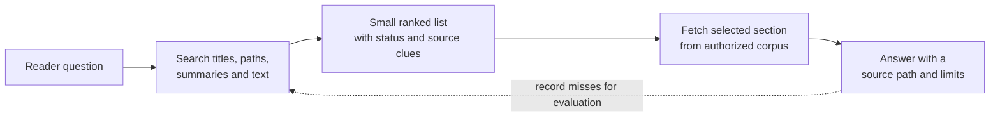

# Retrieval and context efficiency

## Purpose

Use this page to understand why an AI agent should search a knowledge base
before reading it, what information a search result should return, and how to
measure whether the search is useful. The reader outcome is a design model,
not a promise that this repository has a particular search service deployed.

## The problem in plain language

**Retrieval** means finding the parts of a knowledge base relevant to a
question. The agent has a limited **context window**: the text it can read
while composing one answer. Even when the window is large, loading irrelevant
pages costs time, increases answer noise, and makes it harder to inspect which
evidence was used.

Think of a library. The catalog helps you locate books; you then open the
chapter you need. Sending every book on the shelf to a reader would be slow
and confusing. The analogy ends at ranking: a search result can look relevant
while the page is outdated, unreviewed, or unauthorized for that reader.

## The smallest useful path



Text alternative: a question enters search. Search returns a short ranked
list with enough metadata to choose a page. The agent fetches a relevant
section from material the reader may access, then answers with a citation and
the page's limitations. Failed searches become evaluation cases so the
navigation and ranking can improve. The diagram separates *finding* from
*reading*; it does not describe a deployed system.

The corpus in Git is authoritative. Search indexes, embeddings, caches, and
snippets are derived views and must be rebuildable from that corpus. Record
the corpus revision used to produce a result so a later reader can trace
which version the agent saw.

## Search first, then disclose detail

| Stage | Return | Decision the agent can make |
| --- | --- | --- |
| Navigate | Topic and directory indexes | Which subject area is likely to help? |
| Search | Titles, paths, short snippets, lifecycle status, source IDs, and revision | Which few concepts deserve a closer read? |
| Fetch | One section or document with its metadata | Is there enough evidence to answer and cite? |
| Inspect sources | Official documentation or source snapshot when needed | Does a high-risk or disputed claim hold? |

A search response should not return every full document by default. It should
make a small, informed fetch possible. Search also needs an access boundary:
filter by the reader's authorization before revealing private titles,
snippets, or documents. See [security and
governance](security-and-governance.md).

## One illustrative search

This is invented output shape for a question, not a real ranking measurement
or a live API response:

```json
{
  "question": "How do I know whether a knowledge page is stale?",
  "corpus_revision": "<pinned Git commit>",
  "hits": [
    {
      "path": "knowledge/ai/ai-tooling/knowledge-bases/provenance-trust-and-freshness.md",
      "title": "Provenance, trust, and freshness",
      "status": "draft",
      "section": "Freshness signals",
      "snippet": "A freshness signal helps decide when evidence needs review."
    }
  ]
}
```

The title and path help the agent choose what to fetch. The `draft` label is
important: the agent should not present this page as independently reviewed.
The pinned commit identifies the source version. After fetching the section,
the agent should cite the page and, for important technical claims, follow
the page's official source links. This example does not prove the page would
rank first in a real search.

## Choose a search method from measured needs

**Lexical search** matches words and phrases. It is a practical first layer
for exact commands, error text, product names, and document titles. SQLite
FTS5, for example, indexes text and supports relevance ordering; its
`bm25()` function scores matches.[^sqlite-fts5] Elasticsearch also documents
BM25 as a similarity used for text search.[^elasticsearch-similarity]

Lexical matching can miss a relevant page when the question and page use
different words, such as "old docs" versus "stale knowledge." Add aliases,
improve titles and summaries, or test a semantic reranker when those misses
appear in evaluation. A **reranker** reorders a candidate list using another
relevance model. An embedding or vector index is optional derived
infrastructure; it does not become a new source of truth.

Do not assume semantic search is always better. It can be useful for
vocabulary mismatch, but an exact identifier or filename still needs a
reliable path. Compare methods with the same reader questions and measure
answer evidence, latency, and cost before adding complexity.

## Give retrieval a budget

Set budgets per deployment and test them with real questions. There is no
universal best number of hits or tokens.

| Budget | What to observe |
| --- | --- |
| Search hits | How many candidate results the agent sees before choosing. |
| Snippet size | How much text is sent for each candidate. |
| Fetch depth | How many extra sections or links are opened to answer one question. |
| Context size | How many bytes or approximate tokens the retrieved evidence consumes. |
| Time and model calls | Whether the answer arrives within the reader's useful time and cost boundary. |

The cheapest result is not necessarily the best one. If a smaller budget
omits the authoritative page, the answer can become wrong. Increase a budget
only after a failed question shows where the evidence was lost.

## Chunk with the answer in mind

If the corpus is too large to fetch whole pages, use sections with their
headings. Keep the path, title, heading, lifecycle status, source IDs, and
revision attached to every chunk. A command fragment without prerequisites
or a safety note can mislead, so do not split those away from the instruction
they qualify.

## How to tell whether it works

Create a set of reader questions with the expected page or section and any
source IDs needed for a safe answer. For each question, measure:

1. Did the expected page appear within the allowed result count?
2. Did the agent fetch enough of it to answer accurately?
3. Did it preserve draft, review, and freshness limits?
4. How many hits, bytes, fetches, model calls, and seconds were used?

For this repository's example architecture, the planning target is to place
the expected concept within the first three results for its golden questions.
That is a target to test, not an observed result or a universal threshold.
See [evaluation and quality](evaluation-and-quality.md) for the broader
evaluation model and [retrieval cases](../../../../tests/retrieval-cases.yaml)
for the current static question set. Those cases validate paths and source
IDs; they do not yet run a search engine or measure ranking.

## Check your understanding

- Why should a search hit contain a status and source revision as well as a
  title?
- When would you improve aliases before adding a vector index?
- What evidence would show that a three-result budget is too small?

## Official documentation for deeper study

- [SQLite FTS5](https://www.sqlite.org/fts5.html) explains a concrete full-text index, matching, snippets, and BM25 scoring.
- [Elasticsearch similarity settings](https://www.elastic.co/docs/reference/elasticsearch/index-settings/similarity) describes BM25 and other text-similarity choices.

## Related links

- [Reference architecture](reference-architecture.md)
- [Evaluation and quality](evaluation-and-quality.md)
- [Provenance, trust, and freshness](provenance-trust-and-freshness.md)
- [Security and governance](security-and-governance.md)
- [Back to agent knowledge bases](index.md)
- [Back to AI tooling](../index.md)
- [Back to root index](../../../../README.md)

[^sqlite-fts5]: [SQLite - FTS5 Extension](https://www.sqlite.org/fts5.html), source record `sqlite-fts5`.
[^elasticsearch-similarity]: [Elasticsearch - Similarity settings](https://www.elastic.co/docs/reference/elasticsearch/index-settings/similarity), source record `elasticsearch-similarity`.
