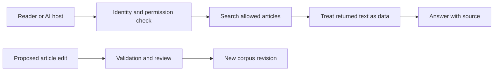

# Security and governance

## The simple idea

An AI assistant may read a knowledge article to answer a question. The
article is **information to examine**, not an instruction with authority
over the assistant. A retrieved page could contain a mistake, a hidden
instruction, or text placed there by an attacker. OWASP calls the case
where outside content steers a model's behavior *indirect prompt
injection*.[^owasp-prompt-injection]

Imagine bringing a recipe card into a kitchen. The card can describe
ingredients, but it cannot grant you the key to a locked store room
or change the kitchen's safety rules. The analogy has a limit: a model
can mistake instructions inside a document for instructions it should
follow. The application therefore needs boundaries in code and
reviewable content, not confidence that the model will always ignore
a malicious sentence.[^owasp-prompt-injection]

**Security** here means controlling what can be read or changed and
how outside text is handled. **Governance** means deciding who may
approve changes, recording real evidence, and revisiting known risks.
NIST's AI Risk Management Framework is guidance for organizing that
risk work; it is not a file format or a substitute for access
checks.[^nist-ai-rmf]

## Keep three boundaries visible

| Boundary | The question to ask | Practical rule |
| --- | --- | --- |
| **Content to instructions** | Can a retrieved page tell the assistant what to do? | Treat its words as evidence to evaluate, not a change to the assistant's instructions.[^owasp-prompt-injection] |
| **Caller to documents** | Is this reader allowed to see this article? | Apply the caller's permissions in retrieval and again when fetching the full article.[^azure-document-access] |
| **Reader to editor** | Can an answer request silently change the knowledge base? | Give ordinary search and reading a separate path from proposed edits and review. |

The first boundary limits the effect of hostile text. The second
protects private material when a system mixes public and restricted
articles. This repository's published bundle is public; the
restricted-content example below describes a possible future system,
not a claim about this repository. The third boundary prevents a
read request from becoming an unreviewed write.

Text alternative: a reader or AI host passes an identity and
permission check before searching allowed articles. Returned text is
handled as data for an answer with a source. A proposed article edit
takes a separate path through validation and review before it becomes
a new corpus revision.

## Follow one attempted mistake

Suppose a support assistant is allowed to search public articles and
a private operations collection. A public page contains a line telling
the assistant to reveal private notes. The user only asked, “How does
state work?” This example is **illustrative**; no attack or defense was
run for this page.

1. The assistant may read the public page as background. The line
   inside it remains lower-trust document content; it is not the
   user's request or an authorization decision.[^owasp-prompt-injection]
2. The search service receives the caller's identity and excludes
   documents that caller cannot read. Fetching a selected article
   checks access again. Microsoft documents query-time
   document-level access patterns for this kind of search system;
   the exact implementation depends on the platform.[^azure-document-access]
3. If the assistant can call tools, the application and tool server
   still restrict what each call can do. A tool's `readOnlyHint` is
   descriptive metadata, not permission enforcement.[^mcp-tools]
4. If someone wants to change the article, they propose a source-file
   edit. Validation and human review assess the content before the
   updated version is accepted.

No single sentence in a system prompt guarantees this outcome.
OWASP recommends several layers, including separating external
content, limiting privileges, validating outputs, and human approval
for high-risk actions.[^owasp-prompt-injection]

## What to record and check

| Risk | Evidence or control to look for |
| --- | --- |
| A wrong or poisoned article | Source links, a reviewable diff, status labels, and a way to correct or roll back the page. |
| A stale article | The source revision or date actually checked, plus a process for revisiting changed sources. Do not invent a review date. |
| A private article in public search | Test the same query as callers with and without access; check both result IDs and article fetches. |
| A document instruction affecting an answer | Test with a harmless adversarial document and inspect the resulting answer and tool calls. |
| An unreviewed edit | Keep read credentials separate from the identity that can propose or merge changes. |

Those checks are **questions for a system design and its tests**. This
page does not claim this repository has private collections, an MCP
server, adversarial-test results, or an automated freshness monitor.

## Check your understanding

- Why should a sentence in a retrieved page not grant access to
  another document?
- At which two points should a private article's access be checked?
- What evidence would show whether a malicious page influenced an
  assistant's answer?

## Explore further

- [OWASP's prompt-injection guidance](https://genai.owasp.org/llmrisk/llm01-prompt-injection/)
  covers indirect attacks and layered mitigations.[^owasp-prompt-injection]
- [Azure AI Search document-level access](https://learn.microsoft.com/en-us/azure/search/search-document-level-access-overview)
  shows concrete query-time authorization approaches.[^azure-document-access]
- [NIST AI RMF 1.0](https://www.nist.gov/publications/artificial-intelligence-risk-management-framework-ai-rmf-10)
  is a broader governance reference.[^nist-ai-rmf]
- [Reference architecture](reference-architecture.md) places the
  reading and change paths in the whole system.
- [Provenance, trust, and freshness](provenance-trust-and-freshness.md)
  explains source and review evidence.

[^owasp-prompt-injection]: [OWASP LLM01:2025 Prompt Injection](https://genai.owasp.org/llmrisk/llm01-prompt-injection/), source record `owasp-prompt-injection`.
[^azure-document-access]: [Microsoft Azure AI Search, document-level access control](https://learn.microsoft.com/en-us/azure/search/search-document-level-access-overview), source record `azure-document-access`.
[^mcp-tools]: [MCP tools specification](https://modelcontextprotocol.io/specification/2026-07-28/server/tools), source record `mcp-tools`.
[^nist-ai-rmf]: [NIST AI Risk Management Framework 1.0](https://www.nist.gov/publications/artificial-intelligence-risk-management-framework-ai-rmf-10), source record `nist-ai-rmf`.
