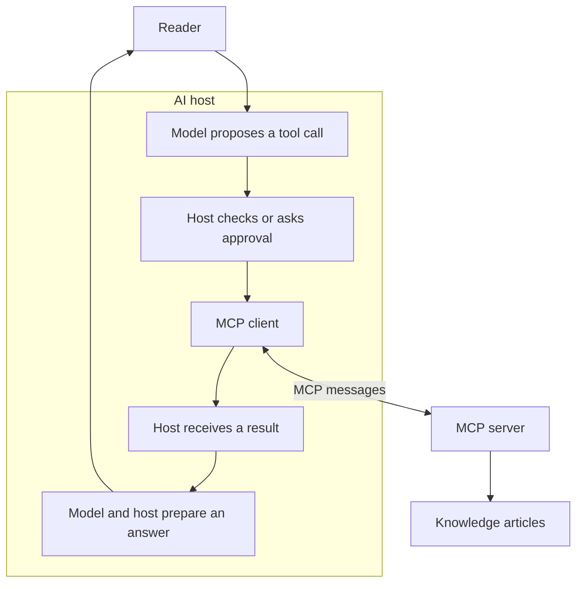

# Model Context Protocol

## The simple idea

**Model Context Protocol (MCP)** is a shared way for an AI application to
request information or an action from another program. For example, an AI
assistant could ask a knowledge server to search articles, then use the
returned article to answer a reader's question. MCP defines the exchange
between the programs; the server still decides where its information comes
from and what a caller may access.[^mcp-architecture][^mcp-base]

Think of a library desk. You ask an assistant a question; the assistant
may request a page from the desk, which returns what it can find and
serve. That picture helps explain the direction of the request. It stops
there: the desk does not guarantee the page is relevant or accurate,
grant access to every collection, or decide how the assistant explains it.

## The three participants

| Participant | Plain-language role | In the knowledge example |
| --- | --- | --- |
| **Host** | The AI application you use. It coordinates its connections. | The assistant where you ask a question. |
| **Client** | The part of that host that talks to one MCP server. | The connection that sends the assistant's search request. |
| **Server** | A program that offers information or operations. It can run locally or remotely. | A service that searches the knowledge articles. |

A host can have several clients, each connected to a different server.
The server is the provider of the capability; it is not necessarily a
large remote machine.[^mcp-architecture]

Text alternative: a reader asks the AI host. Its model may propose a
tool call; the host applies its controls and may ask for approval. The
host's MCP client exchanges messages with a server that reads knowledge
articles. The model and host use the result to prepare an answer. A tool
call is therefore a decision by the host, not an automatic
consequence of connecting to a server.

## What a server can offer

MCP groups common server capabilities into three useful kinds. A server
may offer one, two, or all three.[^mcp-server-features] Clients also have
optional capabilities such as elicitation; these are separate from what
servers offer.[^mcp-architecture]

| Capability | What you can ask for | Knowledge example |
| --- | --- | --- |
| **Tool** | Run a named operation with inputs and receive a result. | `search_knowledge` takes a query and returns matching titles, article IDs, and a source revision. |
| **Resource** | Read content identified by a URI. | `kb://terraform/state` identifies a readable article. |
| **Prompt** | Get a reusable prompt template. | A template could ask the host to explain an article for a beginner. |

A tool can read or change something, depending on what the server
implements. The word *tool* alone does not mean an operation is safe or
read-only. A resource is content offered for reading; a prompt is a
template, not an automatic answer. Typically the model proposes tool
use, the application selects resources, and a user selects prompts;
the host still controls what it actually sends.[^mcp-server-features]

## Follow one question

Imagine a reader asking, “What does Terraform state do?” The following
is an **illustrative design**, not a running server:

1. The model proposes a `search_knowledge` call with
   `{"query": "Terraform state"}`. The host may require approval and
   decides whether to send it through its MCP client.
2. The server searches its allowed articles and returns a few titles,
   stable IDs, and the knowledge revision it searched.
3. If the host chooses a result and the server exposes it as a resource,
   the client requests that article through a URI such as
   `kb://terraform/state`.
4. The host uses the returned content to explain state and can cite the
   article and its source revision.

MCP carries those requests and responses. It does not prescribe Git,
Markdown, a database, or any particular search algorithm behind the
server. It also cannot guarantee that the selected article is correct
or that the model will explain it well. Those need source review and
answer evaluation.[^mcp-architecture][^mcp-tools][^mcp-resources]

For this repository, [Terraform state management](../../terraform/fundamentals/state-management.md)
is a real article. The sample URI and tool name above are only examples;
this page does not claim that this repository has a live MCP server.

## The boundaries that matter

| Question | Short answer |
| --- | --- |
| How do messages travel? | A local server can use `stdio`; a remote server can use Streamable HTTP. The transport changes delivery, not the meaning of a tool or resource.[^mcp-transports] |
| Where is the conversation? | The host manages it. The server sees only what the host sends in a request; a connection is not the chat history.[^mcp-architecture] |
| Does the server remember earlier requests? | In MCP version 2026-07-28, a server must not infer request context from earlier calls on the same connection. For work that spans requests, the client passes an explicit identifier.[^mcp-base] |
| Who checks access? | The server validates inputs and enforces access controls for what it serves or changes. Tool descriptions and annotations do not grant permission.[^mcp-tools] |
| Who decides whether to use a result? | The host controls its user interaction and what context it gives the model. MCP does not define the model's reasoning or the final answer.[^mcp-architecture] |

If a server offers both `search_knowledge` and `edit_article`,
the write operation needs its own permission checks and a clear user
decision. Returning an article through MCP never authorizes editing it.

## Check your understanding

- In the question example, which participant reads the knowledge
  articles, and which participant prepares the final answer?
- Would changing from local `stdio` to remote HTTP make an article
  trustworthy by itself? Why?
- If a tool description says it is read-only, what must the server
  still check?

## Explore further

- Read the [MCP architecture overview](https://modelcontextprotocol.io/docs/2026-07-28/learn/architecture)
  for the host, client, and server relationship.[^mcp-architecture]
- Read the [base protocol](https://modelcontextprotocol.io/specification/2026-07-28/basic/index),
  [tools](https://modelcontextprotocol.io/specification/2026-07-28/server/tools),
  and [resources](https://modelcontextprotocol.io/specification/2026-07-28/server/resources)
  specifications when designing an integration.[^mcp-base][^mcp-tools][^mcp-resources]
- If updating older TypeScript examples, the [SDK v2 migration
  guide](https://ts.sdk.modelcontextprotocol.io/v2/migration/upgrade-to-v2)
  explains the split from `@modelcontextprotocol/sdk` to the v2 client
  and server packages.[^mcp-typescript-sdk]
- For this repository's design, continue to
  [Agent knowledge bases](knowledge-bases/index.md) and
  [Create AI tools for Claude and Codex](create-ai-tools-for-claude-and-codex.md).

[^mcp-architecture]: [MCP architecture overview](https://modelcontextprotocol.io/docs/2026-07-28/learn/architecture), source record `mcp-architecture`.
[^mcp-base]: [MCP base protocol, version 2026-07-28](https://modelcontextprotocol.io/specification/2026-07-28/basic/index), source record `mcp-base`.
[^mcp-tools]: [MCP tools specification](https://modelcontextprotocol.io/specification/2026-07-28/server/tools), source record `mcp-tools`.
[^mcp-resources]: [MCP resources specification](https://modelcontextprotocol.io/specification/2026-07-28/server/resources), source record `mcp-resources`.
[^mcp-server-features]: [MCP server features](https://modelcontextprotocol.io/specification/2026-07-28/server/index), source record `mcp-server-features`.
[^mcp-transports]: [MCP transports overview](https://modelcontextprotocol.io/specification/2026-07-28/basic/transports), source record `mcp-transports`.
[^mcp-typescript-sdk]: [MCP TypeScript SDK v2 migration guide](https://ts.sdk.modelcontextprotocol.io/v2/migration/upgrade-to-v2), source record `mcp-typescript-sdk`.
