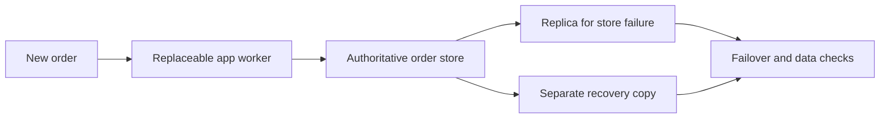

# Stateful design decision checklist

## The idea in plain language

A workload is **stateful** when the next piece of work depends on information
kept from earlier work. Before calling it ready for production, ask where
that information lives, which failures it must survive, and how you would
show that recovery works. A second running replica is useful, but it does
not answer every data-loss question.

Think of a shop's order book. Two cashiers can keep serving customers if
they both use a shared record, but a second cashier cannot restore an order
that was deleted from the record. The analogy has limits: real systems may
have several state stores and replicas; a backup may contain an earlier
version; and correctness can require application-specific checks.

AWS frames recovery around two targets: **recovery time objective (RTO)** is
the maximum acceptable delay before service returns, and **recovery point
objective (RPO)** limits how old the recovered data may be. The owners of a
workload choose these based on the impact of downtime and lost data; a
diagram or service label cannot set them for you.[^aws-objectives]

## Follow the state and the failure

Text alternative: an app worker writes an order to the authoritative store.
A replica can help with some store failures, while a separate recovery copy
can help with loss or corruption that also reaches the live system. Both
paths end with a check that the expected orders are usable. The diagram
helps identify which component owns data and which failure each recovery
path is meant to cover; it does not prove either path is configured.

For each important state item, write down four things:

| Question | Why the answer changes the design |
| --- | --- |
| What is the authoritative copy? | A cache can be rebuilt; the only copy of a customer order cannot. |
| Where are its live and recovery copies? | A failure can affect one process, host, Availability Zone, Region, account, or operator action. |
| What is the acceptable outage and data gap? | RTO and RPO guide the choice between restore, failover, and other recovery paths. |
| What observation proves recovery? | A green backup job does not show that the application can read the right data. |

Replication and backup serve different questions. A live replica may shorten
recovery from one component failure, but a bad write can also be copied to
it. A retained backup can offer an earlier recovery point, but restoring it
takes time and may lose work since that point. These are design
possibilities, not guarantees of an AWS product or configuration.

## One illustrative review

Imagine an online shop with two app workers and a database of paid orders.
This is an invented workload, not an AWS deployment or recovery test.

1. The app workers are replaceable only if the paid orders are stored in the
   database rather than in one worker's memory.
2. The team names the database as the authoritative state and asks what
   happens if its instance, storage, or entire location fails. A replica
   might help with one failure; a separately retained backup may be needed
   for accidental deletion or corruption.
3. The shop owners choose acceptable downtime and lost-order limits. Those
   targets become RTO and RPO. A 15-minute backup interval, for example,
   is **not** itself proof of a 15-minute RPO: backup completion, restore
   point, and data validity still need checking.
4. In an isolated recovery exercise, the team would restore, retrieve known
   paid orders, measure how long users could not use the service, and compare
   recovered data to the chosen targets. AWS explicitly recommends checking
   recovered data, not merely seeing that a restore job completed.[^aws-recovery-test]

If the database runs on Kubernetes, a StatefulSet can give Pods stable
identity and associated storage. It does not perform the database's
replication, choose a valid recovery point, or prove queries work after
failover.[^k8s-statefulset] See [stateful workloads in
Kubernetes](../../../kubernetes/core-objects/stateful-workloads.md) for that
boundary.

## Review questions before approval

- **State:** List authoritative records, derived data, caches, files,
  messages, and external services. Which can be rebuilt, and from what?
- **Failure:** Name the failure scope you are designing for. Is the copy
  outside that scope and protected from unintended deletion?
- **Recovery:** Record the chosen RTO and RPO and the procedure intended to
  meet them. What must be restored or failed over first?
- **Correctness:** Define an application-level check, such as reading a
  known paid order. What result would make you stop rather than resume
  traffic?
- **Evidence:** Record an actual recovery exercise with measured timing,
  recovered data, and unresolved gaps before claiming the targets are met.

Network flow state needs a different review. For security groups, network
ACLs, and inspection appliances, use [stateful
networking](../networking/stateful-networking.md). For the simpler
compute-versus-data model, start with [stateful vs.
stateless](stateful-vs-stateless.md).

## Check your understanding

- Why does a second app worker not protect an order stored only in the first
  worker's memory?
- What different failures might a live replica and a retained backup address?
- What would you measure to support a claim that the chosen RTO and RPO are
  achievable?

## Official documentation for deeper study

- [Define recovery objectives for downtime and data loss](https://docs.aws.amazon.com/wellarchitected/latest/framework/rel_planning_for_recovery_objective_defined_recovery.html)
  explains how business impact shapes RTO and RPO.
- [Perform periodic recovery of data](https://docs.aws.amazon.com/wellarchitected/latest/framework/rel_backing_up_data_periodic_recovery_testing_data.html)
  explains why backup integrity and restoration require a recovery test.
- [Kubernetes StatefulSets](https://kubernetes.io/docs/concepts/workloads/controllers/statefulset/)
  explains stable Pod identity and storage association.

Next, use [stateless application
patterns](stateless-application-patterns.md) to see how replaceable compute
depends on shared state, or return to the [AWS architecture index](index.md).

[^aws-objectives]: [AWS Well-Architected: Define recovery objectives](https://docs.aws.amazon.com/wellarchitected/latest/framework/rel_planning_for_recovery_objective_defined_recovery.html).
[^aws-recovery-test]: [AWS Well-Architected: Perform periodic recovery of the data](https://docs.aws.amazon.com/wellarchitected/latest/framework/rel_backing_up_data_periodic_recovery_testing_data.html).
[^k8s-statefulset]: [Kubernetes: StatefulSets](https://kubernetes.io/docs/concepts/workloads/controllers/statefulset/).
