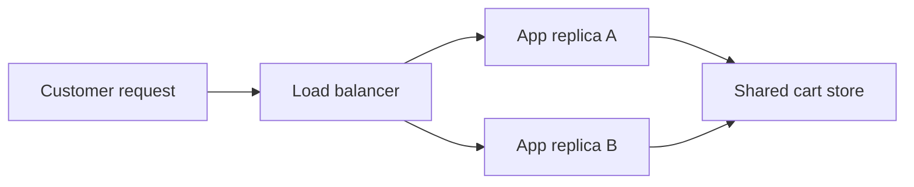

# Stateful vs. stateless on AWS

## The idea in plain language

**State** is information from an earlier request or event that a system needs
later. A shopping cart, a user session, a saved file, and a job's progress
are all state. The useful question is **where that information lives**.

A **stateless compute replica** can handle the next request without relying
on information kept only in its own memory or local disk. It may still read
or write a database, queue, or object store. A **stateful component** keeps
information whose loss or inconsistency would matter to future work. AWS's
reliability guidance recommends separating needed state from replaceable
compute when possible.[^aws-stateless]

Picture a restaurant. A waiter can leave at the end of a shift if every
order is recorded where the next waiter can find it. If the waiter alone
remembers the orders, replacing them loses essential information. The
analogy has a limit: the shared order book itself must be protected and
available; moving state does not make it disappear.

## Follow one request

Imagine two web replicas serving a shopping cart. This is an invented
example, not a deployed AWS workload.

Text alternative: a load balancer can send the next customer request to
either app replica. Both read and update the same cart store, so required
cart history is not held only by the replica that handled the last request.
If replica A fails, replica B can read the cart *if the store and access path
remain healthy*. That last condition is why the store still needs its own
availability, backup, and recovery plan.

If cart state instead lives only in replica A's memory, replica B cannot
recover it after A fails. Sticky routing to A can hide the problem during
normal operation but does not make A's private memory durable.

## What changes operationally

| Question | Replaceable compute | Component holding required state |
| --- | --- | --- |
| What happens after one instance fails? | Start another and reconnect to shared state. | Recover or fail over the data and check consistency. |
| What makes scaling harder? | Usually capacity, dependencies, and startup time. | Data placement, replication, ordering, or ownership may constrain placement. |
| What must be protected? | Reproducible code, configuration, and credentials. | Data integrity, access, backups, and recovery objectives. |

These are design tendencies, not automatic properties of an AWS service.
For example, a web process can become stateful if it keeps uploads only on
local disk. A managed database remains a stateful dependency even when AWS
operates much of its infrastructure. Replacing compute and recovering data
are different tasks.

## Decide what must survive

Before calling a component stateless, list what it holds between requests:

1. **Required state:** a cart, uploaded file, payment record, or work item
   whose loss would violate the user outcome.
2. **Rebuildable state:** a cache or derived file that can be recreated from
   another authoritative store within an acceptable time.
3. **Short-lived state:** temporary calculations used only during one
   request, provided retry behavior is understood.

Then ask: if this replica vanishes now, where would a replacement get each
required item? AWS lists databases, caches, file systems, and object storage
as ways to offload state, chosen according to the data and access
need.[^aws-stateless] In standard Lambda functions, AWS says not to rely on an
execution environment persisting between invocations; permanent changes
belong in durable services before the invocation ends.[^aws-lambda-design]

Moving required state to a shared service introduces new questions: Is that
service available? Is data encrypted and access controlled? Can a retry
repeat an operation safely? What are the acceptable recovery time and data
loss? The answer cannot be inferred from the word “stateless” alone.

## Check your understanding

- A web server writes uploaded files only to its local disk. What happens
  when that server is replaced?
- Why can an API be stateless while the whole application is still stateful?
- What extra evidence would you need before claiming that an application
  remains available after one replica fails?

## Official documentation for deeper study

- [AWS Well-Architected: make systems stateless where possible](https://docs.aws.amazon.com/wellarchitected/latest/framework/rel_mitigate_interaction_failure_stateless.html) explains separating session and user data from compute.
- [Designing Lambda applications](https://docs.aws.amazon.com/lambda/latest/dg/concepts-application-design.html) explains why functions must treat execution environments as replaceable and store permanent changes externally.

Next, use [stateless application patterns](stateless-application-patterns.md)
for AWS component choices, or the [stateful design
checklist](stateful-design-decision-checklist.md) before an operational
decision. See the [AWS architecture index](index.md).

[^aws-stateless]: [Make systems stateless where possible](https://docs.aws.amazon.com/wellarchitected/latest/framework/rel_mitigate_interaction_failure_stateless.html).
[^aws-lambda-design]: [Designing Lambda applications](https://docs.aws.amazon.com/lambda/latest/dg/concepts-application-design.html).
