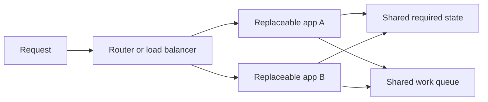

# Stateless application patterns on AWS

## The idea in plain language

A replaceable app replica should not be the only place that holds something
users still need. Move **required state** to a suitable shared system, and
let the app replica read it when handling a request. The goal is that a new
replica can take over without needing the old replica's private memory or
disk.[^aws-stateless]

“Stateless” describes the compute layer in this pattern. The whole
application still has state, and its shared systems need their own access,
availability, backup, and recovery design. Read [stateful vs.
stateless](stateful-vs-stateless.md) first for the basic distinction.

## One picture of the pattern

Text alternative: requests can reach either app replica. Both replicas
access the same required state; they can also submit work to a queue that
outlives an individual app process. The drawing is a design model, not a
deployed AWS architecture or a guarantee of availability.

## Put each kind of information in the right place

| Information | If kept only in one replica | A possible shared pattern |
| --- | --- | --- |
| Uploaded image | It can vanish when that replica is replaced. | Store the object in S3 and keep its identifier with the user's record.[^aws-s3] |
| Login session or cart | A different replica cannot continue the interaction. | Use a shared session store or a design where each request carries what the app needs.[^aws-stateless] |
| Background work request | A process crash can erase work that was only in memory. | Put the request in a durable queue or workflow service; design retry behavior.[^aws-lambda-design] |
| Temporary calculation | Usually safe to recompute if the request is retried. | Keep it local only when loss and recomputation are acceptable. |
| Cache copy | May disappear with the replica. | Rebuild from the authoritative store, or use a shared cache if recovery time requires it. |

These are categories, not a prescription to use every listed AWS service.
For each item, decide what must survive, how it is read, what consistency it
needs, and who can access it. A shared store can become a bottleneck or
failure point if its own design is ignored.

## Follow an upload

Imagine an app that receives a profile photo. This is an invented example;
no upload or AWS resource was created for this page.

1. The app receives the photo and writes it as an object in a protected S3
   bucket. S3 is an object store; an object has a key that the app can keep
   with the user's record.[^aws-s3]
2. The app saves the object's key in an authoritative user record only after
   confirming the upload succeeded. This ordering is a design choice for
   this example, not a universal transaction guarantee between two stores.
3. A later request may land on another app replica. That replica reads the
   user record and retrieves the object with appropriate permissions.

If the first replica disappears after step 2, the photo remains in the
shared store, assuming the store and its access path are healthy. If it
disappears between steps 1 and 2, the system may have an unreferenced object
that needs cleanup. If step 2 happens before the upload succeeds, the record
may point to a missing object. A real design must handle those partial
failures and decide when to retry or clean up.

## Replaceable workers still need careful retries

A queue can preserve a work request while workers start and stop. It does
not mean processing happens exactly once. For example, AWS documents that
an SQS **standard queue** may deliver a message more than once; consumers
should be idempotent, meaning that processing the same request twice does
not cause an unwanted second effect.[^aws-sqs-delivery] AWS gives the same
design principle for Lambda event processing.[^aws-lambda-design]

An illustrative payment worker could store a request ID with the completed
payment and check it before charging again. The exact payment-provider API,
transaction boundary, and failure behavior must be designed and tested for
the real system; a queue alone cannot supply that proof.

## What to check before claiming replaceability

- Can a new replica start from code and configuration without manual edits?
- Where are sessions, uploads, job progress, logs, and credentials stored?
- Can a request be retried or duplicated without corrupting state?
- If a replica exits during work, what resumes or compensates for it?
- Can the shared state system meet the application’s availability and
  recovery goals under the expected failure?

These questions are a design review, not evidence that a particular
deployment passed a failure test. For an operational decision, continue to
the [stateful design checklist](stateful-design-decision-checklist.md).

## Check your understanding

- Why can two interchangeable app replicas still depend on a stateful
  database or object store?
- What can go wrong between writing an S3 object and saving its key?
- Why must a worker handle a duplicate SQS standard-queue message?

## Official documentation for deeper study

- [AWS Well-Architected stateless guidance](https://docs.aws.amazon.com/wellarchitected/latest/framework/rel_mitigate_interaction_failure_stateless.html) explains why to move session and user data out of replaceable compute.
- [Amazon S3 introduction](https://docs.aws.amazon.com/AmazonS3/latest/userguide/Welcome.html) explains objects, keys, access, and storage choices.
- [SQS at-least-once delivery](https://docs.aws.amazon.com/AWSSimpleQueueService/latest/SQSDeveloperGuide/standard-queues-at-least-once-delivery.html) explains duplicate delivery for standard queues.
- [Designing Lambda applications](https://docs.aws.amazon.com/lambda/latest/dg/concepts-application-design.html) covers replaceable execution environments and idempotency.

See the [AWS architecture index](index.md) for related design choices.

[^aws-stateless]: [Make systems stateless where possible](https://docs.aws.amazon.com/wellarchitected/latest/framework/rel_mitigate_interaction_failure_stateless.html).
[^aws-s3]: [What is Amazon S3?](https://docs.aws.amazon.com/AmazonS3/latest/userguide/Welcome.html).
[^aws-sqs-delivery]: [Amazon SQS at-least-once delivery](https://docs.aws.amazon.com/AWSSimpleQueueService/latest/SQSDeveloperGuide/standard-queues-at-least-once-delivery.html).
[^aws-lambda-design]: [Designing Lambda applications](https://docs.aws.amazon.com/lambda/latest/dg/concepts-application-design.html).
