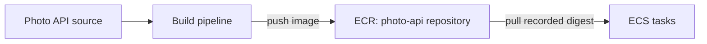

# Amazon ECR

## Purpose

Amazon Elastic Container Registry (ECR) is a place to **store and retrieve
container images**. A build process pushes an image into ECR; a service such
as [Amazon ECS](amazon-ecs.md) can pull it to start a container. ECR also
stores other compatible OCI artifacts, including Helm charts. This page
focuses on a **private** registry; AWS offers a separate public ECR service.
[^ecr-overview][^ecr-images]

## The first mental model

Think of a warehouse. The **registry** is the warehouse for an AWS account
and Region. A **repository** is a named shelf for one application or kind of
artifact. An **image** is a packaged application on that shelf. A **tag** is
a convenient label, while a **digest** identifies the exact image manifest
by its hash.[^ecr-registry][^ecr-pull]

The analogy has limits. ECR does not build the package, decide whether it
should be released, or run it. A label can be moved to another image when
tags are mutable. A digest keeps the selected image identity precise, but
the image still has to be retained and the runtime still needs permission
and network access to pull it.[^ecr-tags][^ecr-policies][^ecr-lifecycle]

| Part | Plain meaning | What to check |
| --- | --- | --- |
| Private registry | The account-and-Region ECR endpoint. | Is the image in the expected account and Region? |
| Repository | A named collection, such as `photo-api`. | Does the name match the image reference? |
| Tag | A readable name such as `v4`. | Can this repository's tag be overwritten? |
| Digest | A `sha256:` hash for the image manifest. | Was the intended digest recorded and retained? |
| Pull permission | The runtime's authorization to read an image. | Which identity pulls the image? |

The repository name is part of a complete image reference. The registry
endpoint includes the AWS account and Region; a reference then adds the
repository and a tag or digest. A digest reference selects a particular
manifest instead of relying on what a tag happens to name at pull time.
ECS also accepts a tag in a task definition and can resolve that tag to a
digest for a service deployment; recording the release digest makes the
chosen image explicit before that deployment.[^ecr-registry][^ecs-task-image]

## Example: a photo API release

This photo API, its release, and the events below are invented. No image was
built, pushed, pulled, scanned, or run in AWS for this example.

1. A build pipeline packages the photo API as a container image. It pushes
   that image to the `photo-api` repository in one private ECR registry.
2. The release records the pushed image's digest. It can also give the image
   a human-friendly tag such as `v4`, but the ECS task definition uses the
   recorded digest to select the exact image.[^ecs-task-image][^ecr-tags]
3. ECS starts two tasks. Its **task execution role** supplies permission for
   ECS to pull the private image. The application's separate **task role**
   would authorize application calls such as storing photos in S3; it does
   not replace the execution role.[^ecs-execution-role]
4. If a task is replaced, ECS pulls the selected image again. A cleanup rule
   must leave that digest available for running replacements and intended
   rollbacks.[^ecr-lifecycle]

Text alternative: the photo API source goes to a build pipeline. The
pipeline pushes an image into the ECR `photo-api` repository. ECS pulls the
recorded digest from that repository to start tasks. ECR is the artifact
store between building and running, not the component that does either.

## Permissions, retention, and findings

- **Access.** IAM identity policies and ECR repository policies can grant
  repository actions. A principal also needs `ecr:GetAuthorizationToken`
  through an IAM policy to authenticate to the private registry, even if a
  repository policy grants its push or pull actions. A successful registry
  login does not by itself prove that a particular repository action is
  allowed.[^ecr-policies]
- **Tags and retention.** ECR can prevent existing tags from being
  overwritten; the current configuration can include exceptions. A
  lifecycle policy can archive or expire images that meet its rules. Preview
  those rules before applying them, and keep any image needed by a running
  service or rollback plan.[^ecr-tags][^ecr-lifecycle]
- **Scanning.** ECR scanning reports known software vulnerabilities. Basic
  scanning covers operating-system findings; enhanced scanning uses Amazon
  Inspector and can continuously assess operating-system and programming
  language packages. A scan result is evidence to assess, not proof that
  the application or its configuration is safe.[^ecr-scanning]

## Other artifacts and platform ownership

### Helm charts in ECR through OCI

ECR can store a packaged Helm chart as an OCI artifact. That chart describes
Kubernetes resources; it is a different artifact from the application image
those resources may run. AWS's [Helm chart procedure](https://docs.aws.amazon.com/AmazonECR/latest/userguide/push-oci-artifact.html)
shows the required chart name, repository, and OCI reference.[^ecr-helm]

### Who manages the repository?

A platform tool such as Crossplane can manage an ECR repository's
configuration. The build pipeline still creates and publishes application
artifacts. The [Application delivery platform API](../../../kubernetes/crossplane/application-delivery-platform-api.md)
shows one repository ownership pattern without making Crossplane an image
builder.

## Check your understanding

1. What does the build pipeline do, what does ECR do, and what does ECS do?
2. Why might a digest be safer to record for a release than a mutable tag?
3. If ECS can authenticate but cannot pull `photo-api`, which permission
   boundary would you inspect next?
4. Why should a lifecycle rule be previewed against rollback images?

## Deeper study

- [ECR registry and repository concepts](https://docs.aws.amazon.com/AmazonECR/latest/userguide/concept-and-components.html)
  and the [image lifecycle walkthrough](https://docs.aws.amazon.com/AmazonECR/latest/userguide/getting-started-cli.html)
  for creating a repository and pushing an image.
- [Private registry authentication](https://docs.aws.amazon.com/AmazonECR/latest/userguide/registry_auth.html)
  and [repository policies](https://docs.aws.amazon.com/AmazonECR/latest/userguide/repository-policies.html)
  for the two access boundaries.
- [Image tag mutability](https://docs.aws.amazon.com/AmazonECR/latest/userguide/image-tag-mutability.html),
  [lifecycle policies](https://docs.aws.amazon.com/AmazonECR/latest/userguide/LifecyclePolicies.html),
  and [image scanning](https://docs.aws.amazon.com/AmazonECR/latest/userguide/image-scanning.html)
  for release identity, retention, and findings.
- [Push a Helm chart to ECR](https://docs.aws.amazon.com/AmazonECR/latest/userguide/push-oci-artifact.html)
  for the OCI chart workflow.

Continue to [Amazon ECS](amazon-ecs.md) to see how the image becomes a
running task. [Back to AWS compute](index.md) |
[Back to AWS index](../index.md)

[^ecr-overview]: [Amazon ECR - What is Amazon ECR?](https://docs.aws.amazon.com/AmazonECR/latest/userguide/what-is-ecr.html).
[^ecr-registry]: [Amazon ECR - Private registry](https://docs.aws.amazon.com/AmazonECR/latest/userguide/Registries.html).
[^ecr-images]: [Amazon ECR - Private images](https://docs.aws.amazon.com/AmazonECR/latest/userguide/images.html).
[^ecr-tags]: [Amazon ECR - Image tag mutability](https://docs.aws.amazon.com/AmazonECR/latest/userguide/image-tag-mutability.html).
[^ecr-pull]: [Amazon ECR - Pull a private image](https://docs.aws.amazon.com/AmazonECR/latest/userguide/docker-pull-ecr-image.html).
[^ecr-policies]: [Amazon ECR - Private repository policies](https://docs.aws.amazon.com/AmazonECR/latest/userguide/repository-policies.html).
[^ecr-lifecycle]: [Amazon ECR - Lifecycle policies](https://docs.aws.amazon.com/AmazonECR/latest/userguide/LifecyclePolicies.html).
[^ecr-scanning]: [Amazon ECR - Image scanning](https://docs.aws.amazon.com/AmazonECR/latest/userguide/image-scanning.html).
[^ecr-helm]: [Amazon ECR - Push a Helm chart](https://docs.aws.amazon.com/AmazonECR/latest/userguide/push-oci-artifact.html).
[^ecs-execution-role]: [Amazon ECS - Task execution IAM role](https://docs.aws.amazon.com/AmazonECS/latest/developerguide/task_execution_IAM_role.html).
[^ecs-task-image]: [Amazon ECS - Task definition image parameter](https://docs.aws.amazon.com/AmazonECS/latest/developerguide/task_definition_parameters.html).
