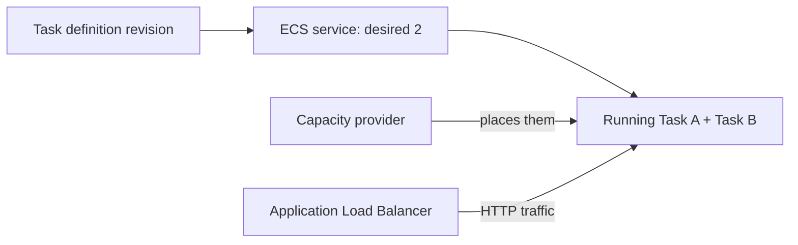

# Amazon ECS

## Purpose

Amazon Elastic Container Service (ECS) runs and manages containers on AWS.
You describe what should run; ECS starts **tasks** and, for a long-running
application, keeps the requested number running through a **service**. A
container image supplies the application files, while a task definition
describes how ECS should run them.[^ecs-task-definitions]

This page gives the first mental model. It does not tell you to run a live
deployment. For the later platform choice, use [ECS vs. EKS](ecs-vs-eks.md).

## Why it matters

A container can stop, a host can disappear, or a new application version can
be released. ECS separates four questions that people often mix together:
what to run, which copies are running now, how many should stay running, and
what compute can host them. A running task does not by itself mean there is
an ECS service to replace it when it stops.[^ecs-task-definitions][^ecs-services]

Think of a **help desk with two staffed seats**. The task definition is the
work instruction, each running task is one staffed seat, the service asks for
two seats to stay staffed, and the capacity provider supplies the space to
run them. The analogy stops there: a task is software, not a person; it may
have several containers, its network address can change, and local files do
not automatically follow its replacement.

| ECS part | Simple meaning | In the help-desk example |
| --- | --- | --- |
| Cluster | A regional logical place that groups ECS services and tasks. | The desk's operating area. |
| Task definition | A versioned description of images, CPU, memory, roles, networking, logs, and storage. | The instructions for one seat. |
| Task | A running instance of a task definition. | One staffed seat now. |
| Service | Keeps a desired number of tasks running and deploys replacements. | The staffing rule: keep two seats open. |
| Capacity provider | Chooses the compute strategy used to place tasks. | How the desk gets space and equipment. |

AWS calls a task definition a blueprint. It can contain one or more
containers. A task is one instance of that definition; a service maintains
the desired number of task instances. A standalone task can also be run for
finite work, but the service scheduler does not replace such a task after it
finishes.[^ecs-task-definitions][^ecs-services]

Text alternative: one task definition revision tells the ECS service what to
run. The service maintains two tasks, and the capacity provider supplies
places to run them. An Application Load Balancer can route HTTP requests to
both tasks. The diagram distinguishes the desired count from the two actual
running copies; it does not show a real deployment.

## Example: a photo API

This application, its task count, and the events below are invented. No AWS
cluster, task, or request was run.

1. A team builds a photo API image and records it in a task definition along
   with the command, CPU and memory, log settings, and application IAM role.
2. The ECS service requests **two tasks** from that definition on Fargate.
   Fargate provides compute without the team managing the underlying hosts.
3. An Application Load Balancer sends HTTP requests to the tasks. The tasks
   write durable photos to S3, rather than relying on their local task files.
4. One task stops. ECS starts a replacement to restore the service's desired
   count. The new task may have a different network address; the photos
   remain in S3.[^ecs-services][^ecs-storage]

Fargate is one capacity choice. ECS can also use EC2 Auto Scaling group
capacity providers and ECS Managed Instances. AWS recommends capacity
providers to choose where tasks run; task-definition launch-type
compatibility is a separate setting. Capacity choices change who manages
hosts and which workload features are available, so they are not merely a
price switch.[^ecs-capacity]

## Boundaries around a running task

- **Network.** With `awsvpc` networking, a task receives its own network
  interface and can have task-level security groups. Fargate tasks use this
  network mode. An ALB is an optional way to send public HTTP requests to an
  ECS service; the service itself is not automatically internet-facing.
  [^ecs-task-networking][^ecs-load-balancing]
- **AWS identity.** A **task role** grants permissions to the application
  code in the containers, such as reading a specific S3 bucket. A separate
  **task execution role** lets ECS pull an image or send logs on the task's
  behalf. Giving the execution role S3 access does not grant that permission
  to application code.[^ecs-task-role][^ecs-execution-role]
- **Data.** Task-local files may disappear when a task stops. ECS supports
  storage choices such as EFS and, under documented conditions, EBS, but
  durability and replacement behaviour differ by volume and task type.
  Choose where authoritative data lives before relying on task replacement.
  [^ecs-storage]
- **Health.** A service maintains a number of tasks, not a proven user
  outcome. Container or load-balancer health checks can trigger replacement,
  but a healthy task can still serve a wrong response. Verify the user path
  separately.[^ecs-services]

## Check your understanding

1. Which object says what to run, and which object asks ECS to keep two
   copies running?
2. Why will a one-off task that finishes not be replaced by a service?
3. Which IAM role does application code use to call S3?
4. If one photo-API task stops, which data must have been stored outside its
   local files?

## Deeper study

- [Task definitions](https://docs.aws.amazon.com/AmazonECS/latest/developerguide/task_definitions.html)
  and [services](https://docs.aws.amazon.com/AmazonECS/latest/developerguide/ecs_services.html)
  for the core ECS objects.
- [Capacity providers and launch types](https://docs.aws.amazon.com/AmazonECS/latest/developerguide/capacity-launch-type-comparison.html)
  for Fargate, ECS Managed Instances, and EC2 choices.
- [Task IAM role](https://docs.aws.amazon.com/AmazonECS/latest/developerguide/task-iam-roles.html)
  and [task execution IAM role](https://docs.aws.amazon.com/AmazonECS/latest/developerguide/task_execution_IAM_role.html)
  for the two permission boundaries.
- [Task networking](https://docs.aws.amazon.com/AmazonECS/latest/developerguide/task-networking-awsvpc.html),
  [service load balancing](https://docs.aws.amazon.com/AmazonECS/latest/developerguide/service-load-balancing.html),
  and [task storage](https://docs.aws.amazon.com/AmazonECS/latest/developerguide/using_data_volumes.html)
  for connections and data lifetime.

Continue to [ECS vs. EKS](ecs-vs-eks.md) to compare orchestration APIs,
or [Amazon ECR](amazon-ecr.md) to see where an image can be stored.
[Back to AWS compute](index.md) | [Back to AWS index](../index.md)

[^ecs-task-definitions]: [Amazon ECS - Task definitions](https://docs.aws.amazon.com/AmazonECS/latest/developerguide/task_definitions.html).
[^ecs-services]: [Amazon ECS - Services](https://docs.aws.amazon.com/AmazonECS/latest/developerguide/ecs_services.html).
[^ecs-capacity]: [Amazon ECS - Launch types and capacity providers](https://docs.aws.amazon.com/AmazonECS/latest/developerguide/capacity-launch-type-comparison.html).
[^ecs-task-role]: [Amazon ECS - Task IAM role](https://docs.aws.amazon.com/AmazonECS/latest/developerguide/task-iam-roles.html).
[^ecs-execution-role]: [Amazon ECS - Task execution IAM role](https://docs.aws.amazon.com/AmazonECS/latest/developerguide/task_execution_IAM_role.html).
[^ecs-task-networking]: [Amazon ECS - Allocate a task network interface](https://docs.aws.amazon.com/AmazonECS/latest/developerguide/task-networking-awsvpc.html).
[^ecs-load-balancing]: [Amazon ECS - Use load balancing for service traffic](https://docs.aws.amazon.com/AmazonECS/latest/developerguide/service-load-balancing.html).
[^ecs-storage]: [Amazon ECS - Storage options for tasks](https://docs.aws.amazon.com/AmazonECS/latest/developerguide/using_data_volumes.html).
