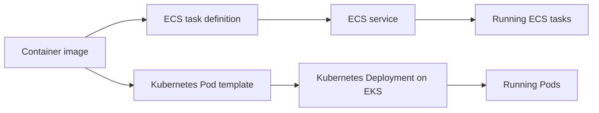

# ECS vs. EKS

## Purpose

Amazon ECS and Amazon EKS both run containerized applications on AWS. The
main difference is the **control interface** used to describe and operate
them. ECS uses AWS task definitions, tasks, and services. EKS provides a
managed Kubernetes control plane, so teams use Kubernetes objects such as
Pods and Deployments, and can extend its API with custom resources.
[^ecs-task-definitions][^eks-overview][^kubernetes-custom-resources]

This explanation helps a team ask which interface and operating model it
actually needs. A web API or queue worker can run on either platform; the
workload name alone does not decide the answer.

## The mental model

Imagine **two control panels for the same machine**. Both can ask for two
running copies of a container, but their switches, extension points, and
maintenance steps differ. The analogy stops when capacity, networking,
identity, and storage enter the picture: the same container image can run on
both, but its deployment configuration and AWS integration must be designed
for the chosen platform.

| Question | ECS | EKS |
| --- | --- | --- |
| What describes a running copy? | A task definition describes it; a task is a running instance. | A Pod template describes it; a Pod is a running instance. |
| What maintains several copies? | An ECS service requests a desired task count. | A Kubernetes Deployment manages ReplicaSets and Pods toward a desired count. |
| What is the main API? | AWS ECS APIs for clusters, task definitions, tasks, and services. | Kubernetes API objects, plus AWS EKS APIs for the managed cluster. |
| How is application AWS access attached? | An IAM task role. | A Kubernetes service account mapped through EKS Pod Identity or IRSA. |
| Can the platform define a new Kubernetes object kind? | ECS has its own API, not Kubernetes CRDs. | Kubernetes custom resource definitions (CRDs) extend the API. |

An ECS service replaces a stopped task to maintain its desired count.
Kubernetes Deployments reconcile their Pods through ReplicaSets. Neither
statement proves that the application gives a correct answer to a user.
[^ecs-services][^kubernetes-deployments] ECS task roles and EKS service-account
identity are different ways to grant workloads AWS permissions; both require
permissions scoped to the application.[^ecs-task-role][^eks-service-accounts]

Text alternative: one application image can be named in an ECS task
definition or a Kubernetes Pod template. The ECS service creates and
maintains tasks; an EKS Deployment creates and maintains Pods through
Kubernetes controllers. The diagram helps show why moving an image is easier
than translating the platform configuration around it.

## Example: a photo API and a platform promise

This team and its requirements are invented. No ECS service, EKS cluster, or
cost comparison was run.

A team has a photo API that accepts requests through an ALB, stores photos in
S3, and needs two running copies. Both ECS and EKS can meet that requirement.
The team must still define networking, application IAM access, logging,
health checks, and a deployment path.

Now the team makes one additional promise: developers will submit a custom
`PhotoService` object, and an in-cluster controller will turn each object into
the application's infrastructure. That promise uses the Kubernetes API and
custom resources, so EKS preserves the proposed interface. Choosing ECS
would require designing a different platform API or automation to replace it.
Kubernetes documents CRDs as a way to add a new resource type to its API.
[^kubernetes-custom-resources]

If the team **does not** need that Kubernetes interface and already operates
AWS services through IAM and infrastructure code, ECS may be a simpler
operating model for this one API. That is a conditional inference from the
documented API surfaces, not a measured claim that ECS is always cheaper,
faster, or more reliable.

## What does not decide the choice by itself

- **"We want managed compute."** ECS can use Fargate, ECS Managed Instances,
  or EC2 capacity providers. EKS has AWS-managed control-plane options and
  EKS Auto Mode, which also manages much cluster infrastructure. Compare the
  exact capacity and feature requirements, not a simple managed/unmanaged
  label.[^ecs-capacity][^eks-auto-mode]
- **"We have Docker images."** The image can be reused, but task
  definitions, Kubernetes manifests, IAM wiring, service discovery, and
  rollout controls do not translate automatically.
- **"Kubernetes is portable."** Kubernetes API objects can travel between
  Kubernetes implementations, but a workload using AWS load balancers,
  identity, storage, or provider-specific custom resources still needs
  adaptation. This is an inference from those integration points, not a
  guarantee of portability.
- **"ECS has fewer Kubernetes parts."** ECS avoids operating Kubernetes
  objects and add-ons, but the team still owns its task roles, VPC rules,
  capacity choices, application health, data, and releases. EKS Auto Mode
  reduces some cluster work; it does not remove the application work.
- **"One is cheaper."** A cost answer needs an actual workload shape,
  capacity plan, cluster and network charges, operations effort, and current
  prices. No such comparison is recorded here.

## A practical decision sequence

1. List the application's **required interfaces**: Kubernetes API objects,
   operators, CRDs, or only a container service and AWS resources.
2. List its **runtime needs**: compute type, storage lifetime, network paths,
   identity, scaling, and how traffic reaches it.
3. Identify who will maintain the platform and which operational skills and
   automation the team already has.
4. Build one small representative path on each viable option if the choice is
   still unclear. Compare deployment, failure diagnosis, security boundaries,
   and measured cost from that path.

## Check your understanding

1. Why can the photo API run on either platform before the custom-resource
   promise is added?
2. Which object maintains running copies in ECS, and which object starts the
   Kubernetes reconciliation chain on EKS?
3. Why is reusing a container image not the same as migrating the platform?

## Deeper study

- [ECS task definitions](https://docs.aws.amazon.com/AmazonECS/latest/developerguide/task_definitions.html)
  and [services](https://docs.aws.amazon.com/AmazonECS/latest/developerguide/ecs_services.html)
  for its API model.
- [Amazon EKS overview](https://docs.aws.amazon.com/eks/latest/userguide/what-is-eks.html)
  and [EKS Auto Mode](https://docs.aws.amazon.com/eks/latest/userguide/automode.html)
  for the managed Kubernetes choices.
- [Kubernetes Deployments](https://kubernetes.io/docs/concepts/workloads/controllers/deployment/)
  and [custom resources](https://kubernetes.io/docs/concepts/extend-kubernetes/api-extension/custom-resources/)
  for the API and extension model.
- [ECS capacity choices](https://docs.aws.amazon.com/AmazonECS/latest/developerguide/capacity-launch-type-comparison.html)
  and [EKS workload AWS access](https://docs.aws.amazon.com/eks/latest/userguide/service-accounts.html)
  for two important implementation questions.

Continue to [Amazon ECS](amazon-ecs.md) for its core objects,
[Kubernetes fundamentals](../../../kubernetes/fundamentals/kubernetes-fundamentals.md)
for the Kubernetes model, or [EKS to ECS migration](eks-to-ecs-migration.md)
for the platform-change inventory. [Back to AWS compute](index.md)

[^ecs-task-definitions]: [Amazon ECS - Task definitions](https://docs.aws.amazon.com/AmazonECS/latest/developerguide/task_definitions.html).
[^ecs-services]: [Amazon ECS - Services](https://docs.aws.amazon.com/AmazonECS/latest/developerguide/ecs_services.html).
[^ecs-capacity]: [Amazon ECS - Launch types and capacity providers](https://docs.aws.amazon.com/AmazonECS/latest/developerguide/capacity-launch-type-comparison.html).
[^ecs-task-role]: [Amazon ECS - Task IAM role](https://docs.aws.amazon.com/AmazonECS/latest/developerguide/task-iam-roles.html).
[^eks-overview]: [Amazon EKS - What is Amazon EKS](https://docs.aws.amazon.com/eks/latest/userguide/what-is-eks.html).
[^eks-auto-mode]: [Amazon EKS - Automate cluster infrastructure with EKS Auto Mode](https://docs.aws.amazon.com/eks/latest/userguide/automode.html).
[^eks-service-accounts]: [Amazon EKS - Grant workloads access to AWS](https://docs.aws.amazon.com/eks/latest/userguide/service-accounts.html).
[^kubernetes-deployments]: [Kubernetes - Deployments](https://kubernetes.io/docs/concepts/workloads/controllers/deployment/).
[^kubernetes-custom-resources]: [Kubernetes - Custom Resources](https://kubernetes.io/docs/concepts/extend-kubernetes/api-extension/custom-resources/).
