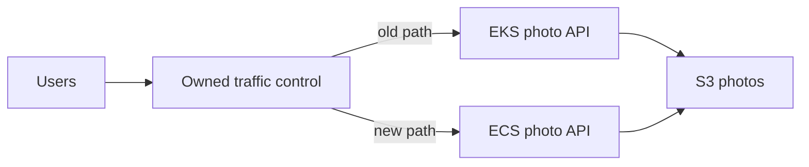

# EKS to ECS migration

## Purpose

Moving from Amazon EKS to Amazon ECS means changing **who describes and runs
an application**, while preserving the outcomes its users depend on. A
Kubernetes Deployment describes desired Pods; an ECS task definition
describes what one task runs, and an ECS service keeps the desired task
count. The same container image may work on both, but a working image alone
does not carry over traffic routes, identity, storage, scaling, or operating
procedures.[^k8s-deployment][^ecs-task-definitions][^ecs-services]

Use this page to understand the migration and decide what must be proven
before traffic moves. It is an explanation, not a procedure for changing a
live production platform. For the initial platform choice, read
[ECS vs. EKS](ecs-vs-eks.md).

## What actually moves?

Imagine moving a small restaurant to a different building. You might keep
the menu and recipes, but must arrange a new entrance, kitchen equipment,
staff access, deliveries, and a way to handle customers already arriving.
The application image is like the recipe; its surrounding platform is the
rest of the operation. The analogy stops at the user outcome: software can
share external data and receive traffic in both places at once, which
requires deliberate compatibility and routing checks.

| EKS responsibility | Question for the ECS target |
| --- | --- |
| Deployment and Pods | Which task definition, service, and capacity will run the containers? |
| Service and Ingress | Which listener or private discovery path reaches the right tasks? |
| Service account and workload identity | Which task role grants application AWS calls, and which execution role lets ECS pull the image and send logs? |
| HPA and node capacity | Which metric changes the service task count, and where does compute capacity come from? |
| Config, secrets, and volumes | Where do settings and authoritative data live after task replacement? |
| Jobs and CronJobs | Which one-off task or schedule runs the work, with what retry and duplicate-work rules? |
| CRDs, operators, and admission controls | Which product or process will provide these platform behaviors? |

These are design questions, not one-to-one resource conversions. For
example, an ALB can route HTTP traffic to ECS tasks, while Service Connect
can help ECS services find one another privately. Neither reproduces every
Ingress controller, service mesh, or custom Kubernetes policy by changing
its name.[^k8s-ingress][^ecs-load-balancing][^ecs-service-connect]

## Example: moving a photo API

This photo API, its architecture, and the sequence below are invented. No
cluster, load balancer, task, or request was created or tested.

The EKS version has a Deployment with two Pods, an HTTP route, and workload
permission to write photos to S3. Photos already live outside the Pods.
The ECS target uses the same reviewed image, a task definition, a service
with two desired tasks, an application task role for S3, and an execution
role for pulling its private image from ECR. An ALB target path can send
requests to the ECS service.[^ecs-task-definitions][^ecs-services]
[^ecs-task-role][^ecs-execution-role][^ecs-load-balancing]

Text alternative: one traffic control point can route users to the old EKS
photo API or the new ECS photo API. Both versions reach the same durable
photo store. The diagram shows a possible parallel period, not a configured
load balancer or proof that both versions can safely write the same data.

Before moving production traffic, the team must confirm that both versions
understand the same photo records and permissions. It should exercise the
ECS path directly with known requests, confirm responses and S3 effects,
and compare logs, error rate, latency, and task replacement with an observed
EKS baseline. A healthy ECS task or ALB target is only a partial signal;
the user journey and durable result must also work.

## Choose the traffic and rollback boundary

A team can use a controlled routing point to expose both versions and
change the share of requests. For example, an ALB listener rule can weight
two target groups **when both paths can be represented under that rule**.
An ALB does not automatically move the weight away from a target group
whose targets are all unhealthy. Decide who owns the listener configuration
and how to revert it before relying on this path.[^alb-weighted-rules]

Keep the old workload available while the ECS path is validated and during
the agreed rollback window. Shifting traffic back does not undo writes
already made to shared data, messages already sent, or incompatible schema
changes. A migration plan therefore needs a data-compatibility decision
and a rollback test, not only a routing switch.

For the example, a safe cutover question is: *Can a photo uploaded through
the ECS path still be read if requests return to EKS?* If the answer is
unknown, the traffic shift is not ready. The precise acceptable error,
latency, and rollback thresholds come from the application's existing
service goals; this page supplies no measured values.

## Which workloads need a different design?

- **Scheduled and finite work.** A Kubernetes CronJob may become an
  EventBridge Scheduler target that runs an ECS task. Review schedule time
  zone, invocation retry, duplicate effects, logs, and a missed-run path.
  A completed standalone task is not maintained by an ECS service.
  [^ecs-scheduler][^ecs-services]
- **Stateful workloads.** A PVC cannot be assumed to become a task-local
  directory. ECS offers several storage options with different persistence
  and sharing behavior. Identify the authoritative data, backup and
  restore path, and task replacement behavior before choosing one.
  [^ecs-storage]
- **Platform extensions.** A CRD plus controller can create a Kubernetes
  application API. ECS does not execute that controller or preserve its
  custom resource. Inventory what the controller actually does, then choose
  a replacement service, infrastructure module, automation, or a reason
  to keep that workload on EKS.[^k8s-custom-resources]
- **Scaling.** ECS Service Auto Scaling changes the desired number of
  service tasks from configured metrics. It does not guarantee that the
  selected metric represents completed business work. Capacity and task
  placement still need their own check.[^ecs-auto-scaling]

If the main objective is to reduce Kubernetes infrastructure work while
keeping its API, compare EKS Auto Mode before committing to a platform
migration. It manages more of the EKS compute, networking, load balancing,
and storage infrastructure, while teams still own application behavior
and configuration.[^eks-auto-mode]

## Evidence to collect before retiring EKS

1. **Inventory:** record the workloads, routes, identities, data stores,
   schedules, controllers, and operational runbooks actually in use.
2. **Target mapping:** assign an owner and target behavior to each one;
   leave any unmatched platform function visible as a decision.
3. **Parallel check:** run representative read and write journeys against
   ECS and observe task replacement, network access, permissions, logs,
   scaling response, and data compatibility.
4. **Cutover check:** use the chosen routing control, compare observed
   outcomes with predeclared thresholds, and exercise the return path while
   EKS is still available.
5. **Retirement:** only after the agreed observation and rollback window,
   remove unused workloads and dependent resources in an owned change.

The inventory is a prompt for evidence, not proof that any migration is
safe. Production cutover and decommissioning require the application's
actual owner, traffic architecture, and recovery goals.

## Check your understanding

1. Why is reusing the container image insufficient to complete the move?
2. Which two ECS roles have different jobs in the photo API example?
3. What does a weighted ALB rule fail to do automatically when one target
   group has no healthy targets?
4. Which shared-data question must be answered before moving requests?
5. When might EKS Auto Mode or staying on EKS be a better next step?

## Deeper study

- [Kubernetes Deployments](https://kubernetes.io/docs/concepts/workloads/controllers/deployment/),
  [Ingress](https://kubernetes.io/docs/concepts/services-networking/ingress/),
  and [custom resources](https://kubernetes.io/docs/concepts/extend-kubernetes/api-extension/custom-resources/)
  to inventory the source contracts.
- [ECS task definitions](https://docs.aws.amazon.com/AmazonECS/latest/developerguide/task_definitions.html),
  [services](https://docs.aws.amazon.com/AmazonECS/latest/developerguide/ecs_services.html),
  and [service load balancing](https://docs.aws.amazon.com/AmazonECS/latest/developerguide/service-load-balancing.html)
  for the target runtime and HTTP path.
- [ECS task role](https://docs.aws.amazon.com/AmazonECS/latest/developerguide/task-iam-roles.html),
  [execution role](https://docs.aws.amazon.com/AmazonECS/latest/developerguide/task_execution_IAM_role.html),
  [Service Auto Scaling](https://docs.aws.amazon.com/AmazonECS/latest/developerguide/service-auto-scaling.html),
  and [storage options](https://docs.aws.amazon.com/AmazonECS/latest/developerguide/using_data_volumes.html)
  for identity, capacity, and data lifetime.
- [ALB weighted listener rules](https://docs.aws.amazon.com/elasticloadbalancing/latest/application/rule-action-types.html)
  and [EKS Auto Mode](https://docs.aws.amazon.com/eks/latest/userguide/automode.html)
  for the cutover mechanism and an alternative to moving platforms.

Continue with [Amazon ECS](amazon-ecs.md) for its core objects or
[ECS vs. EKS](ecs-vs-eks.md) for the platform decision.
[Back to AWS compute](index.md) | [Back to AWS index](../index.md)

[^k8s-deployment]: [Kubernetes - Deployments](https://kubernetes.io/docs/concepts/workloads/controllers/deployment/).
[^k8s-ingress]: [Kubernetes - Ingress](https://kubernetes.io/docs/concepts/services-networking/ingress/).
[^k8s-custom-resources]: [Kubernetes - Custom Resources](https://kubernetes.io/docs/concepts/extend-kubernetes/api-extension/custom-resources/).
[^ecs-task-definitions]: [Amazon ECS - Task definitions](https://docs.aws.amazon.com/AmazonECS/latest/developerguide/task_definitions.html).
[^ecs-services]: [Amazon ECS - Services](https://docs.aws.amazon.com/AmazonECS/latest/developerguide/ecs_services.html).
[^ecs-load-balancing]: [Amazon ECS - Service load balancing](https://docs.aws.amazon.com/AmazonECS/latest/developerguide/service-load-balancing.html).
[^ecs-service-connect]: [Amazon ECS - Service Connect](https://docs.aws.amazon.com/AmazonECS/latest/developerguide/service-connect.html).
[^ecs-task-role]: [Amazon ECS - Task IAM role](https://docs.aws.amazon.com/AmazonECS/latest/developerguide/task-iam-roles.html).
[^ecs-execution-role]: [Amazon ECS - Task execution IAM role](https://docs.aws.amazon.com/AmazonECS/latest/developerguide/task_execution_IAM_role.html).
[^ecs-auto-scaling]: [Amazon ECS - Service Auto Scaling](https://docs.aws.amazon.com/AmazonECS/latest/developerguide/service-auto-scaling.html).
[^ecs-storage]: [Amazon ECS - Task storage options](https://docs.aws.amazon.com/AmazonECS/latest/developerguide/using_data_volumes.html).
[^ecs-scheduler]: [Amazon ECS - Scheduled tasks](https://docs.aws.amazon.com/AmazonECS/latest/developerguide/tasks-scheduled-eventbridge-scheduler.html).
[^alb-weighted-rules]: [Elastic Load Balancing - Listener rule actions](https://docs.aws.amazon.com/elasticloadbalancing/latest/application/rule-action-types.html).
[^eks-auto-mode]: [Amazon EKS - EKS Auto Mode](https://docs.aws.amazon.com/eks/latest/userguide/automode.html).
