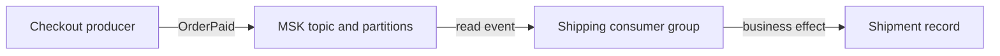

# Amazon MSK

## Purpose

Amazon Managed Streaming for Apache Kafka (MSK) runs Apache Kafka clusters
on AWS. Applications still use Kafka producers, topics, partitions, and
consumer groups to exchange events. MSK operates cluster infrastructure;
the application team still decides what an event means and what happens
when it is processed.[^msk-overview]

Start with [Kafka fundamentals](../../../databases/kafka/fundamentals.md)
if topics, partitions, and offsets are new. This page explains the AWS
service boundary and the questions to ask before connecting a workload.

## What AWS manages, and what you manage

Think of a parcel sorting center. AWS maintains the building and sorting
equipment; your team decides what goes in each parcel, which lane it takes,
who collects it, and what a successful delivery means. The analogy stops
at durability and ordering: Kafka is a distributed log with partition-local
order and retention rules, not a promise that each event causes exactly one
business action.

| Concern | MSK provides | Application or platform team decides |
| --- | --- | --- |
| Cluster | Create and update operations, broker management, and common broker recovery. | Cluster type, network access, capacity or quotas, and change windows. |
| Data | Kafka broker storage and Kafka APIs. | Topic design, partition keys, retention, schemas, replication needs, and client behavior. |
| Access | VPC connectivity and supported authentication options. | Which clients can connect and which principals may produce or consume. |
| Signals | Service and Kafka metrics. | Which lag, error, and user-outcome signals trigger action. |

MSK can replace much of the work of running Kafka brokers yourself. It
does not write producer retry logic, make a consumer's external side effect
repeat-safe, or confirm that an order was fulfilled. Those application
boundaries remain even when the cluster reports healthy.[^msk-overview]

## Provisioned or Serverless?

**MSK Provisioned** lets a team choose broker type and count and, for
Standard brokers, storage volumes. The team sizes and scales the cluster
with help from MSK's managed operations. **MSK Serverless** manages broker
capacity and scaling for the team, but its available Regions, quotas, and
supported access model still need checking for the workload. Serverless
requires IAM access control and does not support Kafka ACLs.
[^msk-provisioned][^msk-serverless][^msk-quotas]

The useful question is not which name sounds simpler. Check expected
throughput, retention, partitions, connectivity, authentication, Region,
limits, and cost model against current AWS documentation before selecting
a cluster type. No benchmark or price comparison was run for this page.

## Example: an order event

The shop, event, and sequence are invented. No Kafka cluster or application
was run.

1. The checkout service publishes an `OrderPaid` event to an MSK topic.
2. MSK brokers store the event according to the topic's configuration. A
   shipping consumer group reads it and tracks its own position.
3. The shipping application records the shipment in its own system. It
   must handle the possibility of reading an event again after a failure;
   MSK's broker management does not make that external action unique.
4. Operators watch both Kafka progress and the shipping outcome. A small
   offset gap alone does not prove that shipments were created correctly.

Text alternative: checkout publishes an `OrderPaid` event to a topic in
MSK. A shipping consumer group reads the event and creates a shipment
record outside Kafka. MSK manages the brokers in the middle; the producer
and consumer own the event contract and business result.

The [consumer groups, lag, and replay](../../../databases/kafka/consumer-groups-lag-and-replay.md)
guide explains why a consumer position is not proof of business completion.
The [delivery guarantees](../../../databases/kafka/delivery-guarantees-and-failure-handling.md)
guide explains the repeat-safe external effect.

## Connecting a client

For an MSK Provisioned cluster, clients are private to the cluster VPC by
default. A client in that VPC still needs a reachable network path and
security-group permission to the brokers. Clients in another VPC need a
supported connectivity design; simply knowing a bootstrap address is not
enough.[^msk-client-access]

The client must also use a compatible authentication method. With MSK IAM
access control, IAM authenticates the client and authorizes its Kafka
actions; Kafka ACLs do not authorize IAM identities. Match the client
library, cluster listener, and identity configuration before investigating
application-level produce or consume failures.[^msk-iam]

For an EKS application, this creates three separate questions: can the Pod
reach the broker network, can its workload identity authenticate and
perform the Kafka action, and does its producer or consumer behave
correctly? The [EKS-to-MSK applications](../../../cross-topic-guides/eks-to-msk-applications.md)
page follows that integration path.

## Reading the signals

Provisioned clusters publish Kafka and broker metrics to CloudWatch and
can support Prometheus monitoring. MSK publishes consumer lag metrics,
but a lag series may be absent for an unstable group, a group without a
committed offset, or a group name that cannot be represented as a CloudWatch
dimension. An absent chart therefore needs investigation before it can be
called zero lag.[^msk-monitoring][^msk-lag]

For the invented shipping flow, inspect producer failures, topic and broker
health, consumer-group position, consumer errors, and shipment records
together. The first failing boundary tells you where to look next.
Review client failover behavior and topic replication as part of
availability; broker replacement alone is not an application recovery
test.[^msk-standard-practices]

## Check your understanding

1. Which Kafka responsibilities move to AWS, and which remain with the
   checkout and shipping applications?
2. Why can a client know the bootstrap brokers but still fail to publish?
3. Why is a missing consumer-lag metric different from a measured zero?
4. What evidence shows that an `OrderPaid` event produced a shipment?
5. Which requirements would you check before choosing Serverless?

## Deeper study

- [What is Amazon MSK?](https://docs.aws.amazon.com/msk/latest/developerguide/what-is-msk.html)
  for its control-plane and Kafka data-plane boundary.
- [MSK Provisioned](https://docs.aws.amazon.com/msk/latest/developerguide/msk-provisioned.html),
  [MSK Serverless](https://docs.aws.amazon.com/msk/latest/developerguide/serverless.html),
  and [service quotas](https://docs.aws.amazon.com/msk/latest/developerguide/limits.html)
  for cluster-type selection.
- [Client access](https://docs.aws.amazon.com/msk/latest/developerguide/client-access.html)
  and [IAM access control](https://docs.aws.amazon.com/msk/latest/developerguide/iam-access-control.html)
  for connection and authorization.
- [Provisioned monitoring](https://docs.aws.amazon.com/msk/latest/developerguide/monitoring.html)
  and [consumer lag](https://docs.aws.amazon.com/msk/latest/developerguide/consumer-lag.html)
  for operational signals.

Continue to [Kafka operations](../../../databases/kafka/operations.md)
for symptom-based investigation. [Back to AWS databases](index.md) |
[Back to AWS index](../index.md)

[^msk-overview]: [Amazon MSK - What is Amazon MSK?](https://docs.aws.amazon.com/msk/latest/developerguide/what-is-msk.html).
[^msk-provisioned]: [Amazon MSK - MSK Provisioned](https://docs.aws.amazon.com/msk/latest/developerguide/msk-provisioned.html).
[^msk-serverless]: [Amazon MSK - MSK Serverless](https://docs.aws.amazon.com/msk/latest/developerguide/serverless.html).
[^msk-client-access]: [Amazon MSK - Client access](https://docs.aws.amazon.com/msk/latest/developerguide/client-access.html).
[^msk-iam]: [Amazon MSK - IAM access control](https://docs.aws.amazon.com/msk/latest/developerguide/iam-access-control.html).
[^msk-monitoring]: [Amazon MSK - Monitor a Provisioned cluster](https://docs.aws.amazon.com/msk/latest/developerguide/monitoring.html).
[^msk-lag]: [Amazon MSK - Monitor consumer lag](https://docs.aws.amazon.com/msk/latest/developerguide/consumer-lag.html).
[^msk-standard-practices]: [Amazon MSK - Standard broker best practices](https://docs.aws.amazon.com/msk/latest/developerguide/bestpractices.html).
[^msk-quotas]: [Amazon MSK - Service quotas](https://docs.aws.amazon.com/msk/latest/developerguide/limits.html).
