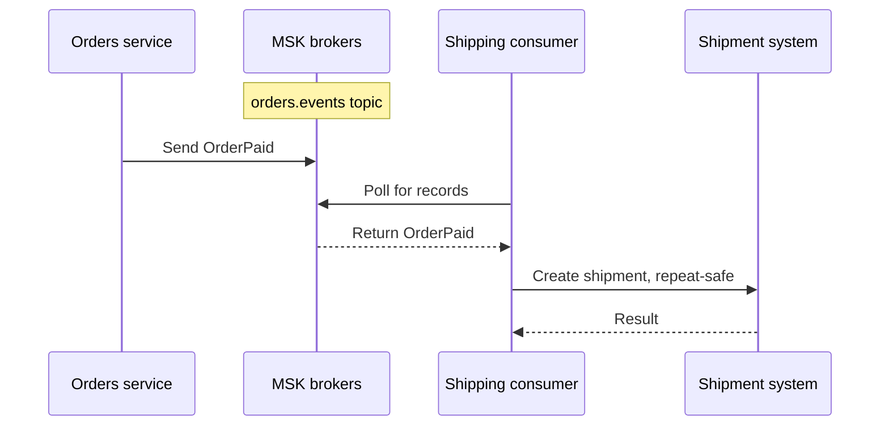

# Amazon MSK

## Purpose

Amazon Managed Streaming for Apache Kafka (MSK) runs Apache Kafka clusters
on AWS. Applications still use Kafka producers, topics, partitions, and
consumer groups to exchange events. MSK operates cluster infrastructure;
the application team still decides what an event means and what happens
when it is processed.[^msk-overview]

Start with [Kafka fundamentals](../../../databases/kafka/fundamentals.md)
if topics, partitions, and offsets are new. This page explains the AWS
service boundary and the questions to ask before connecting a workload.

## What AWS manages, and what you manage

Think of the notice board in [Kafka fundamentals](../../../databases/kafka/fundamentals.md).
AWS maintains the building and boards (brokers and storage). Your team
decides what to post, how to group notices, how long to keep them, and
which readers can access them. Readers still walk up to the board
themselves; a notice stays after one reader sees it. The analogy stops
at durability and ordering: Kafka is a distributed log with
partition-local order and retention rules, not a promise that each
event causes exactly one business action.

| Concern | MSK provides | Application or platform team decides |
| --- | --- | --- |
| Cluster | Create and update operations, broker management, and common broker recovery. | Cluster type, network access, broker capacity or service quota requests, and timing of changes the team starts. |
| Data | Kafka broker storage and Kafka APIs. | Topic design, partition keys, retention, schemas, replication needs where configurable, client behavior, and Standard broker storage sizing. |
| Access | VPC connectivity and supported authentication options. | Which clients can connect and which principals may produce or consume. |
| Signals | Service and Kafka metrics. | Which lag, error, and user-outcome signals trigger action. |

MSK can replace much of the work of running Kafka brokers yourself. It
does not write producer retry logic, make a consumer's external side effect
repeat-safe, or confirm that an order was fulfilled. Those application
boundaries remain even when the cluster reports healthy.[^msk-overview]

## Provisioned or Serverless?

**MSK Provisioned** lets a team choose broker type and count. With
**Standard brokers**, the team also provisions storage and watches its
capacity. **Express brokers** provide automatically scaling storage,
but the team still selects broker instances and checks Express-specific
features and quotas. **MSK Serverless** manages broker capacity and
scaling for the team, but its available Regions, quotas, and supported
access model still need checking for the workload. Serverless requires
IAM access control and does not support Kafka ACLs.
[^msk-provisioned][^msk-express][^msk-serverless][^msk-quotas]

The useful question is not which name sounds simpler. Check expected
throughput, retention, partitions, connectivity, authentication, Region,
limits, available Kafka versions, and cost model against current AWS
documentation before selecting a cluster type. Kafka features and
client defaults documented for a newer Apache release might not be
available on the version chosen for an MSK cluster. No benchmark or
price comparison was run for this page.[^msk-supported-versions]

## Example: an order event

The shop, event, and sequence are invented. No Kafka cluster or application
was run.

1. The orders service publishes an `OrderPaid` event to the
   `orders.events` topic in MSK.
2. MSK brokers store the event according to the topic's configuration. A
   shipping consumer group reads it and tracks its own position.
3. The shipping application records the shipment in its own system. It
   must handle the possibility of reading an event again after a failure;
   MSK's broker management does not make that external action unique.
4. Operators watch both Kafka progress and the shipping outcome. Small
   consumer lag alone does not prove that shipments were created correctly.

Text alternative: the orders service publishes an `OrderPaid` event to
the `orders.events` topic in MSK. A shipping consumer polls the brokers
and receives the stored
event; the brokers do not push it to an idle consumer. The application
then creates a shipment record outside Kafka and checks the result. MSK
manages the brokers in the middle; the producer and consumer own the
event contract and business result.

The [consumer groups, lag, and replay](../../../databases/kafka/consumer-groups-lag-and-replay.md)
guide explains why a consumer position is not proof of business completion.
The [delivery guarantees](../../../databases/kafka/delivery-guarantees-and-failure-handling.md)
guide explains the repeat-safe external effect.

## Connecting a client

For an MSK Provisioned cluster, broker connections are VPC-private by
default. A client in that VPC still needs a reachable network path and
security-group permission to the brokers. Clients in another VPC need a
supported connectivity design, such as VPC peering or MSK multi-VPC
private connectivity; simply knowing a bootstrap address is not
enough.[^msk-client-access][^msk-cross-vpc]

Serverless also uses private VPC connectivity. Check the VPCs, subnets,
and security groups selected for that cluster when planning client
access.[^msk-serverless-connectivity]

The bootstrap list starts a connection. The client discovers the other
broker addresses it needs for partition leaders and group coordination;
DNS, routes, ports, and security rules must permit those connections
too. Reaching one bootstrap broker does not prove that every produce or
consume request can succeed.[^msk-bootstrap]

The client must also use the authentication method of its listener. MSK
Provisioned can offer IAM, SASL/SCRAM, mutual TLS, or unauthenticated
access, depending on its security settings. With MSK IAM, AWS
credentials authenticate the client and IAM authorizes Kafka actions;
Kafka ACLs do not authorize IAM identities. With SASL/SCRAM or mutual
TLS, the client presents a password or certificate; Kafka ACL rules and
their defaults determine authorization. Match the client library,
listener, and credentials before investigating application-level
failures. Serverless requires IAM.
[^msk-iam][^msk-security-settings][^msk-acls][^msk-serverless]

For an EKS application, this creates three separate questions: can the Pod
reach the broker network, can its workload identity authenticate and
perform the Kafka action, and does its producer or consumer behave
correctly? The [EKS-to-MSK applications](../../../cross-topic-guides/eks-to-msk-applications.md)
page follows that integration path.

## Reading the signals

Provisioned clusters publish Kafka and broker metrics to CloudWatch and
can support Prometheus monitoring. Serverless has its own CloudWatch
metrics. Both offer consumer-lag signals: lag compares a group's
committed offset
with newer records in a topic, so it tracks Kafka progress, not a
shipment result. A Provisioned lag series may be absent for an unstable
group, a group without a committed offset, or a group name with a colon
or non-ASCII characters. An absent chart needs investigation before it
can be called zero lag.[^msk-monitoring][^msk-serverless-monitoring]
[^msk-lag]

For the invented shipping flow, inspect producer failures, topic and broker
health, consumer-group position, consumer errors, and shipment records
together. The first failing boundary tells you where to look next.
Review client failover behavior and topic replication as part of
availability. For Standard brokers, AWS recommends a topic replication
factor of at least 3 and `min.insync.replicas` no higher than one less
than that factor so a rolling change can leave room for an `acks=all`
producer to write. During Standard broker patching, MSK restarts
brokers one at a time and moves partition leadership; clients may
reconnect. Broker replacement alone is not an application recovery
test.
[^msk-standard-practices][^msk-patching]

## Check your understanding

1. Which Kafka responsibilities move to AWS, and which remain with the
   orders and shipping applications?
2. Why can a client know the bootstrap brokers but still fail to publish?
3. Why is a missing consumer-lag metric different from a measured zero?
4. What evidence shows that an `OrderPaid` event produced a shipment?
5. Which requirements would you check before choosing Serverless?

## Deeper study

- [What is Amazon MSK?](https://docs.aws.amazon.com/msk/latest/developerguide/what-is-msk.html)
  for its control-plane and Kafka data-plane boundary.
- [MSK Provisioned](https://docs.aws.amazon.com/msk/latest/developerguide/msk-provisioned.html),
  [MSK Serverless](https://docs.aws.amazon.com/msk/latest/developerguide/serverless.html),
  and [service quotas](https://docs.aws.amazon.com/msk/latest/developerguide/limits.html)
  for cluster-type selection.
- [Supported Kafka versions](https://docs.aws.amazon.com/msk/latest/developerguide/supported-kafka-versions.html)
  for feature availability on the chosen broker type.
- [Express broker capabilities](https://docs.aws.amazon.com/msk/latest/developerguide/msk-broker-types-express.html)
  and [Standard broker best practices](https://docs.aws.amazon.com/msk/latest/developerguide/bestpractices.html)
  for storage and rolling-change decisions.
- [Client access](https://docs.aws.amazon.com/msk/latest/developerguide/client-access.html)
  and [IAM access control](https://docs.aws.amazon.com/msk/latest/developerguide/iam-access-control.html)
  for connection and authorization.
- [Provisioned monitoring](https://docs.aws.amazon.com/msk/latest/developerguide/monitoring.html),
  [Serverless monitoring](https://docs.aws.amazon.com/msk/latest/developerguide/serverless-monitoring.html),
  and [consumer lag](https://docs.aws.amazon.com/msk/latest/developerguide/consumer-lag.html)
  for operational signals.

Continue to [Kafka operations](../../../databases/kafka/operations.md)
for symptom-based investigation. [Back to AWS databases](index.md) |
[Back to AWS index](../index.md)

[^msk-overview]: [Amazon MSK - What is Amazon MSK?](https://docs.aws.amazon.com/msk/latest/developerguide/what-is-msk.html).
[^msk-provisioned]: [Amazon MSK - MSK Provisioned](https://docs.aws.amazon.com/msk/latest/developerguide/msk-provisioned.html).
[^msk-express]: [Amazon MSK - Express brokers](https://docs.aws.amazon.com/msk/latest/developerguide/msk-broker-types-express.html).
[^msk-serverless]: [Amazon MSK - MSK Serverless](https://docs.aws.amazon.com/msk/latest/developerguide/serverless.html).
[^msk-serverless-connectivity]: [Amazon MSK - Create a Serverless cluster](https://docs.aws.amazon.com/msk/latest/developerguide/create-serverless-cluster.html).
[^msk-client-access]: [Amazon MSK - Client access](https://docs.aws.amazon.com/msk/latest/developerguide/client-access.html).
[^msk-cross-vpc]: [Amazon MSK - Access outside the cluster VPC](https://docs.aws.amazon.com/msk/latest/developerguide/aws-access.html).
[^msk-bootstrap]: [Amazon MSK - Bootstrap brokers](https://docs.aws.amazon.com/msk/latest/developerguide/msk-get-bootstrap-brokers.html).
[^msk-iam]: [Amazon MSK - IAM access control](https://docs.aws.amazon.com/msk/latest/developerguide/iam-access-control.html).
[^msk-security-settings]: [Amazon MSK - Update security settings](https://docs.aws.amazon.com/msk/latest/developerguide/msk-update-security.html).
[^msk-acls]: [Amazon MSK - Apache Kafka ACLs](https://docs.aws.amazon.com/msk/latest/developerguide/msk-acls.html).
[^msk-monitoring]: [Amazon MSK - Monitor a Provisioned cluster](https://docs.aws.amazon.com/msk/latest/developerguide/monitoring.html).
[^msk-serverless-monitoring]: [Amazon MSK - Monitor Serverless clusters](https://docs.aws.amazon.com/msk/latest/developerguide/serverless-monitoring.html).
[^msk-lag]: [Amazon MSK - Monitor consumer lag](https://docs.aws.amazon.com/msk/latest/developerguide/consumer-lag.html).
[^msk-standard-practices]: [Amazon MSK - Standard broker best practices](https://docs.aws.amazon.com/msk/latest/developerguide/bestpractices.html).
[^msk-patching]: [Amazon MSK - Patching on Provisioned clusters](https://docs.aws.amazon.com/msk/latest/developerguide/patching-impact.html).
[^msk-quotas]: [Amazon MSK - Service quotas](https://docs.aws.amazon.com/msk/latest/developerguide/limits.html).
[^msk-supported-versions]: [Amazon MSK - Supported Kafka versions](https://docs.aws.amazon.com/msk/latest/developerguide/supported-kafka-versions.html).
