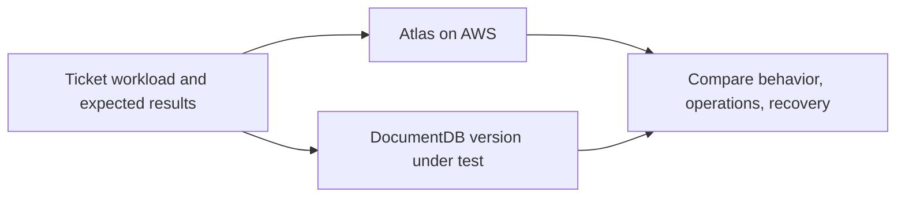

# DocumentDB vs. MongoDB Atlas

## Purpose

Amazon DocumentDB and MongoDB Atlas can both serve a document application
on AWS, but they are different products. **Atlas runs MongoDB**, managed by
MongoDB. **DocumentDB runs an AWS database engine** that implements
supported MongoDB APIs. The first question is whether the application gets
the behavior it needs; ownership, networking, recovery, and cost follow
from that test.[^atlas-clusters][^docdb-how-it-works]
[^docdb-compatibility]

Read [MongoDB on AWS](mongodb-on-aws.md) first if you are also considering
self-managed MongoDB. This page compares only the two managed paths.

## A compatible door is not the whole room

Imagine two workshops that accept the same order form. Their tools,
workflow, and timing may still differ. A MongoDB driver connecting to
DocumentDB is like the order form being accepted: it proves a first
interface works, not that every query, index, transaction, or performance
assumption has the same result. The analogy stops there; the actual
differences are versioned database behavior, not craftsmanship.

AWS currently documents DocumentDB compatibility with MongoDB 4.0, 5.0,
and 8.0 APIs. Its [supported API list](https://docs.aws.amazon.com/documentdb/latest/devguide/mongo-apis.html)
and [functional differences](https://docs.aws.amazon.com/documentdb/latest/devguide/functional-differences.html)
must be checked for the chosen engine version. AWS notes, for example,
that `explain()` output and query plans can differ from MongoDB because
DocumentDB uses its own storage engine. A feature absent in an older
DocumentDB version may be present in a newer one; do not make a
version-free “supported” or “unsupported” claim.[^docdb-compatibility]
[^docdb-supported-apis][^docdb-differences]

| Question | DocumentDB | Atlas on AWS |
| --- | --- | --- |
| Database behavior | A MongoDB-compatible AWS engine; test required commands and semantics against the selected version. | MongoDB under Atlas management; test the selected MongoDB version and tier. |
| Network boundary | Cluster is inside an AWS VPC; plan client reachability and database access. | Atlas project access and a route from the AWS application; supported dedicated clusters can use AWS PrivateLink. |
| Recovery | AWS-managed backups and point-in-time restore within configured retention. | Atlas backup and restore capabilities depend on deployment and policy. |
| Operations | AWS owns service infrastructure; the team owns application behavior and configuration. | MongoDB owns Atlas service operations; the team owns application behavior and configuration. |

The table describes decision boundaries, not tested equivalence.
DocumentDB's VPC placement and Atlas private endpoints are different
network designs. A private endpoint is not available on every Atlas tier.
Both products still need reviewed credentials, access rules, and a
restore exercise.[^docdb-vpc][^atlas-private-endpoints]
[^docdb-backups][^atlas-backups]

## Example: the ticket list

The ticket application, dataset, and evaluation below are invented. No
database, query, failover, restore, or cost test was run.

A support team stores tickets and shows one customer's open tickets in
newest-first order. The team also updates tickets with comments and
publishes changes to another application. It needs an agreed recovery
window after accidental deletion. A useful comparison records:

1. The exact read and write operations, indexes, aggregation stages,
   transaction and change-stream use, and expected results.
2. The intended DocumentDB engine and Atlas MongoDB versions, driver
   versions, and deployment tiers.
3. The AWS application network path and credentials for each candidate.
4. Identical representative data and workload measurements, including
   result correctness, query plans, latency, and failure behavior.
5. A restored copy that the application can read, with observed recovery
   time and recovered data position.

Text alternative: the same ticket workload and expected results are run
against a selected Atlas deployment and a selected DocumentDB version.
The team compares behavior, operating work, and recovery evidence before
choosing. The diagram is a test design, not a claim that either system was
tested.

If a query returns the same ticket list on both candidates, the next
question is whether it continues to do so at the expected scale and after
failover. If a result differs, inspect the exact command and version
against the official compatibility documentation before treating it as
a configuration issue.[^docdb-supported-apis][^docdb-differences]

## How to choose from the evidence

- If exact MongoDB server behavior or a MongoDB-specific feature is a firm
  requirement, Atlas is the managed MongoDB candidate. Confirm the
  selected Atlas version and tier meet the requirement.
- If the application only needs behavior DocumentDB supports and the
  organization prefers AWS service ownership, DocumentDB is a candidate
  after representative compatibility and performance tests.
- If either candidate fails the network, recovery, compliance, or measured
  cost requirements, revisit the architecture rather than forcing a
  favorable row in a comparison chart.

For both choices, a backup configuration is only a promise of a recovery
path. Restore a test cluster, reconnect the application, and check the
records the user needs. DocumentDB and Atlas document different restore
workflows and constraints.[^docdb-backups][^atlas-backups][^atlas-restore]

## Check your understanding

1. Why is a successful MongoDB-driver connection too weak to settle the
   DocumentDB compatibility question?
2. Which DocumentDB documents should you read for the exact engine version?
3. What network difference matters when an AWS application connects to
   Atlas rather than a DocumentDB cluster?
4. Which observations, beyond a green backup status, would show recovery
   is usable?

## Deeper study

- [DocumentDB compatibility](https://docs.aws.amazon.com/documentdb/latest/devguide/compatibility.html),
  [supported APIs](https://docs.aws.amazon.com/documentdb/latest/devguide/mongo-apis.html),
  and [functional differences](https://docs.aws.amazon.com/documentdb/latest/devguide/functional-differences.html)
  for version-specific behavior.
- [DocumentDB VPC access](https://docs.aws.amazon.com/documentdb/latest/devguide/connect-from-outside-a-vpc.html)
  and [backup and restore](https://docs.aws.amazon.com/documentdb/latest/devguide/backup_restore.html)
  for deployment boundaries.
- [Atlas clusters](https://www.mongodb.com/docs/atlas/manage-clusters/),
  [private endpoints](https://www.mongodb.com/docs/atlas/security-private-endpoint/),
  and [restore](https://www.mongodb.com/docs/atlas/backup/cloud-backup/restore-overview/)
  for the managed MongoDB candidate.

Continue to [MongoDB operations](../../../databases/mongodb/operations.md)
for symptom-based checks. [Back to AWS databases](index.md) |
[Back to AWS index](../index.md)

[^docdb-compatibility]: [Amazon DocumentDB - MongoDB compatibility](https://docs.aws.amazon.com/documentdb/latest/devguide/compatibility.html).
[^docdb-supported-apis]: [Amazon DocumentDB - Supported MongoDB APIs](https://docs.aws.amazon.com/documentdb/latest/devguide/mongo-apis.html).
[^docdb-differences]: [Amazon DocumentDB - Functional differences](https://docs.aws.amazon.com/documentdb/latest/devguide/functional-differences.html).
[^docdb-how-it-works]: [Amazon DocumentDB - How it works](https://docs.aws.amazon.com/documentdb/latest/devguide/how-it-works.html).
[^docdb-vpc]: [Amazon DocumentDB - Connect from outside a VPC](https://docs.aws.amazon.com/documentdb/latest/devguide/connect-from-outside-a-vpc.html).
[^docdb-backups]: [Amazon DocumentDB - Backup and restore](https://docs.aws.amazon.com/documentdb/latest/devguide/backup_restore.html).
[^atlas-clusters]: [MongoDB Atlas - Manage clusters](https://www.mongodb.com/docs/atlas/manage-clusters/).
[^atlas-private-endpoints]: [MongoDB Atlas - Private endpoints](https://www.mongodb.com/docs/atlas/security-private-endpoint/).
[^atlas-backups]: [MongoDB Atlas - Dedicated cluster backups](https://www.mongodb.com/docs/atlas/backup/cloud-backup/dedicated-cluster-backup/).
[^atlas-restore]: [MongoDB Atlas - Restore a cluster](https://www.mongodb.com/docs/atlas/backup/cloud-backup/restore-overview/).
