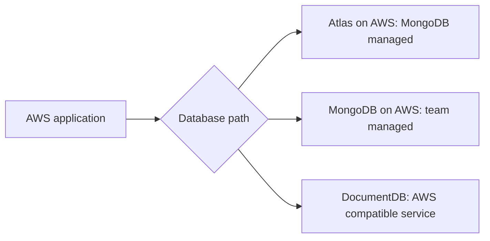

# MongoDB on AWS

## Purpose

An application on AWS can use **MongoDB Atlas hosted on AWS**,
**self-managed MongoDB on AWS**, or **Amazon DocumentDB**. The first two
run MongoDB; DocumentDB is an AWS database with compatibility for selected
MongoDB APIs. The application's actual queries, indexes, and operational
needs decide which paths deserve a trial.[^atlas-providers][^docdb-overview]
[^docdb-compatibility]

Start with [MongoDB fundamentals](../../../databases/mongodb/fundamentals.md)
if documents, collections, and indexes are new. This page helps narrow a
hosting choice; [DocumentDB vs. MongoDB Atlas](documentdb-vs-mongodb-atlas.md)
shows how to compare the two managed options in detail.

## One application, three ownership models

Think of a workshop. With Atlas, MongoDB operates the workshop on selected
cloud infrastructure. With self-managed MongoDB, your team operates the
workshop and its equipment. DocumentDB is an AWS-operated workshop with a
MongoDB-compatible entrance, but equipment and behavior must be checked
for the work you intend to do. The analogy ends there: a database engine
and its query semantics cannot be judged by the workshop name.

| Path | Who operates the database? | What the team must still decide |
| --- | --- | --- |
| MongoDB Atlas on AWS | MongoDB manages the Atlas deployment. | Cluster tier and Region, application access, backup policy, and restore test. |
| Self-managed MongoDB on AWS | Your team runs MongoDB on chosen AWS compute. | Replica-set or sharding design, patching, security, monitoring, backups, restore, and on-call. |
| Amazon DocumentDB | AWS runs a MongoDB-compatible database service. | Engine version, supported APIs and behavior, networking, backup policy, and migration test. |

Atlas supports AWS deployment and other cloud providers; a cluster on AWS
still has Atlas project and network configuration. Private endpoints are
available for supported dedicated clusters, not every tier. Self-management
offers direct control of the MongoDB deployment but also assigns its
production and security work to the team. DocumentDB's current compatibility
includes MongoDB 4.0, 5.0, and 8.0 API versions; the chosen DocumentDB
engine version and documented functional differences matter more than the
word “compatible.”[^atlas-providers][^atlas-private-endpoints]
[^mongo-production][^mongo-security][^docdb-compatibility]

Text alternative: an AWS application has three candidate paths. Atlas on
AWS runs MongoDB under MongoDB's management; self-managed MongoDB runs
under the team's management; DocumentDB is an AWS-managed compatible
service. The diagram shows options to evaluate, not three databases to
write to at once.

## Example: a support ticket application

The ticket application and its requirements below are invented. No cluster,
query, cost estimate, or restore was tested.

The application stores a ticket, lists a customer's open tickets in
newest-first order, adds comments, and sends a change event to another
system. The team also has a recovery target for accidental deletion.
Before selecting a path, it records the exact query shapes and indexes,
comment growth, transaction or change-stream use, expected traffic,
connection location, and restore target.

For Atlas and self-managed MongoDB, the team tests the workload against
the MongoDB version it plans to run. For DocumentDB, it first checks the
chosen engine's supported APIs and functional differences, then runs
representative reads, writes, indexes, and failure tests. Different
`explain()` output and query plans are one documented reason to measure
the workload rather than assuming the same performance.[^docdb-differences]

## A decision sequence

1. **Fix the required behavior.** Write down the application's real
   commands, aggregation stages, index needs, transactions, change streams,
   and expected read/write semantics. Keep a small test dataset and expected
   results. See [MongoDB data modeling](../../../databases/mongodb/data-modeling.md)
   for shaping documents before hosting them.
2. **Choose the ownership boundary.** Decide who can run upgrades, inspect
   failures, rotate credentials, and respond outside business hours.
   Self-management is a deliberate operating commitment, not just a
   cheaper-looking line item.[^mongo-production][^mongo-security]
3. **Prove access and recovery.** Trace application-to-database networking
   and authentication. Configure the chosen backup policy and restore a
   representative dataset into a test environment. Atlas and DocumentDB
   offer managed backup features; their tier, retention, and restore
   behavior differ. A backup setting alone is not a completed restore
   exercise.[^atlas-clusters][^docdb-backups][^mongo-backups]
4. **Compare observed outcomes.** Run the same ticket workload against
   viable candidates with measured latency, correctness, failure behavior,
   operational effort, and current total cost. A provider feature list
   does not substitute for this evidence.

If the application requires exact MongoDB behavior, start with Atlas or
self-managed MongoDB. If it only needs the documented API subset and the
team prefers AWS service ownership, DocumentDB can be a candidate after
compatibility and workload tests. Neither sentence is a universal winner.

## Check your understanding

1. Which two paths run MongoDB, and which uses a compatible AWS engine?
2. What work does the team inherit with self-managed MongoDB?
3. Why is “the driver connects” too weak to prove DocumentDB fit?
4. What would a restore exercise reveal that a backup configuration cannot?

## Deeper study

- [Atlas cloud providers](https://www.mongodb.com/docs/atlas/reference/cloud-providers/),
  [cluster management](https://www.mongodb.com/docs/atlas/manage-clusters/),
  and [private endpoints](https://www.mongodb.com/docs/atlas/security-private-endpoint/)
  for Atlas deployment on AWS.
- [Self-managed production notes](https://www.mongodb.com/docs/manual/administration/production-notes/),
  [security checklist](https://www.mongodb.com/docs/manual/administration/security-checklist/),
  and [backup methods](https://www.mongodb.com/docs/v8.0/core/backups/)
  for the responsibilities of running MongoDB yourself.
- [DocumentDB compatibility](https://docs.aws.amazon.com/documentdb/latest/devguide/compatibility.html),
  [functional differences](https://docs.aws.amazon.com/documentdb/latest/devguide/functional-differences.html),
  and [backup and restore](https://docs.aws.amazon.com/documentdb/latest/devguide/backup_restore.html)
  for the AWS-managed candidate.

Continue to [DocumentDB vs. MongoDB Atlas](documentdb-vs-mongodb-atlas.md)
for a focused managed-service evaluation.
[Back to AWS databases](index.md) | [Back to AWS index](../index.md)

[^atlas-providers]: [MongoDB Atlas - Cloud providers](https://www.mongodb.com/docs/atlas/reference/cloud-providers/).
[^atlas-clusters]: [MongoDB Atlas - Manage clusters](https://www.mongodb.com/docs/atlas/manage-clusters/).
[^atlas-private-endpoints]: [MongoDB Atlas - Private endpoints](https://www.mongodb.com/docs/atlas/security-private-endpoint/).
[^mongo-production]: [MongoDB - Self-managed production notes](https://www.mongodb.com/docs/manual/administration/production-notes/).
[^mongo-security]: [MongoDB - Self-managed security checklist](https://www.mongodb.com/docs/manual/administration/security-checklist/).
[^mongo-backups]: [MongoDB - Self-managed backup methods](https://www.mongodb.com/docs/v8.0/core/backups/).
[^docdb-overview]: [Amazon DocumentDB - How it works](https://docs.aws.amazon.com/documentdb/latest/devguide/how-it-works.html).
[^docdb-compatibility]: [Amazon DocumentDB - MongoDB compatibility](https://docs.aws.amazon.com/documentdb/latest/devguide/compatibility.html).
[^docdb-differences]: [Amazon DocumentDB - Functional differences](https://docs.aws.amazon.com/documentdb/latest/devguide/functional-differences.html).
[^docdb-backups]: [Amazon DocumentDB - Backup and restore](https://docs.aws.amazon.com/documentdb/latest/devguide/backup_restore.html).
