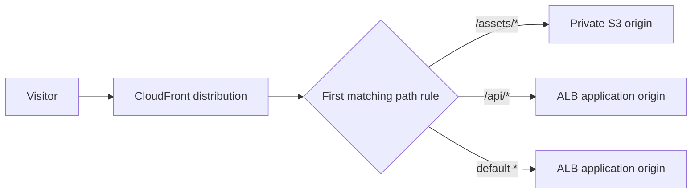

# CloudFront

## Purpose

Amazon CloudFront is AWS's content delivery network (CDN). It receives a
visitor's request at an edge location, chooses an origin when it needs the
response, and may reuse a cached copy for later requests. An **origin** is the
application or storage that holds the original content.[^cloudfront-how-it-works]

This page helps you read a CloudFront distribution as a set of request-routing
and protection decisions. For the general cache model, start with
[CDN and edge fundamentals](../../edge/cdn-and-edge-fundamentals.md).

## Why the distribution matters

A **distribution** is the CloudFront configuration for a site. It connects a
public hostname to one or more origins and says how matching request paths
are handled. A site may need different handling for versioned images, public
pages, and signed-in API responses. One rule for all three can accidentally
cache private data or send a request to the wrong backend.

Think of the distribution as a **reception desk with a route sheet**. The desk
checks the requested path, selects the appropriate backend, and may answer
from a copy already at hand. The analogy has limits: CloudFront operates at
many edge locations, a cache hit never reaches the origin, and path matching
is affected by exact rules and their order rather than human judgement.

| Part | Simple meaning | Question it answers |
| --- | --- | --- |
| Alternate domain name and certificate | The site name, such as `learn.example.org`, and proof CloudFront may serve it over TLS. | Which public name do visitors use? |
| Origin | S3 storage or an application endpoint that provides the response on a miss. | Where does the original come from? |
| Cache behavior | A path pattern plus the origin and policies to apply. | Which rule handles this URL? |
| Cache policy | The cache key and minimum, default, and maximum lifetime. | May two requests reuse one stored response, and for how long? |
| Origin request policy | Additional headers, cookies, or query strings sent to the origin on a miss without entering the cache key. | What does the origin need to receive? |

CloudFront tests non-default cache behaviors in their listed order and uses
the **first matching** path pattern. The default `*` behavior catches what
remains. A broad rule placed before a sensitive one can select the wrong
origin or access policy; AWS specifically warns that overlapping patterns can
expose content intended to require signed URLs.[^cloudfront-cache-behaviors]
Cache and origin request policies are separate, though values placed in the
cache key are automatically forwarded to the origin.[^cloudfront-cache-policy][^cloudfront-origin-request-policy]

## Example: one site, two origins

This site and its routes are invented. The table illustrates a possible
distribution; no CloudFront configuration or request was run.

| Order | Path pattern | Origin | Intended handling |
| --- | --- | --- | --- |
| 1 | `/assets/*` | Private S3 bucket | Public, versioned assets can use a longer cache lifetime. |
| 2 | `/api/*` | Application Load Balancer (ALB) | Signed-in responses use a no-cache policy. |
| Default | `*` | ALB | Application pages follow their own response and cache rules. |

When someone requests `/assets/logo-v3.svg`, the first rule selects S3. A
usable copy can return from the edge; a miss goes to S3. A request for
`/api/orders` skips the first rule, selects the ALB, and must not reuse
another person's orders. A request for `/shop` reaches the default rule.
Path patterns choose an origin and behaviour; they do not prove that content
is public or that an authenticated response is safe to cache.

Text alternative: a visitor reaches the CloudFront distribution. The first
matching path rule sends an asset request to S3, an API request to the ALB,
and any remaining request to the default ALB behaviour. A cache hit may be
answered before an origin is contacted. The diagram helps a reader check
which rule takes precedence.

## Protect each connection and origin

- **Viewer to CloudFront.** A custom site hostname needs an alternate domain
  name, a matching certificate, and DNS pointing at the distribution. AWS's
  CloudFront domain guidance places an ACM certificate used for this purpose
  in `us-east-1`.[^cloudfront-alternate-domain] Set the viewer protocol policy
  for each behaviour according to whether the site requires HTTPS.
- **CloudFront to an application origin.** This is a separate connection.
  For a custom origin, an HTTPS-only origin protocol policy tells CloudFront
  to use HTTPS even if the visitor connection used another protocol. An
  invalid origin certificate causes CloudFront to drop the TLS connection.
  Do not assume HTTPS at the viewer also guarantees HTTPS to the
  origin.[^cloudfront-origin-protocol]
- **CloudFront to S3.** For a regular S3 bucket, origin access control (OAC)
  lets CloudFront sign requests. A bucket policy can grant the CloudFront
  service principal access scoped to the distribution while direct public
  access stays closed. OAC does not apply to an S3 website endpoint, which is
  configured as a custom origin.[^cloudfront-s3-oac]
- **Edge filtering.** An AWS WAF web ACL can be associated with a CloudFront
  distribution to filter requests before they reach the application. It is
  an additional control, not a replacement for application authorization or
  origin access rules.[^cloudfront-waf]

For the full response-sharing and bypass model, use
[CDN caching and origin protection](../../edge/cdn-caching-and-origin-protection.md).
That guide explains why an origin's `private` header alone may not prevent
CloudFront caching under a positive minimum TTL.

## Observe the result

CloudFront access logs record details of viewer requests, including paths and
responses, and can help investigate wrong routing or cache behaviour. AWS
describes standard logs as **best effort**: a record can arrive late and, in
rare cases, be missing. Do not treat log counts alone as a complete request
ledger.[^cloudfront-logging] A safe deployment check would compare a small
set of public, private, and direct-origin requests with the intended policies
and origin logs. This page does not claim that such a check was performed.

## Check your understanding

1. Which behaviour handles `/api/orders` in the example, and what would
   happen if a broader pattern appeared first?
2. Why do the viewer HTTPS policy and the origin protocol policy need
   separate review?
3. What does OAC protect for the S3 origin, and what cache mistake would it
   leave unsolved?

## Deeper study

- [How CloudFront delivers content](https://docs.aws.amazon.com/AmazonCloudFront/latest/DeveloperGuide/HowCloudFrontWorks.html)
  for the edge-to-origin request flow.
- [Cache behavior settings](https://docs.aws.amazon.com/AmazonCloudFront/latest/DeveloperGuide/DownloadDistValuesCacheBehavior.html)
  for ordered path patterns and per-behaviour policies.
- [Add an alternate domain name](https://docs.aws.amazon.com/AmazonCloudFront/latest/DeveloperGuide/CreatingCNAME.html)
  and [custom-origin protocol behaviour](https://docs.aws.amazon.com/AmazonCloudFront/latest/DeveloperGuide/RequestAndResponseBehaviorCustomOrigin.html)
  for the two TLS connections.
- [Restrict access to an S3 origin](https://docs.aws.amazon.com/AmazonCloudFront/latest/DeveloperGuide/private-content-restricting-access-to-s3.html)
  and [use AWS WAF protections](https://docs.aws.amazon.com/AmazonCloudFront/latest/DeveloperGuide/distribution-web-awswaf.html)
  for two distinct protection layers.
- [CloudFront access logs](https://docs.aws.amazon.com/AmazonCloudFront/latest/DeveloperGuide/AccessLogs.html)
  for investigation and delivery limits.

For an EKS application behind an ALB, continue to
[CDN in front of EKS](../../../cross-topic-guides/cdn-in-front-of-eks.md).
For a provider choice, see [Akamai vs. CloudFront](../../edge/akamai-vs-cloudfront.md).
[Back to AWS networking](index.md) | [Back to AWS index](../index.md)

[^cloudfront-how-it-works]: [Amazon CloudFront - How CloudFront delivers content](https://docs.aws.amazon.com/AmazonCloudFront/latest/DeveloperGuide/HowCloudFrontWorks.html).
[^cloudfront-cache-behaviors]: [Amazon CloudFront - Cache behavior settings](https://docs.aws.amazon.com/AmazonCloudFront/latest/DeveloperGuide/DownloadDistValuesCacheBehavior.html).
[^cloudfront-cache-policy]: [Amazon CloudFront - Understand cache policies](https://docs.aws.amazon.com/AmazonCloudFront/latest/DeveloperGuide/cache-key-understand-cache-policy.html).
[^cloudfront-origin-request-policy]: [Amazon CloudFront - Control origin requests with a policy](https://docs.aws.amazon.com/AmazonCloudFront/latest/DeveloperGuide/controlling-origin-requests.html).
[^cloudfront-alternate-domain]: [Amazon CloudFront - Add an alternate domain name](https://docs.aws.amazon.com/AmazonCloudFront/latest/DeveloperGuide/CreatingCNAME.html).
[^cloudfront-origin-protocol]: [Amazon CloudFront - Request and response behavior for custom origins](https://docs.aws.amazon.com/AmazonCloudFront/latest/DeveloperGuide/RequestAndResponseBehaviorCustomOrigin.html).
[^cloudfront-s3-oac]: [Amazon CloudFront - Restrict access to an Amazon S3 origin](https://docs.aws.amazon.com/AmazonCloudFront/latest/DeveloperGuide/private-content-restricting-access-to-s3.html).
[^cloudfront-waf]: [Amazon CloudFront - Use AWS WAF protections](https://docs.aws.amazon.com/AmazonCloudFront/latest/DeveloperGuide/distribution-web-awswaf.html).
[^cloudfront-logging]: [Amazon CloudFront - Access logs](https://docs.aws.amazon.com/AmazonCloudFront/latest/DeveloperGuide/AccessLogs.html).
