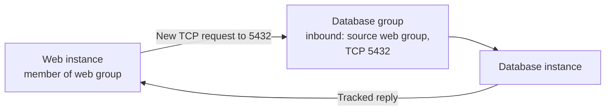

# Security groups

## The idea in plain language

An AWS **security group** is a set of rules for network traffic entering
or leaving its associated resource, such as an EC2 instance. An inbound
rule answers which new requests may reach it; an outbound rule answers
which new traffic it may send. Rules allow traffic. Security groups do not
have explicit deny rules.[^aws-sg][^aws-sg-rules]

Think of a room with a guest list. One list might admit a web server to a
database room, while another admits users to the web room. The analogy has
limits: a security group checks network source, protocol, port, and
direction; it does not authenticate a user, ensure that an application is
listening, or make a broken route work.

## Follow one application request

Imagine a web application and a database in the same VPC. The database
listens on TCP port 5432. The following groups and traffic are
illustrative; no AWS resources were created or tested.

Text alternative: the web instance sends a new request to database port
5432. The database security group has an inbound rule that names the web
security group as its source, so member instances can send traffic on that
port when the network path permits it. The database's reply to an allowed
request is tracked. This diagram helps you check both the right destination
group and the intended source membership.[^aws-sg-rules][^aws-sg]

The group reference does **not** copy the web group's own rules into the
database group. It names the private IP addresses of resources associated
with that source group for the specified direction, protocol, and port.
Referencing another group does not, by itself, create a route or open every
port. AWS documents extra conditions and a middlebox limitation for group
references across VPCs.[^aws-sg-rules]

## Read a rule without guessing

| Part | Question to ask |
| --- | --- |
| Direction | Is this a new inbound request or new outbound traffic? |
| Protocol and port | Is it the protocol and destination port the service actually uses? |
| Source or destination | Is the expected IP range, prefix list, or group identified? |
| Association | Is this group attached to the resource receiving or sending traffic? |

Multiple groups associated with one resource contribute their allow rules
together. A non-default group created directly in AWS starts with no inbound
allow rules and an outbound allow-all rule. The VPC's **default** group is
different: it initially allows inbound traffic from other resources in that
same group.[^aws-sg-rules][^aws-default-sg] When Terraform's AWS provider
creates `aws_security_group`, it removes AWS's initial outbound allow-all
rule. Outbound traffic then depends on the egress rules you explicitly define,
inline or as separate rule resources.[^terraform-aws-sg] Inspect the group's
actual rules instead of assuming a creation default still applies.

The fact that a packet passes a security group says only that this network
control allowed it. A subnet network ACL, route, host firewall, or
application can still stop the connection. See [stateful
networking](stateful-networking.md) for how the ACL and security group treat
reply traffic differently.[^aws-vpc-security]

## If access fails

Use the intended source, destination, protocol, and port to narrow the
question before changing a rule:

1. Confirm the actual resource and its associated security groups.
2. Check the destination group's inbound rule for the new request and the
   source group's outbound rules; a Terraform-created group may have no egress
   rule at all.
3. If a rule references a group, confirm the source resource is associated
   with that group and the reference is valid for the VPC relationship.
4. If those checks match, inspect routes, network ACLs, the destination
   listener, and host controls. Do not treat an allow rule as proof that
   traffic arrived or that the application accepted it.

These are read-and-reason checks; this page does not prescribe a rule
change. Restrict source ranges and ports to the traffic the workload
actually needs.[^aws-sg]

## Check your understanding

- Why does the database group need an inbound rule for new web requests?
- What does naming the web group as a source include, and what does it not
  include?
- What would you inspect after the rules look correct but the connection
  still fails?

## Official documentation for deeper study

- [Control traffic using security groups](https://docs.aws.amazon.com/vpc/latest/userguide/vpc-security-groups.html)
  explains resource association and connection tracking.
- [Security group rules](https://docs.aws.amazon.com/vpc/latest/userguide/security-group-rules.html)
  explains directions, defaults, combined rules, and group references.
- [Default security groups](https://docs.aws.amazon.com/vpc/latest/userguide/default-security-group.html)
  shows the VPC default group's self-referencing inbound rule.
- [Terraform AWS provider security group](https://registry.terraform.io/providers/hashicorp/aws/latest/docs/resources/security_group)
  explains why a Terraform-created group's outbound rules can differ from
  AWS's creation default.
- [Amazon VPC security](https://docs.aws.amazon.com/vpc/latest/userguide/VPC_Security.html)
  shows where network ACLs and Flow Logs fit in the wider path.

Next, use [stateful networking](stateful-networking.md) to trace a request
and reply through the subnet ACL, or return to the [AWS networking
index](index.md).

[^aws-sg]: [Amazon VPC: Security groups](https://docs.aws.amazon.com/vpc/latest/userguide/vpc-security-groups.html).
[^aws-sg-rules]: [Amazon VPC: Security group rules](https://docs.aws.amazon.com/vpc/latest/userguide/security-group-rules.html).
[^aws-vpc-security]: [Amazon VPC: Internetwork traffic privacy](https://docs.aws.amazon.com/vpc/latest/userguide/VPC_Security.html).
[^aws-default-sg]: [Amazon VPC: Default security groups](https://docs.aws.amazon.com/vpc/latest/userguide/default-security-group.html), source record `aws-default-sg`.
[^terraform-aws-sg]: [Terraform AWS provider: Security group resource](https://registry.terraform.io/providers/hashicorp/aws/latest/docs/resources/security_group), source record `terraform-aws-sg`.
