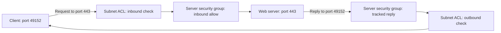

# Stateful networking

## The idea in plain language

In networking, **state** can mean remembering that a packet belongs to a
connection already allowed. An AWS **security group** remembers allowed
traffic for its associated resource, so reply traffic is allowed without a
separate reverse-direction rule. A **network access control list (network
ACL)** checks traffic at a subnet boundary without remembering previous
packets. Its inbound and outbound rules must each allow the relevant
direction.[^aws-sg][^aws-nacl]

Imagine an event entrance. One attendant recognizes a guest returning from
the lobby; another checks every crossing against a rule list. The analogy
has limits: network controls evaluate packet fields and connection tracking,
not a person's identity, and neither control proves that the application is
healthy or authorized for a user.

This use of *stateful* is different from a [stateful
application](../architecture/stateful-vs-stateless.md), which needs saved
data between requests. A server can be stateless as an application while a
security group tracks its network connections.

## Follow a request and its reply

Imagine an EC2 web server listening on TCP port 443. A client chooses a
temporary source port, such as 49152, and sends a request. The following
addresses and rules are illustrative; no AWS network was configured or
tested.

Text alternative: the client sends a request toward server port 443. The
subnet ACL checks the inbound packet, then the server's security group checks
whether the request is allowed. The reply leaves the server for the client's
temporary port. The security group recognizes it as reply traffic, while
the subnet ACL checks it again in the outbound direction. The diagram helps
you locate a missing reverse-direction ACL rule when a request enters but
no reply reaches the client.[^aws-sg][^aws-nacl]

The client's operating system or service chooses its temporary, or
**ephemeral**, port range. Do not copy 49152 or one example range as a
universal rule. AWS documents different ranges for different clients and
services; choose rules for the actual traffic you expect.[^aws-nacl-custom]

## What each control decides

| Control | Attached to | How to think about the reply |
| --- | --- | --- |
| Security group | Resource, such as an EC2 instance | Reply to allowed traffic is automatically allowed by connection tracking. |
| Network ACL | Subnet | Inbound and outbound packets are evaluated separately against ordered allow or deny rules. |

Both controls can affect the same path. A security group's tracked reply
does **not** bypass a network ACL that denies that outbound packet. A
working pair of rules also does not establish that routing, the server's
listener, DNS, or a host firewall is correct. VPC Flow Logs can help
diagnose overly restrictive security group and ACL rules, but their record
is one observation of the network path, not an application health
check.[^aws-vpc-security]

## A safe first diagnosis

When a connection fails, start with the intended source, destination,
protocol, and ports. Then ask:

1. Did the request reach the right subnet and resource? Check routes and
   the security group associated with the resource.
2. Does the security group allow the new request in the needed direction?
   Its reply behavior applies only after traffic is allowed.
3. Does the subnet's network ACL allow both the request and the reply,
   including the client's actual ephemeral destination port?
4. If the controls appear correct, inspect the application listener and
   other path controls rather than assuming the ACL is at fault.

This is a reasoning sequence, not a recommendation to open broad port
ranges. Choose the narrow rules your traffic needs and check their effect.
For detailed security-group behavior, use the [security groups
guide](security-groups.md).

## Check your understanding

- Why can a reply pass a security group without an explicit reverse rule?
- Why might that same reply still be denied by a network ACL?
- Why is a single hard-coded ephemeral port range a risky assumption?

## Official documentation for deeper study

- [Control traffic using security groups](https://docs.aws.amazon.com/vpc/latest/userguide/vpc-security-groups.html)
  explains resource rules and tracked reply traffic.
- [Control subnet traffic with network ACLs](https://docs.aws.amazon.com/vpc/latest/userguide/vpc-network-acls.html)
  explains stateless subnet checks and ordered rules.
- [Custom network ACLs](https://docs.aws.amazon.com/vpc/latest/userguide/custom-network-acl.html)
  explains response rules and client-dependent ephemeral ports.
- [Amazon VPC security](https://docs.aws.amazon.com/vpc/latest/userguide/VPC_Security.html)
  connects security groups, ACLs, and Flow Logs.

Next, read [security groups](security-groups.md) for resource-level checks,
or return to the [AWS networking index](index.md).

[^aws-sg]: [Amazon VPC: Security groups](https://docs.aws.amazon.com/vpc/latest/userguide/vpc-security-groups.html).
[^aws-nacl]: [Amazon VPC: Network ACLs](https://docs.aws.amazon.com/vpc/latest/userguide/vpc-network-acls.html).
[^aws-nacl-custom]: [Amazon VPC: Custom network ACLs](https://docs.aws.amazon.com/vpc/latest/userguide/custom-network-acl.html).
[^aws-vpc-security]: [Amazon VPC: Internetwork traffic privacy](https://docs.aws.amazon.com/vpc/latest/userguide/VPC_Security.html).
