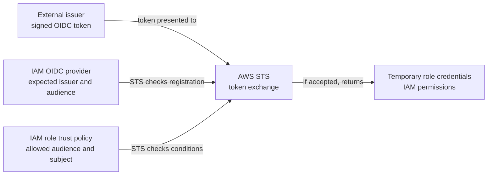

# IAM OIDC provider and STS web identity

## Why these pieces exist

An automated workload outside AWS may need to call an AWS service. Giving
it a long-lived AWS access key makes the key another secret to store,
rotate, and recover if exposed. With **web identity federation**, the
workload presents a signed token from an identity provider that AWS trusts.
AWS Security Token Service (STS) checks the token against an IAM role's
trust policy and can return temporary credentials for that role. The
workload uses those credentials, not its OIDC token, to call AWS APIs.[^aws-sts-web-identity]
See [OIDC fundamentals](../../../security/identity-federation/oidc-fundamentals.md)
for the issuer, audience, subject, and expiry claims.

## The four pieces

| Piece | Plain-language job |
| --- | --- |
| External OIDC provider | Issues a signed token that describes the workload. |
| IAM OIDC provider | Registers an external issuer and allowed client IDs or audiences with the AWS account.[^aws-create-oidc-provider] |
| Role trust policy | Decides which tokens from that issuer may assume one IAM role, including audience and subject conditions for GitHub.[^aws-oidc-role] |
| Role permissions policy | Limits the AWS actions and resources available after the role is assumed.[^aws-oidc-role] |

STS is the exchange point. `AssumeRoleWithWebIdentity` accepts the web
identity token without a pre-existing AWS credential and, when the trust
conditions pass, returns an access key ID, secret access key, and session
token. These are temporary **AWS** credentials. An optional session policy
can reduce the effective permissions further, but cannot grant more than
the role allows.[^aws-sts-web-identity]

Text alternative: an external issuer signs a token. AWS validates the
OIDC token against the registered provider and role trust policy,
including the expected issuer and audience and any subject conditions the
trust policy defines. If it is accepted, STS exchanges the token for temporary
role credentials. Those credentials carry the role's permissions when used
for AWS API calls.

Think of provider registration as recognizing a badge office, the trust
policy as the guest list for one door, and the role permissions as the
allowed rooms. The analogy is limited: AWS checks signed token claims, not
a paper badge, and a copied bearer token may be usable until it expires.
Do not log or share the token or returned credentials.

## Follow an invented example

Suppose a GitHub Actions job in an invented `northwind/docs` repository
needs to upload one site bundle. The AWS account registers GitHub's OIDC
issuer and the intended audience. The role trust policy accepts only the
job context the maintainer has chosen. The role permissions allow only the
needed upload operation on the intended site resource. The job presents
its GitHub token to STS; if all trust checks pass, it receives temporary
role credentials. If the upload is then denied, that is a permissions
question, even though federation succeeded. No AWS account, role, or
upload was created for this example.[^aws-oidc-role][^aws-sts-web-identity]

For GitHub specifically, a trust policy needs a narrow
`token.actions.githubusercontent.com:sub` condition. AWS checks for that
condition when a GitHub OIDC role trust policy is created or updated.
A value that is not solely a wildcard passes this minimum guard, but
`StringLike` with `repo:org/repo:*` still allows every branch, tag,
pull-request context, and environment in that repository. For a role meant
for one deployment context, compare the **actual** token subject with a
specific `StringEquals` condition and also check
`token.actions.githubusercontent.com:aud` against the intended audience.
The subject may be branch-, tag-, pull-request-, or environment-shaped and
may include immutable owner and repository IDs. A condition built for a
name-based subject will not match a token using immutable IDs, or vice versa.
See [AWS OIDC federation for GitHub
Actions](../../../git/github-actions/aws-oidc-federation.md) before
writing the condition.[^aws-oidc-role][^github-aws-oidc][^github-actions-oidc-reference]

The AWS condition is only one side of this boundary. A person who can
change the trusted workflow or run it in the matching context may be able
to request the role. Restrict who can change workflows or push to trusted
branches, protect deployment environments, and give `id-token: write`
only to jobs that need the exchange.[^github-aws-oidc][^github-actions-secure-use]

## Troubleshoot at the right boundary

| Symptom | First question |
| --- | --- |
| AWS does not recognize the token's issuer or audience | Does the IAM OIDC provider registration match the token issuer and intended audience? |
| STS denies the role assumption | Does the role's trust policy admit this provider and the token's actual audience and subject, including an environment or immutable-ID format? |
| STS succeeds but an AWS API denies the operation | Do the role's identity policy and any applicable resource, session, boundary, or organization policies allow that action on that resource?[^aws-policy-evaluation][^aws-sts-web-identity] |

Do not broaden a trust condition simply to clear an error. Confirm the
identity of the intended workload first. A successful exchange proves
only that the role was assumed; it does not prove that the application
action succeeded or that the trust policy is appropriately narrow.

## Check your understanding

1. Which AWS object represents the external token issuer in the account?
2. What does the trust policy decide, and what does the role permissions
   policy decide?
3. What credential does the workload use for the AWS API call after STS
   accepts its token?

## Official documentation and next steps

- [Create an IAM OIDC provider](https://docs.aws.amazon.com/IAM/latest/UserGuide/id_roles_providers_create_oidc.html)
  for provider registration and client IDs.
- [Create a role for OIDC federation](https://docs.aws.amazon.com/IAM/latest/UserGuide/id_roles_create_for-idp_oidc.html)
  for trust and permissions policies, including GitHub-specific conditions.
- [STS AssumeRoleWithWebIdentity](https://docs.aws.amazon.com/STS/latest/APIReference/API_AssumeRoleWithWebIdentity.html)
  for the exchange and returned credentials.
- [AWS OIDC federation for GitHub Actions](../../../git/github-actions/aws-oidc-federation.md)
  for the GitHub job side of this example.
- [EKS workload identity](../../../cross-topic-guides/eks-workload-identity.md)
  for a different workload and trust context.

[Back to AWS security](index.md) | [Back to AWS index](../index.md)

[^aws-create-oidc-provider]: [AWS IAM - Create an OpenID Connect identity provider](https://docs.aws.amazon.com/IAM/latest/UserGuide/id_roles_providers_create_oidc.html), source record `aws-create-oidc-provider`.
[^aws-oidc-role]: [AWS IAM - Create a role for OpenID Connect federation](https://docs.aws.amazon.com/IAM/latest/UserGuide/id_roles_create_for-idp_oidc.html), source record `aws-oidc-role`.
[^aws-sts-web-identity]: [AWS STS API Reference - AssumeRoleWithWebIdentity](https://docs.aws.amazon.com/STS/latest/APIReference/API_AssumeRoleWithWebIdentity.html), source record `aws-sts-web-identity`.
[^github-aws-oidc]: [GitHub Docs - Configuring OpenID Connect in Amazon Web Services](https://docs.github.com/en/actions/how-tos/secure-your-work/security-harden-deployments/oidc-in-aws), source record `github-aws-oidc`.
[^github-actions-oidc-reference]: [GitHub Docs - OpenID Connect reference](https://docs.github.com/en/actions/reference/security/oidc), source record `github-actions-oidc-reference`.
[^github-actions-secure-use]: [GitHub Docs - Secure use reference](https://docs.github.com/en/actions/reference/security/secure-use), source record `github-actions-secure-use`.
[^aws-policy-evaluation]: [AWS IAM - Policy evaluation logic](https://docs.aws.amazon.com/IAM/latest/UserGuide/reference_policies_evaluation-logic.html), source record `aws-policy-evaluation`.
