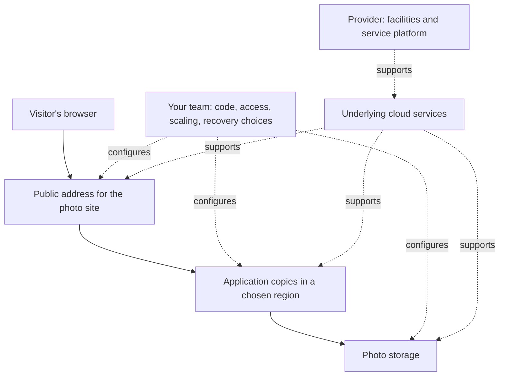

# Cloud computing fundamentals

## Purpose

Read this before choosing a public cloud provider or service. You should leave
able to explain what cloud computing supplies, which decisions remain yours, and why
"automatic scaling," "high availability," and "pay for what you use" need
closer questions.

This is a public cloud starting model, not a setup guide. NIST also describes
private, community, and hybrid deployment models. A private cloud can be
operated by its organization or a third party; a community cloud serves
organizations with shared concerns.[^nist-cloud-definition] The example
below is invented; no cloud account, bill, or failure test validated it.

## What cloud computing is

Cloud computing lets you request computing resources over a network without
installing each physical machine yourself. Resources can include servers,
storage, databases, and applications. In a public cloud, a provider operates
the shared infrastructure. NIST calls its five **essential characteristics**
on-demand self-service (request resources yourself), broad network access,
resource pooling, rapid elasticity, and measured service (track resource use).
Pooling can also happen inside a private cloud. In a public cloud, the pool
can serve people from many organizations. These characteristics do not
mean every change is instant or automatic.[^nist-cloud-definition]

Think of **the cloud** as a way to obtain and operate resources, not a
different place where the usual questions about access, data, reliability,
and cost disappear.

## Why the model matters

Cloud services let a team start without buying hardware or guessing all its
future capacity in advance. The trade-off is that the team still has to make
the right service and configuration choices. Mistaking a provider feature
for a protection already in place can expose data, leave a single point of
failure, or produce a bill nobody expected.

## The mental model: who does what

The provider runs physical facilities and offers services. You decide what
to put in those services, who can reach your workload, and which protective
features to use. The exact split depends on the service. A **virtual machine**
is a software-defined computer; with IaaS, you manage its operating system.
An application **runtime** is the environment that runs your code; a managed
runtime removes
some operating-system work. A ready-made software service removes more
application work. Your **workload** is the application and data you put on
the platform. Your data, identities, and configuration still need your
attention.[^azure-shared-responsibility]

| If you choose... | The provider generally operates... | You are responsible for... |
| --- | --- | --- |
| Infrastructure as a service (IaaS), such as a virtual machine | Facilities, physical network and hosts, and the software that makes virtual machines possible | Operating and patching the guest operating system; your application, data, identities, network access rules, and configuration |
| Platform as a service (PaaS), such as a managed app runtime | IaaS layers plus operating system and runtime | Your application code and settings, data, identities, and the network controls the service exposes |
| Software as a service (SaaS), such as a hosted application | PaaS layers plus the application service | Your data, users, permissions, and available settings |

These are broad service models, not a contract for every product. Read the
particular provider's responsibility guide before relying on its defaults.
The responsibility split follows NIST's service models and Microsoft's
illustrative security matrix; it can differ by
product.[^nist-cloud-definition][^azure-shared-responsibility] You still
protect the devices that access a cloud service, including a SaaS
application.[^azure-shared-responsibility]

## An analogy: renting a workshop

Imagine renting a workshop instead of building one. The owner maintains the
building and utilities. You choose the equipment, decide who has keys, and
protect the work stored inside. As with a rented workshop, an idle resource
can still cost money. You still need a way to recover valuable work after
an accident; in the cloud, check each service's recovery and backup
options.[^azure-reliability-responsibility]

The analogy helps separate the provider's infrastructure from your workload.
It breaks down in two useful ways:

- You do not normally add a workshop room through an API. Cloud capacity can
  be requested through software, sometimes by rules the service already
  offers and sometimes by rules you must configure.
- A workshop has a fixed floor plan and lease. Cloud resources come from a
  pool and can be metered in different units. In a public cloud, that pool
  can serve other organizations too.

## Four useful words with limits

- **Elasticity** means capacity can grow or shrink as demand changes. Scaling
  behavior and limits depend on the service; some services scale without a
  policy you write. For example, an EC2 Auto Scaling group has minimum,
  desired, and maximum capacities; a scaling policy changes the desired number within
  those limits.[^aws-autoscaling-groups] More copies also require an
  application that can handle them. A configured maximum is not a guarantee
  that capacity will be available immediately. An **account quota** is a
  provider-set limit on resource use that may stop scaling below your
  configured maximum.[^aws-ec2-on-demand]
- **Region** means a provider's area containing datacenters. Azure, for
  example, describes an **availability zone** as a separate datacenter group
  within a region, with its own power, cooling, and network. Not every region or
  service supports the same zone options. Selecting a region does not by
  itself make every service span zones; check each service's default and zone
  options. A zone failure and a whole-region failure require different
  recovery choices.[^azure-regions-zones]
- **Reliability** means a workload can keep working or recover as expected.
  You achieve it by designing for failures. The provider makes
  platform capabilities available, while you choose the workload's
  architecture, backup, monitoring, and recovery settings. A single copy of
  an application or data store can still fail.[^azure-reliability-responsibility]
  **Availability** asks whether a workload can serve a request now;
  **durability** asks whether stored data survives a hardware failure.
  Redundant storage may preserve data after a hardware loss, but an accidental
  deletion or overwrite can affect its active copies. Choose backup or
  versioning options for that recovery need.[^azure-blob-reliability]
  A provider's service-level
  agreement is not a promise that your whole workload is
  available.[^azure-regions-zones]
- **Measured service** is NIST's term for metering resource use; pricing is
  a separate question, although services often charge by use.[^nist-cloud-definition]
  Metering does not mean a running resource is free while nobody uses it.
  For example, an Amazon EC2 On-Demand instance incurs compute charges while
  it is running, including idle time.[^aws-ec2-on-demand]

## Visual: the invented photo site

**Text alternative:** A visitor reaches the photo site's public address,
which sends the request to application copies, potentially spread across
zones if the team chooses a supported design. Those copies read or write
photo storage. The provider operates the facilities and platform beneath
those services. Your team configures the application, access rules, scaling,
and data protection. Use the diagram to identify which settings your team
must decide before launch. The exact network path and ownership details vary
by service.

## Example: a small photo-sharing site

Suppose an invented community site has quiet weekdays and a busy weekend
event. Its team follows this sequence:

1. **Start:** Choose a region, a service for running the application, and
   storage for photos. Keep photos outside application copies that might be
   removed during scaling; decide who may read and write the photos.
2. **Prepare:** Check how this chosen service scales and its account quotas;
   set a capacity limit for the event. Confirm that several application copies
   can safely serve the same users. Choose data backup and recovery settings;
   decide whether a zone failure needs a redundant deployment. Estimate
   compute, storage, requests, and data-transfer charges, then set a budget
   alert before the event. An alert warns you; it does not by itself stop
   charges.[^aws-budgets-costs]
3. **During the event:** Watch requests, errors, running capacity, and cost
   alerts. If the configured limit is reached, extra requests may slow down
   or fail; more visitor traffic does not create unlimited capacity.
4. **After the event:** Reduce unneeded running capacity and inspect the
   charges as billing data arrives. Check that the site works and photos are
   still recoverable, rather than assuming idle resources are free.

This example shows choices, not a promise that every cloud service has those
features or that cloud hosting is always cheaper.

## Check your understanding

1. If the provider maintains a physical server, who decides who may read
   your application's data?
2. What must be true before a traffic spike can add useful application
   copies?
3. Why can an application in one region still need a recovery plan, and why
   might redundant photo storage still need a backup or versioning?
4. Why might an idle virtual machine appear on the bill?

If you can answer those, compare a specific provider's service model with
this page before adopting its defaults.

## Next steps

- Use the [cloud topic map](index.md) to choose AWS, Azure, Google Cloud, or
  provider-neutral solutions.
- Read [Cost allocation basics](../finops/cost-allocation-basics.md) when a
  team needs to decide who owns cloud spending.
- Read [Stateful vs. stateless on AWS](aws/architecture/stateful-vs-stateless.md)
  to see why adding application copies does not solve data placement.

## Official documentation for deeper study

- [NIST SP 800-145](https://csrc.nist.gov/pubs/sp/800/145/final) defines
  cloud computing and its service models.
- [Microsoft's shared responsibility guide](https://learn.microsoft.com/en-us/azure/security/fundamentals/shared-responsibility)
  shows how customer and provider work changes across IaaS, PaaS, and SaaS.
- [Microsoft's reliability responsibility guide](https://learn.microsoft.com/en-us/azure/reliability/concept-shared-responsibility)
  explains why workload reliability still needs customer decisions.
- [Microsoft's regions and zones guide](https://learn.microsoft.com/en-us/azure/well-architected/design-guides/regions-availability-zones)
  explains Azure's zone boundaries and deployment choices.
- [Microsoft's Azure Blob Storage reliability guide](https://learn.microsoft.com/en-us/azure/reliability/reliability-storage-blob)
  distinguishes infrastructure redundancy from recovery after data changes.
- [Amazon EC2 Auto Scaling groups](https://docs.aws.amazon.com/autoscaling/ec2/userguide/auto-scaling-groups.html)
  shows what a configured scaling group can control.
- [Amazon EC2 On-Demand instances](https://docs.aws.amazon.com/AWSEC2/latest/UserGuide/ec2-on-demand-instances.html)
  illustrates that running idle compute can still be billed.
- [AWS Budgets](https://docs.aws.amazon.com/cost-management/latest/userguide/budgets-managing-costs.html)
  shows how to alert on actual or forecasted spending.

## Related links

- [Cloud index](index.md)
- [Start here](../start-here.md)
- [Root knowledge index](../index.md)

[^nist-cloud-definition]: [NIST SP 800-145](https://csrc.nist.gov/pubs/sp/800/145/final), source record `nist-cloud-definition`.
[^azure-shared-responsibility]: [Microsoft Learn - Shared responsibility in the cloud](https://learn.microsoft.com/en-us/azure/security/fundamentals/shared-responsibility), source record `azure-shared-responsibility`.
[^azure-reliability-responsibility]: [Microsoft Learn - Shared responsibility for reliability](https://learn.microsoft.com/en-us/azure/reliability/concept-shared-responsibility), source record `azure-reliability-responsibility`.
[^azure-regions-zones]: [Microsoft Learn - Regions and availability zones](https://learn.microsoft.com/en-us/azure/well-architected/design-guides/regions-availability-zones), source record `azure-regions-zones`.
[^azure-blob-reliability]: [Microsoft Learn - Reliability in Azure Blob Storage](https://learn.microsoft.com/en-us/azure/reliability/reliability-storage-blob), source record `azure-blob-reliability`.
[^aws-autoscaling-groups]: [Amazon EC2 Auto Scaling - Auto Scaling groups](https://docs.aws.amazon.com/autoscaling/ec2/userguide/auto-scaling-groups.html), source record `aws-autoscaling-groups`.
[^aws-ec2-on-demand]: [Amazon EC2 - Purchasing On-Demand Instances](https://docs.aws.amazon.com/AWSEC2/latest/UserGuide/ec2-on-demand-instances.html), source record `aws-ec2-on-demand`.
[^aws-budgets-costs]: [AWS Cost Management - Managing your costs with AWS Budgets](https://docs.aws.amazon.com/cost-management/latest/userguide/budgets-managing-costs.html), source record `aws-budgets-costs`.
