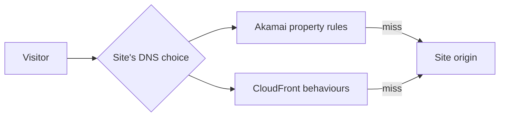

# Akamai vs. CloudFront

## Purpose

Akamai and Amazon CloudFront are two ways to put an edge network between
visitors and a site's origin. Both can deliver public content from nearby
caches and apply request rules before contacting the origin. This page helps
you compare **what a particular site needs to do**, rather than choose by a
provider label or assume their similarly named features are equivalent.

An **origin** is the application or storage that supplies the original
response. A **cache** is a stored response that can be reused for another
request when the rules allow it. See [CDN and edge fundamentals](cdn-and-edge-fundamentals.md)
for the request flow before comparing products.

Think of these as **two delivery services with different sorting manuals**.
Both can bring the same public document to a reader; each describes routing,
checks, and exceptions in its own language. The analogy breaks when a response
contains private data, when a cache serves it without asking the origin, and
when the site's security depends on an extra product or application check.
Those differences must be designed and tested, not inferred from the analogy.

## Translate the important parts

| Site question | Akamai concept | CloudFront/AWS concept |
| --- | --- | --- |
| Which public name reaches the edge? | Property hostname mapped through an Akamai edge hostname. | Alternate domain name and certificate on a distribution, with DNS pointed at CloudFront. |
| Which rule handles a path? | Property Manager matches and behaviours in a rule tree. | Ordered cache behaviours in a distribution; first matching path pattern wins. |
| Which backend supplies a miss? | Origin Server behaviour and origin hostname. | Origin attached to the matching cache behaviour. |
| Where can application filtering run? | App & API Protector, if included and scoped to the site's traffic. | AWS WAF web ACL associated with the distribution, if configured. |
| Where can custom edge code run? | EdgeWorkers, if available for the property. | CloudFront Functions or Lambda@Edge, selected for the required event and capability. |

Akamai documents the roles of property, property hostname, edge hostname, and
origin hostname, while Property Manager combines request matches and
behaviours in a rule tree.[^akamai-concepts][^akamai-rules] CloudFront
associates origins and path patterns with cache behaviours, whose order is
significant.[^cloudfront-behaviors] This table maps jobs, not a promise of
identical defaults, performance, cost, or feature access.

Text alternative: the visitor reaches the provider selected by the site's
DNS route. Akamai evaluates a property's rules; CloudFront evaluates a
distribution's behaviours. Either edge may answer from its cache or ask the
site origin on a miss. The diagram shows that comparing the products requires
checking the same visitor outcome through two different configurations. It
does not show a measured performance comparison or a live deployment.

## Example: the same AWS-hosted site

The site and requests are invented. No Akamai property, CloudFront
distribution, contract, or benchmark was inspected or run for this example.

A team serves `/assets/app-v4.js` publicly and `/account/orders` only to the
signed-in visitor. Its static files are in S3; its application is behind an
AWS Application Load Balancer (ALB). The team already runs Akamai but is
considering CloudFront for a new deployment.

For **either** candidate, the team first writes down the required outcomes:

1. A versioned asset can be cached, and a request for another version gets
   that version rather than an old copy.
2. An account response is never stored in a shared edge cache. The
   application still authorizes each visitor.
3. A visitor cannot reach private S3 content or the application origin by
   skipping the edge controls the team relies on.
4. The team can tell which rule, cache result, origin, and security action
   produced a failed request.

Then it maps these outcomes to each provider's property or distribution
settings and tests them. Akamai's origin behaviour defines where its edge
retrieves content and how the origin hostname is used.[^akamai-origin]
CloudFront has an AWS-specific option for a regular private S3 bucket:
origin access control (OAC), with a bucket policy scoped to the distribution.
It also supports private ALBs as VPC origins under documented limits.
These are CloudFront options, not automatic equivalents of an Akamai origin
configuration.[^cloudfront-s3-oac][^cloudfront-vpc-origins]

## Questions that actually decide the fit

| Need | What to compare |
| --- | --- |
| Cache and routing | Path precedence, cache-key inputs, private-response rules, TTLs, redirects, and invalidation behaviour on real site paths. |
| Origin protection | Whether the required S3 and ALB origins can be kept private or otherwise reject a direct bypass under each design. |
| Application security | Which licensed and configured policies cover the hostname and paths, how they are tested, and how false positives are handled. |
| Edge code | The exact event, runtime, data access, and deployment limits of the function feature needed by the site. |
| Operations | How a change is tested, activated, observed, and rolled back by the team that will be on call. |
| Commercial terms | The actual contract, feature entitlements, traffic profile, and measured bill; this page has no current price comparison. |

Do not equate Akamai App & API Protector with AWS WAF merely because both can
inspect web requests. Akamai applies its security policies to traffic in
their configured scope; AWS WAF requires a web ACL associated with the
CloudFront distribution. What each rule detects and how it responds is a
separate design decision.[^akamai-security][^cloudfront-waf]

Similarly, Akamai EdgeWorkers and CloudFront's function options all run code
at the edge, but they have different supported events and limits. Check the
particular task before assuming that one function translates directly to
another.[^akamai-edgeworkers][^cloudfront-edge-functions]

Akamai property versions can be activated on a staging network before
production.[^akamai-activation] That gives one concrete testing path, but it
does not replace real response checks after activation. For CloudFront,
wait for the distribution's `Deployed` status, then test the matching paths.
That status means its configuration has propagated; it does not prove the
site's user journeys.[^cloudfront-distribution-status]
Provider availability, geographic latency, and total cost require the team's
own workload and contract evidence; this page does not declare a universal
winner.

## Check your understanding

1. Why is a feature-name table insufficient to decide whether private S3
   content is protected in both designs?
2. Which two requests from the example would you compare on both providers
   before moving traffic?
3. What extra evidence is needed before saying one provider is faster or
   cheaper for this site?

## Deeper study

- [Akamai Property Manager concepts](https://techdocs.akamai.com/property-mgr/docs/key-concepts-terms),
  [rules](https://techdocs.akamai.com/property-mgr/docs/rules), and
  [origin settings](https://techdocs.akamai.com/property-mgr/docs/origin-server)
  for its delivery configuration.
- [CloudFront cache behaviours](https://docs.aws.amazon.com/AmazonCloudFront/latest/DeveloperGuide/DownloadDistValuesCacheBehavior.html),
  [S3 origin access control](https://docs.aws.amazon.com/AmazonCloudFront/latest/DeveloperGuide/private-content-restricting-access-to-s3.html),
  and [VPC origins](https://docs.aws.amazon.com/AmazonCloudFront/latest/DeveloperGuide/private-content-vpc-origins.html)
  for the AWS configuration.
- [Akamai App & API Protector](https://techdocs.akamai.com/cloud-security/docs/app-api-protector)
  and [CloudFront with AWS WAF](https://docs.aws.amazon.com/AmazonCloudFront/latest/DeveloperGuide/distribution-web-awswaf.html)
  for the distinct security scopes.
- [Akamai EdgeWorkers](https://techdocs.akamai.com/edgeworkers/docs/welcome-to-edgeworkers)
  and [CloudFront edge functions](https://docs.aws.amazon.com/AmazonCloudFront/latest/DeveloperGuide/edge-functions.html)
  for custom-code choices.

For one-provider design, continue to
[CDN caching and origin protection](cdn-caching-and-origin-protection.md).
For two active providers, read [multi-CDN operations](multi-cdn-operations.md).
[Back to edge and CDN](index.md) | [Back to cloud index](../index.md)

[^akamai-concepts]: [Akamai - Key concepts and terms](https://techdocs.akamai.com/property-mgr/docs/key-concepts-terms).
[^akamai-rules]: [Akamai - Rules](https://techdocs.akamai.com/property-mgr/docs/rules).
[^akamai-origin]: [Akamai - Origin Server](https://techdocs.akamai.com/property-mgr/docs/origin-server).
[^akamai-security]: [Akamai - App and API Protector](https://techdocs.akamai.com/cloud-security/docs/app-api-protector).
[^akamai-edgeworkers]: [Akamai - EdgeWorkers](https://techdocs.akamai.com/edgeworkers/docs/welcome-to-edgeworkers).
[^akamai-activation]: [Akamai - Activate your property](https://techdocs.akamai.com/property-mgr/docs/activate-prop).
[^cloudfront-behaviors]: [Amazon CloudFront - Cache behavior settings](https://docs.aws.amazon.com/AmazonCloudFront/latest/DeveloperGuide/DownloadDistValuesCacheBehavior.html).
[^cloudfront-s3-oac]: [Amazon CloudFront - Restrict access to an Amazon S3 origin](https://docs.aws.amazon.com/AmazonCloudFront/latest/DeveloperGuide/private-content-restricting-access-to-s3.html).
[^cloudfront-vpc-origins]: [Amazon CloudFront - Restrict access with VPC origins](https://docs.aws.amazon.com/AmazonCloudFront/latest/DeveloperGuide/private-content-vpc-origins.html).
[^cloudfront-waf]: [Amazon CloudFront - Use AWS WAF protections](https://docs.aws.amazon.com/AmazonCloudFront/latest/DeveloperGuide/distribution-web-awswaf.html).
[^cloudfront-edge-functions]: [Amazon CloudFront - Customize at the edge with functions](https://docs.aws.amazon.com/AmazonCloudFront/latest/DeveloperGuide/edge-functions.html).
[^cloudfront-distribution-status]: [Amazon CloudFront - Distribution status](https://docs.aws.amazon.com/cloudfront/latest/APIReference/API_Distribution.html).
