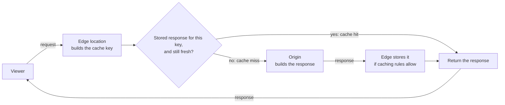

# CDN and edge fundamentals

## Purpose

Use this page to understand what a content delivery network (CDN) does and the
vocabulary used by CloudFront, Akamai, and multi-CDN designs. It explains the
caching model well enough to reason about one question that matters for
safety: which viewers can receive the same stored response.

General caching behaviour on this page comes from the HTTP caching standard.
Provider-specific behaviour is taken from Amazon CloudFront's documentation
and is labelled as such. Other CDNs have different defaults, so check your
provider's documentation before relying on any default described here.

## What a CDN is

A CDN is a network of servers placed close to users that sits between those
users and your application. When a user requests something, the request goes
to a nearby CDN server. If that server already holds a usable copy of the
response, it returns the copy. If not, it fetches the response from your
application and may keep a copy for the next request.

A cache that stores responses for reuse by more than one user is called a
shared cache.[^rfc-9111-http-caching] A CDN is a shared cache, and that one
fact is behind both its benefit and its main risk.

## Why it matters

A response served from a nearby copy arrives sooner, and your application
never sees the request. That lowers latency for users and load on your
servers.[^cloudfront-cache-key]

The risk comes from the same mechanism. A shared cache hands one stored
response to many people. If the CDN treats two requests as "the same" when the
correct responses differ, someone receives the wrong content. When the
difference is who is logged in, that means one user's private data is shown to
another.

## The mental model

| Term | Simple definition |
| --- | --- |
| Origin | Your application or storage: the place the real response comes from. |
| Edge location | A CDN site near users that receives their requests. Also called a point of presence (POP). |
| Cache key | The set of request values the CDN uses to decide whether two requests are asking for the same stored response. |
| Cache hit | The edge has a stored response for this cache key that is still valid, and returns it without contacting the origin. |
| Cache miss | The edge has nothing usable for this cache key, so it asks the origin. |
| TTL (time to live) | How long a stored response may be reused before it is considered stale. |
| Invalidation | An instruction to stop using stored responses before their TTL ends. Also called a purge. |
| Edge compute | Your own code, run by the CDN on requests or responses. It is a separate feature from caching. |

The HTTP caching standard describes a stored response as fresh while it can be
reused without checking with the origin, and stale afterwards. It also sets a
floor for the cache key: at minimum the request method and the target
URI.[^rfc-9111-http-caching] Everything beyond that floor is configuration,
and it differs between providers.

## Visual: one request through the edge

Text alternative: a viewer sends a request to an edge location, which builds a
cache key from the request. The edge asks whether it holds a stored response
for that key that is still fresh. If yes, it is a cache hit and the stored
response is returned to the viewer. If no, it is a cache miss: the edge asks
the origin, the origin builds the response, the edge stores it if the caching
rules allow, and then returns it to the viewer.

This is the sequence CloudFront documents: the request is routed to the edge
location that can best serve it, the cache is checked, and on a miss the
request is forwarded to the origin and the returned object is added to the
cache.[^cloudfront-how-it-works] Use the diagram to see that the cache key is
built before the origin is asked anything, and that on a cache hit the origin
is not contacted at all. The origin's influence comes earlier, when it answers
a miss: its response headers can tell the cache not to store that response,
as long as the CDN is configured to honour them.

## The cache key decides who shares a response

The central rule, as CloudFront's documentation states it: when a value in the
request determines the response your origin returns, that value belongs in the
cache key. When a value does not affect the response, including it only creates
duplicate copies and lowers the hit ratio.[^cloudfront-cache-key]

- A key that is **too broad** leaves out something the response depends on.
  Different responses collapse into one stored copy, and viewers receive
  content meant for someone else.
- A key that is **too narrow** includes values that do not matter. Identical
  responses are stored many times, most requests miss, and the origin gets
  little relief.

Defaults are provider-specific. CloudFront's default cache key contains the
distribution's domain name and the URL path; query strings, headers, and
cookies are not part of it unless a cache policy adds
them.[^cloudfront-cache-key] Do not assume another CDN starts from the same
place.

## Example: one path, different languages and login states

This example is illustrative. The site, paths, and users are invented, and the
behaviour shown follows from the model above. It is not a recorded test.

A site serves `/home`. The origin returns the page in the language of the
request's `Accept-Language` header. For a logged-in user, identified by a
session cookie, it adds a greeting with the user's name. The CDN's cache key is
the path only.

| # | Request for `/home` | Cache key | Result | What the viewer receives |
| --- | --- | --- | --- | --- |
| 1 | English, not logged in | `/home` | Miss. Origin's response is stored. | English page. Correct. |
| 2 | German, not logged in | `/home` | Hit. | English page. Wrong language. |
| 3 | After the copy expires: English, Dana logged in | `/home` | Miss. Origin's response is stored. | "Welcome, Dana". Correct for Dana. |
| 4 | English, a different user logged in | `/home` | Hit. | "Welcome, Dana". Another user's page. |

Request 2 is a nuisance. Request 4 is a data leak, and nothing failed: the
CDN did what its key told it to do.

How each problem is addressed:

- **Language.** Make the language part of what identifies the response. One
  way is to add the header to the cache key. CloudFront's documentation points
  out that browsers send many spellings of the same language preference, which
  multiplies stored copies, and suggests a language-specific URL such as
  `/en-US/...` as an alternative.[^cloudfront-cache-key]
- **Login state.** The safest default is not to store personalized responses
  in a shared cache at all. The origin can mark a response with
  `Cache-Control: private`, which the HTTP standard defines as meaning a
  shared cache must not store it.[^rfc-9111-http-caching] This protects you
  only where the CDN honours the header, which the cautions below qualify.
  Putting the session
  cookie in the cache key would separate users, but every user then has a
  private copy, so almost nothing is served from cache.

Three cautions keep this from being a false comfort:

- **Configuration can override the origin's headers.** In CloudFront, if the
  minimum TTL is greater than zero, CloudFront caches a response for that
  minimum even when the origin sends `no-cache`, `no-store`, or
  `private`.[^cloudfront-expiration] Confirm how your CDN's settings interact
  with origin headers.
- **The standard's protection for authenticated requests covers the
  `Authorization` header.** A shared cache must not reuse a response to a
  request carrying that header unless the response explicitly allows
  it.[^rfc-9111-http-caching] Requests that carry a session cookie are not
  covered by that rule.
- **A cookie does not make a response private.** The HTTP caching standard
  notes, in its security considerations (section 7.3), that a `Set-Cookie`
  response header does not inhibit caching: a cacheable response that carries
  one can be reused for later requests. A server that wants to control this
  has to send suitable `Cache-Control` response headers.[^rfc-9111-http-caching]
  For cookie-based sessions, nothing prevents storage unless the origin or the
  CDN configuration says so.

[CDN caching and origin protection](cdn-caching-and-origin-protection.md)
turns this into path-by-path design decisions.

## TTL and invalidation

A **TTL** controls how long a stored response is reused. A longer TTL means
more hits and less origin load; a shorter one means fresher content. The
origin usually expresses the lifetime with `Cache-Control` directives such as
`max-age`, and `s-maxage` for shared caches specifically.[^rfc-9111-http-caching]
CDN settings can cap, raise, or replace those values, and the defaults differ
by provider and by configuration.

When a stored response expires, the edge does not necessarily download it
again. CloudFront forwards the next request to the origin to check whether its
copy is still the latest, and the origin can answer that nothing
changed.[^cloudfront-expiration] A CDN may also discard a rarely requested
response before its TTL ends to make room for others, so a TTL is an upper
limit on reuse, not a promise of storage.[^cloudfront-expiration]

**Invalidation** removes stored responses before they expire, so the next
request goes to the origin.[^cloudfront-invalidation] It has two limits worth
knowing. It reaches the CDN's caches only: copies already held by browsers or
by other caches between the CDN and the user stay until they expire. And it is
a reaction after the fact. For files that change often, CloudFront's
documentation recommends versioned file names, such as a new name for each
release, so that a new version is simply a new URL.[^cloudfront-invalidation]

## Cache and edge compute are different things

Caching stores responses and reuses them. It runs no code of yours.

Edge compute runs your code at the CDN, on requests and responses as they pass
through. CloudFront, for example, offers CloudFront Functions and Lambda@Edge
for tasks such as manipulating requests and responses, basic authentication
and authorization, and generating responses at the edge.[^cloudfront-edge-functions]

The two interact. An edge function can normalize a request before the cache
key is built, for example by reducing many language header spellings to one
value, which makes caching more effective.[^cloudfront-cache-key] Keep them
separate in your head anyway:

- Adding edge code does not make a response cacheable.
- A caching problem is solved with cache keys, TTLs, and headers, not with
  more code.
- Edge code runs on the request path for every matching request, so a bug
  there affects all of them.

## An analogy: a branch office with a photocopier

Imagine a head office that holds every original document, and branch offices
in each city:

- The **head office** is the origin.
- A **branch** is an edge location. It keeps photocopies of documents people
  often ask for.
- The **label on each shelf slot** is the cache key. Two requests that produce
  the same label get the same photocopy.
- The **"use by" date** on a copy is its TTL.
- A **recall notice** from head office is an invalidation.

Where the analogy stops being accurate:

- **The label is all the branch looks at.** A clerk would notice that a letter
  is addressed to someone else. A cache compares keys and nothing more.
- **A recall does not reach copies people took home.** Browser caches keep
  their copy until it expires.
- **Copies can be thrown out early.** A cache may evict a rarely used response
  before its date.
- **"Use by" does not mean "refetch".** After expiry the edge can ask the
  origin whether its copy is still current.
- **A branch that rewrites documents is another service.** That is edge
  compute, and the photocopier picture does not cover it.

## Common misconceptions

- **"The CDN knows which responses are private."** It knows what its
  configuration and the response headers tell it.
- **"Adding everything to the cache key is the safe choice."** It avoids
  mixing responses and removes most of the benefit. Decide per path instead.
- **"Invalidation updates every user immediately."** It clears the CDN's
  copies, not copies held elsewhere.
- **"All CDNs behave like CloudFront by default."** Default cache keys and
  TTLs are provider-specific.
- **"Edge compute is a faster cache."** It is a place to run code.

## Check your understanding

- In the example, why does request 4 return Dana's page even though the user
  is different?
- What are two ways to stop request 2 from returning the wrong language, and
  what does each cost?
- Why does invalidating a file not guarantee that every user sees the new
  version straight away?
- What is the difference between caching a response at the edge and running an
  edge function?

## Next steps

- Design cache keys, TTLs, purges, and origin access in [CDN caching and origin
  protection](cdn-caching-and-origin-protection.md).
- Compare providers in [Akamai vs. CloudFront](akamai-vs-cloudfront.md).
- Apply the model on AWS in [CloudFront](../aws/networking/cloudfront.md).
- Run more than one provider with [multi-CDN operations](multi-cdn-operations.md).

## Official documentation for deeper study

- The standard for shared caches, freshness, `Cache-Control`, and `Vary`: [RFC 9111 - HTTP Caching](https://www.rfc-editor.org/rfc/rfc9111.html).
- The request path through an edge location: [CloudFront - How CloudFront delivers content](https://docs.aws.amazon.com/AmazonCloudFront/latest/DeveloperGuide/HowCloudFrontWorks.html).
- Cache hits, the default cache key, and customizing it: [CloudFront - Understand the cache key](https://docs.aws.amazon.com/AmazonCloudFront/latest/DeveloperGuide/understanding-the-cache-key.html).
- TTL settings and how they combine with origin headers: [CloudFront - Manage how long content stays in the cache](https://docs.aws.amazon.com/AmazonCloudFront/latest/DeveloperGuide/Expiration.html).
- Invalidation versus versioned file names: [CloudFront - Invalidate files to remove content](https://docs.aws.amazon.com/AmazonCloudFront/latest/DeveloperGuide/Invalidation.html).
- Code at the edge: [CloudFront - Customize at the edge with functions](https://docs.aws.amazon.com/AmazonCloudFront/latest/DeveloperGuide/edge-functions.html).
- For any other CDN, read that provider's own caching documentation; the [Akamai vs. CloudFront](akamai-vs-cloudfront.md) page lists starting points.

## Related links

- [CDN caching and origin protection](cdn-caching-and-origin-protection.md)
- [Akamai vs. CloudFront](akamai-vs-cloudfront.md)
- [CloudFront](../aws/networking/cloudfront.md)
- [Amazon CloudFront documentation](https://docs.aws.amazon.com/cloudfront/)
- [Back to edge and CDN index](index.md)
- [Back to cloud index](../index.md)
- [Back to knowledge index](../../index.md)

[^rfc-9111-http-caching]: [RFC 9111 - HTTP Caching](https://www.rfc-editor.org/rfc/rfc9111.html), source record `rfc-9111-http-caching`.
[^cloudfront-how-it-works]: [Amazon CloudFront Developer Guide - How CloudFront delivers content](https://docs.aws.amazon.com/AmazonCloudFront/latest/DeveloperGuide/HowCloudFrontWorks.html), source record `cloudfront-how-it-works`.
[^cloudfront-cache-key]: [Amazon CloudFront Developer Guide - Understand the cache key](https://docs.aws.amazon.com/AmazonCloudFront/latest/DeveloperGuide/understanding-the-cache-key.html), source record `cloudfront-cache-key`.
[^cloudfront-expiration]: [Amazon CloudFront Developer Guide - Manage how long content stays in the cache](https://docs.aws.amazon.com/AmazonCloudFront/latest/DeveloperGuide/Expiration.html), source record `cloudfront-expiration`.
[^cloudfront-invalidation]: [Amazon CloudFront Developer Guide - Invalidate files to remove content](https://docs.aws.amazon.com/AmazonCloudFront/latest/DeveloperGuide/Invalidation.html), source record `cloudfront-invalidation`.
[^cloudfront-edge-functions]: [Amazon CloudFront Developer Guide - Customize at the edge with functions](https://docs.aws.amazon.com/AmazonCloudFront/latest/DeveloperGuide/edge-functions.html), source record `cloudfront-edge-functions`.
