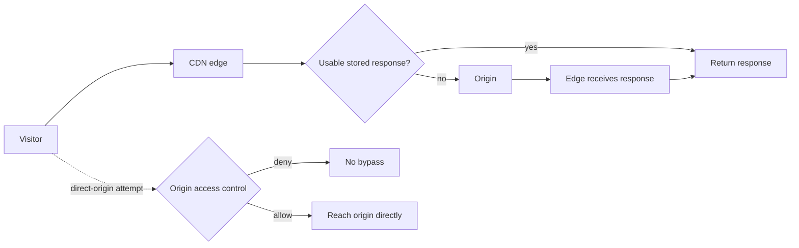

# CDN caching and origin protection

## Purpose

A content delivery network (CDN) sits between a visitor and the place that
produces a response, called the **origin**. It can keep a response at the edge
and reuse it for later visitors. A safe design answers two questions:

1. **Who may share this response?** The cache must not hand one person's
   private page to another person.
2. **Can a visitor skip the CDN?** If the origin is reachable directly, the
   visitor can avoid the edge's caching and security controls.

Use this explanation after [CDN and edge fundamentals](cdn-and-edge-fundamentals.md)
when deciding cache behaviour and origin access for a site or API. The HTTP
rules below are general; CloudFront settings and origin patterns are labelled
as AWS examples. Check another provider's own rules before applying them.

## Four separate decisions

| Decision | What it controls | Failure when it is wrong |
| --- | --- | --- |
| Cache eligibility | Whether a response may be stored in a shared cache at all. | A personalized response becomes available to another visitor. |
| Cache key | Which request values distinguish one stored response from another. | Different public responses are mixed, or identical ones are stored many times. |
| Lifetime | How long a stored response is considered fresh. | Visitors see old content longer than intended. |
| Origin access | Which clients may connect to the real application or storage. | A direct request avoids the edge. |

Think of the cache as a **labelled shelf**. First decide whether a document is
public enough to place there. Then choose a label that distinguishes versions
that differ. Origin protection is the locked door behind the shelf: it decides
who can fetch new documents from the source. The analogy stops here: a cache
may exist at many edge locations, its entries expire or are evicted, and its
"label" is calculated from HTTP request values rather than written by a
person. Locking the origin does not make a wrongly cached response safe.

Text alternative: the visitor normally reaches the CDN edge. A usable stored
response returns from the edge; otherwise the edge requests one from the
origin, receives it, and returns it. A separate direct-origin attempt reaches
an origin access control. If that control allows the visitor through, the CDN
can be bypassed. The diagram separates response-sharing rules from
origin-reachability rules.

## Example: a catalog and an account page

This shop is invented to illustrate the decisions; no CDN configuration or
request was tested.

The shop serves `/catalog?language=en&utm_source=mail`. Everyone asking for
English receives the same catalog. The `language` value changes the response;
`utm_source` is used only for analytics and does not. The shop also serves
`/account`, which includes the signed-in visitor's orders.

| Request | Safe shared-cache decision | Why |
| --- | --- | --- |
| `/catalog?language=en&utm_source=mail` | Cache if its response and policy permit it; distinguish `language=en`. | A French catalog needs a different stored response. |
| `/catalog?language=en&utm_source=search` | Reuse the English catalog if the response is truly identical. | Including `utm_source` in the key would make an unnecessary second copy. |
| `/account` with a session cookie | Disable shared caching for this path and send an appropriate private response header. | Each visitor receives different orders; adding a session cookie to the key is a fragile and inefficient substitute for keeping it out of shared storage. |

CloudFront's cache key includes its distribution domain and URL path by
default. Query strings, headers, and cookies become part of the key only when
the cache policy includes them. Its guidance is to include a request value
that changes the origin's response and exclude irrelevant values; otherwise
the cache either mixes responses or fills with duplicates.[^cloudfront-cache-key]

CloudFront has a separate **origin request policy**. It can send a value to
the origin without putting that value in the cache key. That is useful for
values the origin needs while handling a miss but that do not change the body,
such as a request-tracing header. The origin sees only misses, so count all
viewer traffic from CDN logs rather than origin request logs. Forwarding only
is unsafe for a value that *does* change a cacheable body: on a hit, the origin is not asked again, so
the next viewer receives the stored response for the same key. Values in the
cache key are automatically forwarded to the origin.[^cloudfront-origin-request-policy]

## Private responses need a policy, not just a header

Under the HTTP caching standard, `Cache-Control: private` tells a compliant
shared cache not to store the response, and `no-store` prohibits storage by
any compliant cache.[^rfc-9111-http-caching] The origin should send suitable
headers for private responses, but a CDN's own settings must agree.

CloudFront has an important exception: a cache policy with a **minimum TTL
greater than zero** caches for at least that duration even when the origin
sends `private`, `no-store`, or `no-cache`.[^cloudfront-cache-policy]
The managed `CachingOptimized` policy has a one-second minimum TTL, so do not
apply it to a private response simply because the origin sends `private`.
[^cloudfront-managed-cache-policies]

For a private path such as `/account`, use these CloudFront checks:

1. Match every private URL with the intended cache behaviour: a pattern for
   `/account` alone might not cover `/account/orders` or `/api/me`. Check the
   order of CloudFront's path patterns so a public default behaviour cannot
   catch a private path.[^cloudfront-behavior-settings] Attach the managed
   `CachingDisabled` cache policy, or a policy with minimum, default, and
   maximum TTLs all zero.[^cloudfront-managed-cache-policies]
2. Forward the session cookie to the origin with an origin request policy.
   The disabled cache policy does not put that cookie in the key, and
   CloudFront does not forward it by default.[^cloudfront-origin-request-policy]
3. Have the origin send `Cache-Control: private, no-store` for the account
   response. `no-cache` alone is different: it permits storage but requires
   validation before reuse under HTTP rules.[^rfc-9111-http-caching]
4. Check the actual policy and response headers for every private path. Then
   request the same path as account A twice, account B, and anonymously from
   one network location; inspect the bodies and CloudFront cache-result logs.
   [^cloudfront-standard-logs]
   Repeat from another location if possible. A few clean responses alone do
   not prove every path and edge is safe.

Do not treat the presence of a cookie as an automatic cache ban. The HTTP
standard explicitly notes that `Set-Cookie` alone does not prevent a response
from being cached.[^rfc-9111-http-caching]

## Keep the origin behind the edge

The origin control depends on the kind of origin:

| Origin | CloudFront example | Boundary to check |
| --- | --- | --- |
| Regular S3 bucket | Use origin access control (OAC), keep public bucket access off, and grant the CloudFront service principal access scoped to the intended distribution. | A direct S3 request should not read the object. OAC does not apply to an S3 website endpoint, which CloudFront treats as a custom origin.[^cloudfront-s3-oac] |
| Private application endpoint | Where supported, use a CloudFront VPC origin for a private ALB, NLB, or EC2 instance. | The application endpoint should not become a separately reachable public route. Check supported origin types and current limitations.[^cloudfront-vpc-origins] |
| Public custom origin | Add origin-side restrictions appropriate to the service. AWS documents custom headers as one possible check. | A public endpoint remains reachable on the network; test whether an unauthorised direct request can still obtain content.[^cloudfront-custom-origin] |

These are *origin* controls. A private S3 bucket does not stop two viewers from
sharing a mistakenly cached account response. A perfect cache policy does not
stop someone from calling an exposed origin directly. Give the origin its own
hostname that resolves to the origin rather than back to the CDN, or origin
requests could loop.

## Freshness and a bad release

A time to live (TTL) sets how long a stored response may be reused while it is
fresh; it does not guarantee that the edge will keep the copy that long.
CloudFront invalidation removes selected cached files before expiry, so the
next request can fetch them again. For frequently updated static assets,
versioned filenames are usually easier to reason about than repeatedly
invalidating the same URL.[^cloudfront-invalidation] Invalidation does not
close a direct-origin route or repair a policy that may cache private data
again. If private data was cached, fix the policy first, then invalidate the
affected paths to remove copies the CDN already holds.

## Check your understanding

1. If two public catalog responses differ by language, which request value
   must distinguish their cache entries?
2. Why is forwarding a session cookie to the origin without including it in
   the cache key dangerous when the path is cacheable?
3. Why can `Cache-Control: private` be insufficient under a CloudFront policy
   with a positive minimum TTL?
4. Which separate check would reveal that someone can fetch an object from
   S3 without going through CloudFront?

## Deeper study

- [HTTP caching standard](https://www.rfc-editor.org/rfc/rfc9111.html) for
  shared-cache storage and response directives.
- [CloudFront cache keys](https://docs.aws.amazon.com/AmazonCloudFront/latest/DeveloperGuide/understanding-the-cache-key.html)
  and [cache policies](https://docs.aws.amazon.com/AmazonCloudFront/latest/DeveloperGuide/cache-key-understand-cache-policy.html)
  for request variation and TTL settings.
- [CloudFront managed cache policies](https://docs.aws.amazon.com/AmazonCloudFront/latest/DeveloperGuide/using-managed-cache-policies.html)
  for `CachingDisabled` and the minimum TTL of `CachingOptimized`.
- [CloudFront cache behavior settings](https://docs.aws.amazon.com/AmazonCloudFront/latest/DeveloperGuide/DownloadDistValuesCacheBehavior.html)
  for path-pattern matching and behavior order.
- [CloudFront standard logging reference](https://docs.aws.amazon.com/AmazonCloudFront/latest/DeveloperGuide/standard-logs-reference.html)
  for cache-result evidence when checking requests.
- [CloudFront origin request policies](https://docs.aws.amazon.com/AmazonCloudFront/latest/DeveloperGuide/controlling-origin-requests.html)
  for forwarding data without varying the cache.
- [CloudFront S3 OAC](https://docs.aws.amazon.com/AmazonCloudFront/latest/DeveloperGuide/private-content-restricting-access-to-s3.html)
  and [VPC origins](https://docs.aws.amazon.com/AmazonCloudFront/latest/DeveloperGuide/private-content-vpc-origins.html)
  for supported origin restrictions.

For the basic request flow, return to [CDN and edge fundamentals](cdn-and-edge-fundamentals.md).
For an AWS-specific service overview, see [CloudFront](../aws/networking/cloudfront.md).
For an architecture choice, see [Akamai vs. CloudFront](akamai-vs-cloudfront.md).
[Back to edge and CDN](index.md) | [Back to cloud index](../index.md)

[^rfc-9111-http-caching]: [RFC 9111 - HTTP Caching](https://www.rfc-editor.org/rfc/rfc9111.html).
[^cloudfront-cache-key]: [Amazon CloudFront - Understand the cache key](https://docs.aws.amazon.com/AmazonCloudFront/latest/DeveloperGuide/understanding-the-cache-key.html).
[^cloudfront-cache-policy]: [Amazon CloudFront - Understand cache policies](https://docs.aws.amazon.com/AmazonCloudFront/latest/DeveloperGuide/cache-key-understand-cache-policy.html).
[^cloudfront-managed-cache-policies]: [Amazon CloudFront - Use managed cache policies](https://docs.aws.amazon.com/AmazonCloudFront/latest/DeveloperGuide/using-managed-cache-policies.html).
[^cloudfront-behavior-settings]: [Amazon CloudFront - Cache behavior settings](https://docs.aws.amazon.com/AmazonCloudFront/latest/DeveloperGuide/DownloadDistValuesCacheBehavior.html).
[^cloudfront-standard-logs]: [Amazon CloudFront - Standard logging reference](https://docs.aws.amazon.com/AmazonCloudFront/latest/DeveloperGuide/standard-logs-reference.html).
[^cloudfront-origin-request-policy]: [Amazon CloudFront - Control origin requests with a policy](https://docs.aws.amazon.com/AmazonCloudFront/latest/DeveloperGuide/controlling-origin-requests.html).
[^cloudfront-s3-oac]: [Amazon CloudFront - Restrict access to an Amazon S3 origin](https://docs.aws.amazon.com/AmazonCloudFront/latest/DeveloperGuide/private-content-restricting-access-to-s3.html).
[^cloudfront-vpc-origins]: [Amazon CloudFront - Restrict access with VPC origins](https://docs.aws.amazon.com/AmazonCloudFront/latest/DeveloperGuide/private-content-vpc-origins.html).
[^cloudfront-custom-origin]: [Amazon CloudFront - Restrict access to files](https://docs.aws.amazon.com/AmazonCloudFront/latest/DeveloperGuide/private-content-overview.html).
[^cloudfront-invalidation]: [Amazon CloudFront - Invalidate files to remove content](https://docs.aws.amazon.com/AmazonCloudFront/latest/DeveloperGuide/Invalidation.html).
