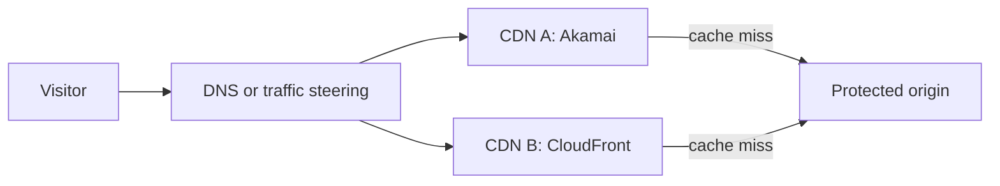

# Multi-CDN operations

## Purpose

A **multi-CDN** site lets traffic reach the same public service through two
content delivery network (CDN) providers. A traffic-steering layer, often
DNS, chooses a provider. Each provider has its own cache and configuration;
both can fetch from the origin when they lack a usable copy.

Use this model when you need to understand a provider migration or a design
intended to survive one CDN's failure. Two CDNs do not automatically make the
site resilient: a shared broken origin, a wrong cache rule on both providers,
or DNS clients that keep an old answer can still affect visitors.

Think of two **shopfronts drawing from one storeroom**. Customers may enter
through either door, but both doors must show the same prices and protect
private orders. The analogy has limits: each CDN keeps independent copies,
their security rules and logs use different fields, and DNS cannot instantly
move every visitor from one door to the other.

Text alternative: the visitor asks a traffic-steering system where to go.
That system chooses Akamai or CloudFront. Each CDN can answer from its own
cache, or fetch from the same protected origin on a miss. The diagram makes
the independent caches and shared-origin failure boundary visible. It is an
illustrative design, not a deployed configuration.

## Define one expected response, then map it twice

Akamai Property Manager expresses request matching and behaviours in a rule
tree; CloudFront uses ordered cache behaviours and policies. Their names and
defaults differ. Akamai's cache key can include a hostname, path, query
parameters, headers, and cookies. CloudFront's cache policy chooses its key
inputs and TTL values. Compare the **response seen by a visitor**, not only
whether the configuration screens look alike.[^akamai-rules][^akamai-caching][^cloudfront-cache-policy]

| Visitor outcome | Questions for both providers |
| --- | --- |
| Same public content | Do the same host, path, language, and query values select equivalent content? |
| Private content stays private | Is the path excluded from shared caching, and are authorization decisions still made by the application? |
| Same safe freshness | What TTL and origin header behaviour apply? Can one provider serve stale content under conditions the other cannot? |
| Same route to origin | Is the origin hostname correct, and can someone bypass both edges to reach it? |
| Same incident evidence | Which request ID, path, status, cache result, and origin error fields can be compared? |

Matching intent does not mean using the same setting names. For example,
Akamai's Fast Purge **invalidate** marks an object stale and can use a
conditional origin request; **delete** removes the cached object. CloudFront
uses invalidations or versioned filenames. A purge action on one provider
does not clear the other provider's cache, nor a browser cache.
[^akamai-purge][^cloudfront-invalidation]

## Example: move a small share of a documentation site

This site, percentages, and results are invented. They illustrate the
questions to ask; no DNS change, CDN request, purge, or failover was run.

The site serves public `/guide/*` pages and a signed-in `/account` page. It
currently uses Akamai and is preparing CloudFront as a second route.

1. Configure both providers to serve the same site hostname and origin.
   Compare a public page and a private account response by path, status,
   redirect, cache header, and content. Verify that a visitor cannot fetch
   private content by using a direct-origin hostname.
2. Start with a small **weighted DNS** share for CloudFront only after those
   outcomes agree. Route 53 weighted records choose answers according to
   relative weights; they do not promise that the exact share of live user
   requests equals the chosen weight.[^route53-weighted]
3. If `/guide/start` must be replaced before its TTL expires, remove the old
   response from **both** provider caches or publish a new versioned URL.
   Check what remains in browser caches.[^akamai-purge][^cloudfront-invalidation]
4. If CloudFront has an edge incident, shift new DNS answers toward Akamai.
   Some resolvers can still return a cached CloudFront answer until its TTL
   expires. Lowering the TTL at incident time cannot erase an earlier cached
   answer.[^route53-dns-cache]

The shared origin remains a separate risk. If its application fails, switching
CDNs may send more cache misses to the same failing system. A health check
that only requests a cached static file could miss that failure; this is an
inference from the cache-hit path. Choose a health signal that exercises the
availability you intend to protect. Route 53 supports HTTP/HTTPS health
checks with an optional response-string match.[^route53-health]

## Observe and recover without losing the comparison

- **Before traffic moves:** record the expected hostname, TLS, redirect,
  cache, security, and origin behaviour for a few public and private paths.
  Test each provider through a provider-specific route as well as the public
  name.
- **During a shift:** compare error rate, latency, origin request volume,
  cache results, and application outcomes by provider. Akamai DataStream 2
  and CloudFront access logs expose different field sets; define the small
  common fields needed for diagnosis, then retain provider-specific IDs.
  CloudFront standard access logs are best effort, not a complete request
  ledger.[^akamai-datastream][^cloudfront-logging]
- **On rollback:** change the traffic-steering choice, allow for existing DNS
  answers, and verify both the old and new path. If a bad response was cached,
  remove or supersede it on both providers. If the origin is the fault,
  changing only DNS is insufficient.

Do not assume that chaining `visitor -> CDN A -> CDN B -> origin` is the same
design. It creates another cache and policy boundary. Use a chain only when
its ownership, cache behaviour, and failure path have been defined and tested.

## Check your understanding

1. Why can a healthy CDN failover still leave some visitors on the old route?
2. If only Akamai's cache is purged, what might a CloudFront visitor receive?
3. Which failure is shared by both CDNs in the diagram?
4. Why might a health check of a cached public file say little about an
   uncached application endpoint?

## Deeper study

- [Akamai caching](https://techdocs.akamai.com/property-mgr/docs/know-caching)
  and [Property Manager rules](https://techdocs.akamai.com/property-mgr/docs/rules)
  for its key and rule-tree model.
- [Akamai Fast Purge methods](https://techdocs.akamai.com/purge-cache/docs/purge-methods)
  and [CloudFront invalidations](https://docs.aws.amazon.com/AmazonCloudFront/latest/DeveloperGuide/Invalidation.html)
  for separate cache-removal behaviour.
- [Route 53 weighted routing](https://docs.aws.amazon.com/Route53/latest/DeveloperGuide/routing-policy-weighted.html)
  and [DNS caching after a change](https://docs.aws.amazon.com/Route53/latest/DeveloperGuide/troubleshooting-new-dns-settings-not-in-effect.html)
  for traffic shifts and their timing limits.
- [Akamai DataStream fields](https://techdocs.akamai.com/datastream2/reference/data-set-parameters-api)
  and [CloudFront access logs](https://docs.aws.amazon.com/AmazonCloudFront/latest/DeveloperGuide/AccessLogs.html)
  for comparing observations.

For the cache-safety model, read
[CDN caching and origin protection](cdn-caching-and-origin-protection.md).
For the provider choice, read [Akamai vs. CloudFront](akamai-vs-cloudfront.md).
[Back to edge and CDN](index.md) | [Back to cloud index](../index.md)

[^akamai-caching]: [Akamai - Learn about Akamai caching](https://techdocs.akamai.com/property-mgr/docs/know-caching).
[^akamai-rules]: [Akamai - Rules](https://techdocs.akamai.com/property-mgr/docs/rules).
[^akamai-purge]: [Akamai - Invalidate and delete methods](https://techdocs.akamai.com/purge-cache/docs/purge-methods).
[^akamai-datastream]: [Akamai - Data set parameters](https://techdocs.akamai.com/datastream2/reference/data-set-parameters-api).
[^cloudfront-cache-policy]: [Amazon CloudFront - Understand cache policies](https://docs.aws.amazon.com/AmazonCloudFront/latest/DeveloperGuide/cache-key-understand-cache-policy.html).
[^cloudfront-invalidation]: [Amazon CloudFront - Invalidate files to remove content](https://docs.aws.amazon.com/AmazonCloudFront/latest/DeveloperGuide/Invalidation.html).
[^cloudfront-logging]: [Amazon CloudFront - Access logs](https://docs.aws.amazon.com/AmazonCloudFront/latest/DeveloperGuide/AccessLogs.html).
[^route53-weighted]: [Amazon Route 53 - Weighted routing](https://docs.aws.amazon.com/Route53/latest/DeveloperGuide/routing-policy-weighted.html).
[^route53-dns-cache]: [Amazon Route 53 - DNS settings not yet in effect](https://docs.aws.amazon.com/Route53/latest/DeveloperGuide/troubleshooting-new-dns-settings-not-in-effect.html).
[^route53-health]: [Amazon Route 53 - Health check values](https://docs.aws.amazon.com/Route53/latest/DeveloperGuide/health-checks-creating-values.html).
