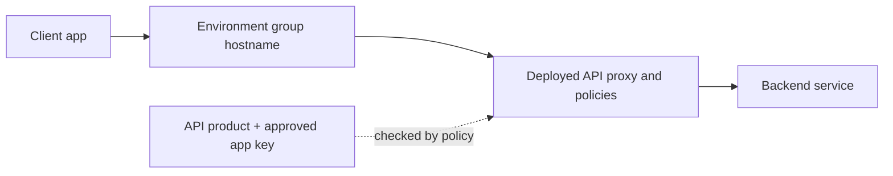

# Apigee API management

## Purpose

Apigee places an **API proxy** between a client and a backend service. The
proxy gives clients a stable entry point and can apply policies before and
after the backend call. Apigee also groups exposed API operations into
**API products** for developer apps. These two paths—handling a request
and deciding which app may use an operation—are the first ideas to learn.
[^apigee-proxies][^apigee-products]

This page is for understanding that model. It does not configure a live
proxy or claim that Apigee is needed for every HTTP service.

## The request path

Imagine a museum with a public entrance, a staffed desk, and rooms behind
it. The hostname and API proxy are the entrance and desk; the backend
service is the room that performs the work. A policy may check a pass at
the desk before a visitor reaches the room. The analogy stops where APIs
need more detail: routes have hostnames and paths, policies execute in
defined flows, and a checked app key does not identify the human using
that app.

| Apigee part | Plain meaning | Why it matters |
| --- | --- | --- |
| Organization | Top-level Apigee home for environments, proxies, products, and apps. | Groups the API program. |
| Environment | Where a proxy revision is deployed. | An undeployed proxy cannot serve requests. |
| Environment group | Gives hostnames to one or more environments. | Hostname plus proxy base path forms the client URL. |
| ProxyEndpoint | Client-facing part of a proxy. | Defines the incoming path and can run access policies. |
| TargetEndpoint | Backend-facing part of a proxy. | Defines how the proxy reaches a backend. |
| Policy | A step that checks or changes traffic. | Must be attached to the right flow to run. |

An environment needs to belong to an environment group for its deployed
proxies to be reachable. The group owns the hostname; the proxy owns its
base path. A proxy's `ProxyEndpoint` receives the client request and can
apply a policy. Its `TargetEndpoint` can send the request to the backend.
Apigee can also create proxy behavior without a conventional backend,
so the backend box below is the common case, not a universal rule.
[^apigee-environments][^apigee-proxies]

Text alternative: a client calls a hostname owned by an environment group.
The request reaches a deployed API proxy, which runs attached policies
and usually forwards to a backend service. Separately, an API product
and approved developer app can give the proxy a key to verify; that
verification happens only when the relevant policy runs.

## The product and app path

An **API product** names operations that app developers may use: a proxy,
resource paths, and possibly methods or quotas. A **developer app**
represents a registered client application and receives a key associated
with approved products. A `VerifyAPIKey` policy attached to the proxy's
request flow can check that key and product access at runtime.
Creating a product and issuing a key alone does not install that check.
[^apigee-products][^apigee-apps][^apigee-verify-key]

An API key is useful for identifying a calling **app**, but Google warns
that keys provide limited security and can be extracted from app code.
For sensitive user data, decide how the API authenticates and authorizes
the **user** as well. Do not treat an approved app key as proof that an
individual user may see every record.[^apigee-api-keys]

A product can define a quota, but a quota setting does not automatically
limit traffic. A `Quota` policy must be attached and configured to use
the intended quota. `SpikeArrest` addresses short traffic surges; it
answers a different question from an app's request allowance over a
longer period.[^apigee-products][^apigee-quota]
[^apigee-spike-arrest]

## Example: a learning API

This learning API, client app, and sequence are invented. No Apigee
organization, policy, product, or request was created or run.

1. A backend returns lessons for `GET /lessons`. The API team publishes
   an Apigee proxy at a reviewed hostname and base path and deploys its
   revision to an environment in an environment group.
2. A “Learning Starter” product includes the lesson-reading operation.
   A registered learning app receives an approved key for that product.
3. On each request, an attached `VerifyAPIKey` policy checks the app key
   before the proxy calls the backend. If the API also has a quota policy,
   it counts requests according to that configured policy.
4. The backend still decides which lessons a signed-in learner may see.
   Proxy key verification does not replace that user-level decision.

To verify the design in a real project, test an allowed app, an unapproved
app, an out-of-product path, and a request without a key. Observe both
the proxy response and backend logs. Add a quota test only after the
quota policy and expected limit are explicit.

## Runtime placement and operating limits

With Google-managed Apigee, the team manages API configuration while
Google operates the Apigee runtime service. With **Apigee hybrid**, Google
maintains the management plane and the team installs and operates the
runtime plane on supported Kubernetes infrastructure. Hybrid can place
API traffic in a controlled network, but adds Kubernetes runtime work;
it is a placement and ownership decision, not an automatic security
upgrade.[^apigee-hybrid]

Apigee API Analytics can show proxy traffic and target metrics, but a
successful proxy response or dashboard trend cannot by itself prove
that the backend performed the right business action. Check the backend
outcome, policy behavior, network path, and product entitlement against
the API's actual contract. Policy availability and usage implications can
also depend on environment type or license; review current product docs
before assuming a policy is available.[^apigee-analytics]
[^apigee-verify-key]

## Check your understanding

1. Which object owns the hostname, and which object owns the proxy base path?
2. What must happen before a product and app key actually restrict a
   proxy request?
3. Why does checking an app key not authorize a signed-in learner?
4. Why does entering a quota on a product not enforce it by itself?
5. What new responsibility does a team take on with Apigee hybrid?

## Deeper study

- [API proxies](https://cloud.google.com/apigee/docs/api-platform/fundamentals/understanding-apis-and-api-proxies)
  and [environments and environment groups](https://cloud.google.com/apigee/docs/api-platform/fundamentals/environments-overview)
  for the request path.
- [API products](https://cloud.google.com/apigee/docs/api-platform/publish/what-api-product),
  [developer apps](https://cloud.google.com/apigee/docs/api-platform/publish/creating-apps-surface-your-api),
  and [VerifyAPIKey](https://cloud.google.com/apigee/docs/api-platform/reference/policies/verify-api-key-policy)
  for app access.
- [Quota](https://cloud.google.com/apigee/docs/api-platform/reference/policies/quota-policy)
  and [SpikeArrest](https://cloud.google.com/apigee/docs/api-platform/reference/policies/spike-arrest-policy)
  for the two traffic-control jobs.
- [Apigee hybrid](https://cloud.google.com/apigee/docs/hybrid/latest/what-is-hybrid)
  and [API Analytics](https://cloud.google.com/apigee/docs/api-platform/analytics/analytics-services-overview)
  for runtime ownership and operational signals.

[Back to Google Cloud index](index.md) |
[Back to cloud index](../index.md)

[^apigee-proxies]: [Apigee - API proxies](https://cloud.google.com/apigee/docs/api-platform/fundamentals/understanding-apis-and-api-proxies).
[^apigee-environments]: [Apigee - Environments and environment groups](https://cloud.google.com/apigee/docs/api-platform/fundamentals/environments-overview).
[^apigee-products]: [Apigee - API products](https://cloud.google.com/apigee/docs/api-platform/publish/what-api-product).
[^apigee-apps]: [Apigee - Register developer apps](https://cloud.google.com/apigee/docs/api-platform/publish/creating-apps-surface-your-api).
[^apigee-verify-key]: [Apigee - VerifyAPIKey policy](https://cloud.google.com/apigee/docs/api-platform/reference/policies/verify-api-key-policy).
[^apigee-api-keys]: [Apigee - API keys](https://cloud.google.com/apigee/docs/api-platform/security/api-keys).
[^apigee-quota]: [Apigee - Quota policy](https://cloud.google.com/apigee/docs/api-platform/reference/policies/quota-policy).
[^apigee-spike-arrest]: [Apigee - SpikeArrest policy](https://cloud.google.com/apigee/docs/api-platform/reference/policies/spike-arrest-policy).
[^apigee-hybrid]: [Apigee - What is hybrid?](https://cloud.google.com/apigee/docs/hybrid/latest/what-is-hybrid).
[^apigee-analytics]: [Apigee - API Analytics](https://cloud.google.com/apigee/docs/api-platform/analytics/analytics-services-overview).
