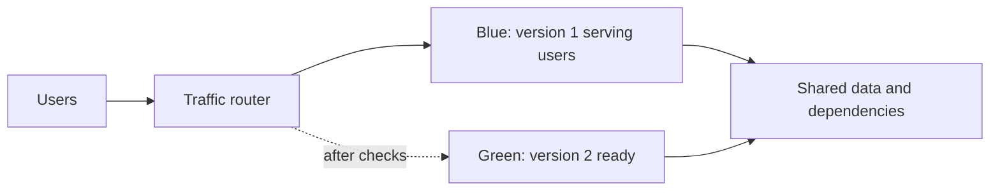

# Blue-green deployment

## The idea in plain language

A blue-green deployment keeps two application versions available during a
release. **Blue** is the version currently serving users; **green** is the
candidate. The team checks green, moves traffic to it, watches the result,
and keeps blue available for a defined time in case traffic needs to move
back.[^aws-ecs-blue-green][^azure-container-apps]

Picture a theater with two stages. While one stage hosts the show, the
other is prepared and checked. The audience can be directed to the new
stage when it is ready. The analogy has a limit: both stages may share the
same ticket system, so changing that shared system affects both versions.
For software, that shared system might be a database, queue, or API.

## Follow one release

Imagine a checkout service moving from version 1 to version 2. This is an
illustrative flow, not an observed deployment.

Text alternative: a stable user endpoint reaches a routing layer. Initially
it sends production traffic to blue while green is prepared. After checks,
routing moves some or all traffic to green according to the platform's
release configuration. Both versions may use the same data and external
dependencies.[^aws-codedeploy]

The word “blue-green” describes **two versions and a controlled traffic
change**, not one exact traffic schedule. AWS CodeDeploy can shift ECS or
Lambda traffic all at once, linearly, or in canary increments. Azure
Container Apps can use revision traffic weights. Cloud Run also offers
traffic migration between revisions.[^aws-codedeploy][^azure-container-apps][^cloud-run-rollouts]

## What each stage answers

| Stage | Reader question | Evidence to seek |
| --- | --- | --- |
| Prepare green | Can the new version start beside blue? | Deployment status, configuration, dependency compatibility. |
| Test green | Does it perform the intended user flow? | A representative smoke test or test traffic, not only process health. |
| Move traffic | Are users reaching the intended version? | Router weights or target groups, version-labelled requests, errors, latency. |
| Observe | Is green behaving acceptably under real load? | Agreed technical and user-facing signals over a defined period. |
| Keep or retire blue | Is switching traffic back still useful? | Old capacity remains available and shared data still works with version 1. |

The precise checks and observation period are team decisions. A green
health check can show the process is alive without proving checkout, login,
or payment works. The example needs the application's own acceptance
signals before a real release.

## Why rollback has a boundary

If version 2 fails because of its code or configuration, traffic may be
redirected to version 1 while blue remains available. AWS ECS and Azure
Container Apps describe this as a benefit of their blue-green
approaches.[^aws-ecs-blue-green][^azure-container-apps]

But routing back does **not** undo a database migration, a message already
sent, or a payment already processed. Both versions must understand any
shared data they encounter during the transition, or the team needs a
separate recovery plan. This is reasoning from the shared-dependency model,
not a promise from a cloud service.

Running both versions also consumes extra capacity during the overlap.
Amazon ECS explicitly calls out temporary resource usage as a
consideration.[^aws-ecs-blue-green] The team should plan when blue can be
retired and what evidence is needed before removing it.

## When this pattern fits

Choose it when you can run two versions together, route users deliberately,
check green before full cutover, and keep shared data compatible long enough
to switch back. If those conditions are absent, the label “blue-green” will
not make a release safe. A rolling update or a gradual rollout may fit a
different capacity or risk constraint; compare the actual traffic and
recovery behavior rather than the name.

## Check your understanding

- What is the difference between making green ready and moving production
  traffic to it?
- Why might moving traffic back to blue fail after a database change?
- Can a blue-green release shift traffic gradually, or must it be one switch?

## Official documentation for deeper study

- [AWS CodeDeploy deployments](https://docs.aws.amazon.com/codedeploy/latest/userguide/deployments.html) explains platform-specific blue-green traffic options.
- [Amazon ECS blue-green deployments](https://docs.aws.amazon.com/AmazonECS/latest/developerguide/deployment-type-blue-green.html) covers service revisions, validation, overlap, and rollback.
- [Azure Container Apps blue-green deployment](https://learn.microsoft.com/en-us/azure/container-apps/blue-green-deployment) shows revisions and traffic weights.
- [Cloud Run rollouts and traffic migration](https://cloud.google.com/run/docs/rollouts-rollbacks-traffic-migration) describes revision traffic and rollback controls.

See the [cloud solutions index](index.md) and [end-to-end
deployment](../../cross-topic-guides/end-to-end-deployment.md).

[^aws-codedeploy]: [Working with deployments in CodeDeploy](https://docs.aws.amazon.com/codedeploy/latest/userguide/deployments.html).
[^aws-ecs-blue-green]: [Amazon ECS blue-green deployments](https://docs.aws.amazon.com/AmazonECS/latest/developerguide/deployment-type-blue-green.html).
[^azure-container-apps]: [Blue-green deployment in Azure Container Apps](https://learn.microsoft.com/en-us/azure/container-apps/blue-green-deployment).
[^cloud-run-rollouts]: [Cloud Run rollouts, rollbacks, and traffic migration](https://cloud.google.com/run/docs/rollouts-rollbacks-traffic-migration).
