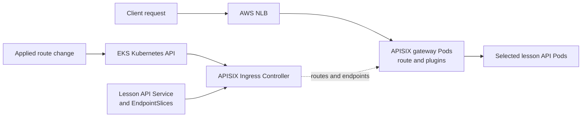

# APISIX on EKS

## Purpose

An API gateway on EKS has two paths. **User requests** travel through an
AWS entry point, APISIX gateway Pods, and a backend application.
**Configuration changes** travel through the Kubernetes API and APISIX
Ingress Controller before they affect the gateway. Keeping those paths
separate makes it easier to explain a failure and decide which component
owns a fix.[^apisix-ingress-start][^apisix-deployment-architecture]

Read [What Apache APISIX does for an API](../kubernetes/applications-and-tools/apache-apisix.md)
first if routes, upstreams, and plugins are new terms. This page focuses
on how they meet AWS networking and EKS workloads.

## One request and one route change

Think of a venue with an outer entrance, a reception desk, and rooms
inside. The AWS load balancer is the entrance; APISIX is the desk that
reads a request and applies a route or policy; the backend Service is
the room name in the directory, and the application Pods are the rooms
that can actually answer. The APISIX Ingress Controller updates the
desk's instructions and the list of available rooms. The analogy stops
at the network: a Service is often a configuration reference here, not
an extra network hop, and a successful entrance check does not prove
the requested lesson was returned.[^apisix-resources]

The following lesson-search API is invented. No EKS cluster, load
balancer, gateway, route, plugin, backend, or request was configured or
tested.

1. A client requests `learn.example.com/lessons`. In this example, an
   AWS Network Load Balancer (NLB) exposes the APISIX gateway Service.
   The NLB handles network entry; the selected listener and target mode
   determine how it reaches the gateway Pods.[^aws-eks-nlb]
2. An APISIX gateway Pod matches the host and path, runs any configured
   plugins, and uses the lesson API's Kubernetes Service as the backend
   reference. By default, the controller tracks that Service's
   EndpointSlices and APISIX proxies directly to selected application
   Pods rather than sending every request through the Service's
   cluster IP.[^apisix-routes][^apisix-plugin][^apisix-resources]
3. Separately, a team changes an `HTTPRoute`, `Ingress`, or supported
   APISIX custom resource. APISIX Ingress Controller watches that
   Kubernetes resource and translates it into gateway configuration.
   The controller does not handle each user request.[^apisix-ingress-start]

Text alternative: the solid top path carries the client request from an
NLB to APISIX and then to a selected lesson API Pod. The lower path
carries an applied route change through the Kubernetes API to the APISIX
Ingress Controller. The controller also reads the backend Service and
EndpointSlices and programs the gateway with routes and targets. Neither
the controller nor, by default, the Service cluster IP is a hop in each
client request.[^apisix-resources]

An NLB is **one** way to expose APISIX on EKS. It can give APISIX the
Layer 7 routing and plugin role while AWS handles external network
entry. An NLB with **instance targets** reaches gateway Pods through
node ports; one with **IP targets** can target their Pod IPs directly.
This choice is about the NLB-to-gateway leg, separate from how APISIX
chooses lesson API Pods. EKS Auto Mode and the AWS Load Balancer
Controller have different Service annotations and ownership rules; use
the documentation for the implementation and target mode selected for
the cluster. In the AWS Load Balancer Controller path, an NLB is
internal unless configured as internet-facing; a `LoadBalancer` Service
alone does not say that the gateway is public. An AWS Application Load
Balancer can also route HTTP traffic, but adding its own Layer 7 rules
changes which layer owns host/path decisions.
[^aws-eks-nlb][^aws-eks-auto-nlb]

## Decide where each policy lives

| Decision | Possible owner in this example | What to make explicit |
| --- | --- | --- |
| Public or private exposure | AWS load balancer and network configuration | Which subnets, scheme, listener, target mode, and security boundary expose APISIX. |
| TLS termination | NLB listener, APISIX gateway, or both on separate connections | Which endpoint decrypts TLS, where certificates live, and whether the next hop is encrypted. |
| Host/path route and gateway policy | APISIX route and explicitly attached plugins | The matching host/path, backend, and actual authentication or limit plugin. |
| Backend availability | Kubernetes Service, EndpointSlices, and application Pods | The selector, ready endpoints, application health, and response. |

For example, a TCP listener can pass TLS through to APISIX, whereas an
NLB TLS listener terminates TLS at the load balancer. Decide this before
configuring certificates and gateway listeners. With TCP pass-through,
the certificate belongs at APISIX; with NLB TLS termination, it belongs
at the NLB, and a separate TLS connection to APISIX requires its own
target-side choice. In a pass-through example, a gateway
`LoadBalancer` Service with port `443` can create an NLB TCP listener on
`443`. With instance targets, the NLB sends to the Service's node port;
with IP targets, it sends to the gateway Pod's HTTPS target port. The
Service port, node port, and target port are distinct settings.
Separately decide whether APISIX encrypts its connection to the backend.
Do not infer end-to-end TLS from a browser lock icon alone.
[^aws-nlb-listeners]

If gateway policy or logs depend on the original client IP, check the
NLB target group's client-IP behavior before using that address. For
IP targets with TCP or TLS, preservation is disabled by default; APISIX
may see a load-balancer node IP instead. AWS documents client-IP
preservation and Proxy Protocol v2 options. Proxy Protocol v2 requires
matching gateway support; either choice needs a deliberate network and
trust-boundary review. With instance targets, Kubernetes node-port
forwarding under `externalTrafficPolicy: Cluster` can also replace the
client address with a node address.[^aws-nlb-target-groups][^k8s-source-ip]

APISIX plugins run only when configured on the relevant route, service,
consumer, or other supported scope. A gateway installation alone does
not add authentication or rate limiting to the lesson API. Keep the
backend's business authorization in the application, and prevent a
direct route to the backend from bypassing required gateway policy.
See [How APISIX policies shape one request](../kubernetes/applications-and-tools/apisix-security-traffic-and-observability.md)
for those decisions.[^apisix-plugin]

## Diagnose the first broken handoff

| Observation | First evidence to inspect | Why |
| --- | --- | --- |
| No load-balancer address or unhealthy targets | Gateway Service and its events, selected AWS load-balancer controller, NLB targets, and APISIX Pod readiness. | Route rules cannot help if requests never reach the gateway. |
| NLB target is healthy, but APISIX returns no matching route | Host/path, selected route resource, controller logs, and programmed gateway configuration. | A Kubernetes route object can exist before the gateway serves it. |
| APISIX rejects the request | Matched route and the plugin that made the decision. | A configured policy can intentionally block a request before proxying. |
| APISIX matches a route, but the backend fails | Service port, ready endpoints, backend network path, and application logs. | A matched route does not create a healthy application. |

The APISIX documentation provides separate ways to inspect translated
controller configuration and the configuration synchronized to the
gateway. This is more informative than assuming a successfully applied
Kubernetes manifest is live at the data plane.[^apisix-configuration-troubleshooting]

Gateway API support is versioned and may be partial for specific fields.
Before using an `HTTPRoute` option, check the controller's supported
resource and field table for the version you run. Check that the
`GatewayClass` selects APISIX when more than one Gateway API controller
is installed. A `Gateway` listener does not make APISIX open a new data
plane port: the gateway must already listen on the actual target port.
Listener-port matching is optional and off by default in the current
APISIX documentation; when enabled, a listener port different from the
port APISIX actually receives after Service mapping can cause a `404`.
[^apisix-gateway-api][^apisix-configuration-troubleshooting]

The controller can configure APISIX through an etcd-backed Admin API
or API-driven standalone mode, which the current controller docs mark
experimental. These have different storage and recovery paths. If some
gateway Pods serve a new route and others return `404`, compare the
applied configuration on each Pod before changing the AWS entry or
backend. [How the gateway and controller fit together](../kubernetes/applications-and-tools/apisix-architecture-and-deployment.md)
explains those modes.[^apisix-deployment-architecture]

## Check your understanding

1. If APISIX returns a no-route response for `/lessons`, which path
   should you inspect first?
2. Why can an `HTTPRoute` exist in Kubernetes while only some gateway
   Pods serve it?
3. If an NLB TLS listener terminates HTTPS, what additional question
   should you ask about traffic from the NLB to APISIX?
4. Does the backend Service name in the route mean every request passes
   through its cluster IP?

## Deeper study

- [APISIX Ingress Controller introduction](https://apisix.apache.org/docs/ingress-controller/getting-started/get-apisix-ingress-controller/)
  and [route configuration](https://apisix.apache.org/docs/ingress-controller/getting-started/configure-routes/)
  for the controller-to-gateway path.
- [APISIX deployment architecture](https://apisix.apache.org/docs/ingress-controller/concepts/deployment-architecture/)
  and [configuration troubleshooting](https://apisix.apache.org/docs/ingress-controller/reference/apisix-ingress-controller/configuration-troubleshoot/)
  for mode and state checks.
- [APISIX Ingress Controller resources](https://apisix.apache.org/docs/ingress-controller/concepts/resources/)
  for the Service reference, EndpointSlice tracking, and default Pod path.
- [EKS Network Load Balancers](https://docs.aws.amazon.com/eks/latest/userguide/network-load-balancing.html)
  and [NLB listeners](https://docs.aws.amazon.com/elasticloadbalancing/latest/network/load-balancer-listeners.html)
  for AWS entry and TLS choices.
- [NLB target groups](https://docs.aws.amazon.com/elasticloadbalancing/latest/network/load-balancer-target-groups.html)
  for target type, client-IP preservation, and Proxy Protocol v2.
- [How the APISIX gateway and controller fit together](../kubernetes/applications-and-tools/apisix-architecture-and-deployment.md)
  and [trace an APISIX 404](../kubernetes/troubleshooting/apisix.md)
  for deeper Kubernetes-specific guidance.

[Back to cross-topic guides](index.md)

[^apisix-ingress-start]: [Apache APISIX - Get APISIX and APISIX Ingress Controller](https://apisix.apache.org/docs/ingress-controller/getting-started/get-apisix-ingress-controller/).
[^apisix-routes]: [Apache APISIX - Configure Routes](https://apisix.apache.org/docs/ingress-controller/getting-started/configure-routes/).
[^apisix-deployment-architecture]: [Apache APISIX - Deployment Architecture](https://apisix.apache.org/docs/ingress-controller/concepts/deployment-architecture/).
[^apisix-resources]: [Apache APISIX - Ingress Controller Resources](https://apisix.apache.org/docs/ingress-controller/concepts/resources/).
[^apisix-gateway-api]: [Apache APISIX - Gateway API support](https://apisix.apache.org/docs/ingress-controller/concepts/gateway-api/).
[^apisix-configuration-troubleshooting]: [Apache APISIX - Configuration Troubleshooting](https://apisix.apache.org/docs/ingress-controller/reference/apisix-ingress-controller/configuration-troubleshoot/).
[^apisix-plugin]: [Apache APISIX - Plugin](https://apisix.apache.org/docs/apisix/terminology/plugin/).
[^aws-eks-nlb]: [Amazon EKS - Network Load Balancers](https://docs.aws.amazon.com/eks/latest/userguide/network-load-balancing.html).
[^aws-eks-auto-nlb]: [Amazon EKS - Configure NLBs with EKS Auto Mode](https://docs.aws.amazon.com/eks/latest/userguide/auto-configure-nlb.html).
[^aws-nlb-listeners]: [Elastic Load Balancing - NLB listeners](https://docs.aws.amazon.com/elasticloadbalancing/latest/network/load-balancer-listeners.html).
[^aws-nlb-target-groups]: [Elastic Load Balancing - NLB target groups](https://docs.aws.amazon.com/elasticloadbalancing/latest/network/load-balancer-target-groups.html).
[^k8s-source-ip]: [Kubernetes - Using Source IP](https://kubernetes.io/docs/tutorials/services/source-ip/).
