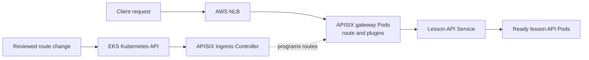

# APISIX on EKS

## Purpose

An API gateway on EKS has two paths. **User requests** travel through an
AWS entry point, APISIX gateway Pods, and a backend application.
**Configuration changes** travel through the Kubernetes API and APISIX
Ingress Controller before they affect the gateway. Keeping those paths
separate makes it easier to explain a failure and decide which component
owns a fix.[^apisix-ingress-start][^apisix-deployment-architecture]

Read [Apache APISIX](../kubernetes/applications-and-tools/apache-apisix.md)
first if routes, upstreams, and plugins are new terms. This page focuses
on how they meet AWS networking and EKS workloads.

## One request and one route change

Think of a venue with an outer entrance, a reception desk, and a room
inside. The AWS load balancer is the outer entrance; APISIX is the desk
that reads a request and applies a route or policy; the backend Service
leads to the room. The APISIX Ingress Controller is the staff member who
updates the desk's instructions. The analogy stops at the network:
load balancers and controllers reconcile over time, and a successful
entrance check does not prove the requested lesson was returned.

The following lesson-search API is invented. No EKS cluster, load
balancer, gateway, route, plugin, backend, or request was configured or
tested.

1. A client requests `api.example.test/lessons`. In this example, an
   AWS Network Load Balancer (NLB) exposes the APISIX gateway Service.
   The NLB handles network entry; the selected listener and target mode
   determine how it reaches the gateway Pods.[^aws-eks-nlb]
2. An APISIX gateway Pod matches the host and path, runs any configured
   plugins, and proxies to the lesson API's Kubernetes Service. That
   Service selects ready application endpoints.[^apisix-routes]
   [^apisix-plugin]
3. Separately, a team changes an `HTTPRoute`, `Ingress`, or supported
   APISIX custom resource. APISIX Ingress Controller watches that
   Kubernetes resource and translates it into gateway configuration.
   The controller does not handle each user request.[^apisix-ingress-start]

Text alternative: the top path carries the client request from an NLB
to APISIX, then to a Kubernetes Service and ready lesson API Pods. The
bottom path carries a route change through the Kubernetes API to the
APISIX Ingress Controller, which programs the gateway. The controller
is not on the client request path.

An NLB is **one** way to expose APISIX on EKS. It can give APISIX the
Layer 7 routing and plugin role while AWS handles external network
entry. EKS Auto Mode and the AWS Load Balancer Controller have different
Service annotations and ownership rules; use the documentation for the
implementation and target mode selected for the cluster. An AWS
Application Load Balancer can also route HTTP traffic, but adding its
own Layer 7 rules changes which layer owns host/path decisions.
[^aws-eks-nlb][^aws-eks-auto-nlb]

## Decide where each policy lives

| Decision | Possible owner in this example | What to make explicit |
| --- | --- | --- |
| Public or private exposure | AWS load balancer and network configuration | Which subnets, listener, target mode, and security boundary expose APISIX. |
| TLS termination | NLB listener or APISIX gateway | Which endpoint decrypts TLS, where certificates live, and whether the next hop is encrypted. |
| Host/path route and gateway policy | APISIX route and explicitly attached plugins | The matching host/path, backend, and actual authentication or limit plugin. |
| Backend availability | Kubernetes Service and application Pods | The selector, ready endpoints, application health, and response. |

For example, a TCP listener can pass TLS through to APISIX, whereas an
NLB TLS listener terminates TLS at the load balancer. Decide this before
configuring certificates and gateway listeners. Separately decide
whether APISIX encrypts its connection to the backend. Do not infer
end-to-end TLS from a browser lock icon alone.[^aws-nlb-listeners]

APISIX plugins run only when configured on the relevant route, service,
consumer, or other supported scope. A gateway installation alone does
not add authentication or rate limiting to the lesson API. Keep the
backend's business authorization in the application, and prevent a
direct route to the backend from bypassing required gateway policy.
See [APISIX security, traffic, and observability](../kubernetes/applications-and-tools/apisix-security-traffic-and-observability.md)
for those decisions.[^apisix-plugin]

## Diagnose the first broken handoff

| Observation | First evidence to inspect | Why |
| --- | --- | --- |
| No load-balancer address or unhealthy targets | Gateway Service, selected AWS load-balancer controller, NLB targets, and APISIX Pod readiness. | Route rules cannot help if requests never reach the gateway. |
| NLB target is healthy, but APISIX returns no matching route | Host/path, selected route resource, controller logs, and programmed gateway configuration. | A Kubernetes route object can exist before the gateway serves it. |
| APISIX rejects the request | Matched route and the plugin that made the decision. | A configured policy can intentionally block a request before proxying. |
| APISIX matches a route, but the backend fails | Service port, ready endpoints, backend network path, and application logs. | A matched route does not create a healthy application. |

The APISIX documentation provides separate ways to inspect translated
controller configuration and the configuration synchronized to the
gateway. This is more informative than assuming a successfully applied
Kubernetes manifest is live at the data plane.[^apisix-configuration-troubleshooting]

Gateway API support is versioned and may be partial for specific fields.
Before using an `HTTPRoute` option, check the controller's supported
resource and field table for the version you run. Its listener and
gateway Pod ports must also agree; the controller cannot dynamically
open an arbitrary data-plane port.[^apisix-gateway-api]

## Check your understanding

1. If the NLB reaches APISIX but `/lessons` returns no route, which
   path should you inspect first: AWS entry or route configuration?
2. Why can an `HTTPRoute` exist in Kubernetes while no client receives
   the intended response?
3. If an NLB TLS listener terminates HTTPS, what additional question
   should you ask about traffic from the NLB to APISIX?
4. Why does installing APISIX not automatically protect the lesson API
   with authentication?

## Deeper study

- [APISIX Ingress Controller introduction](https://apisix.apache.org/docs/ingress-controller/getting-started/get-apisix-ingress-controller/)
  and [route configuration](https://apisix.apache.org/docs/ingress-controller/getting-started/configure-routes/)
  for the controller-to-gateway path.
- [APISIX deployment architecture](https://apisix.apache.org/docs/ingress-controller/concepts/deployment-architecture/)
  and [configuration troubleshooting](https://apisix.apache.org/docs/ingress-controller/reference/apisix-ingress-controller/configuration-troubleshoot/)
  for mode and state checks.
- [EKS Network Load Balancers](https://docs.aws.amazon.com/eks/latest/userguide/network-load-balancing.html)
  and [NLB listeners](https://docs.aws.amazon.com/elasticloadbalancing/latest/network/load-balancer-listeners.html)
  for AWS entry and TLS choices.
- [APISIX architecture and deployment](../kubernetes/applications-and-tools/apisix-architecture-and-deployment.md)
  and [APISIX troubleshooting](../kubernetes/troubleshooting/apisix.md)
  for deeper Kubernetes-specific guidance.

[Back to cross-topic guides](index.md)

[^apisix-ingress-start]: [Apache APISIX - Get APISIX and APISIX Ingress Controller](https://apisix.apache.org/docs/ingress-controller/getting-started/get-apisix-ingress-controller/).
[^apisix-routes]: [Apache APISIX - Configure Routes](https://apisix.apache.org/docs/ingress-controller/getting-started/configure-routes/).
[^apisix-deployment-architecture]: [Apache APISIX - Deployment Architecture](https://apisix.apache.org/docs/ingress-controller/concepts/deployment-architecture/).
[^apisix-gateway-api]: [Apache APISIX - Gateway API support](https://apisix.apache.org/docs/ingress-controller/concepts/gateway-api/).
[^apisix-configuration-troubleshooting]: [Apache APISIX - Configuration Troubleshooting](https://apisix.apache.org/docs/ingress-controller/reference/apisix-ingress-controller/configuration-troubleshoot/).
[^apisix-plugin]: [Apache APISIX - Plugin](https://apisix.apache.org/docs/apisix/terminology/plugin/).
[^aws-eks-nlb]: [Amazon EKS - Network Load Balancers](https://docs.aws.amazon.com/eks/latest/userguide/network-load-balancing.html).
[^aws-eks-auto-nlb]: [Amazon EKS - Configure NLBs with EKS Auto Mode](https://docs.aws.amazon.com/eks/latest/userguide/auto-configure-nlb.html).
[^aws-nlb-listeners]: [Elastic Load Balancing - NLB listeners](https://docs.aws.amazon.com/elasticloadbalancing/latest/network/load-balancer-listeners.html).
