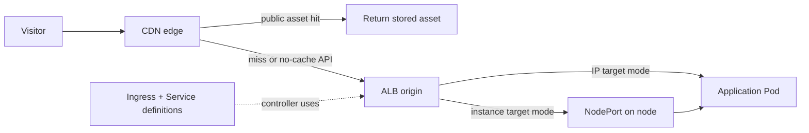

# CDN in front of EKS

## Purpose

A CDN can receive public requests for an application running in Amazon EKS.
The CDN may answer from a cache; otherwise it calls an **origin**. In this
example, the origin is an AWS Application Load Balancer (ALB), which reaches
the application's Pods. EKS hosts the Kubernetes cluster; it does not itself
serve as the CDN origin.[^cloudfront-how-it-works][^eks-alb-ingress]

This page helps you place each decision at the right layer: response sharing
at the CDN, public-to-origin access between CDN and ALB, and application
routing from ALB to Pods. It uses CloudFront as the concrete CDN example;
another provider needs its own cache, TLS, and origin settings checked.

## Why the layers matter

An origin may never see a cache hit. That speeds up public assets but also
means an origin-side change cannot fix a response already being reused
incorrectly. On a cache miss, several components must agree about the
hostname, TLS certificate, path, and target. A healthy Pod does not prove
that a visitor can reach it through all those layers.

Think of this as **two route sheets**. The CDN's sheet chooses whether to
answer from its copy or which origin to call. The ALB's sheet chooses which
application target receives the request. The analogy ends there: the CDN
can store responses while the ALB is a router, and Kubernetes resources
describe desired routing rather than carrying every packet themselves.

| Layer | Job | Question to check |
| --- | --- | --- |
| CDN | Match an edge behaviour, apply cache and security policies, then contact an origin on a miss. | May this response be shared? |
| ALB | Receive the origin request and route it to a target group. | Does the requested host and path reach the intended target? |
| Kubernetes Ingress and controller | Describe HTTP rules and make an implementation realise them; on EKS this can be an AWS ALB. | Did a controller configure the load balancer? |
| Service and Pods | Identify the application endpoints and run the application. | Are ready targets available to receive this traffic? |

An Ingress object alone does not route traffic: an Ingress controller must
fulfil it. The Kubernetes Service describes a set of Pods; the AWS Load
Balancer Controller can register either cluster nodes or Pod IPs as ALB
targets.[^kubernetes-ingress][^kubernetes-service][^eks-alb-ingress]

## Example: assets and signed-in orders

The shop, paths, and results are illustrative. No CDN, ALB, or cluster was
configured or queried.

The shop exposes `/assets/app-v4.js` and `/api/orders`. The first is a
versioned public file whose response is identical for all visitors. The
second returns orders for the signed-in visitor.

1. A visitor requests `/assets/app-v4.js`. If CloudFront holds a valid copy,
   it returns the file without asking the ALB. If it misses, it asks the ALB,
   which routes to the application that serves the asset.
2. The same visitor requests `/api/orders`. The CloudFront behaviour for this
   path uses **no shared caching**. The request reaches the ALB and the
   application checks the visitor's authorization before returning orders.
3. A second visitor must not receive the first visitor's stored orders. A
   session cookie is not an automatic cache prohibition, and CloudFront can
   cache despite an origin's `private` or `no-store` header if the behaviour's
   minimum TTL is positive. Match the response headers and CDN policy.
   [^cloudfront-cache-policy]

Text alternative: a visitor reaches the CDN. A valid public-asset cache hit
returns from the edge. An asset miss or no-cache API request goes to the ALB.
With IP targets, the ALB reaches Pod IPs directly; with instance targets, it
reaches a node's NodePort before traffic reaches a Pod. An Ingress controller
uses the Ingress and Service definitions to configure the ALB. The diagram
shows why the Service is important configuration even when packets do not
pass through its virtual IP.[^eks-alb-ingress]

## The ALB target mode changes the last hop

AWS documents two AWS Load Balancer Controller modes for an ALB Ingress:

- **Instance targets:** the ALB registers cluster nodes. Traffic arrives at
  the Service's NodePort and is then proxied to a Pod. The Service must use a
  compatible type such as `NodePort` or `LoadBalancer`.
- **IP targets:** the ALB registers Pod IPs and routes directly to them. This
  mode is required for Pods running on AWS Fargate or EKS Hybrid Nodes.

Both modes use Kubernetes resources to describe the target application, but
their data paths differ. Do not draw a universal `ALB -> Service -> Pod`
packet path.[^eks-alb-ingress]

## Three boundaries to verify

| Boundary | What can go wrong | Design question |
| --- | --- | --- |
| CDN cache | A private API response is reused for another visitor. | Which paths are cacheable, and does the minimum TTL agree with the origin's headers? |
| CDN to ALB | Direct requests bypass edge controls, or origin TLS fails. | Can the ALB be a supported CloudFront VPC origin in private subnets? If it is public, which origin-side control rejects a bypass? Does its certificate match the origin name or forwarded `Host`? |
| ALB to Pod | The CDN and ALB are healthy but no usable application target exists. | Which controller, target mode, Service, Pod readiness, and application response are expected? |

CloudFront VPC origins support private ALBs under documented region and
feature limits. Their origin security group must allow the CloudFront-managed
connection. A public ALB needs a separate origin access design; pointing DNS
at CloudFront alone does not close the ALB endpoint.[^cloudfront-vpc-origins]
CloudFront-to-ALB HTTPS is separate from visitor-to-CloudFront HTTPS. AWS
requires a valid certificate for the configured origin domain or a forwarded
`Host` name and reports a 502 when origin TLS validation fails.
[^cloudfront-origin-https]

## Check your understanding

1. Why might a request for `/assets/app-v4.js` never reach EKS?
2. Why does the Service matter even when an ALB sends a request directly to a
   Pod IP?
3. What two independent checks prevent `/api/orders` from being exposed
   through caching or an origin bypass?

## Deeper study

- [Amazon EKS ALB Ingress](https://docs.aws.amazon.com/eks/latest/userguide/alb-ingress.html)
  for controller prerequisites and instance versus IP targets.
- [Kubernetes Ingress](https://kubernetes.io/docs/concepts/services-networking/ingress/)
  and [Service](https://kubernetes.io/docs/concepts/services-networking/service/)
  for the cluster routing resources.
- [CloudFront cache policies](https://docs.aws.amazon.com/AmazonCloudFront/latest/DeveloperGuide/cache-key-understand-cache-policy.html)
  for path-specific cache keys and lifetime settings.
- [CloudFront VPC origins](https://docs.aws.amazon.com/AmazonCloudFront/latest/DeveloperGuide/private-content-vpc-origins.html)
  and [origin HTTPS](https://docs.aws.amazon.com/AmazonCloudFront/latest/DeveloperGuide/using-https-cloudfront-to-custom-origin.html)
  for origin access and certificate requirements.

Continue with [CDN caching and origin protection](../cloud/edge/cdn-caching-and-origin-protection.md)
for the cache and bypass decisions, [CloudFront](../cloud/aws/networking/cloudfront.md)
for distribution routing, and [deploying to EKS](deploying-to-eks.md) for
the workload deployment path. [Back to cross-topic guides](index.md)

[^cloudfront-how-it-works]: [Amazon CloudFront - How CloudFront delivers content](https://docs.aws.amazon.com/AmazonCloudFront/latest/DeveloperGuide/HowCloudFrontWorks.html).
[^cloudfront-cache-policy]: [Amazon CloudFront - Understand cache policies](https://docs.aws.amazon.com/AmazonCloudFront/latest/DeveloperGuide/cache-key-understand-cache-policy.html).
[^cloudfront-vpc-origins]: [Amazon CloudFront - Restrict access with VPC origins](https://docs.aws.amazon.com/AmazonCloudFront/latest/DeveloperGuide/private-content-vpc-origins.html).
[^cloudfront-origin-https]: [Amazon CloudFront - Require HTTPS to a custom origin](https://docs.aws.amazon.com/AmazonCloudFront/latest/DeveloperGuide/using-https-cloudfront-to-custom-origin.html).
[^eks-alb-ingress]: [Amazon EKS - Route application and HTTP traffic with Application Load Balancers](https://docs.aws.amazon.com/eks/latest/userguide/alb-ingress.html).
[^kubernetes-ingress]: [Kubernetes - Ingress](https://kubernetes.io/docs/concepts/services-networking/ingress/).
[^kubernetes-service]: [Kubernetes - Service](https://kubernetes.io/docs/concepts/services-networking/service/).
